# Discovery DataScience Meetup #0

- 2020/8/21
- [イベントページ](https://scramble.connpass.com/event/171602/)
- [参考Togetter](https://togetter.com/li/1579639)

## 広告文自動生成プロダクトでDataflowを導入した話
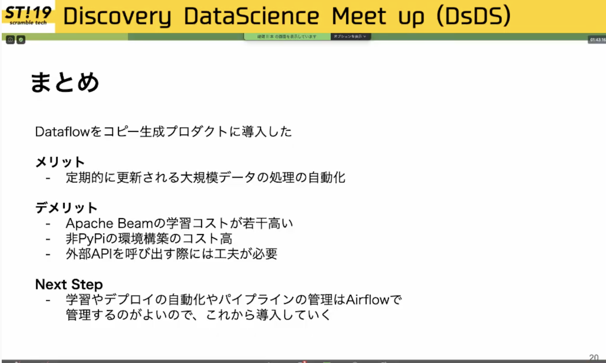

## Tensorflow のモデルを GCP でサービングしてきた話
- Saved Model Prediction

- Custom Prediction Routine
	- `from_path()`でモデルを読み込んで予測を返すだけ

- Custom Prediction Routine
	- マシンリソースが選べない（選択肢が少ない）
	- エラーレスポンスがわかりづらい
	- モデルの容量に制限がある

=>
- GKE
    - マシンタイプの選択が自由かつ楽
    - モデルの容量制限なし
    - 洗練された k8s まわりのエコシステムを利用できる

### まとめ

- AI Platform Prediction を使うと手軽にモデルのサービングが可能になる。
- ただ、プロダクトが大きくなってきたら自前で実装するのがよさそう。

### 余談
Custom Prediction Container

## SageMaker で試行錯誤する推論パイプライン
- Batch Transform -> model_fn とかpredict_fn を定義しておくと SageMaker が呼び出してくれる
-> SageMaker 用に書き換えないといけなくて大変だった

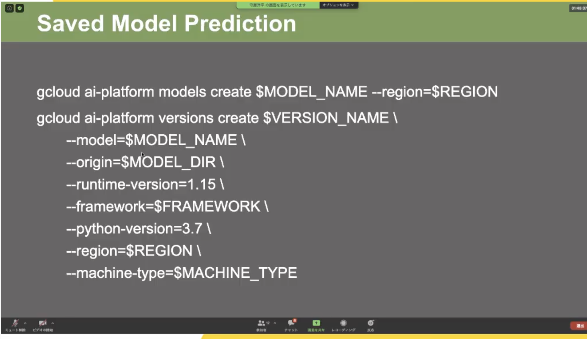
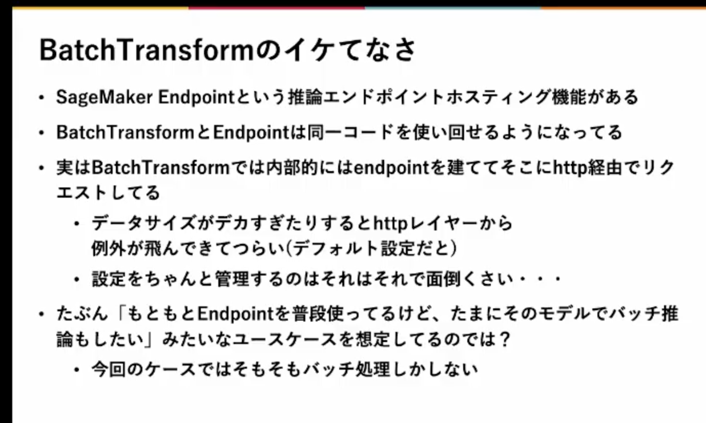

- BatchTransform の代わりに Processing を使ったら快適になった
　-> Processing とは、前処理、後処理用のサービスで、任意のコードを実行できる
- GCP の ai platform training job とだいたい一緒
- スポットインスタンス未対応で GPU インスタンスを立ち上げないといけず、コストがつらかった
- AWS Batch を使う？（EC2 上でバッチ処理を実行でいる）
- SageMaker Train Job を使う（学習 Job として「推論」してしまう）
     -> 想定されている使い方ではなかろうが、使い勝手はよかった

- 最終的な構成：SageMaker Train Job で推論することにした。

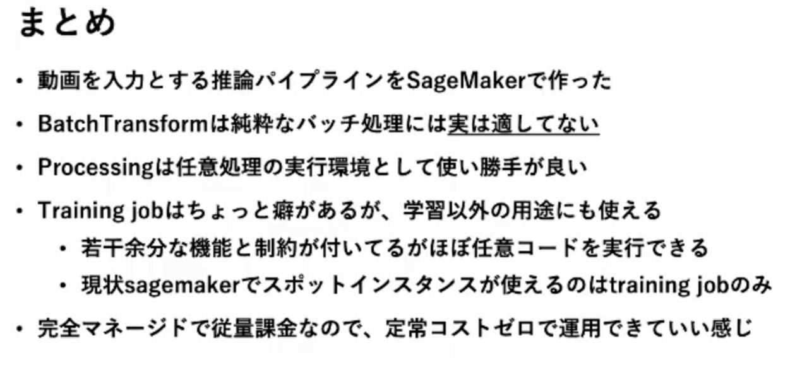

## Cloud Composer で組む機械学習パイプライン
- タクシー乗務員向け機能
- 需要を予測して最適な営業経路を提案
- Cloud Composer で前処理からデプロイまで自動化

### Cloud Composer とは
- 鉄板ワークフローの Airflow を採用
- Python で書ける
- 他の GCP 機能との連携が容易
- クラスタ運用やログ運用がマネージド

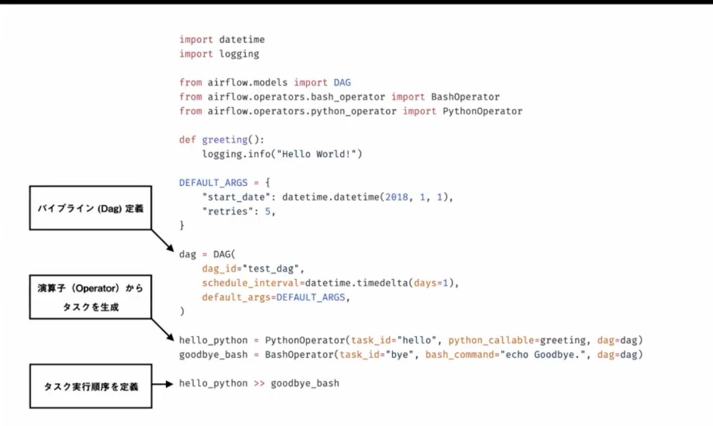

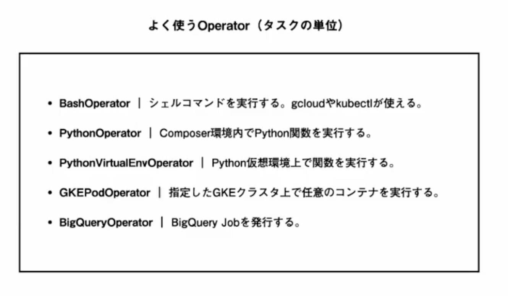

### タスクへの情報の渡し方

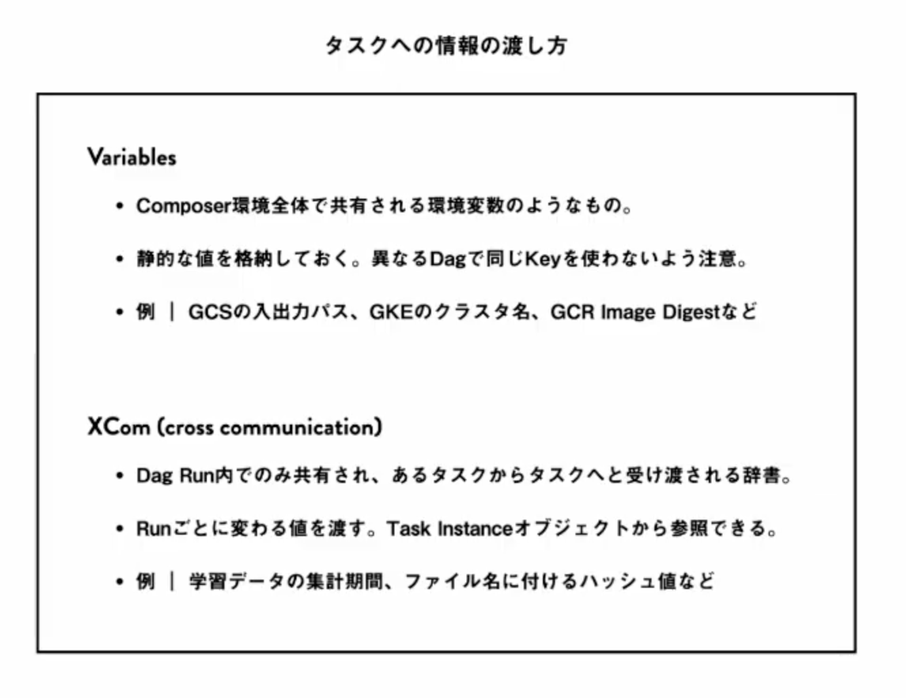

- Variables 
    - Composer 環境全体で共有される環境変数のようなもの
    - 静的な値を格納しておく。異なる Dag で同じ Key を使わないよう注意。

- XCom
    - Dag Run 内でのみ強雨され、あるタスクからタスクへと受け渡される辞書

### おすすめ：GKEPodOperator で全部やる

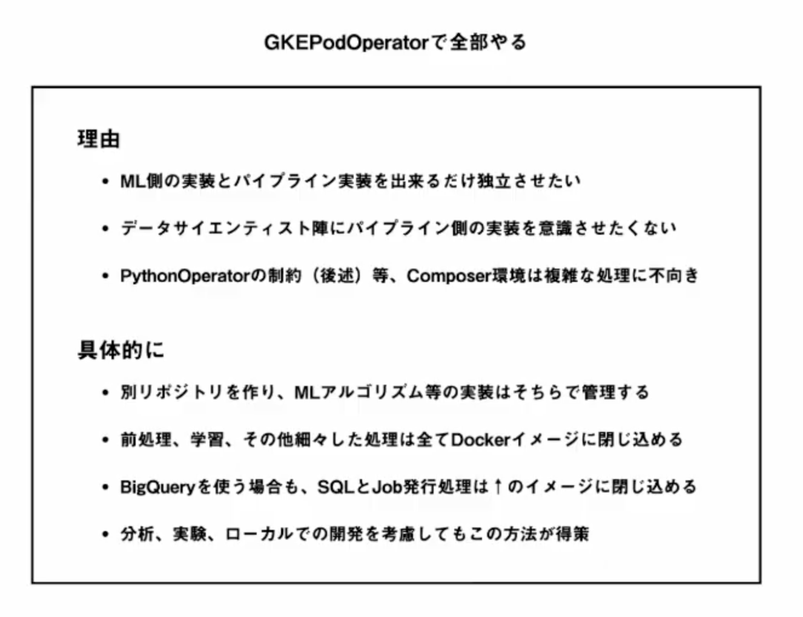

- パイプラインのリポジトリとは別にリポジトリを作り、ML アルゴリズム等の実装はそちらで管理する
- 前処理、学習、その他細々とした処理はすべて Docker イメージに閉じ込める

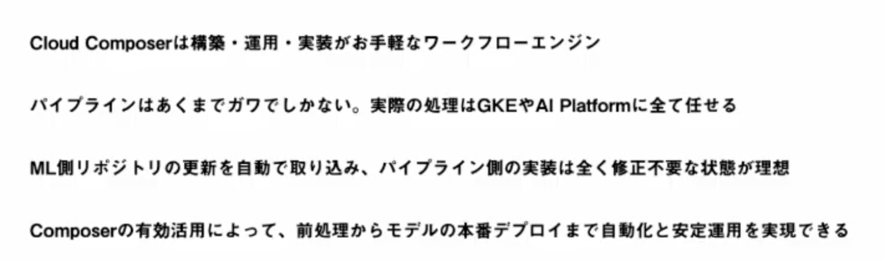

## 検索システムにおける機械学習ランキングとモデル更新の自動化
・Solr（全文検索）

### 運用する上での課題
- MLR モデルが古くなると精度が悪くなるので定期的に新しいデータで再学習する必要がある
- デプロイする時に SolrCLoud クラスタをサービスアウトさせる必要がある
- モデルサイズが大きくて Git のリモートリポジトリに置けない
	- GitLFS を使って一元管理
- マスターデータを更新する前にモデルのバリデーションをかけたい
	- リクエストを受けながらデプロイするので invalid なもで右rをデプロイするとよくない
	- マスターデータが更新される前に CI でチェックしたい
つまり：オペレーションコストを減らしたい

### まとめ
- 現在はチーム内での検証が終わった段階で、サービスへの導入はこれから
- 今後はベンチマークや A/B テスト、モデル選択も自動化したい
- モデル開発やプラグイン開発にリソースを割くためにオペレーションを自動化するのは大切

### 全社共通レコメンドプラットフォームへのKubernetes/Airflow導入

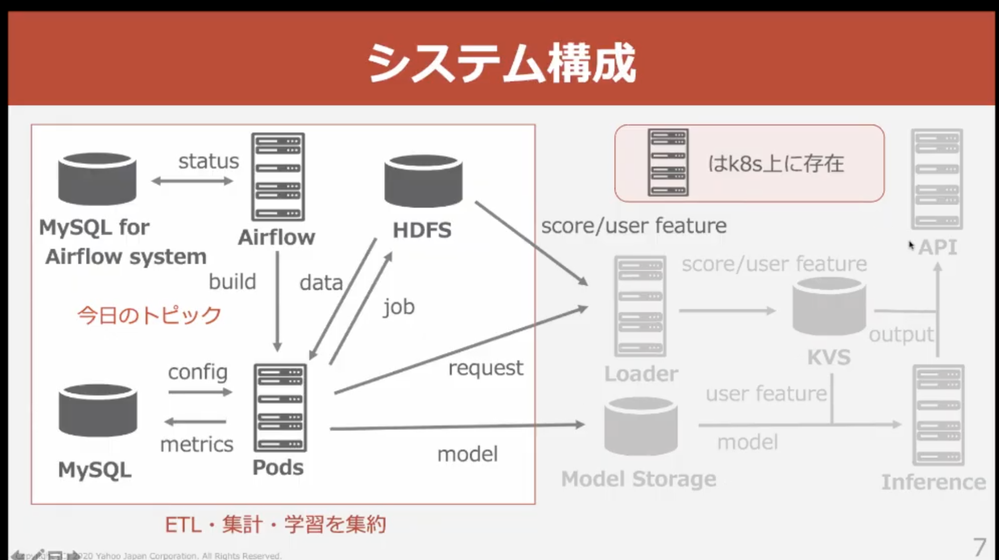

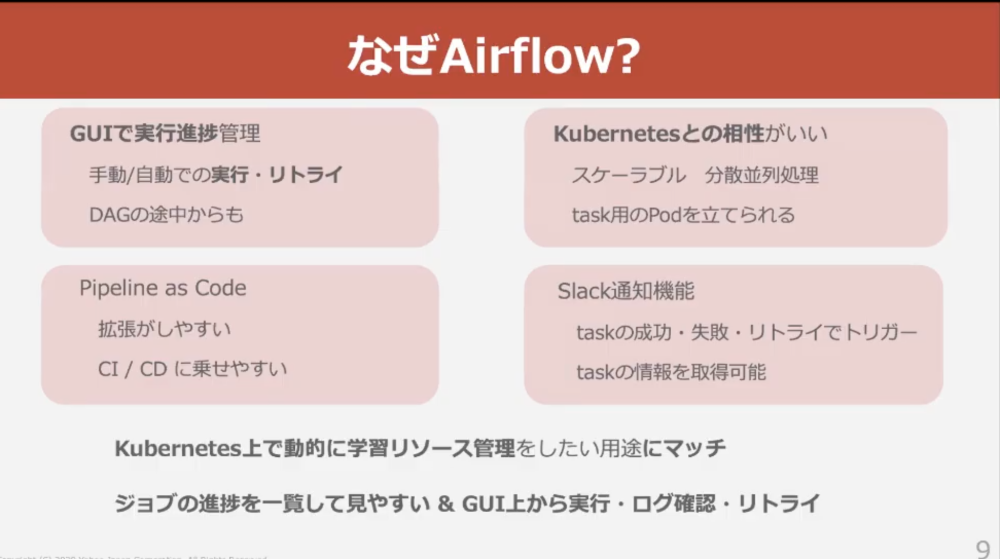

- 共通レコメンドPFを社内の Kubernetes 基盤に移管
    - これまで：自分たちで管理するサーバでリソース調整
    - これから：k8sで動的に

- 全社共通レコメンドプラットフォーム
    - 専属のレコメンドチームを持たないサービス向け、さまざまなサービスが導入
    - サービス側は、ロガーの実装だかえでOK
    - API をたたくだけでアイテム列返却
        - Item to Item: あるアイテムに関連したアイテムをレコメンド（これを見ている人は〜）
        - User to Item：あるユーザーに関連したアイテムをレコメンド（あなたにおすすめ）

- 多様な要望、ログ形式、トラフィック（最高 10k req/s）に耐える必要
- 場合によってはビジネスロジックも考慮

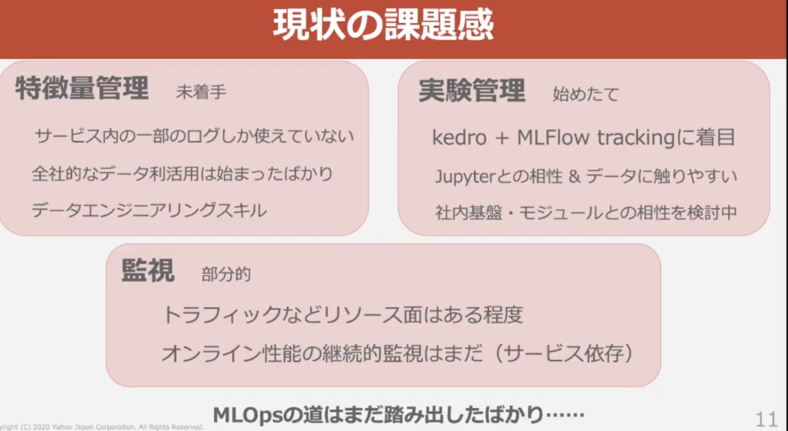
