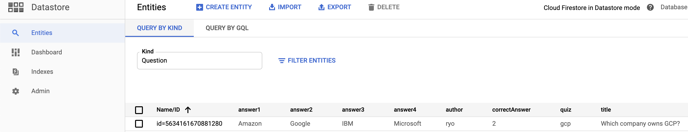

**アプリケーション開発 - Python**

# アプリ開発: 開発環境の設定 - Python

<h2 id="step2">目標</h2>
<p>このラボでは、Google Compute Engine を使用して Google Cloud Platform に Python 開発環境を設定し、仮想マシン（VM）を作成します。また、ソフトウェア開発用にソフトウェア ライブラリをインストールします。</p>
<p>以下のタスクを行います。</p>
<ul>
<li>
<p>Google Compute Engine インスタンスをプロビジョニングする。</p>
</li>
<li>
<p>SSH を使用してインスタンスに接続する。</p>
</li>
<li>
<p>インスタンスに Python ライブラリをインストールする。</p>
</li>
<li>
<p>ソフトウェアのインストールを確認する。</p>
</li>
</ul>
<h2 id="step3">概要</h2>
<p>Compute Engine は Google Cloud Platform が提供するリソースの 1 つです。</p>
<h3>Google Cloud Platform</h3>
<p>Google Cloud Platform（GCP）は、コンピュータやハードディスク ドライブなどの物理アセット一式と、仮想マシン（VM）などの仮想リソースで構成されています。これらは世界中にある Google のデータセンターで稼働しています。各データセンターは世界各地のリージョンにあります。リージョンには、米国中部、西ヨーロッパ、東アジアなどがあります。各リージョンはゾーンの集まりで、各ゾーンはリージョン内で相互に分離されています。各ゾーンは、文字の識別子とリージョン名を組み合わせた名前で識別されます。たとえば、東アジアのリージョンのゾーン a は、asia-east1-a という名前になります。</p>
<p>このようにリソースが分散されていることで、障害時の冗長性や、クライアントの近くにリソースが配置されることによるレイテンシの削減など、いくつかのメリットがあります。また、分散されているリソースを一緒に使用する方法についてのルールも必要になります。</p>
<h3>プロジェクト</h3>
<p>GCP のリソースを割り当てて使用するには、リソースがプロジェクトに含まれている必要があります。プロジェクトとは、構築する対象をまとめて管理する 1 つの単位だと考えることができます。プロジェクトは、設定や権限に加え、アプリケーションに関する情報を記述したその他のメタデータで構成されます。同じプロジェクト内のリソースは簡単に連携できます。これは、リージョンとゾーンのルールに沿って内部ネットワークで通信する方法などで行われます。各プロジェクトに含まれるリソースは、他のプロジェクトからは分離されたままになります。異なるプロジェクトのリソースが相互に接続するには、外部ネットワーク接続を利用する必要があります。</p>
<p>各 GCP プロジェクトには以下の要素が含まれます。</p>
<p>プロジェクト名（ユーザーが指定）
プロジェクト ID（ユーザーまたは GCP が指定）
プロジェクト番号（GCP が指定）
GCP を操作する際、特定のコマンドラインや API 呼び出しでこれらの識別子を使用します。</p>
<p>Google Cloud Platform Console にはプロジェクトの ID と名前が表示されます。</p>
<p>例えば次のようになります。</p>

- プロジェクト名: Example Project
- プロジェクト ID: example-id
- プロジェクト番号: 123456789012
<p>プロジェクト ID は GCP 全体で一意になります。プロジェクトは作成後に削除できますが、その ID を再び使用することはできません。</p>
<p>課金を有効にすると、各プロジェクトは 1 つの請求先アカウントに関連付けられます。リソースの使用について、複数のプロジェクトで同じアカウントに請求されるように設定できます。</p>
<p>プロジェクトは名前空間として機能します。これは、各プロジェクトの各リソースが一意の名前を持つ必要があることを意味しますが、通常、異なるプロジェクトでは同じリソース名を使用できます。一部のリソース名はグローバルに一意である必要があります。詳しくはリソースについてのドキュメントをご覧ください。</p>
<p>このラボでは、Google Compute Engine 仮想マシン（VM）をプロビジョニングし、Google Cloud Platform（GCP）で、Python を使用したソフトウェア開発用にソフトウェア ライブラリをインストールします。</p>
<h3>サービスと通信する方法</h3>
<p>GCP でサービスやリソースと通信するには、次の 3 つの基本的な方法を使用します。</p>
<ul>
<li>
<p>Google Cloud Platform Console: ウェブベースのグラフィック ユーザー インターフェースです。これを使用して GCP のプロジェクトやリソースを管理できます。</p>
</li>
<li>
<p>コマンドライン インターフェース</p>
<ul>
<li>Google Cloud SDK: gcloud コマンドライン ツールを使って、必要なコマンドにアクセスできます。</li>
<li>Cloud Shell: ブラウザベースのインタラクティブな GCP 用シェル環境です。Cloud Shell には GCP Console からアクセスできます。
ターミナル ウィンドウで作業する場合は、Google Cloud SDK が提供する gcloud コマンドライン ツールを使用して、必要なコマンドにアクセスできます。gcloud ツールを使用して開発ワークフローと GCP リソースの両方を管理できます。使用できるコマンドの完全なリストについては、gcloud リファレンスをご覧ください。</li>
</ul>
</li>
<li>
<p>クライアント ライブラリ: Cloud SDK にはクライアント ライブラリが含まれています。これを使用すると、リソースを簡単に作成、管理できます。GCP のクライアント ライブラリが公開している API を使用すると、サービスにアクセスしたり、リソースを管理したりできます。また、Google API クライアント ライブラリを使用して、Google マップ、Google ドライブ、YouTube などのプロダクトの API にアクセスできます。</p>
</li>
</ul>

<h2 id="step5">Compute Engine 仮想マシン インスタンスを作成する</h2>
<p>このセクションでは、GCP Console を使用して新しい Google Compute Engine（VM）インスタンスをプロビジョニングします。</p>
<h3><strong>仮想マシンを作成し、それに接続する</strong></h3>
<ol>
<li>
<p>Console で、<strong>ナビゲーション メニュー</strong> &gt; [<strong>Compute Engine</strong>] &gt; [<strong>VM インスタンス</strong>] の順にクリックします。</p>
<p></p>
</li>
<li>
<p>[<strong>VM インスタンス</strong>] ページで、[<strong>インスタンスを作成</strong>] をクリックします。</p>
</li>
<li>
<p>[<strong>インスタンスの作成</strong>] ページで、[<strong>名前</strong>] に「<code>dev-instance</code>」と入力し、[<strong>リージョン</strong>] で [<strong>us-central1（アイオワ）</strong>]、[<strong>ゾーン</strong>] で [<strong>us-central1-a</strong>] を選択します。</p>
<aside>
<strong>GCP のリージョンとゾーン:</strong>
GCP では、リージョンと呼ばれる複数の異なる地理的なロケーションでプロダクトやサービスが提供されます。
各リージョンには複数の異なるゾーンがあります。各ゾーンは電源とインターネット接続が他のゾーンから分離されています。

</aside>
</li>
<li>
<p>[<strong>ID と API へのアクセス</strong>] で、[<strong>すべての Cloud API に完全アクセス権を許可</strong>] を選択します。</p>
</li>
<li>
<p>[<strong>ファイアウォール</strong>] で、[<strong>HTTP トラフィックを許可する</strong>] を有効にします。</p>
</li>
<li>
<p>残りの設定はデフォルトのままにして、[<strong>作成</strong>] をクリックします。</p>
<p></p>
<p>仮想マシンがプロビジョニングされて起動されるまでに約 20 秒かかります。</p>
</li>
</ol>
<h4>完了したタスクをテストする</h4>
<p>[<strong>進捗状況を確認</strong>] をクリックして、実行したタスクを確認します。タスクが正常に完了すると、評価スコアが提供されます。</p>
<ql-activity-tracking step="1">
    Compute Engine 仮想マシン インスタンスを作成する
</ql-activity-tracking>
<ol start="7">
<li>
<p>[<strong>VM インスタンス</strong>] ページの <code>dev-instance</code> の行で、[<strong>SSH</strong>] をクリックします。</p>
<p>これにより、ブラウザでホストされる SSH セッションが起動されます。ポップアップ ブロッカーを使用していると、2 回クリックする必要がある場合があります。</p>
<p>SSH 認証鍵の構成や管理は必要ありません。</p>
</li>
</ol>
<h3>VM インスタンスにソフトウェアをインストールする</h3>
<ol>
<li>
<p>SSH セッションで Debian パッケージのリストを更新するには、次のコマンドを実行します。</p>
<pre><code>sudo apt-get update&#x000A;</code></pre>
</li>
<li>
<p>Git をインストールするには、次のコマンドを実行します。</p>
<pre><code>sudo apt-get install git&#x000A;</code></pre>
<p>プロンプトが表示されたら「<code>Y</code>」と入力し、追加のディスク容量を使用することに同意します。</p>
</li>
<li>
<p>Python をインストールするには、次のコマンドを実行します。</p>
<pre><code>sudo apt-get install python3-setuptools python3-dev build-essential&#x000A;</code></pre>
<p>ここでも、プロンプトが表示されたら「<code>Y</code>」と入力し、追加のディスク容量を使用することに同意します。</p>
</li>
<li>
<p>pip をインストールするには、次のコマンドを実行します。</p>
<pre><code>curl https://bootstrap.pypa.io/get-pip.py -o get-pip.py&#x000A;</code></pre>
<pre><code>sudo python3 get-pip.py&#x000A;</code></pre>
</li>
</ol>
<h4>完了したタスクをテストする</h4>
<p>[<strong>進捗状況を確認</strong>] をクリックして、実行したタスクを確認します。タスクが正常に完了すると、評価スコアが提供されます。</p>
<ql-activity-tracking step="2">
    ソフトウェアをインストールし、VM インスタンスを構成する
</ql-activity-tracking>
<h2 id="step6">VM を構成してアプリケーション ソフトウェアを実行する</h2>
<p>このセクションでは、VM へのソフトウェアのインストールを確認し、サンプルコードをいくつか実行します。</p>
<h3>Python のインストールを確認する</h3>
<ol>
<li>
<p>引き続き SSH ウィンドウで、次のコマンドを実行して Python と pip のバージョンを確認します。</p>
<pre><code>python3 --version&#x000A;</code></pre>
<pre><code>pip3 --version&#x000A;</code></pre>
<p>出力に Python と pip のインストールされたバージョンが表示されます。</p>
</li>
<li>
<p>クラス リポジトリのクローンを作成します。</p>
<pre><code>git clone https://github.com/GoogleCloudPlatform/training-data-analyst&#x000A;</code></pre>
</li>
<li>
<p>作業ディレクトリを変更します。</p>
<pre><code>cd ~/training-data-analyst/courses/developingapps/python/devenv/&#x000A;</code></pre>
</li>
<li>
<p>シンプルなウェブサーバーを実行します。</p>
<pre><code>sudo python3 server.py&#x000A;</code></pre>
</li>
<details close>
<summary>server.py</summary>

```py
try:
  from BaseHTTPServer import BaseHTTPRequestHandler, HTTPServer
except ImportError:
  from http.server import BaseHTTPRequestHandler, HTTPServer

class SimpleHTTPRequestHandler(BaseHTTPRequestHandler):
  def do_GET(self):
    self.send_response(200)
    self.send_header('Content-type','text/plain')
    self.end_headers()
    self.wfile.write(b'Hello GCP dev!')
    return

  
def run():
  print('Server is starting...')
  server_address = ('0.0.0.0', 80)
  server = HTTPServer(server_address, SimpleHTTPRequestHandler)
  print('Started. Press Ctrl + C to stop')
  server.serve_forever()
  
if __name__ == '__main__':
  run()
```
</details>
<li>
<p>Cloud Console の VM インスタンスのリストに戻り（<strong>ナビゲーション メニュー</strong> &gt; [<strong>Compute Engine</strong>] &gt; [<strong>VM インスタンス</strong>]）、<code>dev-instance</code> の [<strong>外部 IP</strong>] をクリックします。</p>
<p></p>
<p>ブラウザが開き、Python からの「<code>Hello GCP dev!</code>」 というメッセージが表示されます。</p>
</li>
</ol>
<h4>完了したタスクをテストする</h4>
<p>[<strong>進捗状況を確認</strong>] をクリックして、実行したタスクを確認します。タスクが正常に完了すると、評価スコアが提供されます。</p>
<ql-activity-tracking step="3">
    アプリケーション ソフトウェアを実行して成功のレスポンスを受け取る
</ql-activity-tracking>
<ol start="6">
<li>
<p>SSH ウィンドウに戻り、<strong>Ctrl</strong>+<strong>c</strong> キーを押してアプリケーションを停止します。</p>
</li>
<li>
<p>Google Compute Engine VM インスタンスを列挙するために必要な Python パッケージをインストールします。</p>
<pre><code class="language-bash prettyprint">sudo pip3 install -r requirements.txt&#x000A;</code></pre>

ちなみに、`requirement.txt` の中身は以下。

```
google-api-python-client==1.6.4
google-auth==1.2.1
```

</li>
<li>
<p>Cloud Shell でインスタンスを一覧表示します。次のコマンドを入力して、Compute Engine インスタンスを一覧表示するシンプルな Python アプリケーションを実行します。<code>&lt;PROJECT_ID&gt;</code> は GCP プロジェクトの ID に置き換えます。<code>&lt;YOUR_VM_ZONE&gt;</code> には、VM の作成時に指定したリージョンを指定します。これらの値は Console の VM インスタンスのページで確認できます。</p>
<p></p>
<pre><code class="language-bash prettyprint">python3 list-gce-instances.py &lt;PROJECT_ID&gt; --zone=&lt;YOUR_VM_ZONE&gt;&#x000A;</code></pre>

<details close>
<summary>list-gce-instances.py</summary>

```py
import argparse
import os
import time

import googleapiclient.discovery

def list_instances(compute, project, zone):
    result = compute.instances().list(project=project, zone=zone).execute()
    return result['items']


def main(project, zone):
    compute = googleapiclient.discovery.build('compute', 'v1')

    instances = list_instances(compute, project, zone)

    print('Instances in project %s and zone %s:' % (project, zone))
    for instance in instances:
        print(' - ' + instance['name'])


if __name__ == '__main__':
    parser = argparse.ArgumentParser(
        description=__doc__,
        formatter_class=argparse.RawDescriptionHelpFormatter)
    parser.add_argument('project_id', help='Your Google Cloud project ID.')
    parser.add_argument(
        '--zone',
        default='us-central1-f',
        help='Compute Engine zone to deploy to.')

    args = parser.parse_args()

    main(args.project_id, args.zone)
```

</details>

<p>SSH ターミナル ウィンドウにインスタンス名が表示されます。</p>
<p>出力例:
</p>
</li>
</ol>

# アプリ開発: Cloud Datastore でのアプリケーション データの保存 - Python

<h2 id="step2">概要</h2>
<p><a href="https://cloud.google.com/datastore/docs/concepts/overview">Google Cloud Datastore</a> は、自動スケーリングと高いパフォーマンスを実現し、アプリケーション開発を簡素化するように構築された NoSQL ドキュメント データベースです。このラボでは、この Datastore を使用してオンライン クイズ アプリケーションのアプリケーション データを保存します。また、クイズのデータを Datastore から取得して表示するようアプリケーションを構成します。</p>
<p>クイズ アプリケーションのスケルトンをあらかじめ用意していますので、まず Google Cloud Shell を使用してスケルトンを含むリポジトリのクローンを作成し、その後 Cloud Shell エディタを使ってコードを確認して、Cloud Shell のウェブ プレビュー機能でアプリケーションを表示します。その後、Cloud Datastore を使用してデータを保存するようコードを変更します。</p>
<h2 id="step3">目標</h2>
<p>このラボでは、次のタスクの実行方法について学びます。</p>
<ul>
<li>
<p>Cloud Shell を開発環境として利用する</p>
</li>
<li>
<p>アプリケーションをプレビューする</p>
</li>
<li>
<p>アプリケーション コードを更新して Cloud Datastore を統合する</p>
</li>
</ul>

<h2 id="step5">クイズ アプリケーションを用意する</h2>
<p>クイズ アプリケーションを含むリポジトリは github.com にあります。このセクションでは、Cloud Shell を使用してコマンドを入力することで、リポジトリのクローンを作成してアプリケーションを実行します。</p>
<h3><strong>Cloud Shell でソースコードのクローンを作成する</strong></h3>
<p>クラスのリポジトリのクローンを作成します。</p>
<pre><code>git clone https://github.com/GoogleCloudPlatform/training-data-analyst&#x000A;</code></pre>
<h3>クイズ アプリケーションを構成して実行する</h3>
<ol>
<li>
<p>作業ディレクトリを変更します。</p>
</li>
</ol>
<pre><code class="language-bash prettyprint">cd ~/training-data-analyst/courses/developingapps/python/datastore/start&#x000A;</code></pre>
<ol start="2">
<li>
<p>GCP プロジェクト ID を参照する環境変数 <code>GCLOUD_PROJECT</code> をエクスポートします。</p>
<pre><code class="language-bash prettyprint">export GCLOUD_PROJECT=$DEVSHELL_PROJECT_ID&#x000A;</code></pre>
<aside>
 これが Cloud Shell における <strong>GCP プロジェクト ID</strong> です。Cloud Shell で作業している間は、<code>$DEVSHELL_PROJECT_ID</code> 環境変数でプロジェクト ID にアクセスできます。

</aside>
</li>
<li>
<p>アプリケーションの依存関係をインストールします。</p>
<pre><code>sudo pip install -r requirements.txt&#x000A;</code></pre>
<p>互換性がないことを示す警告は無視してください。</p>
</li>
<li>
<p>アプリケーションを実行します。</p>
<pre><code>python run_server.py&#x000A;</code></pre>
<p>アプリケーションの実行が開始されると、次のようなメッセージが表示されます。</p>
<pre><code>* Running on http://127.0.0.1:8080/ (Press CTRL+C to quit)&#x000A;* Restarting with stat&#x000A;* Debugger is active!&#x000A;* Debugger PIN: 179-313-240&#x000A;</code></pre>
</li>
</ol>
<h3>クイズ アプリケーションを確認する</h3>
<ol>
<li>
<p>Cloud Shell で、[<strong>ウェブでプレビュー</strong>] &gt; [<strong>ポート 8080 上でプレビュー</strong>] をクリックして、クイズ アプリケーションをプレビューします。</p>
<p></p>
<p>このウェブ アプリケーションのユーザー インターフェースが表示されます。主に次の 3 つの部分で構成されています。</p>
<ul>
<li><strong>Create Question</strong></li>
<li><strong>Take Test</strong></li>
<li><strong>Leaderboard</strong></li>
</ul>
<p></p>
</li>
<li>
<p>ナビゲーション バーで、[<strong>Create Question</strong>] をクリックします。</p>
<p>質問と答えのテキストボックスと、正しい答えを選択するためのラジオボタンを含む、簡単なフォームが表示されます。</p>
<aside>
アプリケーションのこの箇所で出題者が質問を追加できます。この箇所は、一般的な Python ウェブ アプリケーション フレームワークである Flask を使用したサーバー側ウェブ アプリケーションとして記述されています。

</aside>
</li>
<li>
<p>ナビゲーション バーで [<strong>Take Test</strong>] をクリックし、[<strong>GCP</strong>] をクリックして、GCP の質問にアクセスします。</p>
<p>質問の例が表示されます。</p>
<p></p>
<p>アプリケーションのこの箇所で解答者が質問に答えます。</p>
<aside>この箇所は、クライアント側ウェブ アプリケーションとして記述されています。

</aside>
</li>
<li>
<p>サーバー側アプリケーションに戻るには、ナビゲーション バーの [<strong>Quite Interesting Quiz</strong>] リンクをクリックします。</p>
</li>
</ol>
<h2 id="step6">クイズ アプリケーションのコードを確認する</h2>
<p>このラボでは、ファイルの閲覧と編集を行います。Cloud Shell にインストールされている <code>nano</code> や <code>vim</code> などの shell エディタや、Cloud Shell コードエディタを使用できます。</p>
<p>このラボでは、Cloud Shell コードエディタを使用してこのクイズ アプリケーションのコードを確認します。</p>
<h3>Cloud Shell コードエディタを起動する</h3>
<p>Cloud Shell で、<strong>コードエディタ（ベータ版）の起動</strong>アイコン（鉛筆の形）をクリックしてコードエディタを起動します。</p>
<p></p>
<aside>ブラウザの別のタブで Cloud Shell とコードエディタが起動します。

</aside>
<h3>Flask ウェブ アプリケーションを確認する</h3>
<ol>
<li>
<p>エディタの左側にあるファイル ブラウザ パネルを使用して、<code>/training-data-analyst/courses/developingapps/python/datastore/start</code> フォルダに移動します。</p>
<aside>
<strong>注:</strong> 以降のパスはこのフォルダからの相対パスです。このアプリケーションは、一般的なアプリケーション フレームワークである Flask を使用して記述された標準的な Python アプリケーションです。

</aside>
</li>
<li>
<p><code>...run-server.py</code> ファイルを選択します。</p>
<p>このファイルにはアプリケーションのエントリポイントが含まれています。ポート 8080 でアプリケーションを実行します。</p>
</li>
<li>
<p><code>...quiz/init.py</code> ファイルを選択します。</p>
<p>このファイルは、ウェブ アプリケーションと REST API のルートをインポートします。</p>
</li>
<li>
<p><code>...quiz/webapp/questions.py</code> ファイルと <code>...quiz/webapp/routes.py</code> ファイルを選択します。</p>
<p>これらのファイルには、URI をハンドラにマッピングするルートが含まれています。フォームを表示するハンドラと、出題者がこのウェブ アプリケーションに投稿したフォームデータを収集するハンドラがあります。</p>
</li>
<li>
<p><code>...quiz/webapp/templates</code> フォルダを選択します。</p>
<p>このフォルダには、Jinja2 テンプレートを使用するウェブ アプリケーション ユーザー インターフェースのテンプレートが含まれています。</p>
</li>
<li>
<p><code>...quiz/webapp/templates/add.html</code> ファイルを表示します。</p>
<p>このファイルには、[Create Question] フォームの Jinja2 テンプレートが含まれています。</p>
<p>クイズを選択するための選択リスト、出題者が質問と答えを入力できるテキストボックス、正しい答えを選択するためのラジオボタンがあることを確認してください。</p>
</li>
<li>
<p><code>...quiz/api/api.py</code> ファイルを選択します。</p>
<p>このファイルには、テストを受ける生徒に JSON データを送信するハンドラが含まれています。</p>
</li>
<li>
<p><code>...quiz/gcp/datastore.py</code> ファイルを選択します。</p>
<p>このファイルに、Cloud Datastore を使用してクイズの質問の保存と読み込みを行うための Datastore コードを記述します。</p>
<p>このモジュールは、ウェブ アプリケーションと API にインポートされます。</p>
</li>
</ol>
<h2 id="step7">Cloud Datastore にエンティティを追加する</h2>
<p>このセクションでは、フォームデータを Cloud Datastore に保存するためのコードを記述します。</p>
<aside>
<strong>重要:</strong> <code># TODO</code> と <code># END TODO</code> で囲まれたコードを更新します。学習効果を最大限に高めるために、セクションの最後にある完成後のコードブロックを参照せずにコードを記述してみてください。また、コード、インライン コメント、<a href="https://googlecloudplatform.github.io/google-cloud-python/latest/datastore/client.html">Cloud Datastore の関連する API ドキュメント</a>を確認してください。

</aside>
<h3><strong>App Engine アプリケーションを作成して Cloud Datastore をプロビジョニングする</strong></h3>
<ol>
<li>
<p>Cloud Shell に戻り、<strong>Ctrl</strong>+<strong>C</strong> キーを押してアプリケーションを停止します。</p>
</li>
<li>
<p>次のコマンドを実行して、プロジェクトに App Engine アプリケーションを作成します。</p>
<pre><code>gcloud app create --region "us-central"&#x000A;</code></pre>
</li>
</ol>
<p>App Engine アプリケーションが作成されると次のメッセージが表示されます。</p>
<pre><code>Creating App Engine application in project [qwiklabs-gcp-f67238775c00cfaa] and region [us-central]....done.&#x000A;Success! The app is now created. Please use `gcloud app deploy` to deploy your first app.&#x000A;</code></pre>
<p><strong>注:</strong> この段階ではまだクイズのウェブ アプリケーションで App Engine を使用していません。Cloud Datastore を使用する場合は、プロジェクトで App Engine アプリケーションを作成する必要があります。</p>
<h3><strong>Python の Datastore モジュールをインポートして使用する</strong></h3>
<p>Cloud Shell エディタで <code>...quiz/gcp/datastore.py</code> ファイルを開き、以下の処理を実行するコードを追加します。</p>
<ul>
<li>
<code>os</code> モジュールをインポートする。</li>
<li>os モジュールを使って <code>GCLOUD_PROJECT</code> 環境変数を取得する。</li>
<li>
<code>google.cloud</code> パッケージから <code>datastore</code> モジュールをインポートする。</li>
<li>
<code>datastore_client という名前の datastore.Client</code> クライアント オブジェクトを宣言する。<code></code>
</li>
</ul>
<p><strong>更新後の datastore.py</strong></p>

```py
# TODO: Import the os module

import os

# END TODO

# TODO: Get the GCLOUD_PROJECT environment variable

project_id = os.getenv('GCLOUD_PROJECT')

# END TODO

from flask import current_app

# TODO: Import the datastore module from the google.cloud package

from google.cloud import datastore

# END TODO

# TODO: Create a Cloud Datastore client object
# The datastore client object requires the Project ID.
# Pass through the Project ID you looked up from the
# environment variable earlier

datastore_client = datastore.Client(project_id)

# END TODO
```

<h3><strong>Cloud Datastore エンティティを作成するコードを記述する</strong></h3>
<p>引き続き <code>...quiz/gcp/datastore.py</code> で作業します。</p>
<p><code>save_question()</code> 関数に移動して、既存の <code>pass</code> プレースホルダ ステートメントを削除してから、以下の処理を実行するコードを追加します。</p>
<ul>
<li>Datastore クライアント オブジェクトを使用して、種類が <code>'Question'</code> の Datastore エンティティのキーを作成する。</li>
<li>そのキーを使用して、質問の Datastore エンティティを作成する。</li>
<li>ウェブ アプリケーションのフォームから提供される値の辞書の項目を反復処理する。</li>
<li>ループの本体で、キーと値を Datastore エンティティ オブジェクトに割り当てる。</li>
<li>Datastore クライアントを使用してデータを保存する。</li>
</ul>
<p><strong>datastore.py</strong> - save_question() 関数</p>

```py
"""
Create and persist and entity for each question
The Datastore key is the equivalent of a primary key in a relational database.
There are two main ways of writing a key:
1. Specify the kind, and let Datastore generate a unique numeric id
2. Specify the kind and a unique string id
"""
def save_question(question):
# TODO: Create a key for a Datastore entity
# whose kind is Question

    key = datastore_client.key('Question')

# END TODO

# TODO: Create a Datastore entity object using the key

    q_entity = datastore.Entity(key=key)

# END TODO

# TODO: Iterate over the form values supplied to the function

    for q_prop, q_val in question.iteritems():

# END TODO

# TODO: Assign each key and value to the Datastore entity

        q_entity[q_prop] = q_val

# END TODO

# TODO: Save the entity

    datastore_client.put(q_entity)

# END TODO
```

<p><code>datastore.py</code> を保存します。</p>
<h3>アプリケーションを実行して Cloud Datastore エンティティを作成する</h3>
<ol>
<li>
<p><code>...quiz/gcp/datastore.py</code> ファイルを保存し、Cloud Shell コマンド プロンプトに戻ります。</p>
</li>
<li>
<p>次のコマンドを実行して、アプリケーションを実行します。</p>
</li>
</ol>
<pre><code class="language-bash prettyprint">python run_server.py&#x000A;</code></pre>
<ol start="3">
<li>
<strong>Cloud Shell</strong> で、[<strong>ウェブでプレビュー</strong>] &gt; [<strong>ポート 8080 上でプレビュー</strong>] をクリックして、クイズ アプリケーションをプレビューします。</li>
<li>[<strong>Create Question</strong>] をクリックします。</li>
<li>フォームに次の値を入力して、[<strong>Save</strong>] をクリックします。</li>
</ol>
<table>
<tr>
<td colspan="1" rowspan="1">
<p><strong>フォームの項目</strong></p>
</td>
<td colspan="1" rowspan="1">
<p><strong>値</strong></p>
</td>
</tr>
<tr>
<td colspan="1" rowspan="1">
<p>Author</p>
</td>
<td colspan="1" rowspan="1">
<p><code>自分の名前</code></p>
</td>
</tr>
<tr>
<td colspan="1" rowspan="1">
<p>Quiz</p>
</td>
<td colspan="1" rowspan="1">
<p><code>Google Cloud Platform</code></p>
</td>
</tr>
<tr>
<td colspan="1" rowspan="1">
<p>Title</p>
</td>
<td colspan="1" rowspan="1">
<p><code>Which company owns GCP?</code></p>
</td>
</tr>
<tr>
<td colspan="1" rowspan="1">
<p>Answer 1</p>
</td>
<td colspan="1" rowspan="1">
<p><code>Amazon</code></p>
</td>
</tr>
<tr>
<td colspan="1" rowspan="1">
<p>Answer 2</p>
</td>
<td colspan="1" rowspan="1">
<p><strong><code>Google</code></strong>（[Answer 2] のラジオボタンを選択します）</p>
</td>
</tr>
<tr>
<td colspan="1" rowspan="1">
<p>Answer 3</p>
</td>
<td colspan="1" rowspan="1">
<p><code>IBM</code></p>
</td>
</tr>
<tr>
<td colspan="1" rowspan="1">
<p>Answer 4</p>
</td>
<td colspan="1" rowspan="1">
<p><code>Microsoft</code></p>
</td>
</tr>
</table>
<p>アプリケーションのホームページに戻ります。</p>
<ol start="6">
<li>Cloud Platform Console に戻り、<strong>ナビゲーション メニュー</strong> &gt; [<strong>Datastore</strong>] &gt; [<strong>エンティティ</strong>] をクリックします。</li>
</ol>
<p></p>
<p>作成した新しい質問が表示されます。</p>



<h3>Cloud Datastore エンティティを取得する</h3>
<p>このセクションでは、Cloud Datastore からエンティティ データを取得してアプリケーションに質問を表示するためのコードを記述します。</p>
<h4>Cloud Datastore エンティティを取得するためのコードを記述する</h4>
<p>コードエディタで <code>...quiz/gcp/datastore.py</code> ファイルを開き、<code>list_entities(quiz, redact)</code> 関数のコードを削除して、次の処理を実行するクエリに置き換えます。</p>
<ul>
<li>Cloud Datastore から特定のクイズの Question エンティティを取得する。</li>
<li>Datastore クライアントを使用してクエリを取得し、返されたデータを使用してリストを作成する。</li>
<li>リストの項目を列挙して、各エンティティのキーの識別子を最上位のプロパティに昇格させる。</li>
<li>結果を返す。</li>
</ul>
<p>元のコード:</p>

```py
"""
Returns a list of question entities for a given quiz
- filter by quiz name, defaulting to gcp
- no paging
- add in the entity key as the id property 
- if redact is true, remove the correctAnswer property from each entity
"""
def list_entities(quiz='gcp', redact=True):
    return [{'quiz':'gcp', 'title':'Sample question', 'answer1': 'A', 'answer2': 'B', 'answer3': 'C', 'answer4': 'D', 'correctAnswer': 1, 'author': 'Nigel'}]

"""
```

<p>更新後のコード:</p>

```py
"""
Returns a list of question entities for a given quiz
- filter by quiz name, defaulting to gcp
- no paging
- add in the entity key as the id property 
- if redact is true, remove the correctAnswer property from each entity
"""
def list_entities(quiz='gcp', redact=True):
    query = datastore_client.query(kind='Question')
    query.add_filter('quiz', '=', quiz)
    results =list(query.fetch())
    for result in results:
        result['id'] = result.key.id
    if redact:
        for result in results:
            del result['correctAnswer']
    return results
"""
```

<p><code>datastore.py</code> を保存します。</p>
<h4>アプリケーションを実行して Cloud Datastore に対するクエリをテストする</h4>
<p>最後に、先ほどの質問が Datastore から取得されてクイズ アプリケーションに読み込まれるかどうかをテストします。</p>
<p>Cloud Shell で、<strong>Ctrl</strong>+<strong>C</strong> キーを押してアプリケーションを停止してから、再びアプリケーションを開始します。</p>
<pre><code>python run_server.py&#x000A;</code></pre>
<p>クイズをプレビューします。クイズを実行しているブラウザがまだ開いている場合は、ブラウザを再読み込みします。それ以外の場合は、[<strong>ウェブでプレビュー</strong>] &gt; [<strong>ポート 8080 上でプレビュー</strong>] をクリックします。</p>
<p>[<strong>Take Test</strong>] &gt; [<strong>GCP</strong>] をクリックします。</p>
<p>先ほど作成した質問が表示されるはずです。</p>
<p></p>

<p>このセルフペース ラボは、<a href="https://google.qwiklabs.com/quests/41">Application Development - Python</a> クエストの一部です。クエストとは、学習パスを構成する一連のラボのことです。完了すると、成果が認められて上のバッジが贈られます。バッジは公開して、オンライン レジュメやソーシャル メディア アカウントにリンクさせることができます。このラボを終えたら、<a href="https://google.qwiklabs.com/learning_paths/41/enroll">このクエストに登録</a>して、すぐにクレジットを受け取れます。<a href="https://google.qwiklabs.com/catalog">受講可能なその他の Qwiklabs のクエストもご覧ください</a>。</p>
<h3>次のラボの受講</h3>
<p><a href="https://google.qwiklabs.com/catalog_lab/977">アプリ開発: アプリケーションへのユーザー認証の追加 - Python</a> などに進んで<a href="https://google.qwiklabs.com/quests/41?locale=ja">Application Development - Python</a> クエストを続けるか、以下のおすすめのラボをご確認ください。</p>
<ul>
<li>
<p><a href="https://google.qwiklabs.com/catalog_lab/923">Datastore: Qwik Start</a></p>
</li>
<li>
<p><a href="https://google.qwiklabs.com/catalog_lab/699">Cloud Storage: Qwik Start - Console</a></p>
</li>
<li>
<p><a href="https://google.qwiklabs.com/catalog_lab/341">App Engine フレキシブル環境での WordPress の実行</a>などのその他のラボ</p>
</li>
</ul>
<h3>次のステップと詳細情報</h3>
<ul>
<li>
<p>Datastore の詳細については、<a href="https://cloud.google.com/datastore/docs/">Google Cloud Datastore ドキュメント</a>をご覧ください。</p>
</li>
<li>
<p><a href="https://cloud.google.com/python/">Google Cloud Platform での Python</a> についてご確認ください。</p>
</li>
</ul>

# アプリ開発: Cloud Storage への画像ファイルや動画ファイルの保存 - Python

<h2 id="step2">概要</h2>
<p>Cloud Storage では、世界中のどこからでも、いつでもデータを保存、取得できます。データの量に制限はありません。ウェブサイト コンテンツの提供、アーカイブと障害復旧のためのデータの保存、直接ダウンロードによるユーザーへの大きなデータ オブジェクトの配布など、さまざまなシナリオで Cloud Storage を使用できます。</p>
<p>このラボでは、Cloud Storage を使用してアプリケーション データを保存、取得するようにアプリケーションを構成します。使用するアプリケーションはオンライン クイズ アプリケーション、使用するデータはそのフォームデータです。フォームに含める画像をローカルマシンからアップロードします。</p>
<h2 id="step3">目標</h2>
<p>このラボでは、次のタスクの実行方法について学びます。</p>
<ul>
<li>
<p>Cloud Shell を開発環境として設定する</p>
</li>
<li>
<p>アプリケーション コードを更新して Cloud Datastore を統合する</p>
</li>
<li>
<p>クイズ アプリケーションを使用して画像ファイルを Cloud Storage にアップロードし、その画像をクイズに表示する</p>
</li>
</ul>

<h2 id="step5">クイズ アプリケーションを用意する</h2>
<p>このセクションでは、Cloud Shell にアクセスしてクイズ アプリケーションを含む git リポジトリのクローンを作成し、アプリケーションを実行します。</p>
<h3><strong>Cloud Shell でソースコードのクローンを作成する</strong></h3>
<p>次のコマンドを実行して、クラスのリポジトリのクローンを作成します。</p>
<pre><code>git clone https://github.com/GoogleCloudPlatform/training-data-analyst&#x000A;</code></pre>
<h3>クイズ アプリケーションを構成して実行する</h3>
<ol>
<li>
<p>作業ディレクトリを変更します。</p>
<pre><code class="language-bash prettyprint">cd ~/training-data-analyst/courses/developingapps/python/cloudstorage/start&#x000A;</code></pre>
</li>
<li>
<p>アプリケーションを構成します。</p>
<pre><code>. prepare_environment.sh&#x000A;</code></pre>

<font color="red" size=4>これはいわゆるドット実行というやつ。[こちらのドキュメント](https://www.ibm.com/support/knowledgecenter/ja/SSLTBW_2.4.0/com.ibm.zos.v2r4.bpxa500/dot.htm) などを参照。</font>

<aside>
警告は無視してください。
</aside>
<p>このスクリプト ファイルを実行すると、以下の処理が行われます。</p>
<ul>
<li>App Engine アプリケーションを作成する。</li>
<li>環境変数 <code>GCLOUD_PROJECT</code> をエクスポートする。</li>
<li>pip を更新し、その後 <code>pip install -r requirements.txt</code> を実行する。</li>
<li>Cloud Datastore にエンティティを作成する。</li>
<li>Google Cloud Platform のプロジェクト ID を出力する。</li>
</ul>
</li>
<li>
<p>アプリケーションを実行します。</p>
<pre><code>python run_server.py&#x000A;</code></pre>
<p>アプリケーションの実行が開始されると、次のような出力が表示されます。</p>
<pre><code>* Running on http://127.0.0.1:8080/ (Press CTRL+C to quit)&#x000A;* Restarting with stat&#x000A;* Debugger is active!&#x000A;* Debugger PIN: 502-577-323&#x000A;</code></pre>
</li>
</ol>
<h3>クイズ アプリケーションを確認する</h3>
<ol>
<li>
<p>[<strong>ウェブでプレビュー</strong>] &gt; [<strong>ポート上でプレビュー 8080</strong>] をクリックして、アプリケーションをプレビューします。</p>
</li>
<li>
<p>ツールバーの [<strong>Create Question</strong>] をクリックします。</p>
</li>
</ol>
<p>質問と答えのテキストボックスと、正しい答えを選択するためのラジオボタンを含む、簡単なフォームが表示されます。</p>
<aside>
 このフォームには、ファイル アップロード用の新しい項目があります。画像ファイルをアップロードすることも、動画ファイルをアップロードすることもできます。このラボでは画像ファイルをアップロードしますが、動画ファイルをアップロードするプロセスも同じです。
</aside>
<h2 id="step6">クイズ アプリケーションのコードを確認する</h2>
<p>このセクションでは、このケーススタディ用アプリケーションのコードを確認します。</p>
<p>このラボでは、ファイルの閲覧と編集を行います。Cloud Shell にインストールされている <code>nano</code> や <code>vim</code> などの shell エディタや、Cloud Shell コードエディタを使用できます。</p>
<p>このラボでは、Cloud Shell コードエディタを使用してこのクイズ アプリケーションのコードを確認します。</p>
<p></p>
<h3>アプリケーションのコードを確認する</h3>
<ol>
<li>
<p>エディタの左側にあるファイル ブラウザ パネルを使用して、<code>/training-data-analyst/courses/developingapps/python/cloudstorage/start</code> フォルダに移動します。</p>
</li>
<li>
<p><code>...quiz/webapp/templates/</code> フォルダにある <code>add.html</code> ファイルを選択します。</p>
<p>このファイルには、Create Question フォームのテンプレートが含まれています。</p>
<p>フォームが変更されていることに注意してください。<code>enc-type</code> に <code>multipart/form-data</code> が使用され、次の 2 つのフォーム コントロールが追加されています。</p>
<ul>
<li>ファイル アップロード コントロールの <code>image</code>
</li>
<li>非表示項目の <code>imageUrl</code>
</li>
</ul>
</li>
<li>
<p><code>...quiz/webapp</code> フォルダにある <code>routes.py</code> ファイルを選択します。</p>
<p>このファイルには、フォームデータを受け取る POST ハンドラのルートが含まれています。フォームから画像ファイルを取得するように変更されています。</p>
</li>
<li>
<p><code>...quiz/webapp</code> フォルダにある <code>questions.py</code> ファイルを選択します。</p>
<p>このファイルには、<code>routes.py</code> ファイルで抽出されたフォームデータを処理するハンドラが含まれています。Cloud Storage のクライアントである新しいモジュールを使用できるように、このファイルを編集します。</p>
</li>
<li>
<p><code>...quiz/gcp/storage.py</code> ファイルを選択します。</p>
<p>このファイルに、画像ファイルのデータを Cloud Storage に保存するためのコードを記述します。</p>
</li>
</ol>
<h2 id="step7">Cloud Storage バケットを作成する</h2>
<p>このセクションでは、Cloud Storage バケットを作成し、それを参照する環境変数をエクスポートします。</p>
<ol>
<li>
<p>Cloud Shell コマンドラインに戻り、<strong>Ctrl+C</strong> キーを押してアプリケーションを停止します。</p>
</li>
<li>
<p><code>&lt;Project ID&gt;-media</code> という名前の Cloud Storage バケットを作成します。</p>
<pre><code>gsutil mb gs://$DEVSHELL_PROJECT_ID-media&#x000A;</code></pre>
<p>バケットを作成するには gsutil mb コマンドを使用します。バケットの名前として gs://BUCKET_NAME を渡します。</p>
<p>接頭辞 $DEVSHELL_PROJECT_ID に -media を付けたバケット名を使用します。</p>
</li>
<li>
<p>次のコマンドを実行して、この Cloud Storage バケット名を環境変数 <code>GCLOUD_BUCKET</code> としてエクスポートします。</p>
</li>
</ol>
<pre><code>export GCLOUD_BUCKET=$DEVSHELL_PROJECT_ID-media&#x000A;</code></pre>
<aside>
このアプリケーションの構成では環境変数を利用することを思い出してください。開発チームはこれらの変数を変更するだけで、このアプリケーションを開発、テスト、ステージング、本番の各環境にデプロイできます。

</aside>
<h2 id="step8">Cloud Storage にオブジェクトを追加する</h2>
<p>このセクションでは、アップロードされたファイルを Cloud Storage に保存するためのコードを記述します。</p>
<aside>
重要: # TODO と # END TODO で囲まれたコードを更新します。学習効果を最大限に高めるために、コード、インライン コメント、関連する API ドキュメントを確認してください。

</aside>
<p>Cloud StorageのAPIドキュメントについては、<a href="https://cloud.google.com/storage/docs/apis">APIs &amp; Reference</a>を参照してください。</p>
<h3>Python の Cloud Storage モジュールをインポートして使用する</h3>
<ol>
<li>コードエディタで <code>...quiz/gcp/storage.py</code> ファイルの先頭に移動します。</li>
<li>
<code>GCLOUD_BUCKET</code> 環境変数からバケット名を取得します。</li>
<li>
<code>google.client</code> パッケージから storage モジュールをインポートします。</li>
<li>Cloud Storage クライアントを作成します。</li>
<li>Cloud Storage バケットへの参照を取得します。</li>
</ol>
<p><strong>quiz/gcp/storage.py</strong></p>

```py
# TODO: Get the Bucket name from the
# GCLOUD_BUCKET environment variable

bucket_name = os.getenv('GCLOUD_BUCKET')

# END TODO

# TODO: Import the storage module

from google.cloud import storage

# END TODO

# TODO: Create a client for Cloud Storage

storage_client = storage.Client()

# END TODO

# TODO: Use the client to get the Cloud Storage bucket

bucket = storage_client.get_bucket(bucket_name)

# END TODO
```

<h3>Cloud Storage にファイルを送信するためのコードを記述する</h3>
<ol>
<li>引き続き <code>storage.py</code> で、<code>upload_file(...)</code> 関数の既存の pass ステートメントを削除してから、Cloud Storage クライアントを使用して、Cloud Storage バケットにファイルをアップロードして公開します。</li>
<li>バケット内の Cloud Storage blob オブジェクトへの参照を取得します。</li>
<li>その blob オブジェクトを使用して画像をアップロードします。</li>
<li>ファイルを公開します。</li>
<li>blob の公開 URL を返します。</li>
</ol>
<p><strong>quiz/gcp/storage.py - <code>upload_file(...)</code> 関数</strong></p>

```py
"""
Uploads a file to a given Cloud Storage bucket and returns the public url
to the new object.
"""
def upload_file(image_file, public):

    # TODO: Use the bucket to get a blob object

    blob = bucket.blob(image_file.filename)

    # END TODO

    # TODO: Use the blob to upload the file

    blob.upload_from_string(
        image_file.read(),
        content_type=image_file.content_type)

    # END TODO

    # TODO: Make the object public

    if public:
        blob.make_public()

    # END TODO


    # TODO: Modify to return the blob's Public URL

    return blob.public_url

    # END TODO
```

<p><code>storage.py</code> を保存します。</p>
<h3>Cloud Storage の機能を使用するためのコードを記述する</h3>
<ol>
<li>エディタで <code>...quiz/webapp/questions.py</code> ファイルの先頭に移動します。</li>
<li>datastore クライアントだけでなく storage クライアントも使用できるように import ステートメントを変更します。</li>
<li>
<code>upload_file(...)</code> 関数に移動します。storage クライアントを使用してファイルをアップロードし、返された公開 URL を変数に代入します。</li>
<li>その公開 URL を返すように return ステートメントを変更します。</li>
<li>
<code>save_question(...)</code> 関数に移動します。<code>image_file</code> が存在するかどうかを確認する if テストを記述します。</li>
<li>存在する場合は、<code>upload_file(...)</code> 関数を呼び出して、imageUrl という名前のエンティティ プロパティに公開 URL を割り当てます。</li>
<li>存在しない場合は、imageUrl エンティティ プロパティに空の文字列を割り当てます。</li>
</ol>
<p><strong>quiz/webapp/questions.py</strong></p>

```py
# TODO: Import the storage module

from quiz.gcp import storage, datastore

# END TODO

"""
uploads file into google cloud storage
- upload file
- return public_url
"""
def upload_file(image_file, public):
    if not image_file:
        return None

    # TODO: Use the storage client to Upload the file
    # The second argument is a boolean

    public_url = storage.upload_file(
       image_file,
       public
    )

    # END TODO

    # TODO: Return the public URL
    # for the object

    return public_url

    # END TODO

"""
uploads file into google cloud storage
- call method to upload file (public=true)
- call datastore helper method to save question
"""
def save_question(data, image_file):

    # TODO: If there is an image file, then upload it
    # And assign the result to a new Datastore
    # property imageUrl
    # If there isn't, assign an empty string

    if image_file:
        data['imageUrl'] = str(
                  upload_file(image_file, True))
    else:
        data['imageUrl'] = u''

    # END TODO

    data['correctAnswer'] = int(data['correctAnswer'])
    datastore.save_question(data)
    return
```

<p><code>questions.py</code> を保存します。</p>
<h3>アプリケーションを実行して Cloud Storage オブジェクトを作成する</h3>
<ol>
<li>
<code>...gcp/storage.py</code> ファイルと <code>...webapp/questions.py</code> ファイルを保存してから、Cloud Shell コマンドに戻ります。</li>
<li>Cloud Shell に戻ってアプリケーションを実行します。</li>
</ol>
<pre><code>python run_server.py&#x000A;</code></pre>
<ol start="3">
<li>
<p><a href="https://storage.googleapis.com/cloud-training/quests/doggies-small.png">ここ</a>から画像ファイルをローカルマシンにダウンロードします。</p>
</li>
</ol>
<ol start="4">
<li>
<p>Cloud Shell で、[<strong>ウェブでプレビュー</strong>] &gt; [<strong>ポート上でプレビュー 8080</strong>] をクリックして、クイズ アプリケーションをプレビューします。</p>
</li>
</ol>
<ol start="5">
<li>
<p>[<strong>Create Question</strong>] をクリックします。</p>
</li>
</ol>
<ol start="6">
<li>
<p>フォームに次の値を入力して、[<strong>Save</strong>] をクリックします。</p>
<table>

<tr>
<th>フォームの項目</th>
<th>値</th>
</tr>


<tr>
<td>Author</td>
<td>自分の名前</td>
</tr>
<tr>
<td>Quiz</td>
<td><code>Google Cloud Platform</code></td>
</tr>
<tr>
<td>Title</td>
<td><code>Which product does this logo relate to?</code></td>
</tr>
<tr>
<td>Image</td>
<td><code>先ほどダウンロードした Google_Cloud_Storage_logo.png ファイルをアップロード</code></td>
</tr>
<tr>
<td>Answer 1</td>
<td><code>App Engine</code></td>
</tr>
<tr>
<td>Answer 2</td>
<td>
<code>Cloud Storage</code>（[Answer 2] のラジオボタンを選択します）</td>
</tr>
<tr>
<td>Answer 3</td>
<td><code>Compute Engine</code></td>
</tr>
<tr>
<td>Answer 4</td>
<td><code>Container Engine</code></td>
</tr>

</table>
</li>
</ol>
<ol start="7">
<li>
<p>Cloud Console に戻り、<strong>ナビゲーション メニュー</strong> &gt; [<strong>Storage</strong>] に移動します。</p>
</li>
</ol>
<ol start="8">
<li>
<p>[<strong>Storage</strong>] &gt; [<strong>ブラウザ</strong>] ページで、該当するバケット（<code>&lt;Project ID&gt;-media</code> という名前）をクリックします。</p>
</li>
</ol>
<p><code>Google_Cloud_Storage_logo.png</code> という名前の新しいオブジェクトが表示されるはずです。</p>
<h3>クライアント アプリケーションを実行して Cloud Storage の公開 URL をテストする</h3>
<ol>
<li>
<p>アプリケーションの URL の末尾に <code>/api/quizzes/gcp</code> を追加します。</p>
<p>先ほどこのウェブ アプリケーションに追加した質問に対応する JSON データがクライアントに返されるはずです。</p>
<p>imageUrl プロパティには、Cloud Storage のオブジェクトに対応する値が含まれています。</p>
</li>
<li>
<p>アプリケーションのホームページに戻り、[<strong>Take Test</strong>] をクリックします。[<strong>GCP</strong>] をクリックして、各質問に答えます。</p>
<p>先ほど追加した質問まで進むと、先ほどの画像がクライアント側ウェブ アプリケーションに表示されるはずです。</p>
</li>
</ol>
<h2 id="step9">これで完了です。</h2>
<p>これで、ラボ「アプリ開発: Cloud Storage への画像ファイルや動画ファイルの保存 - Python」が終了しました。 Cloud Storage を使用して、アプリケーション データを保存および取得しました。</p>

<p>このセルフペース ラボは、<a href="https://google.qwiklabs.com/quests/41">Application Development - Python</a>
そして <a href="https://google.qwiklabs.com/quests/67">Cloud Development</a> クエストの一部です。クエストとは学習パスを構成する一連のラボのことで、完了すると成果が認められて上のようなバッジが贈られます。バッジは公開して、オンライン レジュメやソーシャル メディア アカウントにリンクできます。このラボの修了後、次のクエストに登録すれば、すぐにクレジットを受け取ることができます。受講可能なその他の <a href="https://google.qwiklabs.com/catalog">Qwiklabs のクエスト</a>もご確認ください。</p>
<h3>次のステップと詳細情報</h3>
<p>画像や動画で他にどのようなことができるか確認します。</p>
<ul>
<li>
<p><a href="https://google.qwiklabs.com/catalog_lab/1111">Extract, Analyze, and Translate Text from Images with the Cloud ML APIs</a></p>
</li>
<li>
<p><a href="https://google.qwiklabs.com/catalog_lab/804">Video Intelligence: Qwik Start</a></p>
</li>
</ul>

# アプリ開発: アプリケーションへのユーザー認証の追加 - Python
<h2 id="step2">概要</h2>
<p>このラボでは、Firebase を使用してアプリケーションに認証を追加する方法を学びます。この承認により、ユーザーが識別され、ユーザーが行えることが決定されます。詳細については、<a href="https://cloud.google.com/docs/authentication/">認証の概要</a>をご覧ください。</p>
<p>Firebase は、ウェブ アプリケーションやモバイルアプリを作成できる包括的なフレームワークです。Google Cloud Platform（GCP）と統合しているため、GCP プロジェクトを Firebase プロジェクトにインポートできます。Firebase の詳細については、<a href="https://firebase.google.com/docs/functions/functions-and-firebase">Google Cloud Functions と Firebase</a> をご覧ください。</p>
<p>このラボで使用するアプリケーションは、オンライン クイズ アプリケーションです。このアプリケーションに Firebase Authentication を追加して、メールアドレスとパスワードによるシンプルな認証情報を使用するように構成します。これにより、ユーザーは、登録してログインしないとクイズに答えられなくなります。</p>
<h2 id="step3">目標</h2>
<p>このラボでは、次のタスクを行います。</p>
<ul>
<li>
<p>Firebase で GCP プロジェクトを登録する。</p>
</li>
<li>
<p>クライアント側のウェブ アプリケーションに Firebase の構成を追加する。</p>
</li>
<li>
<p>Python のコードを記述して Firebase Authentication をクライアント側のウェブ アプリケーションと統合させる。</p>
</li>
</ul>

<h2 id="step5">ケーススタディ用アプリケーションを準備する</h2>
<p>時間の節約のため、github.com のリポジトリにあるアプリケーション スケルトンのクローンを作成します。</p>
<h3><strong>Cloud Shell でソースコードのクローンを作成する</strong></h3>
<p>github.com のリポジトリのクローンを作成します。</p>
<pre><code class="language-bash prettyprint">git clone https://github.com/GoogleCloudPlatform/training-data-analyst&#x000A;</code></pre>
<p>ワーキングディレクトリへのショートカットのため、ソフトリンクを作成します。</p>
<pre><code>ln -s ~/training-data-analyst/courses/developingapps/v1.2/python/firebase ~/firebase</code></pre>
<h3>ケーススタディ用アプリケーションを構成、実行する</h3>
<ol>
<li>
<p>このラボのサンプルファイルを含むディレクトリに変更します。</p>
<pre><code>cd ~/firebase/start&#x000A;</code></pre>
</li>
<li>
<p>アプリケーションを構成します。</p>
<pre><code>. prepare_environment.sh&#x000A;</code></pre>
<p>このスクリプト ファイルを実行すると、以下の処理が行われます。</p>
<ul>
<li>App Engine アプリケーションが作成される。</li>
<li>
<code>gs:[Project-ID]-media</code> という名前の Cloud Storage バケットが作成される。</li>
<li>
<code>GCLOUD_PROJECT</code> と <code>GCLOUD_BUCKET</code> の 2 つの環境変数がエクスポートされる。</li>
<li>
<code>&gt;pip install -r requirements.txt</code> が実行される。</li>
<li>Cloud Datastore にエンティティが作成される。</li>
<li>Google Cloud Platform のプロジェクト ID が出力される。</li>
</ul>
<p>互換性がないことを示すメッセージは無視してください。</p>
</li>
<li>
<p>アプリケーションを実行します。</p>
</li>
</ol>
<pre><code>python run_server.py&#x000A;</code></pre>
<h3>ケーススタディ用アプリケーションを起動する</h3>
<p>Cloud Shell で、[<strong>ウェブでプレビュー</strong>] &gt; [<strong>ポート上でプレビュー 8080</strong>] をクリックして、クイズ アプリケーションをプレビューします。</p>
<p>このラボで後ほど Cloud Shell のウェブ プレビューのドメイン（<code>8080-dot-2958229-dot-devshell.appspot.com</code> のような形式）が必要となるため、このウィンドウは開いたままにします。</p>
<h2 id="step6">ケーススタディ用アプリケーションのコードを確認する</h2>
<p>このラボでは、ファイルの閲覧と編集を行います。Cloud Shell にインストールされている <code>nano</code> や <code>vim</code> などの shell エディタや、Cloud Shell コードエディタを使用できます。</p>
<p>このラボでは、Cloud Shell コードエディタを使用してこのクイズ アプリケーションのコードを確認します。</p>
<h3><strong>クライアント アプリケーションを確認する</strong></h3>
<ol>
<li>
<p>コードエディタの左側にあるファイル ブラウザ パネルを使用して、<code>/training_data_analyst/courses/developingapps/v1.2/python/firebase/start</code> フォルダに移動します。</p>
</li>
<li>
<p><code>...quiz/webapp/static/client/</code> フォルダにある <code>index.html</code> ファイルを選択します。</p>
<p>このファイルは AngularJS シングルページ アプリケーション（SPA）の 1 ページです。アプリケーションのライブラリとコード用の <code>&lt;script&gt;&lt;/script&gt;</code> タグと、SPA が動的に出力内容をレンダリングするマークアップが含まれます。</p>
</li>
<li>
<p><code>...quiz/webapp/static/client/app/auth/</code> フォルダにある <code>qiq-login-template.html</code> ファイルを選択します。</p>
<p>このファイルには、ログイン コンポーネント用の AngularJS のテンプレートが含まれます。いくつかのテキストボックスとボタンが 1 つ含まれていることを確認します。ボタンにはイベント ハンドラが設定されており、クリック時にコードが実行されます。</p>
</li>
<li>
<p>同じフォルダにある <code>qiq-login.js</code> ファイルを選択します。</p>
<p>このファイルには、AngularJS のコンポーネントが含まれています。このコンポーネントにより、ユーザーはアプリケーションにログインしたり、登録ページに移動したりできるようになります。</p>
</li>
</ol>
<h2 id="step7">Firebase を操作する</h2>
<p>このセクションでは、この Google Cloud Platform プロジェクト用に Firebase プロジェクトを作成し、Firebase Authentication 機能を有効にします。</p>
<h3>Firebase プロジェクトを作成する</h3>
<ol>
<li>
<p> 新しいブラウザタブを開き、<a href="https://console.firebase.google.com/">Firebase Console</a> に移動します。</p>
</li>
<aside>
 Qwiklabs のユーザー名とパスワードを使用してもう一度ログインする必要がある場合があります。
</aside>
<li>
<p>[Welcome to Firebase!] ページで、[Create a project] をクリックします。</p>
</li>
<li>
<p>「Enter your project name」ダイアログで自分のプロジェクト名を選択します。</p>
<p></p>
</li>
<li><p>「<strong>I accept the Firebase terms</strong>」をオンにします。<strong>続行</strong>をクリックします。</p></li>
<li><p>[<strong>Confirm Firebase billing plan</strong>] ダイアログで、[<strong>Confirm Plan</strong>] をクリックします。</p></li>
<li><p><strong>A few things to remember when adding Firebase to a Google Cloud project</strong> のダイアログで、<strong>続行</strong>をクリックします。</p></li>
<li><p><strong>Google Analytics for your Firebase project</strong>ダイアログで、<strong>続行</strong>をクリックします。</p></li>
<li><p><strong>Configure Google Analytics</strong>ダイアログで：</p></li>
</ol>
<ul>
<li>
<p><strong>Use the default settings for sharing Google Analytics for Firebase data</strong>チェックボックスをオフにします。</p>
</li>
<li><p><strong>Measurement Controller-Controller Data Protection</strong>条項に同意しますをオンにしますおよび<strong>EU End User Consent Policy</strong>の対象を確認します。</p></li>
<li><p><strong>I accept the Google Analytics terms</strong>をオンにします。</p></li>
<li><p><strong>Add Firebase</strong>をクリックします。</p></li>
<p></p>
</ul>

<ol start="9">
<li><p>新しいプロジェクトの準備ができた後で<strong>続行</strong>をクリックします。</p></li>
</ol>
<h3>Firebase <strong>Authentication</strong> を構成する</h3>
<ol>
<li>
<p>Firebaseページの左側にある<strong>Develop</strong> &gt; <strong>Authentication</strong>をクリックします。
</p>
<p></p>
</li>
<li>
<p><strong>Authentication overview</strong>ページで、<strong>Set up sign-in method</strong>を選択します。</p>
</li>
<li>
<p><strong>Sign-in method</strong>タブで、Email/Password providerに起動して、編集をクリックします。</p>
<p></p>
</li>
<li>
<p><strong>Enable</strong>をクリックして、ユーザーが自分のメールアドレスとパスワードを使用してサインアップして、<strong>Save</strong>をクリックします。</p>
<p></p>
</li>
<li>
<p><strong>Authorized Domains</strong>で、<strong>Add Domain</strong>をクリックします。</p>
</li>
<li>
<p>Quizアプリケーションに戻ってドメインをコピーします「8080-dot-2999129-dot-devshell.appspot.com」。</p>
</li>
<li>
<p> Firebaseコンソールに戻り、ドメインを[Domain]テキストボックスに貼り付けて、[Add]をクリックします。
</p>
</li>
</ol>
<h2 id="step8">クライアント側のウェブ アプリケーションを Firebase と統合させる</h2>
<p>このセクションでは、クライアント側のウェブ アプリケーションに Firebase の構成を適用します。</p>
<h3>
<strong>ウェブ アプリケーション</strong>に Firebase の構成を適用する</h3>
<ol>
<li>
<p>Firebase コンソールの右上にある<strong>Project Overview</strong>をクリックします。</p>
</li>
<li>
<p>ウェブアイコンをクリックします。</p>
<p></p>
</li>
<li>
<p>アプリを登録するためにアプリをニックネームを付けて、<strong>Register app</strong>をクリックします。</p>
</li>
<li>
<p>Firebase SDKスクリプトを<strong>コピー</strong>します。</p>
</li>
<li>
<p>Cloud Shell コードエディタで、<code>training_data_analyst/courses/developingapps/v1.2/python/firebase/start/quiz/webapp/static/client/</code> を開きます。</p>
</li>
<li>
<p>ページの下部にある一連の &lt;script&gt;&lt;/script&gt; タグの直前に、Firebase の構成のマークアップを貼り付けます。</p>
</li>
<li>
<p>追加したFirebaseコンフィギュレーションにはfirebase-app.jsを読み込んでいる行の下で、下記のようにFirebaseライブラリを追加します。</p>
<pre><code>&lt;script src="https://www.gstatic.com/firebasejs/7.5.2/firebase-auth.js"&gt;&lt;/script&gt;&#x000A;</code></pre>
</li>
<p></p>
<li>
<p><code>index.html</code> ファイルを保存します。</p>
</li>
</ol>
<h3>アプリケーションを実行する</h3>
<ol>
<li>
<p>クイズ アプリケーションに戻り、ブラウザを更新します。</p>
</li>
<li>
<p>ナビゲーション バーで、[<strong>Take Test</strong>] をクリックします。</p>
</li>
<li>
<p>ナビゲーション バーで、[<strong>GCP</strong>]、[<strong>People</strong>]、[<strong>Places</strong>] のいずれかをクリックします。</p>
<p>
ログインしていない場合は、テストを受けることはできません。</p>
</li>
<li>
<p>ナビゲーション バーで、[<strong>Register</strong>] をクリックします。</p>

> **動作確認できず。Registerのフォームがそもそも出てこなかった。。。**

</li>
<li>
<p>任意のメールアドレスとパスワードをフォームの項目に入力し、[<strong>Register</strong>] をクリックします。</p>
</li>
</ol>
<aside>
  「<code>abcd1234$</code>」のような、ある程度複雑なパスワードを使用する必要があります。

</aside>
<p>ログインすると、GCP のクイズにリダイレクトされます。</p>
<ol start="6">
<li>ナビゲーション バーで、[<strong>Logout</strong>] をクリックします。</li>
</ol>
<p>ログアウトされ、クイズのホームページにリダイレクトされます。</p>
<h2 id="step9">お疲れさまでした</h2>

# アプリ開発: バックエンド サービスの開発 - Python

<h2 id="step2">概要</h2>
<p>Google App Engine では、コマンドラインからのリソース管理、本番環境でのソースコードのデバッグ、API バックエンドの実行といった作業が可能です。このラボではバックエンド サービスに集中し、Pub/Sub、Natural Language、Spanner のサービスと API を組み合わせて、オンライン クイズ アプリケーションからフィードバックとスコアを収集して分析します。</p>
<h2 id="step3">目標</h2>
<p>このラボでは、次のタスクを行います。</p>
<ul>
<li>
<p>メッセージを作成して Cloud Pub/Sub トピックにパブリッシュする。</p>
</li>
<li>
<p>独立したワーカー アプリケーションでそのトピックにサブスクライブしてメッセージを受信する。</p>
</li>
<li>
<p>Cloud Natural Language Machine Learning API を使用する。</p>
</li>
<li>
<p>Cloud Spanner のデータベース インスタンスを作成して構成し、そのデータベースにデータを挿入する。</p>
</li>
</ul>

<h2 id="step5">クイズ アプリケーションを用意する</h2>
<p>このセクションでは、Cloud Shell にアクセスして、次の操作を行うコマンドを入力します。</p>
<ul>
<li>
<p>クイズ アプリケーションを含む git リポジトリのクローンを作成する</p>
</li>
<li>
<p>環境変数を設定する</p>
</li>
<li>
<p>アプリケーションを実行する</p>
</li>
</ul>
<h3><strong>Cloud Shell でソースコードのクローンを作成する</strong></h3>
<p>クラスのリポジトリのクローンを作成します。</p>
<pre><code>git clone https://github.com/GoogleCloudPlatform/training-data-analyst&#x000A;</code></pre>
<h3>クイズ アプリケーションを構成して実行する</h3>
<p>このセクションでは、Cloud Shell のウィンドウを 2 つ開きます。1 つはクイズ アプリケーションのウェブ部分のためのウィンドウ、もう 1 つはコンソールを処理するワーカー部分のためのウィンドウです。</p>
<ol>
<li>
<p>作業ディレクトリを変更します。</p>
<pre><code>cd ~/training-data-analyst/courses/developingapps/python/pubsub-languageapi-spanner/start&#x000A;</code></pre>
</li>
<li>
<p>ウェブ アプリケーションを構成するためのスクリプト ファイルを入力します。</p>
<p>このスクリプト ファイルを実行すると、以下の処理が行われます。</p>
<ul>
<li>
<p>App Engine アプリケーションを作成する。</p>
</li>
<li>
<p>環境変数の <code>GCLOUD_PROJECT</code> と <code>GCLOUD_BUCKET</code> をエクスポートする。</p>
</li>
<li>
<p>pip を更新し、その後 pip install -r requirements.txt を実行する。</p>
</li>
<li>
<p>Cloud Datastore にエンティティを作成する。</p>
</li>
<li>
<p>Google Cloud Platform のプロジェクト ID を出力する。</p>
</li>
</ul>
<pre><code>. prepare_web_environment.sh&#x000A;</code></pre>
<p>互換性がないことを示すメッセージは無視してください。</p>
</li>
<li>
<p>ウェブ アプリケーションを実行します。</p>
<pre><code>python2 run_server.py&#x000A;</code></pre>
<p>アプリケーションの実行が開始されると、次の出力例のようなメッセージが表示されます。</p>
<p><strong>出力例</strong></p>
<pre><code>* Running on http://127.0.0.1:8080/ (Press CTRL+C to quit)&#x000A;* Restarting with stat&#x000A;* Debugger is active!&#x000A;* Debugger PIN: 110-448-781&#x000A;</code></pre>
</li>
<li>
<p>Cloud Shell のタブの右側にある [<strong>Cloud Shell セッションを追加</strong>]（<strong>+</strong>）をクリックして、2 つ目の Cloud Shell ウィンドウを追加します。このウィンドウではワーカー（コンソール）アプリケーションを実行します。</p>
</li>
<li>
<p>2 つ目のウィンドウで、作業ディレクトリを変更します。</p>
<pre><code>cd ~/training-data-analyst/courses/developingapps/python/pubsub-languageapi-spanner/start&#x000A;</code></pre>
</li>
<li>
<p>2 つ目の Cloud Shell ウィンドウで、ワーカー アプリケーションを実行します。</p>
<pre><code>. run_worker.sh&#x000A;</code></pre>
<p>このスクリプト ファイルを実行すると、以下の処理が行われます。</p>
<ul>
<li>環境変数の <code>GCLOUD_PROJECT</code> と <code>GCLOUD_BUCKET</code> をエクスポートする。</li>
<li>GCP サービス アカウントを作成、構成する。</li>
<li>Google Cloud Platform のプロジェクト ID を出力する。</li>
<li>ワーカー アプリケーションを実行する（<code>python -m quiz.console.worker</code>）。</li>
</ul>
</li>
</ol>
<h3><strong>クイズ アプリケーションを確認する</strong></h3>
<ol>
<li>
<p><strong>Cloud Shell</strong> で、[<strong>ウェブでプレビュー</strong>] &gt; [<strong>ポート上でプレビュー 8080</strong>] をクリックして、クイズ アプリケーションをプレビューします。</p>
<p></p>
</li>
<li>
<p>ナビゲーション バーで、[<strong>Take Test</strong>] をクリックします。</p>
</li>
<li>
<p>[<strong>Places</strong>] をクリックします。</p>
</li>
<li>
<p>質問に答えます。</p>
<p>質問に答えると、フィードバックの送信を求める最終画面が表示されます。</p>
<p>フォームに情報を入力することはできますが、[<strong>Send Feedback</strong>] ボタンはまだ機能しません。</p>
</li>
<li>
<p>1 つ目の Cloud Shell ウィンドウに戻り、<strong>Ctrl</strong>+<strong>C</strong> キーを押してウェブ アプリケーションを停止します。</p>
</li>
</ol>
<h2 id="step6">クイズ アプリケーションのコードを調べる</h2>
<p>このラボでは、ファイルの閲覧と編集を行います。Cloud Shell にインストールされている <code>nano</code> や <code>vim</code> などの shell エディタや、Cloud Shell コードエディタを使用できます。</p>
<p>このラボでは、Cloud Shell コードエディタを使用してこのクイズ アプリケーションのコードを確認します。</p>
<h3>Cloud Shell コードエディタを起動する</h3>
<p>Cloud Shell で、<strong>コードエディタ（ベータ版）の起動</strong>アイコン（鉛筆の形）をクリックしてコードエディタを起動します。</p>
<p></p>
<aside>ブラウザの別のタブで Cloud Shell とコードエディタが起動します。

</aside>
<h3>GCP アプリケーションのコード構造を確認する</h3>
<ol>
<li>
<p>エディタの左側にあるファイル ブラウザ パネルを使用して、<code>/training-data-analyst/courses/developingapps/python/pubsub-languageapi-spanner/start</code> フォルダに移動します。</p>
</li>
<li>
<p><code>.../quiz/gcp</code> フォルダにある <code>pubsub.py</code> ファイルを選択します。</p>
<p>このファイルには、アプリケーションが Cloud Pub/Sub トピックにフィードバック メッセージをパブリッシュし、Cloud Pub/Sub サブスクリプションからメッセージを受信するためのコールバックを登録できるようにするモジュールが含まれています。</p>
</li>
<li>
<p><code>.../quiz/gcp</code> フォルダにある <code>languageapi.py</code> ファイルを選択します。</p>
<p>このファイルには、ユーザーが Cloud Natural Language ML API にテキストを送信し、この API から感情スコアを受信できるようにするモジュールが含まれています。</p>
</li>
<li>
<p><code>spanner.py</code> ファイルを選択します。</p>
<p>このファイルには、ユーザーがフィードバックと Natural Language API のレスポンス データを Cloud Spanner データベース インスタンスに保存できるようにするモジュールが含まれています。</p>
</li>
</ol>
<h3><strong>ウェブ アプリケーションのコードを確認する</strong></h3>
<ol>
<li>
<p><code>.../quiz/api</code> フォルダにある <code>api.py</code> ファイルを選択します。</p>
<p><code>/api/quizzes/feedback/:quiz</code> ルートに送信された POST メッセージのハンドラは、クライアントから受け取ったフィードバック データを Pub/Sub にパブリッシュします。</p>
</li>
<li>
<p><code>.../quiz/console</code> フォルダにある <code>worker.py</code> ファイルを選択します。</p>
<p>このファイルは、Pub/Sub サブスクリプションに配信されたメッセージを使用する、独立したコンソール アプリケーションとして実行されます。</p>
</li>
</ol>
<h2 id="step7">Cloud Pub/Sub を操作する</h2>
<p>このセクションでは、Google Cloud Platform プロジェクトで Cloud Pub/Sub のトピックとサブスクリプションを作成し、メッセージをパブリッシュして取得します。</p>
<h3><strong>Cloud Pub/Sub トピックを作成する</strong></h3>
<ol>
<li>
<p>Cloud Platform Console で、<strong>ナビゲーション メニュー</strong> &gt; [<strong>Pub/Sub</strong>] &gt; [<strong>トピック</strong>] をクリックします。</p>
<p></p>
</li>
<li>
<p>[<strong>トピックを作成</strong>] をクリックします。</p>
</li>
<li>
<p>[<strong>名前</strong>] に「<code>feedback</code>」と入力し、[<strong>作成</strong>] をクリックします。</p>
<p></p>
</li>
</ol>
<h3><strong>Cloud Pub/Sub サブスクリプションを作成する</strong></h3>
<ol>
<li>
<p>2 つ目の Cloud Shell ウィンドウに戻り、<strong>Ctrl+C</strong> キーを押してアプリケーションを停止します。</p>
</li>
<li>
<p><code>feedback</code> トピックに対して <code>worker-subscription</code> という名前の Cloud Pub/Sub サブスクリプションを作成します。</p>
<pre><code class="language-bash prettyprint">gcloud pubsub subscriptions create worker-subscription --topic feedback&#x000A;</code></pre>
</li>
</ol>
<aside class="special"><p>アクティブなアカウントに有効な認証情報がないというエラーが表示された場合は、しばらく待ってから再試行してください。</p>
</aside>
<h3><strong>Cloud Pub/Sub トピックにメッセージをパブリッシュする</strong></h3>
<p><code>feedback</code> トピックに <code>"Hello World"</code> というメッセージをパブリッシュします。</p>
<pre><code class="language-bash prettyprint">gcloud pubsub topics publish feedback --message "Hello World"&#x000A;</code></pre>
<h3><strong>Cloud Pub/Sub サブスクリプションからメッセージを取得する</strong></h3>
<p>最後に、メッセージの自動確認応答を使用して <code>feedback</code> トピックからメッセージを pull します。</p>
<pre><code class="language-bash prettyprint">gcloud beta pubsub subscriptions pull worker-subscription --auto-ack&#x000A;</code></pre>
<p>出力:</p>
<p></p>
<h2 id="step8">プログラムで Cloud Pub/Sub にメッセージをパブリッシュする</h2>
<h3><strong>Cloud Pub/Sub にメッセージをパブリッシュするためのコードを記述する</strong></h3>
<aside class="warning"><p><strong>重要</strong>: 次の文字列の間のコードを更新してください。</p>
<p><code># TODO </code></p>
<p><code># END TODO </code></p>
<p>学習効果を最大限に高めるために、コード、インライン コメント、関連する API ドキュメントを確認してください。</p>
</aside>
<h3><strong>Python の Cloud Pub/Sub モジュールをインポートして使用する</strong></h3>
<p>このセクションでは、<code>...quiz/gcp/pubsub.py</code> を更新します。手順は次のとおりです。</p>
<ol>
<li>
<p>エディタで <code>...quiz/gcp/pubsub.py</code> ファイルを開きます。</p>
</li>
<li>
<p><code>google.cloud</code> パッケージから <code>pubsub_v1</code> モジュールを読み込みます。</p>
</li>
<li>
<p>Cloud Pub/Sub パブリッシャー クライアントを作成します。</p>
</li>
<li>
<p>先に作成した Pub/Sub の feedback トピックを参照する完全修飾パスを取得します。</p>
</li>
</ol>
<h4><strong>quiz/gcp/pubsub.py</strong></h4>

```py
# TODO: Load the Cloud Pub/Sub module

from google.cloud import pubsub_v1

# END TODO
```

```py
# TODO: Create a Pub/Sub Publisher Client

publisher = pubsub_v1.PublisherClient()

# END TODO

# TODO: Create Topic Object to reference feedback topic

topic_path = publisher.topic_path(project_id, 'feedback')

# END TODO
```

<h3><strong>Cloud Pub/Sub にメッセージをパブリッシュするためのコードを記述する</strong></h3>
<ol>
<li>
<p><code>publish_feedback(feedback)</code> 関数で、feedback トピックにメッセージを<a href="https://googlecloudplatform.github.io/google-cloud-python/latest/pubsub/publisher/api/client.html#google.cloud.pubsub_v1.publisher.client.Client.publish">パブリッシュ</a>します。</p>
</li>
</ol>
<h4><strong>quiz/gcp/pubsub.py</strong></h4>

```python
"""
Publishes feedback info
- jsonify feedback object
- encode as bytestring
- publish message
- return result
"""
def publish_feedback(feedback):

# TODO: Publish the feedback object to the feedback topic

    payload = json.dumps(feedback, indent=2,
                                      sort_keys=True)
    data = payload.encode('utf-8')
    future = publisher.publish(topic_path, data=data)
    return future.result()

# END TODO
```

<ol start="2">
<li>
<p>ファイルを保存します。</p>
</li>
</ol>
<h3>Pub/Sub のパブリッシュ機能を使用するためのコードを記述する</h3>
<ol>
<li>
<p><code>.../quiz/api/api.py</code> ファイルで、<code>quiz.gcp</code> パッケージから <code>pubsub</code> モジュールを読み込みます。</p>
</li>
</ol>
<h4><strong>quiz/api/api.py</strong></h4>

```py
# TODO: Add pubsub to import list

from quiz.gcp import datastore, pubsub

# END TODO
```

<ol start="2">
<li>
<p><code>publish_feedback(...)</code> 関数で、<code>pass</code> プレースホルダ ステートメントを削除します。</p>
</li>
<li>
<p><code>pubsub.publish_feedback(feedback)</code> 関数を呼び出します。</p>
</li>
<li>
<p>最後に、フィードバックが受信されたことを示すレスポンスをクライアントに返します。</p>
</li>
</ol>
<h4>
<strong>quiz/api/api.py</strong>、publish_feedback(...) 関数</h4>

```py
"""
Publish feedback
- Call pubsub helper
- Compose and return response
"""
def publish_feedback(feedback):
    # TODO: Publish the feedback using your pubsub module,
    # return the result

    result = pubsub.publish_feedback(feedback)
    response = Response(json.dumps(
                        result, indent=2, sort_keys=True))
    response.headers['Content-Type'] = 'application/json'
    return response

    # END TODO
```

<ol start="5">
<li>
<p>ファイルを保存します。</p>
</li>
</ol>
<h3>アプリケーションを実行して Pub/Sub メッセージを作成する</h3>
<ol>
<li>
<p>1 つ目の Cloud Shell ウィンドウで、ウェブ アプリケーションを再び開始します（実行中の場合は停止してから開始します）。</p>
</li>
<li>
<p>ウェブ アプリケーションをプレビューします。</p>
</li>
<li>
<p>[<strong>Take Test</strong>] をクリックします。</p>
</li>
<li>
<p>[<strong>Places</strong>] をクリックします。</p>
</li>
<li>
<p>質問に答えて評価を選択し、フィードバック テキストを入力してから [<strong>Send Feedback</strong>] をクリックします。</p>
</li>
<li>
<p>2 つ目の Cloud Shell ウィンドウで、次のコマンドを実行して <code>worker-subscription</code> からメッセージを pull します。</p>
<pre><code class="language-bash prettyprint">gcloud pubsub subscriptions pull worker-subscription --auto-ack&#x000A;</code></pre>
<p>出力:</p>
<p></p>
</li>
<li>
<p>ウェブ アプリケーションとコンソール アプリケーションを停止します。</p>
</li>
</ol>
<h2 id="step9">プログラムで Cloud Pub/Sub トピックにサブスクライブする</h2>
<p>このセクションでは、Cloud Pub/Sub トピックへのサブスクリプションを作成して、ワーカー コンソール アプリケーションでメッセージ通知を受信するためのコードを記述します。</p>
<h3>Cloud Pub/Sub サブスクリプションを作成してメッセージを受信するためのコードを記述する</h3>
<p>以下の手順に沿ってコードを追加します。</p>
<ol>
<li>
<p><code>...quiz/gcp/pubsub.py</code> ファイルに戻ります。</p>
</li>
<li>
<p>Cloud Pub/Sub サブスクライバー クライアントを宣言します。</p>
</li>
<li>
<p><code>'worker-subscription'</code> を参照する完全修飾パスを取得します。</p>
</li>
<li>
<p><code>pull_feedback(callback)</code> 関数に移動して、<code>pass</code> プレースホルダ ステートメントを削除します。</p>
</li>
<li>
<p>サブスクライバー クライアントを使用して worker-subscription にサブスクライブし、メッセージを受信したらコールバックを呼び出します。</p>
<p><strong>/quiz/gcp/pubsub.py</strong></p>

```py
# TODO: Create a Pub/Sub Subscriber Client

sub_client = pubsub_v1.SubscriberClient()

# END TODO
```

```py
# TODO: Create a Subscription object named
# worker-subscription

sub_path = sub_client.subscription_path(project_id, 'worker-subscription')

# END TODO
```

```py
def pull_feedback(callback):
    # TODO: Subscribe to the worker-subscription,
    # invoking the callback

    sub_client.subscribe(sub_path, callback=callback)

    # END TODO
```

</li>
<li>
<p>ファイルを保存します。</p>
</li>
</ol>
<h3>Pub/Sub のサブスクライブ機能を使用するためのコードを記述する</h3>
<p>以下の手順に沿ってコードを追加します。</p>
<ol>
<li>
<p><code>...quiz/console/worker.py</code> ファイルで、<code>quiz.gcp</code> パッケージから <code>pubsub</code> モジュールを読み込みます。</p>
</li>
<li>
<p><code>pubsub_callback(message)</code> 関数で、メッセージの確認応答を行います。</p>
</li>
<li>
<p>メッセージをコンソールに表示します。</p>
</li>
<li>
<p><code>main()</code> 関数で、このハンドラ関数を Pub/Sub サブスクリプション コールバックとして登録します。</p>
</li>
</ol>
<h4><strong>console/worker.py</strong></h4>

```py
# TODO: Load the pubsub module from the quiz.gcp package

from quiz.gcp import pubsub

# END TODO
```

```py
def pubsub_callback(message):
    # TODO: Acknowledge the message

    message.ack()

    # END TODO

    log.info('Message received')

    # TODO: Log the message

    log.info(message)

    # END TODO
```

```py
def main():
    log.info('Worker starting...')

    # TODO: Register the callback

    pubsub.pull_feedback(pubsub_callback)

    # END TODO

    while True:
        time.sleep(60)
```

<ol start="5">
<li>
<p>ファイルを保存します。</p>
</li>
</ol>
<h3>ウェブ アプリケーションとワーカー アプリケーションを実行して Pub/Sub メッセージを作成する</h3>
<ol>
<li>
<p>1 つ目の Cloud Shell ウィンドウで、ウェブ アプリケーションがまだ実行されていない場合は開始します。</p>
<pre><code>python2 run_server.py&#x000A;</code></pre>
</li>
<li>
<p>2 つ目の Cloud Shell ウィンドウで、ワーカー アプリケーションを開始します。</p>
<pre><code>. run_worker.sh&#x000A;</code></pre>
</li>
<li>
<p>Cloud Shell で、[<strong>ウェブでプレビュー</strong>] &gt; [<strong>ポート上でプレビュー 8080</strong>] をクリックして、クイズ アプリケーションをプレビューします。</p>
</li>
<li>
<p>[<strong>Take Test</strong>] をクリックします。</p>
</li>
<li>
<p>[<strong>Places</strong>] をクリックします。</p>
</li>
<li>
<p>質問に答えて評価を選択し、フィードバック テキストを入力してから [<strong>Send Feedback</strong>] をクリックします。</p>
</li>
<li>
<p>2 つ目の Cloud Shell ウィンドウに戻ります。</p>
<p>ワーカー アプリケーションがそのハンドラを介してフィードバック メッセージを受信し、その詳細をウィンドウに表示したことがわかります。メッセージそのものは切り捨てられています。</p>
<pre><code>INFO:root:Worker starting...&#x000A;INFO:root:Message received&#x000A;INFO:root:Message {&#x000A;data: '{\n  "email": "app.dev.student@example.org", \n  "fe...'&#x000A;attributes: &lt;google.protobuf.pyext._message.ScalarMapContainer object at 0x7fd136729530&gt;&#x000A;}&#x000A;&#x000A;</code></pre>
</li>
<li>
<p>ウェブ アプリケーションとコンソール アプリケーションを停止します。</p>
</li>
</ol>
<h2 id="step10">Cloud Natural Language API を使用する</h2>
<p>このセクションでは、ユーザーが送信したフィードバック テキストの感情分析を行うためのコードを記述します。</p>
<aside>
詳しくは、<a href="https://cloud.google.com/natural-language/docs/reference/rest/">Google Cloud Natural Language API</a> をご覧ください。

</aside>
<h3>Cloud Natural Language API を呼び出すコードを記述する</h3>
<p>以下の手順に沿ってコードを追加します。</p>
<ol>
<li>
<p>エディタで <code>...quiz/gcp/languageapi.py</code> ファイルの先頭に移動します。</p>
</li>
<li>
<p><code>google.cloud</code> パッケージから <code>language</code> モジュールを読み込みます。</p>
</li>
<li>
<p><code>google.cloud.language</code> パッケージから <code>enums</code> モジュールと <code>types</code> モジュールを読み込みます。</p>
</li>
<li>
<p><a href="https://googlecloudplatform.github.io/google-cloud-python/latest/language/gapic/v1/api.html">Cloud Natural Language クライアント オブジェクト</a>を作成します。</p>
</li>
<li>
<p><code>analyze(...)</code> 関数に移動して、Natural Language クライアントに渡す Document オブジェクトを作成します。</p>
</li>
<li>
<p>このオブジェクトを 2 つのプロパティ <code>content</code> と <code>type</code> を使用して構成します。</p>
</li>
<li>
<p>このオブジェクトの <code>content</code> プロパティにフィードバック テキストを割り当てます。</p>
</li>
<li>
<p><code>type</code> プロパティの値を <code>PLAIN_TEXT</code> に相当する種類に設定します。</p>
</li>
<li>
<p>Natural Language クライアント オブジェクトを使用して、ドキュメントの感情を分析します。</p>
</li>
<li>
<p>最後に、Natural Language API から感情スコアを返します。</p>
</li>
</ol>
<h4>quiz/gcp/languageapi__.py__</h4>

```py
# TODO: Import the language module

from google.cloud import language

# END TODO

# TODO: Import enums and types

from google.cloud.language import enums
from google.cloud.language import types

# END TODO

# TODO: Create the Language API client

lang_client = language.LanguageServiceClient()

# END TODO

def analyze(text):

    # TODO: Create a Document object

    doc = types.Document(content=text,
                    type=enums.Document.Type.PLAIN_TEXT)

    # END TODO

    # TODO: Analyze the sentiment

    sentiment = lang_client.analyze_sentiment(
                    document=doc).document_sentiment

    # END TODO

    # TODO: Return the sentiment score

    return sentiment.score

    # END TODO
```

<ol start="11">
<li>
<p>ファイルを保存します。</p>
</li>
</ol>
<h3>Natural Language API の機能を使用するためのコードを記述する</h3>
<ol>
<li>
<p><code>.../quiz/console/worker.py</code> ファイルで、<code>languageapi</code> モジュールを読み込みます。</p>
</li>
<li>
<p><code>pubsub_callback(message)</code> 関数で、既存のコードの後に、フィードバックに対して感情検出を行います。</p>
</li>
<li>
<p>次に、スコアをコンソールに表示します。</p>
</li>
<li>
<p>フィードバック オブジェクトに新しいスコア プロパティを割り当てます。</p>
</li>
<li>
<p>メッセージ データを返します。</p>
</li>
</ol>
<h4>console/worker.<strong>py</strong>
</h4>

```py
# TODO: Load the pubsub and languageapi modules
# from the quiz.gcp package

from quiz.gcp import pubsub, languageapi

# END TODO
```

```py
def pubsub_callback(message):
    data = json.loads(message.data)

    # TODO: Acknowledge the message

    message.ack()

    # END TODO

    log.info('Message received')

    # TODO: Log the message

    log.info(message)

    # END TODO

    # TODO: Use the languageapi module to
    # analyze the sentiment

    score = languageapi.analyze(str(data['feedback']))

    # END TODO

    # TODO: Log the sentiment score

    log.info('Score: {}'.format(score))

    # END TODO

    # TODO: Assign the sentiment score to
    # a new score property

    data['score'] = score

    # END TODO
```

<ol start="6">
<li>
<p>ファイルを保存します。</p>
</li>
</ol>
<h3>ウェブ アプリケーションとワーカー アプリケーションを実行して Natural Language API をテストする</h3>
<ol>
<li>1 つ目の Cloud Shell ウィンドウに戻ります。</li>
<li>ウェブ アプリケーションを実行します。</li>
<li>2 つ目の Cloud Shell ウィンドウに切り替えます。</li>
<li>ワーカー アプリケーションを再び開始します。</li>
<li>ウェブ アプリケーションをプレビューします。</li>
<li>[<strong>Take Test</strong>] をクリックします。</li>
<li>[<strong>Places</strong>] をクリックします。</li>
<li>質問に答えて評価を選択し、フィードバック テキストを入力してから [<strong>Send Feedback</strong>] をクリックします。</li>
<li>2 つ目の Cloud Shell ウィンドウに戻ります。</li>
</ol>
<p>ワーカー アプリケーションが Cloud Natural Language API を呼び出して、感情スコアをコンソールに表示したことがわかります。</p>
<p></p>
<ol start="10">
<li>
<p>ウェブ アプリケーションとコンソール アプリケーションを停止します。</p>
</li>
</ol>
<h2 id="step11">Cloud Spanner にデータを保存する</h2>
<p>このセクションでは、Cloud Spanner のインスタンス、データベース、テーブルを作成します。その後、フィードバック データをデータベースに保存するためのコードを記述します。</p>
<h3><strong>Cloud Spanner インスタンスを作成する</strong></h3>
<ol>
<li>
<p>Cloud Console に戻り、<strong>ナビゲーション メニュー</strong> &gt; [<strong>Spanner</strong>] &gt; [<strong>インスタンスを作成</strong>] をクリックします。</p>
</li>
<li>
<p>[<strong>インスタンス名</strong>] に「<strong>quiz-instance</strong>」と入力します。</p>
</li>
<li>
<p>[<strong>構成を選択</strong>] セクションで、リージョンとして [<strong>us-central1</strong>] を選択します。</p>
</li>
<li>
<p>[<strong>作成</strong>] をクリックします。</p>
</li>
</ol>
<h3><strong>Cloud Spanner のデータベースとテーブルを作成する</strong></h3>
<ol>
<li>
<p><strong>quiz-instance</strong> の [<strong>インスタンスの詳細</strong>] ページで、[<strong>データベースを作成</strong>] をクリックします。</p>
</li>
<li>
<p>[<strong>名前</strong>] に「<strong>quiz-database</strong>」と入力し、[<strong>次へ</strong>] をクリックします。</p>
</li>
<li>
<p>[<strong>データベース スキーマの定義</strong>] で、[<strong>テキストとして編集</strong>] をクリックします。</p>
</li>
<li>
<p>[<strong>DDL ステートメント</strong>] で、次の SQL ステートメントを入力します。</p>
</li>
</ol>

```sql
CREATE TABLE Feedback (
    feedbackId STRING(100) NOT NULL,
    email STRING(100),
    quiz STRING(20),
    feedback STRING(MAX),
    rating INT64,
    score FLOAT64,
    timestamp INT64
)
PRIMARY KEY (feedbackId);
```

<ol start="5">
<li>[<strong>作成</strong>] をクリックします。</li>
</ol>
<p></p>
<h3>Cloud Spanner にデータを保存するためのコードを記述する</h3>
<p>以下の手順に沿ってコードを追加します。</p>
<ol>
<li>
<p>コードエディタに戻り、<code>.../quiz/gcp/spanner.py</code> ファイルの先頭に移動します。</p>
</li>
<li>
<p><code>google.cloud</code> パッケージから <code>spanner</code> モジュールを読み込みます。</p>
</li>
<li>
<p><a href="https://googlecloudplatform.github.io/google-cloud-python/latest/spanner/client-api.html">Cloud Spanner クライアント</a>を作成します。</p>
</li>
<li>
<p><a href="https://googlecloudplatform.github.io/google-cloud-python/latest/spanner/gapic/v1/api.html#google.cloud.spanner_v1.client.Client.instance">Spanner インスタンス</a>への参照を取得します。</p>
</li>
<li>
<p><a href="https://googlecloudplatform.github.io/google-cloud-python/latest/spanner/instance-api.html#google.cloud.spanner_v1.instance.Instance.database">Spanner データベース</a>への参照を取得します。</p>
</li>
</ol>
<h4><strong>quiz/gcp/spanner.py</strong></h4>

```py
import re

# TODO: Import the spanner module

from google.cloud import spanner

# END TODO

# TODO: Create a spanner Client

spanner_client = spanner.Client()

# END TODO

# TODO: Get a reference to the Cloud Spanner quiz-instance

instance = spanner_client.instance('quiz-instance')

# END TODO

# TODO: Get a referent to the Cloud Spanner quiz-database

database = instance.database('quiz-database')

# END TODO
```

<ol start="6">
<li>
<p><code>saveFeedback(...)</code> 関数に移動します。</p>
</li>
<li>
<p><code>with</code> ブロックを使用して database.batch オブジェクトを作成します。このオブジェクトを使用すると、Spanner データベースに対して複数のオペレーションを実行できます。</p>
</li>
<li>
<p>data のプロパティである email、quiz、timestamp からフィードバック レコードのキーを作成します。email プロパティについては、<code>reverse_email(...)</code> 関数を使用して、入力されたメールアドレスを反転させた文字列を作成します。例 - 入力: app.dev.student@example.com 出力: com_example_student_dev_app</p>
</li>
<li>
<p>batch オブジェクトを使用してレコードを挿入します。一連の列と値を使用します。</p>
</li>
</ol>
<h4><strong>quiz/gcp/spanner.py</strong></h4>

```py
def save_feedback(data):
    # TODO: Create a batch object for database operations

    with database.batch() as batch:
        # TODO: Create a key for the record
        # from the email, quiz and timestamp

        feedback_id = '{}_{}_{}'.format(
                    reverse_email(data['email']),
                    data['quiz'],
                    data['timestamp'])

        # END TODO

        # TODO: Use the batch to insert a record
        # into the feedback table
        # This needs the columns and values

        batch.insert(
            table='feedback',
            columns=(
                'feedbackId',
                'email',
                'quiz',
                'timestamp',
                'rating',
                'score',
                'feedback'
            ),
            values=[
                (
                    feedback_id,
                    data['email'],
                    data['quiz'],
                    data['timestamp'],
                    data['rating'],
                    data['score'],
                    data['feedback']
                )
            ]
        )

        # END TODO

    # END TODO
```

<ol start="10">
<li>
<p>ファイルを保存します。</p>
</li>
</ol>
<h3>Cloud Spanner の機能を使用するためのコードを記述する</h3>
<p>以下の手順に沿ってコードを追加します。</p>
<ol>
<li>
<p><code>.../quiz/console/worker.py</code> ファイルで、<code>spanner</code> モジュールを読み込みます。</p>
</li>
<li>
<p><code>pubsub_callback(message)</code> 関数の既存のコードの後で、フィードバックを Spanner に保存します。</p>
</li>
<li>
<p>フィードバックが保存されたことを伝えるメッセージをコンソールに表示します。</p>
</li>
</ol>
<h4><strong>quiz/console/worker.py</strong></h4>

```py
# TODO: Load the pubsub, languageapi and spanner modules
# from the quiz.gcp package

from quiz.gcp import pubsub, languageapi, spanner

# END TODO

logging.basicConfig(stream=sys.stdout, level=logging.INFO)
log = logging.getLogger()

def pubsub_callback(message):
    data = json.loads(message.data)

    # TODO: Acknowledge the message

    message.ack()

    # END TODO

    log.info('Message received')

    # TODO: Log the message

    log.info(message)

    # END TODO


    # TODO: Use the languageapi module to
    # analyze the sentiment

    score = languageapi.analyze(str(data['feedback']))

    # END TODO

    # TODO: Log the sentiment score

    log.info('Score: {}'.format(score))

    # END TODO

    # TODO: Assign the sentiment score to
    # a new score property

    data['score'] = score

    # END TODO

    # TODO: Use the spanner module to save the feedback

    spanner.save_feedback(data)

    # END TODO

    # TODO: Log a message to say the feedback
    # has been saved

    log.info('Feedback saved')

    # END TODO
```

<h3>ウェブ アプリケーションとワーカー アプリケーションを実行して Cloud Spanner をテストする</h3>
<ol>
<li>
<p>すべてのファイルを保存してから、1 つ目の Cloud Shell ウィンドウに戻ります。</p>
</li>
<li>
<p>ウェブ アプリケーションを開始します。続いてワーカー アプリケーションも開始します。</p>
</li>
<li>
<p>ウェブ アプリケーションをプレビューします。</p>
</li>
<li>
<p>[<strong>Take Test</strong>] &gt; [<strong>Places</strong>] をクリックします。</p>
</li>
<li>
<p>質問に答えて評価を選択し、フィードバック テキストを入力してから [<strong>Send Feedback</strong>] をクリックします。</p>
</li>
<li>
<p>2 つ目の Cloud Shell ウィンドウに戻ります。</p>
<p> ワーカー アプリケーションが Cloud Spanner API を呼び出して、コンソール ウィンドウにメッセージを表示したことがわかります。
</p>
<p></p>
</li>
<li>
<p><strong>Cloud Platform Console</strong> に戻り、<strong>ナビゲーション メニュー</strong> &gt; [<strong>Spanner</strong>] をクリックします。</p>
</li>
<li>
<p><strong>[quiz-instance] &gt; [quiz-database] &gt; [クエリ]</strong> を選択します。</p>
</li>
<li>
<p>クエリを実行するには、<strong>クエリ</strong>欄に「<code>SELECT * FROM Feedback</code>」と入力し、[<strong>クエリを実行</strong>] をクリックします。</p>
</li>
</ol>

```sql
SELECT * FROM Feedback
```

<p>Cloud Spanner データベースの新しいフィードバック レコードが表示されます。このレコードには、Cloud Pub/Sub からのメッセージ データと、Cloud Natural Language API からのスコアが含まれています。</p>
<p></p>
<h2 id="step12">お疲れさまでした</h2>

# アプリ開発: Kubernetes Engine へのアプリケーションのデプロイ - Python

<h2 id="step2">概要</h2>
<p>Google Kubernetes Engine では、Google のインフラストラクチャを使用して、コンテナ化されたアプリケーションのデプロイ、管理、スケーリングを行うマネージド環境が提供されます。Kubernetes Engine で提供される環境は複数のマシン（具体的には Google Compute Engine インスタンス）で構成されています。これらのマシンがグループ化されてクラスタを形成します。</p>
<p>クラスタの操作には、Kubernetes のメカニズムが使用されます。Kubernetes のコマンドとリソースを使用することで、アプリケーションのデプロイや管理、管理タスクの実行やポリシーの設定、デプロイ済みのワークロードの状態監視を行うことができます。</p>
<p>このラボでは、Container Builder や Container Registry などの Google Cloud Platform のリソースと、デプロイメント、ポッド、サービスなどの Kubernetes のリソースを活用して、Kubernetes Engine にクイズ アプリケーションをデプロイします。</p>
<h2 id="step3">目標</h2>
<p>このラボでは、次のタスクの実行方法について学びます。</p>
<ul>
<li>Dockerfile を作成して、クイズ アプリケーションのフロントエンドとバックエンドのコードをデプロイ用にパッケージ化する。</li>
<li>Container Builder を利用して、Docker イメージを作成する。</li>
<li>クイズ アプリケーションをホストする Kubernetes Engine クラスタをプロビジョニングする。</li>
<li>Kubernetes のデプロイメントを使用して、複製したポッドを Kubernetes Engine にプロビジョニングする。</li>
<li>Kubernetes のサービスを活用して、クイズのフロントエンド用ロードバランサをプロビジョニングする。</li>
</ul>

<h2 id="step5">クイズ アプリケーションを用意する</h2>
<p>このセクションでは、Cloud Shell にアクセスしてクイズ アプリケーションを含む git リポジトリのクローンを作成してから、環境変数を設定し、アプリケーションを実行します。</p>
<h3><strong>Cloud Shell でソースコードのクローンを作成する</strong></h3>
<p>レポジトリラボをクローンします。</p>
<pre><code class="language-bash prettyprint">git clone https://github.com/GoogleCloudPlatform/training-data-analyst&#x000A;</code></pre>
<h3><strong>クイズ アプリケーションを構成する</strong></h3>
<p>作業ディレクトリを変更します。</p>
<pre><code class="language-bash prettyprint">cd ~/training-data-analyst/courses/developingapps/python/kubernetesengine/start&#x000A;</code></pre>
<p>クイズ アプリケーションを構成します。</p>
<pre><code class="language-bash prettyprint">. prepare_environment.sh&#x000A;</code></pre>
<p>このスクリプト ファイルを実行すると、以下の処理が行われます。</p>
<ul>
<li>Google App Engine アプリケーションが作成される。</li>
<li>
<code>GCLOUD_PROJECT</code> と <code>GCLOUD_BUCKET</code> の環境変数がエクスポートされる。</li>
<li>pip が更新され、その後 <code>pip install -r requirements.txt</code> が実行される。</li>
<li>Google Cloud Datastore にエンティティが作成される。</li>
<li>Google Cloud Pub/Sub トピックが作成される。</li>
<li>Cloud Spanner のインスタンス、データベース、テーブルが作成される。</li>
<li>Google Cloud Platform のプロジェクト ID が出力される。</li>
</ul>
<p>出力メッセージに互換性がないことを示すメッセージが表示された場合は、無視してください。</p>
<p>次のメッセージが表示されたら、クイズ アプリケーションが構成されたことを示しています。</p>
<p><strong>出力例メッセージ</strong></p>
<pre><code>Creating Cloud Pub/Sub topic&#x000A;Created topic [projects/qwiklabs-gcp-92b7e5716e0cbf7e/topics/feedback].&#x000A;Created subscription [projects/qwiklabs-gcp-92b7e5716e0cbf7e/subscriptions/worker-subscription].&#x000A;Creating Cloud Spanner Instance, Database, and Table&#x000A;Creating instance...done.&#x000A;Creating database...done.&#x000A;Project ID: qwiklabs-gcp-92b7e5716e0cbf7e&#x000A;</code></pre>
<h2 id="step6">コードを確認する</h2>
<p>このセクションでは、アプリケーションのファイルを確認します。</p>
<p>Cloud Shellでインストールしたshellエディター（例：<code>nano</code>と <code>vim</code>と Cloud Shellエディター）を使用してファイルを拝見と変更することができます。このラボでCloud Shellエディターを使用します。</p>
<p>このラボでは、Cloud Shell コードエディタを使用してクイズ アプリケーションのコードを確認します。</p>
<h3>Cloud Shell コードエディタを起動する</h3>
<p>Cloud Shell で、<strong>コードエディタ（ベータ版）の起動</strong>アイコン（鉛筆の形）をクリックしてコードエディタを起動します。</p>
<p></p>
<aside>ブラウザの別のタブで、コードエディタが Cloud Shell と一緒に起動されます。

</aside>
<h3>コードを確認する</h3>
<p><code>training-data-analyst/courses/developingapps/python/kubernetesengine/start</code> に移動します。</p>
<p>クイズ アプリケーションのフォルダ構成は、Kubernetes Engine でデプロイされるときの状態が反映されています。</p>
<p>ウェブ アプリケーションは、<code>frontend</code> というフォルダにあります。</p>
<p>Cloud Pub/Sub にサブスクライブしてメッセージを処理するワーカー アプリケーションのコードは、<code>backend</code> というフォルダにあります。</p>
<p><code>frontend</code> と <code>backend</code> のフォルダにある [<code>Dockerfile</code>] は Docker の構成ファイルで、[<code>backend-deployment.yaml</code>] ファイルと [<code>frontend-deployment.yaml</code>] ファイル<code></code>は Kubernetes Engine の構成ファイルです。</p>
<h2 id="step7">Kubernetes Engine クラスタを作成し、それに接続する</h2>
<h3>Kubernetes Engine クラスタを作成する</h3>
<ol>
<li>
<p>Cloud Platform Console で、<strong>ナビゲーション メニュー</strong> &gt; [<strong>Kubernetes Engine</strong>] &gt; [<strong>クラスタ</strong>] をクリックします。</p>
<p></p>
</li>
<li>
<p>[<strong>クラスタを作成</strong>] をクリックします。</p>
</li>
<li>
<p>クラスタを設定します。以下に提供してある値を入力します、他の値をそのままで置きます：</p>
</li>
</ol>
<table>
<tr>
<td colspan="1" rowspan="1">
<p><strong>プロパティ</strong></p>
</td>
<td colspan="1" rowspan="1">
<p><strong>値</strong></p>
</td>
</tr>
<tr>
<td colspan="1" rowspan="1">
<p>名前</p>
</td>
<td colspan="1" rowspan="1">
<p><code>quiz-cluster</code></p>
</td>
</tr>
<tr>
<td colspan="1" rowspan="1">
<p>ゾーン</p>
</td>
<td colspan="1" rowspan="1">
<p><code>us-central1-b</code></p>
</td>
</tr>
<tr>
<td colspan="1" rowspan="1">
<p>[ノードプール] &gt; [その他の設定項目] &gt; [アクセス スコープ]</p>
</td>
<td colspan="1" rowspan="1">
<p>[<strong>すべての Cloud API に完全アクセス権を許可</strong>] を選択して、[<strong>保存</strong>]をクリックします。</p>
</td>
</tr>
</table>
<ol start="4">
<li>
<p>[<strong>作成</strong>] をクリックします。
クラスタがプロビジョニングされるまでに数分かかります。</p>
</li>
</ol>
<h3><strong>クラスタに接続する</strong></h3>
<p>このセクションでは、クイズ アプリケーションを Kubernetes クラスタに接続します。</p>
<ol>
<li>クラスタの準備ができたら、[<strong>接続</strong>] をクリックします。</li>
</ol>
<p></p>
<ol start="2">
<li>
<p>[<strong>クラスタに接続</strong>] で、[<strong>Cloud Shell で実行</strong>] をクリックします。</p>
</li>
<li>
<p>Cloud Shell で <strong>Enter</strong> キーを押して、あらかじめ入力されている「<code>gcloud container clusters get-credentials quiz-cluster --zone us-central1-b --project [Project-ID]</code>」に類似したコマンドを実行します。</p>
</li>
<li>
<p>次のコマンドを実行して、クラスタ内のポッドを一覧表示します。</p>
</li>
</ol>
<pre><code>kubectl get pods&#x000A;</code></pre>
<p>クラスタ内にポッドがないため、「<code>No resources found</code>」のようなレスポンスが返されます。これにより、セキュリティが構成済みで、<code>kubectl</code> コマンドライン ツールでクラスタへの操作が行えることを確認できました。</p>
<h2 id="step8">Container Builder を使用して Docker イメージを作成する</h2>
<p>この部分では、アプリケーションのフロントエンドとバックエンド用のDockerfileを作成して、Container Builderを使用してイメージを作成しておよびそのイメージをContainer Registryに保存します。</p>
<h3><strong>フロントエンドとバックエンド用の Dockerfile を作成する</strong></h3>
<p>Cloud Shell コードエディタで <code>frontend/Dockerfile</code> を開き、以下の処理を行うコードのブロックを追加します。</p>
<ul>
<li>Dockerfile コマンドを記述して、開始点として Google の Python App Engine イメージを使用するカスタム Docker イメージの作成を初期化します。</li>
<li>Dockerfile コマンドを記述して、仮想環境を有効化します。</li>
<li>Dockerfile コマンドを記述して、ビルドプロセスの一部として「<code>pip install</code>」を実行します。</li>
<li>Dockerfile コマンドを記述して、現在のフォルダの内容をコンテナの <code>/app</code> パスに追加します。</li>
<li>「<code>gunicorn</code>」で始まるステートメントを入力して、<code>Dockerfile</code> を完成させます。コンテナの実行時にこのステートメントが実行されます。Gunicorn（Green Unicorn）は HTTP サーバーで、Python ウェブ サーバー ゲートウェイ インターフェース（WSGI）の仕様に対応しています。</li>
</ul>
<p>次のコードをコピーして <code>Dockerfile</code> に貼り付けます。</p>

```Dockerfile
FROM gcr.io/google_appengine/python

RUN virtualenv -p python2.7 /env

ENV VIRTUAL_ENV /env
ENV PATH /env/bin:$PATH

ADD requirements.txt /app/requirements.txt
RUN pip install -r /app/requirements.txt

ADD . /app

CMD gunicorn -b 0.0.0.0:$PORT quiz:app
```

<p><code>backend/Dockerfile</code> ファイルを開き、次のコードをコピーして貼り付けます。</p>

```Dockerfile
FROM gcr.io/google_appengine/python

RUN virtualenv -p python2.7 /env

ENV VIRTUAL_ENV /env
ENV PATH /env/bin:$PATH

ADD requirements.txt /app/requirements.txt
RUN pip install -r /app/requirements.txt

ADD . /app

CMD python -m quiz.console.worker
```

<h3>Container Builder で Docker イメージを作成する</h3>
<ol>
<li>
<p>Cloud Shellで、[<code>start</code>]フォルダにあることを確認します：</p>
</li>
<pre><code>cd ~/training-data-analyst/courses/developingapps/python/kubernetesengine/start&#x000A;</code></pre>
<li>
<p>フロントエンドDocker イメージを作成ため、次のコマンドを実行します：</p>
</li>
</ol>
<pre><code>gcloud builds submit -t gcr.io/$DEVSHELL_PROJECT_ID/quiz-frontend ./frontend/&#x000A;</code></pre>
<p>ファイルは Cloud Storage にステージングされ、Docker イメージがビルドされて Container Registry に保存されます。この処理には数分かかります。</p>
<p>出力メッセージに互換性がないことを示すメッセージが表示された場合は、無視してください。</p>
<ol start="3">
<li>
<p>次のコマンドを実行して、バックエンドの Docker イメージをビルドします。</p>
</li>
</ol>
<pre><code>gcloud builds submit -t gcr.io/$DEVSHELL_PROJECT_ID/quiz-backend ./backend/&#x000A;</code></pre>
<p>バックエンドの Docker イメージの準備ができると、最後に次のようなメッセージが表示されます。</p>
<pre><code>DONE&#x000A;-----------------------------------------------------------------------------------------------------------------------&#x000A;ID                                    CREATE_TIME                DURATION  SOURCE&#x000A;                                                             IMAGES&#x000A;   STATUS&#x000A;be0326f4-3f6f-42d6-850f-547e260dd4d7  2018-06-13T22:20:16+00:00  50S       gs://qwiklabs-gcp-3f89d0745056ee31_cloudbuil&#x000A;d/source/1528928414.79-4914d2a972f74e188f40ced135662b7d.tgz  gcr.io/qwiklabs-gcp-3f89d0745056ee31/quiz-backend (+1 more&#x000A;)  SUCCESS&#x000A;</code></pre>
<ol start="4">
<li>
<strong>Cloud Platform Console</strong> の<strong>ナビゲーション メニュー</strong>で、[<strong>Container Registry</strong>] をクリックします。
<code>quiz-frontend</code> と <code>quiz-backend</code> の 2 つのポッドが表示されます。</li>
</ol>
<p></p>
<ol start="5">
<li>[<strong>quiz-frontend</strong>] をクリックします。</li>
</ol>
<aside class="special"><p>イメージの名前（ハッシュ）とタグ（[latest]）が表示されます。</p>
</aside>
<p></p>
<h2 id="step9">Kubernetes のデプロイメントとサービスのリソースを作成する</h2>
<p>このセクションでは、Kubernetes のデプロイメントとサービスのリソースの仕様を含むテンプレート <code>yaml</code> ファイルを変更し、Kubernetes Engine クラスタでリソースを作成します。</p>
<h3>Kubernetes のデプロイメント ファイルを作成する</h3>
<ol>
<li>
<strong>Cloud Shell</strong> コードエディタで、[<code>frontend-deployment.yaml</code>] ファイルを開きます。</li>
</ol>
<aside class="special"><p>ファイルのスケルトンが作成されています。プレースホルダをプロジェクト固有の値で置き換えます。</p>
</aside>
<ol start="2">
<li>以下の値を使用して、[<code>frontend-deployment.yaml</code>] ファイルのプレースホルダを置き換えます。</li>
</ol>
<table>
<tr>
<td colspan="1" rowspan="1">
<p><strong>プレースホルダ名</strong></p>
</td>
<td colspan="1" rowspan="1">
<p><strong>値</strong></p>
</td>
</tr>
<tr>
<td colspan="1" rowspan="1">
<p><code>[GCLOUD_PROJECT] </code></p>
</td>
<td colspan="1" rowspan="1">
<p>GCP プロジェクト ID（<strong>Cloud Shell</strong> で「<code>echo $GCLOUD_PROJECT</code>」と入力するとプロジェクト ID が表示されます）</p>
</td>
</tr>
<tr>
<td colspan="1" rowspan="1">
<p><code>[GCLOUD_BUCKET] </code></p>
</td>
<td colspan="1" rowspan="1">
<p>プロジェクトのメディア バケットの Cloud Storage バケット名（<strong>Cloud Shell</strong> で「<code>echo $GCLOUD_BUCKET</code>」と入力するとバケット名が表示されます）</p>
</td>
</tr>
<tr>
<td colspan="1" rowspan="1">
<p><code>[FRONTEND_IMAGE_IDENTIFIER]</code></p>
</td>
<td colspan="1" rowspan="1">
<p>フロントエンド イメージの識別子は <code>gcr.io/[Project_ID]/quiz-frontend</code> のような形式になります</p>
</td>
</tr>
</table>
<aside class="special"><p>quiz-frontend のデプロイメントでは、フロントエンド Docker イメージの 3 つのレプリカが Kubernetes ポッドにプロビジョニングされ、Kubernetes Engine クラスタの 3 つのノードに分散されます。</p>
</aside>
<ol start="3">
<li>ファイルを保存します。</li>
<li>以下の値を使用して、[<code>backend-deployment.yaml</code>] ファイルのプレースホルダを置き換えます。</li>
</ol>
<table>
<tr>
<td colspan="1" rowspan="1">
<p><strong>プレースホルダ名</strong></p>
</td>
<td colspan="1" rowspan="1">
<p><strong>値</strong></p>
</td>
</tr>
<tr>
<td colspan="1" rowspan="1">
<p><code>[GCLOUD_PROJECT] </code></p>
</td>
<td colspan="1" rowspan="1">
<p>GCP プロジェクト ID</p>
</td>
</tr>
<tr>
<td colspan="1" rowspan="1">
<p><code>[GCLOUD_BUCKET] </code></p>
</td>
<td colspan="1" rowspan="1">
<p>プロジェクトのメディア バケットの Cloud Storage バケット ID</p>
</td>
</tr>
<tr>
<td colspan="1" rowspan="1">
<p><code>[BACKEND_IMAGE_IDENTIFIER]</code></p>
</td>
<td colspan="1" rowspan="1">
<p>バックエンド イメージの識別子は <code>gcr.io/[Project_ID]/quiz-backend</code> のような形式になります</p>
</td>
</tr>
</table>
<aside>
quiz-backend のデプロイメントでは、バックエンド Docker イメージの 3 つのレプリカが Kubernetes ポッドにプロビジョニングされ、Kubernetes Engine クラスタの 3 つのノードに分散されます。

</aside>
<ol start="5">
<li>ファイルを保存します。</li>
<li>[<code>frontend-service.yaml</code>] ファイルの内容を確認します。</li>
</ol>
<aside>
サービスによって、ロードバランサを使用してフロントエンド デプロイメントが公開されます。ロードバランサによって、クライアントからフロントエンド ポッドの 3 つすべてのレプリカにリクエストが送信されます。

<font color="yellow" size=5>yamlファイルのコードは以下のとおりになる。</font>

<details close>
<summary>コードを見る</summary>

`frontend-deployment.yaml`

```yaml
# Copyright 2017 Google Inc.
#
# Licensed under the Apache License, Version 2.0 (the "License");
# you may not use this file except in compliance with the License.
# You may obtain a copy of the License at
#
#     http://www.apache.org/licenses/LICENSE-2.0
#
# Unless required by applicable law or agreed to in writing, software
# distributed under the License is distributed on an "AS IS" BASIS,
# WITHOUT WARRANTIES OR CONDITIONS OF ANY KIND, either express or implied.
# See the License for the specific language governing permissions and
# limitations under the License.
apiVersion: apps/v1beta1
kind: Deployment
metadata:
  name: quiz-frontend
  labels:
    app: quiz-app
spec:
  replicas: 3
  template:
    metadata:
      labels:
        app: quiz-app
        tier: frontend
    spec:
      containers:
      - name: quiz-frontend
        image: gcr.io/qwiklabs-gcp-03-365f158e0d4b/quiz-frontend
        imagePullPolicy: Always
        ports:
        - name: http-server
          containerPort: 8080
        env:
          - name: GCLOUD_PROJECT
            value: qwiklabs-gcp-03-365f158e0d4b
          - name: GCLOUD_BUCKET
            value: qwiklabs-gcp-03-365f158e0d4b-media
```

`backend-deployment.yaml`

```yaml
# Copyright 2017 Google Inc.
#
# Licensed under the Apache License, Version 2.0 (the "License");
# you may not use this file except in compliance with the License.
# You may obtain a copy of the License at
#
#     http://www.apache.org/licenses/LICENSE-2.0
#
# Unless required by applicable law or agreed to in writing, software
# distributed under the License is distributed on an "AS IS" BASIS,
# WITHOUT WARRANTIES OR CONDITIONS OF ANY KIND, either express or implied.
# See the License for the specific language governing permissions and
# limitations under the License.
apiVersion: apps/v1beta1
kind: Deployment
metadata:
  name: quiz-backend
  labels:
    app: quiz-app
spec:
  replicas: 2
  template:
    metadata:
      labels:
        app: quiz-app
        tier: backend
    spec:
      containers:
      - name: quiz-backend
        image:  gcr.io/qwiklabs-gcp-03-365f158e0d4b/quiz-backend
        imagePullPolicy: Always
        env:
          - name: GCLOUD_PROJECT
            value: qwiklabs-gcp-03-365f158e0d4b
          - name: GCLOUD_BUCKET
            value: qwiklabs-gcp-03-365f158e0d4b-media
```

`frontend-service.yaml`

```yaml
# Copyright 2017 Google Inc.
#
# Licensed under the Apache License, Version 2.0 (the "License");
# you may not use this file except in compliance with the License.
# You may obtain a copy of the License at
#
#     http://www.apache.org/licenses/LICENSE-2.0
#
# Unless required by applicable law or agreed to in writing, software
# distributed under the License is distributed on an "AS IS" BASIS,
# WITHOUT WARRANTIES OR CONDITIONS OF ANY KIND, either express or implied.
# See the License for the specific language governing permissions and
# limitations under the License.
apiVersion: v1
kind: Service
metadata:
  name: quiz-frontend
  labels:
    app: quiz-app
    tier: frontend
spec:
  type: LoadBalancer
  ports:
  - port: 80
    targetPort: http-server
  selector:
    app: quiz-app
    tier: frontend
```

</details>


</aside>
<h3>デプロイメントとサービスのファイルを実行する</h3>
<ol>
<li>
<p>Cloud Shell で、クイズのフロントエンド デプロイメントをプロビジョニングします。</p>
</li>
</ol>
<pre><code class="language-bash prettyprint">kubectl create -f ./frontend-deployment.yaml&#x000A;</code></pre>
<ol start="2">
<li>
<p>クイズのバックエンド デプロイメントをプロビジョニングします。</p>
</li>
</ol>
<pre><code class="language-bash prettyprint">kubectl create -f ./backend-deployment.yaml&#x000A;</code></pre>
<ol start="3">
<li>
<p>クイズのフロントエンド サービスをプロビジョニングします。</p>
</li>
</ol>
<pre><code class="language-bash prettyprint">kubectl create -f ./frontend-service.yaml&#x000A;</code></pre>
<aside>
各コマンドを実行すると Kubernetes Engine でリソースがプロビジョニングされます。処理が完了するまでに数分かかります。

</aside>
<h2 id="step10">クイズ アプリケーションをテストする</h2>
<p>このセクションでは、デプロイされたポッドとサービスを確認し、クイズ アプリケーションに移動します。</p>
<h3><strong>デプロイされたリソースを確認する</strong></h3>
<ol>
<li>
<strong>Google Cloud Platform Console</strong> の<strong>ナビゲーション メニュー</strong>で、[<strong>Kubernetes Engine</strong>] をクリックします。</li>
<li>[<strong>ワークロード</strong>] をクリックします。</li>
</ol>
<aside>
[quiz-frontend] と [quiz-backend] の 2 つのコンテナが表示されます。
ステータスは、[OK] または作成処理中であることを示す内容が表示されます。

</aside>
<ol start="3">
<li>
<p>[<strong>quiz-frontend</strong>] をクリックします。[<strong>管理対象ポッド</strong>] に 3 つの quiz-frontend ポッドがあります。</p>
</li>
<li>
<p>下にある[<strong>サービスの公開</strong>]部分で、[<strong>エンドポイント</strong>]部分を探してIPアドレスをコピーして、新しいタブとウインドウのURLで入力します。</p>
</li>
</ol>
<p></p>
<ol start="5">
<li>
<p>新しいタブでクイズ アプリケーションが開かれます。これはアプリケーションが適切にデプロイされたことを示しています。ここでラボを終了することもできますが、時間が残っている場合はクイズを作成してみましょう。</p>
</li>
</ol>
<h2 id="step11">これで完了です。</h2>
<p>これで、セルフペースラボ、アプリ開発: Kubernetes Engine へのアプリケーションのデプロイ - Pythonを完了しました。このラボでGCPリソースとKubernetesリソースを使用してクイズアプリケーションを実行します。</p>

<p>アプリ開発: Kubernetes Engine へのアプリケーションのデプロイ - Pythonのセルフペースラボは<a href="https://google.qwiklabs.com/quests/41">アプリケーション開発 - Python</a>と<a href="https://google.qwiklabs.com/quests/67">Cloud Development</a>の一部です。完了すると、成果が認められて上のバッジが贈られます。バッジは公開して、オンライン レジュメやソーシャル メディア アカウントにリンクさせることができます。このラボを終えたら、このクエストに登録して、すぐにクレジットを受け取れます。<a href="https://google.qwiklabs.com/catalog">受講可能なその他の Qwiklabs のクエストもご覧ください</a>。</p>