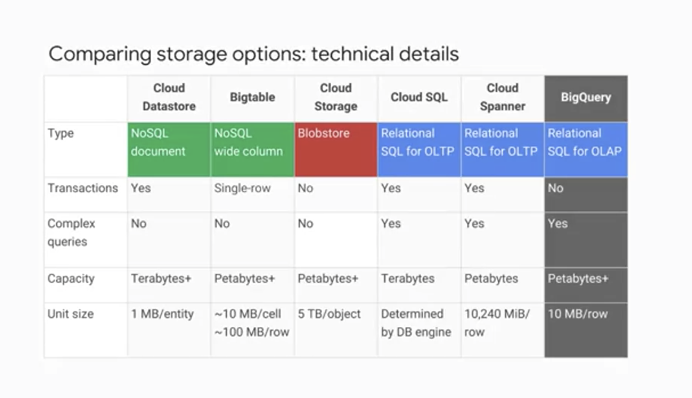
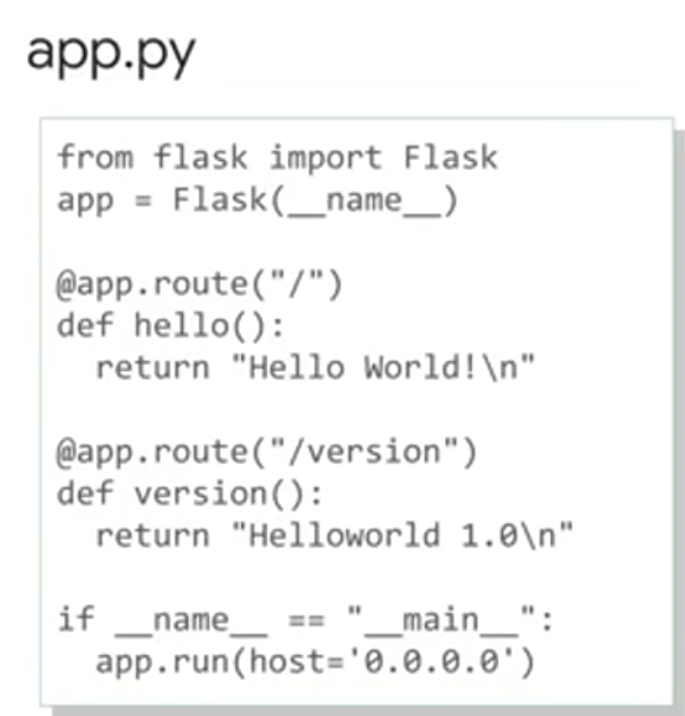
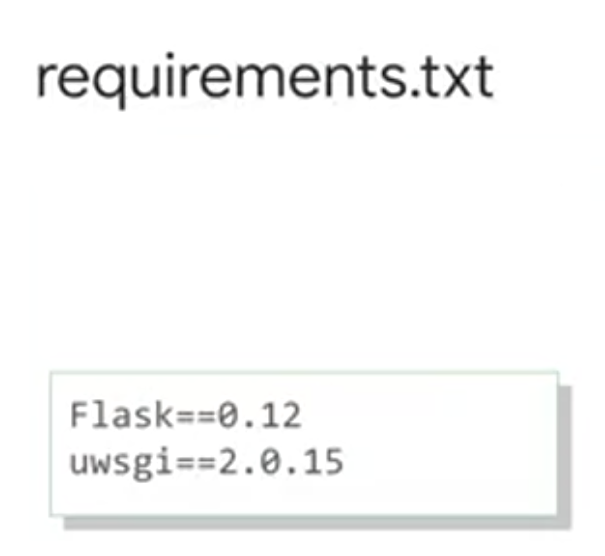
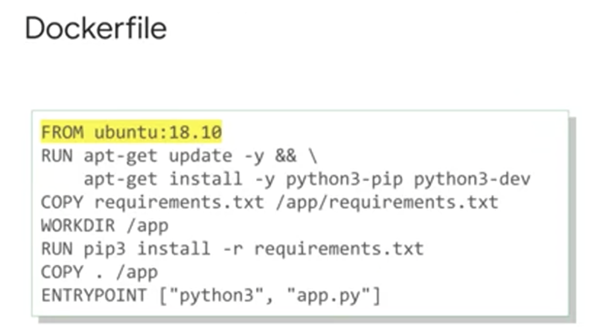
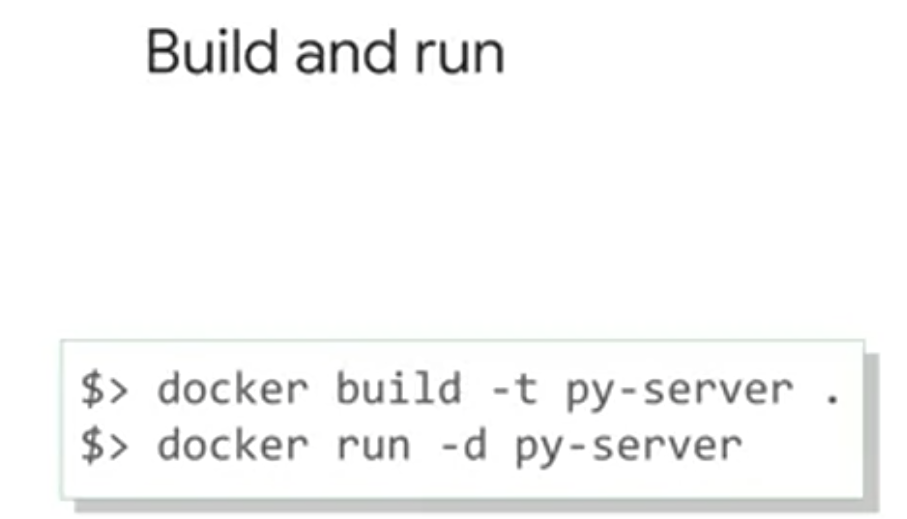
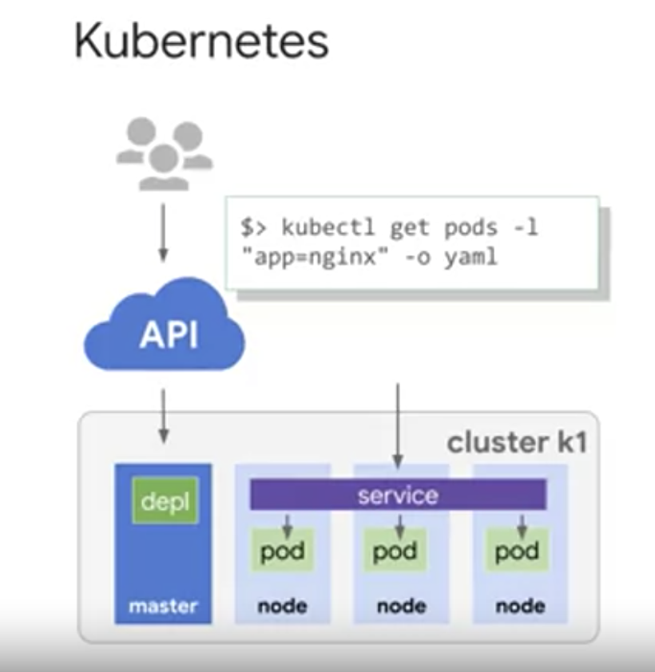
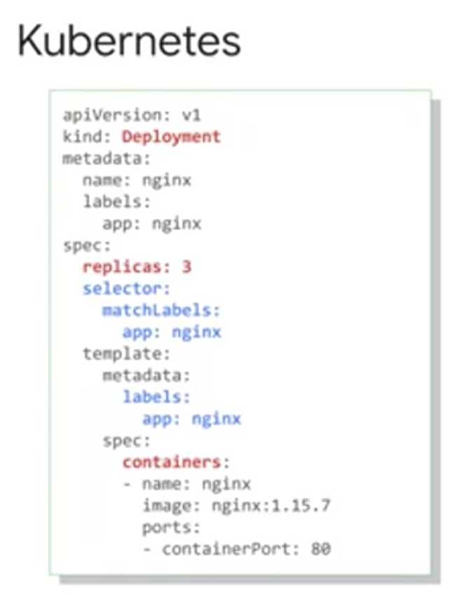

# GCP の基礎

source: coursera / Google Cloud Platform Fundamentals: Core Infrastructure
ß
コンピューティングは GCE (Goole Compute Engine)（IaaS）、PaaS としては Google App Engine (GAP) があること、ストレージサービス（Cloud SQL / DataStore / Bigtable / Bigstorage etc...）の違い、コンテナ技術（Kubernetes 自体や GKE）、ビッグデータ関連（Hadoop、BigQuery）あたりを一通りさらう内容。どれも大事。

## IAM

Compute Engineの InstanceAdmin役割を持つユーザーは VMに対して特定の操作を行うことができます。 たとえば VMの一覧表示、 構成の読み取りと変更、VMの起動と停止です。 操作対象のVMは 役割の適用先によって決まります。 ここでは 特定のGoogleグループの ユーザー全員がこの役割を持っています。 この役割はproject_aの全VMに適用されます。

さらにきめ細かい役割が必要な場合は カスタムの役割があります。 多くの会社では最小権限のモデルを使って 各メンバーに必要最小限の 権限のみを付与しています。  
たとえば InstanceOperator役割を定義して 特定のユーザーにCompute EngineとVMの 起動と停止を許可し 再構成は許可しないとします。 カスタムの役割を使えばこれを実現できます。  
ただし注意点があります。 第一に カスタムの役割を使うことを 明確に決める必要があります。 権ß限の管理が必要になるからです。 会社によっては 事前定義済みの役割を選択しています。 第二に カスタムの役割を使用できるのは プロジェクトまたは組織レベルのみです。 フォルダレベルでは使用できません。  
権限を付与する対象がユーザーではなく Compute Engine VMだとしたら？ その場合はサービスアカウントを使用します。 たとえばVMで実行しているアプリのデータを Google Cloud Storageに保管するとします。

そのデータへのアクセスは インターネット上の全員に許可するのではなく VMだけに許可します。  
そこで Cloud Storageに対してVMを 認証するためのサービスアカウントを作成します。 サービスアカウントの名前は メールアドレスにします。 ただし パスワードではなく 暗号鍵でリソースにアクセスします。 こちらの例では サービスアカウントにCompute Engineの InstanceAdmin役割が付与されています。 VMで実行中のアプリはこのアカウントを使って 他のVMを作成、変更、削除できます。 また サービスアカウントの管理も必要です。 たとえば Aliceが特定のサービスアカウントで 実行可能な操作を管理するとします。  
一方 Bobは表示さえできれば十分です。 サービスアカウントはIDであると同時に リソースでもあるため IAMポリシーをそれ自体に適用できます。 サービスアカウントでAliceには編集者の役割を Bobには閲覧者の役割を付与できます。  
他のGCPリソースの役割を 付与する場合と同じです。 プロジェクト内のVMのグループごとに 異なるIDを付与できます。 

その結果 グループごとに 異なる権限を管理しやすくなります。 また VMを再作成しなくても サービスアカウントの権限を変更できます。 さらに複雑な例を紹介します。 Compute Engineの複数のVMにまたがって 実装されたアプリがあるとします。  
あるアプリコンポーネントには 別のプロジェクトでの編集者役割が必要です。が 他のコンポーネントには不要です。  
そこで２つのサービスアカウントを作成します。 VMのサブグループごとに１つ作成します。 最初のサービスアカウントにだけ 別のプロジェクトでの権限を与えます。 これで アプリのコードが誤っていたり VMが感染したりしたとしてもその影響を軽減できます。

## Google Compute Engine

Compute EngineではVMを作成して Googleのインフラで実行できます。 先行投資は要りません。  
高速で一貫したパフォーマンスのシステムで 数千もの仮想CPUを実行できます。 VMインスタンスを作成するには GCP Consoleまたは gcloudコマンドラインツールを使います。 VMで実行できるLinuxまたは Windows Serverイメージには Google提供のものと カスタマイズバージョンがあります。 物理サーバーからイメージを インポートすることも可能です。 VMを作成するときにマシンタイプを選びます。 タイプによってメモリ量と 仮想CPUの数が決まります。  
タイプにはごく小さなものから 非常に大きなものまであります。 事前定義済みのタイプで要件を満たせない場合は カスタムVMを作成できます。 処理能力については 機械学習やデータ処理など GPUを利用できるワークロード向けに GCPの多くのゾーンでは GPUを利用できます。 物理的なマシンと同じように VMにもディスクが必要です。

永続ストレージは２種類から選択できます。 標準とSSDです。 アプリに高パフォーマンスの 一時的領域が必要な場合は ローカルSSDを接続できます。 ただし永続的な価値のあるデータは 別の場所に保管してください  
ローカルSSDのコンテンツは VMが終了すると消去されるからです。 したがって もう１種類は 永続ディスクです。 ほとんどのユーザーは初めは デフォルトの標準永続ディスクを使用します。 ブートイメージも選べます。 さまざまなバージョンの LinuxとWindowsが用意されています。  
独自のイメージもインポートできます。 VMが常に特定の構成で起動すると便利です。 起動時にソフトウェアパッケージを インストールするなどです。 これを行うには GCP VM起動スクリプトを渡すのが一般的です。 他の種類のメタデータを渡すこともできます。 VMが稼動したら 簡単にディスクのスナップショットを取れます。 バックアップとして保管したり 別のリージョンへのVMの移行時に 使用したりできます。 完了するまで人が介入しない ワークロードがあるとします。  
大規模なデータセットを 分析するバッチジョブなどです。 プリエンブティブルVMでジョブを実行すると 費用を節約できます。 プリエンプティブルVMには通常の Compute Engine VMと異なる点が１つあります。 他でリソースが必要になった場合に Compute Engineがそれを終了できるという点です。 プリエンプティブルVMでは 費用を大幅に節約できます。が 停止と再開が可能なジョブに使用してください

インスタンスに応じた適切なマシンは 仮想CPUの数やメモリ量を基に選択できます。 事前定義済みマシンタイプを 使用することも カスタムマシンタイプを 作成することもできます。 前述のとおり Compute Engineでは VMをかなり大きなサイズにできます。  
この動画を録画している時点では VMの仮想CPUの最大数は96です。 ベータ版での最大メモリサイズは624GBです。 最新情報は GCPウェブサイトでご確認ください 大規模なVMはインメモリデータベースや 分析などのワークロードに役立ちます。  
しかしGCPの大半のお客様は 最初にスケールアップではなく スケールアウトを行います。 Compute Engineの自動スケーリング機能を使用すると 負荷の指標に基づいて アプリのVM数を増減できます。  
この仕組みの一環として 着信トラフィックの負荷がVM間で分散されます。 Google VPCは何種類かの負荷分散をサポートしています。

## VPC の重要な機能

物理ネットワークと同じく VPCでもルーティングテーブルを使用します。 同じネットワーク内のインスタンス間で トラフィックを転送するためです。 サブネット間やGCPゾーン間でも 外部IPアドレスを使用せずに転送できます。 VPCルーティングテーブルは 組み込まれているので プロビジョニングや管理は不要です。 ファイアウォールインスタンスの プロビジョニングと管理も不要です。 VPCのグローバルな 分散型ファイアウォールを使用して インスタンスへの 送受信トラフィックを制限できます。 ファイアウォールル―ルの定義では インスタンスのメタデータタグを使用できます。 これは非常に便利です。 たとえばすべてのウェブサーバーに 「web」というタグを付けるとします。 

ファイアウォールルールで ポート80または443での受信トラフィックを 「web」タグが付いたVMに許可します。 IPアドレスは何であろうと関係ありません。 前に説明したように VPCはGCPプロジェクトに属します。 複数のGCPプロジェクトがあり VPC間の通信が必要な場合はどうなるでしょう 心配いりません。 このような通信も可能です。 単に２つのVPC間にピアリング関係を確立して トラフィックを交換可能にする場合 VPCピアリングを使用できます。 一方 IAMを機能を最大限に利用して 別のプロジェクトのVPCに対して 誰が何の操作を行えるか制御するには 共有VPCを使用できます。 

先ほど、負荷の変化に応じてVMが 自動スケーリングする仕組みを説明しました。 その時々でアプリを提供する VMの数が変わる場合 ユーザーはどのようにアプリに アクセスするのでしょうか その答えはCloud Load Balancingです。 これはソフトウェアで定義された 完全分散型のマネージドサービスです。 ロードバランサは 管理対象のVM内で実行されないため スケーリングも管理も不要です。 Cloud Load Balancingはすべての トラフィックに対応しています。 これにはHTTPとHTTPS、 その他のTCPとSSLトラフィック、 UDPトラフィックも含まれます。 Cloud Load Balancingでは １つのエニーキャストIPが 世界中のリージョンのバックエンド インスタンスのフロントエンドとなります。 負荷はリージョン間で分散されます。 さらに自動マルチリージョン フェイルオーバーにより バックエンドの不調時には トラフィックを分割して移動します。 Cloud Load Balancingは ユーザー、トラフィック、バックエンドの状態、 ネットワーク条件などの変化に瞬時に対応します。 たとえばオンラインゲームが大ヒットするなど 需要の急増が見込まれるとします。 

サポートチケットでGoogleに 負荷の急増を予告する必要があるでしょうか いいえ いわゆる事前警告は不要です。 ウェブアプリの負荷を リージョン間で分散する場合は HTTPS負荷分散を使用します。 HTTP以外のSSLトラフィックには グローバルSSLプロキシロードバランサを 使用します。 SSLを使用しないTCPトラフィックであれば グローバルTCPプロキシロードバランサを 使用します。 この２種類のプロキシサービスは 特定のポート番号とTCPでのみ機能します。 UDPトラフィックや任意のポート番号の トラフィックを負荷分散する場合は リージョンロードバランサで リージョン全体に負荷を分散できます。 これらすべてのサービスの共通点は インターネットから送信されるトラフィックを 対象としていることです。 プロジェクト内での トラフィックの負荷分散はどうでしょう

アプリのプレゼンテーション層と ビジネスロジック層の間での負荷分散などです。 その場合は内部ロードバランサを使用します。 GCP内部IPアドレスでの受信トラフィックの 負荷をCompute Engine VM間に分散します。 よく知られている Googleの無料サービスの１つに 公開ドメインネームサービスを 世界に提供する8.8.8.8があります。 DNSはインターネットホスト名を アドレスに変換します。 お察しのとおり Googleには高度なDNSインフラがあります。 これにより8.8.8.8を 誰もが利用できるようになっています。 GCPで作成するアプリのインターネット ホスト名とアドレスについてはどうでしょう 世界中でアプリが見つかるように GCPではCloud DNSを提供しています。 これはGoogleと同じインフラで 実行されるマネージドDNSサービスです。 低レイテンシと高可用性を実現し 費用効率の高い方法で アプリとサービスをユーザーに提供できます。 DNS情報を公開すると その情報は 全世界のあらゆる場所から配信されます。

Cloud DNSはプログラムも可能です。 数百万ものDNSゾーンとレコードを 公開して管理するには GCP Console、コマンドライン インターフェース、APIを使用できます。 Googleにはグローバルな エッジキャッシュシステムがあります。 このシステムを使ってアプリの コンテンツ配信を加速化するには Google Cloud CDNを使用します。 ユーザーは低レイテンシを実感するでしょう コンテンツの発信元の負荷が減り 費用も節約できまます。 HTTPS負荷分散を設定した後に チェックボックスをオンにするだけで Cloud CDNを有効にできます。 当然 CDNは他にもたくさん存在します。 すでにCDNを使用している場合 GCPのCDN Interconnectパートナー プログラムの対象である可能性があります。 その場合はそのまま使用できます。 GCPのお客様の多くはGoogle VPCと 他のネットワークの相互接続を必要とします。 オンプレミスネットワークや他の クラウド内のネットワークなどです。 選択肢はたくさんあります。 多くのお客様は 仮想プライベートネットワークを IPSECプロトコルを使用して インターネットで接続します。 さらに 動的な接続にするために Cloud RouterというGCP機能を使用します。 

この機能を使用すると 他のネットワークとGoogle VPCの間で BGPを使って VPN経由でルート情報を交換できます。 たとえば 新しいサブネットを Google VPCに追加すると オンプレミスネットワークが自動的に そのルートを取得します。 インターネットを使用したくないお客様もいます。 セキュリティの懸念がある場合や 信頼性の高い帯域幅が必要な場合などです。 その場合はGoogleとの ダイレクトピアリングを検討できます。 ピアリングとはルーターを Google POPと同じデータセンターに配置して トラフィックを交換することです。 Googleは世界中に 100を超えるPOPを設けています。 POPでまだ接続を確立していない場合は キャリアピアリングプログラムの パートナーに接続を依頼できます。 ピアリングには欠点が１つあります。 それはGoogleのSLAの対象ではないことです。 Googleとの相互接続で 高い稼働率が必要な場合は Dedicated Interconnectを使用してください Googleとの１つ以上の 直接プライベート接続を確立できます。 接続形態がGoogleの仕様を満たす場合 その接続は最大で 稼働率99.99％のSLAの対象になります。 VPNで接続をバックアップすれば 信頼性はさらに高くなります。

## GCP のストレージオプションの比較



### Cloud Datastore

非構造化オブジェクトを格納する場合 またはトランザクションとSQLに似た クエリのサポートが必要な場合  
このサービスは テラバイト規模の容量を提供します。 最大ユニットサイズは エンティティあたり 1 MBです。

### Cloud Bigtable

大量の構造化オブジェクトを格納する場合 Cloud Bigtable は SQL クエリも 複数行のトランザクションもサポートしません。 このサービスは ペタバイト規模の容量を提供します。 最大ユニットサイズは セルあたり10MB、行あたり100MB

### Cloud Storage

大きな画像や映画などの 10MGを超える不変blobを格納する場合です。 このサービスは ペタバイト規模の容量を提供します。 最大ユニットサイズは オブジェクトあたり５TBです。 

### Cloud SQLまたはCloud Spanner

オンライントランザクション処理システムで 完全SQLサポートが必要な場合です。 容量については Cloud SQLはテラバイト規模 Cloud Spannerはペタバイト規模です。 Cloud SQLのリードレプリカで対応できない 水平スケーリングが必要な場合は Cloud Spannerの使用を検討してください 

### BigQuery

通常 BigQueryにデータを格納する目的は ビッグデータ分析とインタラクティブな クエリや機能を使用するためです。 BigQueryは オンラインアプリの バックアップ保存先などには適しません。

各ストレージサービスの 技術的な違いを確認すると どのサービスを選択すべきか 判断するのに役立ちます。 ユースケースも判断材料になります。 各サービスをもう一度見ていきましょう Cloud Datastoreは 半構造化データの格納に最適です。 つまり App Engineアプリで 使用するデータです。 Bigtableは 読み書きの多い 分析データの格納に最適です。 AdTech、金融、IoTのデータなどです。 Cloud Storageは構造化、非構造化、 バイナリ、オブジェクトデータに最適です。 画像、大きなメディアファイル、 バックアップなどです。 SQLはウェブフレームワークと 既存アプリでの使用に最適です。 ユーザー認証情報や顧客の注文を 格納する場合などです。 Cloud Spannerは２TBを超える 大規模なデータベースアプリに最適です。 金融取引やeコマースの ユースケースなどに適しています。 このモジュールの冒頭で述べたように これらのサービスは アプリに応じて複数使用できます。

## コンテナ、Kubernetes、Kubernetes Engine

Google Kubernetes Engineで 実行する方法を学習します。  
Compute Engineについては すでに説明しました。 GCPのIaaSサービスです。 クラウドでVMを実行して 永続ストレージと ネットワーキングを使用します。   
App EngineはGCPのPaaSサービスです。 ここで紹介するのは Kubernetes Engineというサービスです。 インフラの面倒な作業を省けるという点では IaaSサービスと似ています。 PaaSサービスにも似ています。 デベロッパーのニーズを 念頭に構築されているからです。 

最初に コンテナというソフトウェアを パッケージ化する方法を説明します。 コンテナが便利な理由と Kubernetes Engineで コンテナを管理する方法を説明します。  
まず 思い出してほしいのは IaaSサービスはコンピューティング リソースを共有可能にするために ハードウェアを仮想化するということです。 各VMでは任意の OSインスタンスを使用できます。 VM上でアプリをビルドして実行し メモリ、ファイルシステム、 ネットワーキングインターフェースなどの 物理マシンと同じものにアクセスできます。 しかし柔軟性には犠牲が必要です。 このような環境での 最小コンピューティング単位は VMとそれに関連付けられたアプリ そしてゲストOSです。が このOSはサイズが大きく 数ギガバイトに及ぶことがあります。 起動に数分かかる場合もあります。 その価値はあります。が VMは高度に構成可能です。 任意のツールを インストールして実行できます。 ディスクやネットワーキングなどの 基となるシステムリソースを構成し 独自のウェブサーバーデータベースや ミドルウェアをインストールできるのです。 一方 アプリが大成功したとして 需要の増加に対応するには ゲストOSを含むVM全体の単位で スケールアウトする必要があります。 そのため リソース使用量が思いのほか 急増する可能性があります。  

これと対照的なのが App EngineのようなPaaS環境です。 App Engineにデプロイする場合 方法はかなり異なります。 空のVMを得るのではなく アプリに必要な サービスファミリーにアクセスします。 必要な作業は 該当するサービスを使用したコードと 自己完結型ワークロードを作成して 独立したライブラリを組み込むことだけです。 アプリの需要が増加すると プラットフォームがアプリを シームレスにスケールします。 ワークロードとインフラとは 別に行われます。 スケールは迅速に行われます。が 基のサーバーアーキテクチャーはコントロールできません。

そこで登場するのがコンテナです。 コンテナとは PaaSのようなワークロードの独立した 環境によるスケーラビリティと IaaS環境のようなOSとハードウェアの 抽象化層を提供するものです。

コンテナはコードとその依存関係が存在する 見えないボックスであり ファイルシステムとハードウェアの 独自のパーティションにのみアクセスできます。 Windows、Linux、その他のOSでは プロセスとは実行中プログラムの インスタンスのことです。 コンテナは新しいプロセスとして 迅速に起動します。 完全に新しいOSインスタンスの 起動にかかる時間とは比較になりません。 各ホストで必要なのは コンテナをサポートするOSと コンテナランタイムだけです。  

基本的には ハードウェアではなく _OSを仮想化している_ ことになります。 この環境は PaaSのようにスケールする一方 IaaSと同等の柔軟性を備えています。 コンテナによる抽象化は コードの移植性を高めます。 OSとハードウェアを ブラックボックスとして扱えるからです。 コードを開発環境からステージ環境、 本番環境に移行する際も ノートパソコンからクラウドに移行する際も 変更したり再構築したりする必要はありません。 たとえばウェブサーバーは ほんの数秒でスケールできます。 単一ホスト上のワークロードのサイズによっては 何十台、何百台もデプロイできます。 これは単純な例です。ので より複雑な例を考えてみましょう  

多数のコンテナを使用して アプリをビルドするとします。 たとえばマイクロサービスパターンに従って 各コンテナが独自の機能を実行します。 各コンテナ内のコードは ネットワークファブリックで 互いに通信できます。 このような仕組みにする場合 アプリをモジュール化できます。 モジュールは簡単にデプロイでき 複数のホストで独立してスケールします。 ホストはアプリの需要に応じて スケールアップ、スケールダウンでき コンテナの起動と停止を行います。 ホストで障害が発生して 置換する場合も同様です。

ここで役立つのが **Kubernetes** です。 Kubernetesを使用すると 多数のホスト上の多数のコンテナの オーケストレーション スケール、新しいバージョンのロールアウト 以前のバージョンへのロールバックを 簡単に行えます。 まず コンテナをビルドして 実行する方法を説明していきます。 コンテナイメージの一般的な形式は オープンソースツールのDockerで 定義されているものです。 この例ではDockerを使用して アプリとその依存関係を コンテナにバンドルします。 別のツールも使用できます。  

たとえば Google Cloudが提供する Cloud Buildは コンテナをビルドするための マネージドサービスです。 コードの例をお見せします。 

<br />
<br/>
<br />
<br />

Pyhonウェブアプリです。 一般的な Flaskフレームワークを使用しています。 ウェブブラウザがこのコードと対話して 最上位のドキュメントを求めるたびに アプリは「hello world」で応答します。 ブラウザがリクエストに 「/version」を追加した場合は アプリがそのバージョンを返します。 このアプリをデプロイするには どうすればよいでしょうか 特定のバージョンのPyshonが必要です。 さらに特定のバージョンのFlaskも必要です。 Pythonのrequirements.txtファイルで コントロールします。 他の依存関係もここで制御します。 Dockerfileを使用してコードをコンテナに パッケージ化する方法を指定します。 たとえば Ubuntuは一般的な Linuxディストリビューションです。 こちらから始めましょう Pythonのインストール方法は 開発環境の場合と同様です。 このファイルに 指定されているため再現できます。 前に作成したrequirements.txtファイルを コピーしましょう そちらを使ってアプリの依存関係をインストールします。 アプリを構成するファイルもコピーします。

コンテナを起動する環境に コンテナの実行方法を指示します。 「docker build」コマンドで コンテナをビルドします。 その結果コンテナがビルドされて 実行可能イメージとして ローカルシステムに保管されます。 次に「docker run」コマンドで イメージを実行します。 実際は コンテナレジストリサービスに イメージをアップロードします。 たとえばGoogle Container Registryです。 ここでイメージの 共有やダウンロードを行います。 アプリをパッケージしました。が 信頼できるスケーラブルな分散型システムを 構築するまでには至っていません。 アプリの構成、サービスディスカバリ、 更新の管理、モニタリングも必要です。 次のレッスンでは KubernetesとKubernetes Engineを 利用する方法を説明します。

## Kubernetes と GKE の概要

ここまで コンテナとアプリのコンテナ化の 基礎を学習しました。  
次はKubernetesの役割について説明します。 Kubernetesはオープンソースの コンテナオーケストレーターで、アプリの管理とスケーリングに役立ちます。  
Kubernetesが提供するAPIでは 許可されたユーザーのみが 複数のユーティリティを使って そのオペレーションを制御できます。  
後ほど ユーティリティの１つ `kubectl` コマンドを紹介します。 
Kubernetesでは「**クラスタ**」という 一連のノードにコンテナをデプロイできます。   
**クラスタ**とは マスターコンポーネントのセットで システム全体と コンテナを実行する 一連のノードをコントロールするものです。 Kubernetesでは _ノードとはコンピューティングインスタンス_ であり Google Cloudでは ノードとは Compute Engine内で実行されるVMです。 Kubernetesを使用する際は 一連のアプリとアプリ間の対話方法を記述すれば それらの実行方法がKubernetesで自動的に識別されます。  
Kubernetesを使用すると 前のレッスンで作成したような コンテナ化アプリを簡単に実行できます。が Kubernetesクラスタは どのように取得するのでしょうか いつでもハードウェア上で自分で作成できます。  
あるいはVMを提供する環境でも可能です。 自分で作成した場合は保守が必要になります。 これは大変な作業です。 保守作業に追われるのは 有意義な時間の使い方ではないため Google Cloudでは Kubernetes Engineを提供しています。  
クラウド内のマネージドサービスとしての Kubernetesです。 これを使えばGCP Consoleで Kubernetesクラスタを作成できます。 Cloud SDKに含まれる gcloudコマンドでも作成できます。 GKEクラスタはカスタマイズできます。 各種マシンタイプ、多数のノード、 ネットワーク設定がサポートされています。 

GKEを使用してKubernetesクラスタを 作成するコマンドの一例を紹介しましょう　　

`gcloud container clusters create k1` です。 このコマンドでは 「K1」というクラスタが作成されます。 すぐに使える構成済みのクラスタです。 進捗状況はConsoleで確認できます。 Kubernetesがコンテナや 一連の関連コンテナをデプロイするときは 常に「**ポッド**」という 抽象化層の中にデプロイします。 
**ポッドはKubernetesの最小デプロイ単位** であり クラスタで実行中のプロセスのようなものです。 アプリの一部であることも アプリ全体であることもあります。 通常は各ポッドに １つのコンテナをデプロイします。が 強い依存関係を持つコンテナが複数ある場合は 単一のポッドにパッケージ化できます。 これらは自動的にネットワークを共有し 共通のディスクストレージ ボリュームを使用できます。 Kubernetes の各ポッドにはコンテナ用に 固有のIPアドレスとポートが割り当てられます。 ポッド内のコンテナ同士はローカルホスト ネットワークインターフェースで通信するため デプロイされているノードは認識されません。 

Kubernetesでポッド内のコンテナを 実行する１つの方法は「`kubectl run`」コマンドです。 もっと良い方法を後ほど説明します。が このコマンドを使えばすぐに開始できます。 kubectl runコマンドを実行すると ポッド内の実行中コンテナで Deploymentが起動されます。 この例のポッド内で実行されるコンテナは nginxオープンソース ウェブサーバーのイメージです。 kubectlコマンドによって リクエストしたバージョンのnginxイメージが Container Registryから取得されます。 Deploymentとは何でしょう Deploymentは 同じポッドの レプリカのグループを表します。 ノードのいずれかで障害が発生しても ポッドの実行状態を保つことができます。 Deploymentにはアプリの一部 またはアプリ全体を含めることができます。 この例では nginxウェブサーバーが含まれています。 実行中のnginxポッドを表示するには 「`kubectl get pods`」コマンドを実行します。 デフォルトではDeployment内のポッドには クラスタ内からしかアクセスできません。 では nginxウェブサーバーの コンテンツへのアクセスを インターネット上の全員に 許可するには？ Deployment 内のポッドを一般公開するには ロードバランサを接続します。 「`kubectl expose`」コマンドで接続します。 Kubernetes で Service を作成し そこにポッドの固定IPアドレスを設定します。 Serviceとは Kubernetesで 負荷分散を表す基本手法です。

つまり Kubernetesに対して パブリックIPアドレスで外部ロードバランサを Serviceに接続するように指定し クラスタの外部から アクセスできるようにしています。 GKEではこうしたロードバランサは ネットワークロードバランサとして作成されます。 これはCompute EngineがVMに提供する マネージド負荷分散サービスの１つです。

GKEではコンテナで この負荷分散を簡単に使用できます。 このIPアドレスにアクセスするクライアントは Service背後のポッドにルーティングされます。 この例ではポッドは１つしかありません。 シンプルな nginx ポッドです。 

ではServiceとは厳密には何でしょう **Serviceは一連のポッドをグループ化して 安定したエンドポイントを提供するもの** です。 この例では ネットワークロードバランサが 管理するパブリックIPアドレスです。 ただし 他の選択肢もあります。 ではなぜServiceが必要なのでしょう ポッドのIPアドレスを 直接使用できないのでしょうか  
たとえばアプリがフロントエンドと バックエンドで構成されているとします。 フロントエンドからバックエンドには ポッドの内部IPアドレスでアクセスできるので Serviceは不要なはずです。 しかし管理の問題があります。 Deploymentがポッドを作成して破棄すると ポッドに固有のIPアドレスが割り当てられます。が このアドレスは変わります。 Serviceは安定したエンドポイントを提供します。 Kubernetesについて学習を進めれば 内部のアプリバックエンドに適する他のServiceタイプがわかってくるでしょう   
「`kubectl get services`」コマンドで ServiceのパブリックIPアドレスを確認できます。 クライアントはこのアドレスで リモートからnginxコンテナにアクセスできます。 追加の処理能力が必要になったら 「`kubectl scale`」コマンドで Deploymentをスケールできます。 この例のDeploymentには ３つのnginxウェブサーバーがあります。 いずれもServiceの背後にあり 1 つの固定IPアドレスでアクセスできます。 自動スケーリングでも 便利なパラメータを設定できます。 たとえばCPU使用率に応じて Deploymentを自動スケールするとします。 このコマンドでは 最小ポッド数を10に指定しています。 最大ポッド数は15です。 スケールアップの基準として CPU使用率が処理能力の80％に達した時点で ポッド数をスケールアップします。 ここまでは 命令型コマンドの実行方法を説明しました。  
exposeやscaleなどです。 命令型は Kubernetesの 段階的な学習やテストには役立ちます。が  **Kubernetesの真の強みは宣言型** です。 コマンドを実行する代わりに 構成ファイルを渡します。 このファイルで目的の状態を指定すれば Kubernetesがその方法を判断します。 こうした構成ファイルは管理ツールになります。 変更を加えるには 構成ファイルを編集し 変更後のバージョンをKubernetesに提示します。





スライドのコマンドは これまでの作業に基づく構成ファイルの 操作の開始点として使用できます。 コマンドの出力はこのようになります。 構成ファイルの操作は一見すると難しそうです。 何行ものコードが 見慣れない構文で記述されているためです。 しかし慣れてくると簡単に処理できます。 バージョン管理システムに保存して インフラの変更を追跡することもできます。 この例のDeployment構成ファイルは nginxポッドのレプリカ数を 3 として宣言しています。  
selectorフィールドを定義して 特定のポッドをレプリカとして グループ化する方法を指示しています。 ポッドを特定できるのは ラベルが共有されているためです。 該当するポッドのアプリには 「nginx」のラベルが付いています。 ３つではなく５つのレプリカを実行する場合 Deployment構成ファイルを編集して ３を５に変更するだけです。 非常に柔軟です。 そして「`kubectl apply`」コマンドを実行して 更新後のファイルが使用されるようにします。  
「`kubectl get replicasets`」コマンドで レプリカを表示して更新後の状態を確認します。 さらに「`kubectl get pods`」コマンドで ポッドがオンラインになるのを観察します。 この出力例では５つのポッドがすべて 実行状態になっています。 最後にDeploymentを調べて 実行中のレプリカ数が正しいかを確認します。 そのためには 「`kubectl get deployments`」を使用します。 この例では５つレプリカがすべて 使用可能になっています。 クライアントは引き続き エンドポイントにアクセスできます。 「`kubectl get services`」コマンドで Serviceの外部IPへの 影響がないことを確認できます。  
現時点で GKEでは nginxポッドの５つのコピーが実行されていて １つのServiceで５つのポッドへの トラフィックをプロキシしています。 Kubernetesではこの手法により 負荷を分散してServiceをスケールします。 前のレッスンでは Pythonアプリをコンテナ化しました。 それをnginxに置き換えて 同じツールを使って デプロイとスケールを行えます。 最後にアプリのバージョンを 更新する方法を説明します。 コンテナを更新して新しいコードを できるだけ早く適用する必要があります。  
しかし すべての変更を一度に ロールアウトするのはリスクが伴います。 アプリの再ビルドと再デプロイの間 ユーザーがダウンタイムを 経験するのは避けたいはずです。 そのため Deploymentには 更新戦略という属性があります。 これはローリングアップデートの例です。 Deploymentのローリングアップデートを選択して 管理対象ソフトウェアの 新しいバージョンを指定すると Kubernetesが新しいバージョンの ポッドを１つずつ作成し 各ポッドが使用可能になるのを待ってから 古いバージョンのポッドを破棄します。 ローリングアップデートを使用すれば ダウンタイムを生じさせることなく アプリのバージョンを迅速に更新できます。

## GCP Fundamentals: Kubernetes Engine を使ってみる

### 概要

このラボでは、それぞれにウェブサーバーが含まれた複数のコンテナを含む Kubernetes Engine クラスタを作成します。クラスタの手前にロードバランサを配置してコンテンツを参照します。

### 目標
このラボでは、次のタスクの実行方法について学びます。  

- Kubernetes Engine を使用して Kubernetes クラスタをプロビジョニングする。
- kubectl を使用して Docker コンテナをデプロイおよび管理する。

### タスク 1: Google Cloud Platform（GCP）Console にログインする

### タスク 2: 必要な API が有効であることを確認する

GCP プロジェクトの名前をメモします。この値は、Google Cloud Platform Console の上部バーに表示されます。qwiklabs-gcp- の形式で、その後に 16 進数が続きます。

GCP Console のナビゲーション メニュー（ナビゲーション メニュー）で、[API とサービス] をクリックします。

有効になっている API のリストを下にスクロールして、次の API が両方とも有効になっていることを確認します。

- Kubernetes Engine API
- Container Registry API

いずれかの API がない場合は、上部にある [API とサービスを有効化] をクリックします。上記の API を名前で検索し、現在のプロジェクトでそれぞれを有効にします。（GCP プロジェクトの名前は先ほどメモしたものです。）。

### タスク 3: Kubernetes Engine クラスタを開始する

GCP Console の右上のツールバーにある「Cloud Shell をアクティブにする」ボタンをクリックします。

[続行] をクリックします。

便宜上、Qwiklabs によって割り当てられたゾーンを `MY_ZONE` という環境変数に配置します。Cloud Shell プロンプトで、次のコマンドを入力します。

```sh
export MY_ZONE=
```

この後に、Qwiklabs によって割り当てられたゾーンを続けて指定します。完全なコマンドは次のようになります。

```sh
export MY_ZONE=us-central1-a
```

Kubernetes Engine で管理されている Kubernetes クラスタを起動します。このクラスタに webfrontend という名前を付けて、2 つのノードを実行するように構成します。

```sh
gcloud container clusters create webfrontend --zone $MY_ZONE --num-nodes 2
```

Kubernetes Engine によって仮想マシンがプロビジョニングされるため、クラスタの作成には数分かかります。

クラスタが作成されたら、kubectl version コマンドを使用して、インストール済みの Kubernetes のバージョンを確認します。

```sh
kubectl version
```

kubectl は、gcloud container clusters create コマンドで自動的に認証されました。

GCP Console で実行中のノードを表示します。ナビゲーション メニュー（ナビゲーション メニュー）で、[Compute Engine] > [VM インスタンス] をクリックします。

Kubernetes クラスタを使用する準備が整いました。

### タスク 4: コンテナを実行してデプロイする

Cloud Shell プロンプトで、nginx コンテナの単一インスタンスを起動します。（Nginx は一般的なウェブサーバーです。）。

```sh
kubectl create deploy nginx --image=nginx:1.17.10
```

Kubernetes では、すべてのコンテナはポッドで実行されます。kubectl create コマンドを使用すると、Kubernetes で、nginx コンテナを含む単一のポッドで構成された Deployment が作成されます。Kubernetes の Deployment は、ポッドが実行されているノード間で障害が発生した場合でも、指定した数のポッドを稼動状態に保ちます。このコマンドでは、デフォルトの数（1）の Pod が起動されました。

注: 将来のバージョンに関する非推奨警告が表示された場合、無視して先に進んでも問題ありません。

nginx コンテナを実行している Pod を表示します。

```sh
kubectl get pods
```

nginx コンテナをインターネットに公開します。

```sh
kubectl expose deployment nginx --port 80 --type LoadBalancer
```

Kubernetes によって、サービスと、パブリック IP アドレスが関連付けられた外部ロードバランサが作成されました。この IP アドレスは、サービスの存続期間中は変更されません。そのパブリック IP アドレスへのネットワーク トラフィックは、サービスの背後にあるポッド（この場合は nginx ポッド）にルーティングされます。

新しいサービスを表示します。

```sh
kubectl get services
```

表示された外部 IP アドレスを使用して、nginx コンテナをリモートでテストしてアクセスすることができます。

Service の External-IP フィールドに入力されるまでに数秒かかる場合があります。が、これは正常な動作です。このフィールドに入力されるまで数秒ごとに kubectl get services コマンドを再実行します。

新しいウェブブラウザ タブを開き、クラスタの外部 IP アドレスをアドレスバーに貼り付けます。Nginx ブラウザのデフォルトのホームページが表示されます。

サービスで実行するポッドの数をスケールアップします。

```sh
kubectl scale deployment nginx --replicas 3
```

Deployment のスケールアップは、利用が拡大しているアプリケーションで使用できるリソースを増やす場合に役立ちます。

Kubernetes でポッドの数が更新されたことを確認します。

```sh
kubectl get pods
```

外部 IP アドレスが変更されていないことを確認します。

```sh
kubectl get services
```

クラスタの外部 IP アドレスを表示したウェブブラウザ タブに戻ります。ページを更新して、nginx ウェブサーバーが応答していることを確認します。

お疲れさまでした
このラボでは、Kubernetes Engine で Kubernetes クラスタを構成しました。アプリケーションを含む複数の Pod をこのクラスタに配置し、アプリケーションの公開とスケーリングを行いました。

<details close>
<summary>実行したシェルの履歴</summary>

```sh
Welcome to Cloud Shell! Type "help" to get started.
Your Cloud Platform project in this session is set to qwiklabs-gcp-02-afc2e9326dd1.
Use “gcloud config set project [PROJECT_ID]” to change to a different project.
student_02_c1e6cd4fb66f@cloudshell:~ (qwiklabs-gcp-02-afc2e9326dd1)$ export MY_ZONE=us-central1-a
student_02_c1e6cd4fb66f@cloudshell:~ (qwiklabs-gcp-02-afc2e9326dd1)$  gcloud container clusters create webfrontend --zone $MY_ZONE --num-node 2
ERROR: (gcloud.container.clusters.create) unrecognized arguments:
  --num-node (did you mean '--num-nodes'?)
  2
  To search the help text of gcloud commands, run:
  gcloud help -- SEARCH_TERMS
student_02_c1e6cd4fb66f@cloudshell:~ (qwiklabs-gcp-02-afc2e9326dd1)$ gcloud container clusters create webfrontend --zone $MY_ZONE --num-nodes 2
WARNING: Currently VPC-native is not the default mode during cluster creation. In the future, this will become the default mode and can be disabled using `--no-enable-ip-alias` flag. Use `
--[no-]enable-ip-alias` flag to suppress this warning.
WARNING: Newly created clusters and node-pools will have node auto-upgrade enabled by default. This can be disabled using the `--no-enable-autoupgrade` flag.
WARNING: Starting with version 1.18, clusters will have shielded GKE nodes by default.
WARNING: Your Pod address range (`--cluster-ipv4-cidr`) can accommodate at most 1008 node(s).
This will enable the autorepair feature for nodes. Please see https://cloud.google.com/kubernetes-engine/docs/node-auto-repair for more information on node autorepairs.
Creating cluster webfrontend in us-central1-a... Cluster is being health-checked (master is healthy)...done.
Created [https://container.googleapis.com/v1/projects/qwiklabs-gcp-02-afc2e9326dd1/zones/us-central1-a/clusters/webfrontend].
To inspect the contents of your cluster, go to: https://console.cloud.google.com/kubernetes/workload_/gcloud/us-central1-a/webfrontend?project=qwiklabs-gcp-02-afc2e9326dd1

kubeconfig entry generated for webfrontend.
NAME         LOCATION       MASTER_VERSION  MASTER_IP       MACHINE_TYPE   NODE_VERSION    NUM_NODES  STATUS
webfrontend  us-central1-a  1.14.10-gke.36  35.188.192.179  n1-standard-1  1.14.10-gke.36  2          RUNNING
student_02_c1e6cd4fb66f@cloudshell:~ (qwiklabs-gcp-02-afc2e9326dd1)$ kubectl version
Client Version: version.Info{Major:"1", Minor:"18", GitVersion:"v1.18.2", GitCommit:"52c56ce7a8272c798dbc29846288d7cd9fbae032", GitTreeState:"clean", BuildDate:"2020-04-16T11:56:40Z", GoVersion:"go1.13.9", Compiler:"gc", Platform:"linux/amd64"}
Server Version: version.Info{Major:"1", Minor:"14+", GitVersion:"v1.14.10-gke.36", GitCommit:"34a615f32e9a0c9e97cdb9f749adb392758349a6", GitTreeState:"clean", BuildDate:"2020-04-06T16:33:17Z", GoVersion:"go1.12.12b4", Compiler:"gc", Platform:"linux/amd64"}
student_02_c1e6cd4fb66f@cloudshell:~ (qwiklabs-gcp-02-afc2e9326dd1)$ kubectl create deploy nginx --image=nginx:1.17.10
deployment.apps/nginx created
student_02_c1e6cd4fb66f@cloudshell:~ (qwiklabs-gcp-02-afc2e9326dd1)$ kubectl get pods
NAME                     READY   STATUS    RESTARTS   AGE
nginx-6cc5778b4d-4zwwd   1/1     Running   0          26s
student_02_c1e6cd4fb66f@cloudshell:~ (qwiklabs-gcp-02-afc2e9326dd1)$ kubectl expose deployment nginx --port 80 --type LoadBalancer
service/nginx exposed
student_02_c1e6cd4fb66f@cloudshell:~ (qwiklabs-gcp-02-afc2e9326dd1)$ kubectl get service
NAME         TYPE           CLUSTER-IP     EXTERNAL-IP   PORT(S)        AGE
kubernetes   ClusterIP      10.51.240.1    <none>        443/TCP        4m57s

nginx        LoadBalancer   10.51.241.54   <pending>     80:32708/TCP   22s
student_02_c1e6cd4fb66f@cloudshell:~ (qwiklabs-gcp-02-afc2e9326dd1)$ kubectl get services
NAME         TYPE           CLUSTER-IP     EXTERNAL-IP   PORT(S)        AGE
kubernetes   ClusterIP      10.51.240.1    <none>        443/TCP        5m3s
nginx        LoadBalancer   10.51.241.54   <pending>     80:32708/TCP   28s
student_02_c1e6cd4fb66f@cloudshell:~ (qwiklabs-gcp-02-afc2e9326dd1)$ kubectl get services
NAME         TYPE           CLUSTER-IP     EXTERNAL-IP    PORT(S)        AGE
kubernetes   ClusterIP      10.51.240.1    <none>         443/TCP        6m44s
nginx        LoadBalancer   10.51.241.54   35.194.16.43   80:32708/TCP   2m9s
student_02_c1e6cd4fb66f@cloudshell:~ (qwiklabs-gcp-02-afc2e9326dd1)$ kubectl scale deployment nginx --replicas 3
deployment.extensions/nginx scaled
student_02_c1e6cd4fb66f@cloudshell:~ (qwiklabs-gcp-02-afc2e9326dd1)$ kubectl get pods
NAME                     READY   STATUS    RESTARTS   AGE
nginx-6cc5778b4d-2kqrn   1/1     Running   0          14s
nginx-6cc5778b4d-4zwwd   1/1     Running   0          4m13s
nginx-6cc5778b4d-m2t4p   1/1     Running   0          14s

student_02_c1e6cd4fb66f@cloudshell:~ (qwiklabs-gcp-02-afc2e9326dd1)$ kubectl get services                                                                                                   
NAME         TYPE           CLUSTER-IP     EXTERNAL-IP    PORT(S)        AGE
kubernetes   ClusterIP      10.51.240.1    <none>         443/TCP        8m17s
nginx        LoadBalancer   10.51.241.54   35.194.16.43   80:32708/TCP   3m42s
student_02_c1e6cd4fb66f@cloudshell:~ (qwiklabs-gcp-02-afc2e9326dd1)$
```

</details>

## App Engine

Compute EngineではVM、Kubernetes Engineでは コンテナを基に選択します。 しかし インフラを 気にしたくない場合もあります。 コードのみに集中したい場合です。 そのためにあるのがApp Engineです。  
PaaSから見ていきましょう PaaSは 「サービスとしてのプラットフォーム」です。 App Engineプラットフォームが コードの実行に必要なハードウェアと ネットワークインフラを管理します。 App Engineにアプリをデプロイするには コードを提供するだけです。 残りの処理はApp Engineが行います。 App Engineには多くのウェブアプリに必要な サービスが組み込まれています。 NoSQLデータベース、インメモリキャッシュ、 負荷分散、ヘルスチェック、ロギング ユーザー認証機能などです。 これらのサービスを利用する アプリコードを作成すれば App Engineがサービスを提供します。  
App Engineは受信トラフィック量に応じて アプリを自動的にスケールします。 料金は使用したリソースの分だけです。 サービスのプロビジョニングや保守も不要です。 したがってApp Engineは ワークロードが変動しやすいか予測できない ウェブアプリやモバイルバックエンドに 特に適しています。 App Engineにはスタンダード環境と フレシキブル環境の２つがあります。

## App Engine スタンダード環境
２つのApp Engine環境のうち シンプルなのはスタンダード環境です。 フレキシブル環境よりもデプロイが簡単で きめ細かい自動スケーリングが可能です。  
どちらの環境でも 一部のサービスに １日の無料割り当て使用量が設定されています。  
しかしスタンダード環境の特徴は 使用量の少ないアプリは 無料で実行できる場合があることです。  
GoogleではApp Engineソフトウェア開発 キットを複数言語で提供しているため アプリをローカルでテストしてから App Engineサービスにアップロードできます。 SDKには単純な デプロイコマンドも含まれています。 コードは実際にどこで実行されるのでしょうか 実行可能バイナリとは 何を意味するのでしょうか App Engineでは このバイナリを「**ランタイム**」と呼びます。 スタンダード環境では Google提供のランタイムを使用します。 選択肢について説明します。 App Engineスタンダード環境で 使用できるランタイムは 特定のバージョンの Java、Python、PHP、Goです。 ランタイムにはApp Engine API対応の ライブラリも組み込まれています。  
多くのアプリでは スタンダード環境のランタイムと ライブラリだけで十分です。 他の言語でコードを作成する場合 スタンダード環境は適しません。 フレキシブル環境をご検討ください スタンダード環境ではコードの制限があり 「サンドボックス」でコードが実行されます。 これはハードウェア、OS、物理的なサーバーの 場所に依存しないソフトウェア構成概念です。 このサンドボックスこそが スタンダード環境でアプリをきめ細かく スケールして管理できる理由の１つです。 通常 サンドボックスには いくつかの制約があります。 たとえば アプリは ローカルファイルシステムに書き込めません。 データを存続させるには データベースサービスに書き込む必要があります。  
また アプリが受信するすべてのリクエストは 60秒でタイムアウトします。 任意のサードパーティソフトウェアは インストールできません。 以上の制約が問題になる場合は フレキシブル環境を選択してください これはApp Engineスタンダード環境の 使用方法を示す図です。 App Engine SDKを使ってアプリを開発し テストバージョンをローカルで実行します。 準備ができたら SDKを使用して アプリをデプロイします。 各App Engineアプリは GCPプロジェクト内で実行されます。 App Engineが自動的にサーバーインスタンスを プロビジョン、スケール、負荷分散します。  
一方 アプリは専用のAPIを使って 各種サービスを呼び出すことができます。 たとえば データを保持するNoSQLデータストア そのデータをキャッシュするMemcache 検索、ロギング、ユーザーログイン ユーザーリクエスト以外によって アクションを開始できる タスクキューやタスクスケジューラなどです。

## App Engine フレキシブル環境

スタンダード環境のサンドボックスモデルの 制約がネックになっているとします。  
それでもApp Engineを利用したい場合 App Engineフレキシブル環境があります。 App Engineフレキシブル環境では サンドボックスではなく App Engineを実行するコンテナを指定します。 アプリはCompute EngineのVM上の Dockerコンテナ内で実行されます。 App Engineが Compute Engine VMを管理します。 ヘルスチェックを行い 必要に応じて修復します。  
VMを実行する地理的リージョンは ユーザーが選択します。 さらに下位互換性を維持するための 重要なOS更新も自動的に適用されます。 その結果ユーザーはコードに集中できます。 App Engineフレキシブル環境のアプリは 標準ランタイムを使用し App Engineのデータストア、Memchach、 タスクキューなどのサービスにアクセスできます。 こちらはスタンダード環境とフレキシブル環境の 比較表です。 スタンダード環境のほうがアプリの インスタンスを短時間で起動できます。 ただしアプリを実行するインフラへの アクセスは制限されます。 たとえば フレキシブル環境では アプリを実行するVMにSSHで接続できます。 ローカルディスクへの書き込みが可能です。 サードパーティソフトウェアも インストールできます。 アプリがApp Engineを介さずに ネットワークを呼び出すことも可能です。  
一方 スタンダード環境では アプリが完全にアイドル状態であれば 請求料金はゼロになります。 前述のようにApp Engineは Dockerコンテナを使用するため App EngineとKubernetes Engineの 違いも気になると思います。 こちらはApp EngineとKubernetes Engineの 比較表です。 App Engineスタンダード環境は アプリのデプロイとスケーリングを 最大限コントロールしたい場合に適しています。 Kubernetes Engineではアプリオーナーは Kubernetesの柔軟性を活用できます。 App Engineフレキシブル環境は これらの中間に位置するものです。  
App Engine環境ではコンテナを 目的を達成する手段として扱います。が Kubernetes Engineでは コンテナは構築の基盤になります。

## Google Cloud Endpoint と Apigee Edge

アプリケーションプログラミング インターフェース（API）についてはこのコースで何度か取り上げました。がここで正確に理解しておきましょう  
ソフトウェアサービスの実装は 複雑で変わりやすいものです。 たとえば 他のソフトウェアが そのサービスを利用するたびに その動作を詳細に知る 必要があるとしたら非常に面倒です。 そのためアプリデベロッパーは ソフトウェアを構造化して 簡潔で明快なインターフェースで 不要な詳細を抽象化し その情報をドキュメント化します。 これがAPIです。  
APIが変更されない限り 基盤となる実装はいくらでも変更できます。 APIを利用している他のソフトウェアが その変更を知る必要はありません。 機能の追加や廃止のために APIの変更が必要になることもあります。 こうしたAPIの変更を適切に行うため デベロッパーはAPIのバージョン管理を行います。 バージョン２のAPIにバージョン１にはない 呼び出しが含まれるとします。 このAPIを利用するプログラムでは 呼び出しの際にAPIバージョンを指定できます。 APIへの対応は非常に重要です。  
GCPには２つのAPI管理ツールが 用意されています。 問題に対してのアプローチが異なり それぞれの長所があります。 ソフトウェアサービスと GCPのバックエンドを開発しているとします。 APIを簡単に公開して 信頼できるデベロッパーのみに 使用してもらいたいと考えています。 使用状況を監視して記録する 簡単な方法も必要です。 APIが呼び出し側のエンドユーザーを 把握するための統一的な方法も必要です。 そこで役立つのが **Cloud Endpoints** です。 Cloud Endpointsでは簡単にデプロイできる プロキシを使用して必要な機能を実装できます。 さらにAPIコンソールの使いやすい インターフェースで機能を管理できます。  
Cloud EndpointsはGCPで実行されるアプリをサポートします。 アプリで使用している言語や クライアントテクノロジーは問いません。 **Apigee Edge** もAPIプロキシを 開発、管理するためのプラットフォームです。 ただし位置付けが異なります。 レート制限、割り当て、分析などの ビジネス的な問題に重点を置いています。 Apigee Edgeの多くのユーザーは 他社にソフトウェアサービスを提供しているため こうした機能が重要になります。 Apigee EdgeはGCP外部の バックエンドサービスにも対応するため エンジニアがレガシーアプリを 「分解」するときによく使われます。 モノリシックアプリを 一度に移行することはリスクがあります。が Apigee Edgeを使用すれば サービスを１つずつ分離し レガシーアプリが完全に使用されなくなるまで マイクロサービスに分解して 順番に実装することができます。

## Cloud Function について

 多くのアプリにはイベントで 駆動される部分があります。　　
 たとえば ユーザーが画像を アップロードできるアプリでは アップロードのたびに 画像を複数の方法で処理する必要があります。 標準の画像形式に変換し 複数のサムネイルを作成してサイズ別に リポジトリに保管するなどです。 このような関数はアプリに統合できます。が それを処理する コンピューティングリソースが必要です。 １日１回の処理でも ミリ秒ごとの処理でも必要です。 このプロビジョニング問題を 解決できるとしたら？  
必要な画像処理を行う単一目的の関数を作成するだけで 画像がアップロードされるたびに 自動的に実行されると便利です。 それを可能にするのがCloud Functionsです。 サーバーやランタイムバイナリを 気にする必要はありません。 GCPのNode.js環境対応のコードを JavaScriptで作成して 起動の条件を構成するだけです。 サーバーの使用料金は不要です。 関数の実行時間分の料金を 100ミリ秒単位で支払うだけです。  
Cloud Functionsのトリガーの基準は Cloud Sotrage、Cloud Pub/Sub、 HTTP呼び出しのイベントです。 Cloud Functionを設定するには まず対象のイベントを選択します。 Cloud Functionsに 各イベントタイプを指示します。 この宣言は「トリガー」と呼ばれます。  
次に JavaScript関数をトリガーに関連付けます。 以降は該当するイベントが発生するたびに 関数が応答します。 マイクロサービスアーキテクチャを 使用するアプリなどは Cloud Functions内で完全に実装できます。 Cloud Functionsは既存のアプリを 拡張するためにも使用されています。 スケーリングの心配がなくなります。

## Stackdriver について

Stackdriverはモニタリング、 ロギング、診断用のGCPツールです。 Stackdriverでは 各種シグナルにアクセスできます。 インフラプラットフォーム、 VM、コンテナ、ミドルウェア アプリ層、ログ、指標、 トレースなどのシグナルです。 アプリの正常性、パフォーマンス、 可用性の分析情報を取得できます。 問題が発生しても迅速に修正できます。

Stackdriverのコアコンポーネントは Monitoring、Logging、Trace、 Error Reporting、Debuggingです。 Stackdriver Monitoringがチェックするのは クラウド環境内のウェブアプリや インターネットでアクセスできる その他のサービスのエンドポイントです。 稼働時間チェックを構成して URL、グループのほか インスタンスや ロードバランサなどのリソースを関連付けます。 基準に基づくアラートも設定できます。 アクションが必要なヘルスチェック結果や 稼働時間の減少などの基準です。 Monitoringは多数の通知ツールと 組み合わせて使用できます。 アプリの状態を可視化する ダッシュボードも作成できます。 Loggingではアプリのログを 表示、フィルタ、検索できます。 ログの内容に基づく指標を定義して ダッシュボードとアラートに 統合することもできます。 ログはBigQuery、Cloud Storage、 Cloud Pub/Subにエクスポートできます。　　
Error Reportingは アプリのエラーを追跡、グループ化し 新しいエラーが検出されると通知します。 TraceではApp Engineアプリの レイテンシを抜き出して URLごとの統計レポートを作成できます。 デバッグについてはどうでしょう アプリに多数のログステートメントを 追加してデバッグするのは大変な作業です。 Debuggerでは別の方法を使用できます。 アプリの本番環境データを ソースコードに関連付けて 本番環境の任意のコード位置で アプリの状態を調べられるようにします。 したがってログステートメントを 追加しなくてもアプリの状態を確認できます。 Debuggerが本領を発揮するのは アプリのソースコードが使用できる場合です。 したがって Cloud Source Repositoriesなどの リポジトリにコードを保管すると役立ちます。

## Google Cloud のビッグデータソリューション

Google Cloudの ビッグデータソリューションは 有用なデータ分析情報によってビジネスと ユーザーエクスペリエンスを変革します。 Googleではこれを「統合サーバーレス プラットフォーム」と呼んでいます。 つまり「サーバーレス」とは ジョブを実行するインスタンスの プロビジョニングが不要ということです。 フルマネージドサービスで かかるのはリソース使用分の料金だけです。 プラットフォームは統合型です。 さまざまなGCPサービスを使って カスタムソリューションを作成できます。 Apache Hadoopはビッグデータ対応の オープンソースフレームワークです。 ベースとなるのはGoogleが開発した MapReduceプログラミングモデルです。 MapReduceモデルの最もシンプルな形では 「map関数」と呼ばれる関数が 並行して膨大なデータセットを処理し それぞれに中間結果を生成します。 そして別の「reduce関数」という関数が すべての中間結果に基づいて 最終的な結果セットを生成します。  
「Hadoop」という用語は Apache Hadoop自体と関連プロジェクトの 総称としてよく使用されます。 Apache Spark、Apache Pig、 Apache Hiveなどのプロジェクトです。 Cloud Dataprocという高速で使いやすい マネージドサービスを使用すると Hadoop、Spark、Hive、Pigを GCP上で実行できます。 Hadoopクラスタをリクエストするだけで 90秒以内にクラスタが自動作成されます。 クラスタを構成するCompute Engine VMの 数とタイプは指定でき クラスタの実行中に 処理能力を増減する必要がある場合は スケールアップまたはダウンできます。 クラスタではHadoopソフトウェアの デフォルト構成を使用することも 構成をカスタマイズすることもできます。 さらにStackdriverで クラスタをモニタリングできます。 Hadoopジョブをオンプレミスで実行する場合は ハードウェアへの資本投資が必要です。 Cloud Dataprocで実行すれば クラスタの存続中に使用した ハードウェアリソースの料金を支払うだけです。 料金設定は時間単位です。が Cloud Dataprocの課金は秒単位です。  
すべてのCloud Dataprocクラスタは 1 秒単位で課金されます。 最小課金時間は１分です。 クラスタを使い終わって削除すれば 課金は停止されます。 オンプレミスのハードウェア資産よりも 俊敏にリソースを使用できます。 費用を節約するために Cloud Dataprocでの一括処理に プリエンプティブルCompute Engine インスタンスを使用することもできます。 終了されても正常に再起動できるジョブであれば この方法でインスタンスの費用を 大幅に削減できます。 この動画を収録した時点では プリエンプティブルインスタンスだと 約80％の費用を削減できます。 Dataprocクラスタの費用に含まれるのは インスタンスの費用だけではありません。が かなりの部分を占めます。 データがクラスタに取り込まれたら SparkとSpark SQLを使用して データマイニングを行えます。 MLibというApache Sparkの 機械学習ライブラリを使用して 機械学習でパターンを検出することもできます。

## Cloud Dataflow

Cloud Dataproc が役立つのは _データセットのサイズが明らかな場合や クラスタサイズを自分で管理する場合_ です。 一方 リアルタイムのデータや データのサイズとレートが予測できない場合は **Cloud Dataflow** が最適です。 この統合プログラミングモデル （マネージドサービス）を使えば 広範なデータ処理パターンを 開発して実行できます。 抽出、変換、読み取り（ETL）から、 バッチ計算、連続計算にまで対応します。 Dataflowで作成するデータパイプラインは バッチデータとストリーミングデータの 両方に適用できます。  
クラスタの起動も インスタンスのサイズ変更も不要です。 処理に必要なリソースが何であれ Cloud Dataflowがリソース管理を 完全に自動化します。 Cloud Dataflowを使用すれば リソース管理やパフォーマンス最適化などの 作業から解放されます。 この例のDataflowパイプラインでは「ソース」で BigQueryテーブルからデータを読み込み 「変換」で各種の方法でデータを処理し 「シンク」で出力をCloud Storageに書き込んでいます。 変換にはMapオペレーションと Reduceオペレーションがあり 非常に高機能なパイプラインを構築できます。 パイプラインの各ステップは 柔軟にスケールされます。 クラスタの起動や管理は不要です。 このサービスがすべてのリソースを オンデマンドで提供します。  
最適化された組み込みの 自動パーティショニング機能により 遅れている作業が動的に再調整されるため ホットキーに関する懸念が減ります。 過度に大きい入力チャンクが 同じクラスタにマップされるといった懸念です。 Dataflowはさまざまな ユースケースで使用されます。 前述のとおり これは汎用のETLツールです。 さらにデータ分析エンジンとして使用すると さまざまな分野で役立ちます。 たとえば不正検出、 金融サービス、IoT分析、製造 ヘルスケア、ロジスティクス、 クリックストリーム 小売業のPoSや セグメンテーション分析などです。 パイプラインは外部サービスを含む 複数のサービスをオーケストレートできるため パーソナライズされたゲーム体験などを 提供するリアルタイムアプリに使用できます。

## BigQuery

たとえば 動的パイプラインではなく 膨大なデータを探索してデータを実行したいとします。  
膨大なデータセットに対する アドホックSQLクエリが必要です。 これを可能にするのがBigQueryです。 ペタバイト規模で低料金の フルマネージド分析データウェアハウスです。 インフラの管理は不要なので 有用な情報を見つけるための データ分析に専念できます。 使い慣れたSQLを使えるだけでなく 従量課金制モデルを利用できます。 BigQueryにデータを取り込むのは簡単です。 Cloud Storageや Cloud Datastoreから読み込んだり BigQueryに1秒あたり最大10万行を ストリーミングしたりできます。 BigQuery内の数テラバイトのデータに対して わずか数秒でSQLクエリを実行できます。 Googleインフラの処理能力を利用するからです。 さらにCloud Dataflow、Hadoop、Sparkを使って BigQuery内のデータを簡単に読み書きできます。 BigQueryはスタートアップ企業から Fortune 500企業まで あらゆる組織で使用されています。 小さな組織では 毎月の無料割り当てが 大きな組織では シームレスなスケーリングと 可用性99.9％のSLAが好評です。 Googleのインフラと同じく BigQueryもグローバルです。  
BigQueryではデータを保持する リージョンを指定できます。 たとえばデータをヨーロッパで保持する場合 ヨーロッパにクラスタを 設定する必要はありません。 データセットを作成する EUロケーションを指定するだけです。 USとアジアのロケーションも選択できます。 BigQueryではストレージと 計算処理が分離されるため クエリとデータストレージの 料金は別々に支払います。  
つまり クエリの料金を支払うのは 実際に実行しているときだけです。 BigQuery内のデータへの ユーザーアクセスを完全に制御でき プロジェクト間での データセットの共有も制御できます。 料金やパフォーマンスに影響しない データセットを共有した場合 共有相手が実行したクエリの料金は 共有相手が支払います。  
BigQueryに長期間保存されているデータには 長期保存割引料金が自動的に適用されます。 データの保存期間が90日に達すると 自動的にストレージ料金が引き下げられます。

## Cloud Pub/Sub と Cloud Datalab

リアルタイムのイベントを扱うときは メッセージングサービスが役立ちます。 Cloud Pub/Subです。 ストリーム分析のための シンプルで信頼性の高いスケーラブルな基盤です。 これを使えば 構築した個別のアプリ間で メッセージを送受信できます。 アプリが分割されるため 独立してスケールできます。 Pub/Subの「Pub」はパブリッシャーの略、 「Sub」はサブスクライバーの略です。 アプリがメッセージをパブリッシュすると １つ以上のサブスクライバーが受信します。 メッセージの受信は必ずしも 同期する必要はありません。 そのためPub/Subは システムを分離するのに便利です。 「**at least once**」（最低 １ 回）の 配信を低レイテンシで行う設計になっています。 「at-least-once配信」とは メッセージが複数回配信される可能性が わずかにあることを意味します。 アプリの作成時は この点に注意してください

Cloud Pub/Subはオンデマンドでスケールし １秒あたり100 万件以上の メッセージを処理できます。 割り当ては必要に応じて選べます。 基盤となるテクノロジーは Google社内で使用しているものと同じです。 高頻度で予測不可能な量のデータが 到着するアプリでは重要な構成部分になります。 たとえば IoTシステムなどです。 ストリーミングデータを分析する場合 Cloud DataflowとPub/Subを 組み合わせて使用できます。 GCPのコンピューティングプラットフォームで 構築されたアプリにも使用できます。  
サブスクライバーを構成してpushまたは pullベースでメッセージを受信します。 つまり サブスクライバーが 新着メッセージの通知を受けるようにするか 定期的に新着メッセージを 確認するように構成できます。 科学者たちは長いこと ラボノードブックを使って考えをまとめ データを探索してきました。 データサイエンスでも このラボノートブックが鍵となります。 データ分析のあちこちに結果に関する コメントを書き込むのは自然なことだからです。 ノートブックのホスト環境として 一般的なのはProject Jupyterです。 Pythonコードを含むウェブベースの ノードブックを作成して保守できるので インタラクティブにコードを実行して 結果を確認できます。 Cloud Datalabはこの自然な手法から 管理作業を取り除きます。  
Compute Engine VM内で稼働するからです。 Cloud Datalabを使うには VMのタイプと VMを実行するGCPリージョンを指定します。 Datalabを起動すると すぐに使える インタラクティブなPython環境が提供されます。 複数のGCPサービスが 自動的にオーケストレートされるので データの探索に専念できます。 料金は使用したリソースの分だけです。 Datalab自体の追加料金はありません。  
BigQuery、Compute Engine、 Cloud Storageと統合されているため データにアクセスする際の 認証の煩わしさはありません。 稼動中はGoogle Chartsでデータを可視化したり 線グラフを描画したりできます。 活発なPythonコミュニティの公開ノートブックで 学習することもできます。 統計や機械学習などに対応する 多数のパッケージもあります。

## 総ざらい

コースの冒頭で インフラの各段階について説明しました。 マネージドインフラから 動的インフラまでの段階です。 GCPのコンピューティングサービスは この段階に沿って用意されています。 Googleのインフラで実行されるVMに アプリをデプロイする場合は **Compute Engine** を選びます。

Google のインフラで実行されるコンテナに アプリをデプロイする場合は **Kubernetes Engine** を選びます。 定義したKubernetesクラスタが管理されます。

コードに集中したい場合は **App Engine**を選びます。 インフラとプロビジョニングの大部分を Googleに任せられます。 App Engineフレキシブル環境では 任意のランタイムを使えます。 アプリを実行する環境を完全に制御できます。 App Engineスタンダード環境では いずれかの標準ランタイムを選択します。 きめ細かくスケールでき ゼロにもスケールできます。 インフラをまったく 管理したくない場合は Cloud Functionsを使用して アプリを構築または拡張します。 ビジネスロジックのコードを渡せば コードはイベントに応じて オンデマンドで起動されます。

GCPでは さまざまな方法で 受信トラフィックの負荷を分散できます。 グローバルHTTP(S)負荷分散では １つのエニーキャストIPの背後に ウェブアプリを配置できます。 世界中のリージョンのバックエンド インスタンス間で負荷が分散されます。 GCPのコンテンツ配信ネットワークとも 統合されています。 トラフィックがHTTPでもHTTPSでもない場合 グローバルTCPまたは SSLプロキシを使用できます。 他のポートを使う場合や UDPトラフィックの場合は リージョンロードバランサを使用します。 多層アプリの内部層の負荷分散には 内部ロードバランサを使用します。

GCPではさまざまな方法で オンプレミスや他のクラウドネットワークと Google VPCを相互接続できます。 VPNの設定は簡単で Cloud Routerによって 動的にルーティングできます。 Googleとのピアリングも可能です。 世界中のPOPで直接接続するか キャリアパートナーを介して接続できます。 SLAが必要で ネットワークトポロジ要件を満たせる場合は Dedicated Interconnectを使用できます。

**Cloud Datastore** が適しているのは 構造化データを格納する場合や トランザクションやSQLに似たクエリの サポートが必要な場合です。 **Cloud Bigtable** が適しているのは 構造化オブジェクトなどの単一キーのデータを 大量に格納する場合です。 Cloud Storageが適しているのは 不変のバイナリオブジェクトの格納です。 **Cloud SQL** または **Cloud Spanner** は OLTPシステムに完全なSQLサポートが 必要な場合に使用します。

**Cloud SQL** はテラバイト規模の容量を提供し **Cloud Spanner** はペタバイト規模の容量と 水平スケーラビリティを提供します。 BigQueryが適しているのは OLAPシステムで対話式クエリと ペタバイト規模の容量が必要な場合です。

今取り上げたサービスのうち Cloud Storageには ４つのストレージクラスがあります。 Multi-RegionalとRegionalは アクセス頻度が高いデータ用のクラスです。 世界中のウェブユーザーに配信する コンテンツにはMulti-regionalを使用します。 計算処理に使用するデータの格納には Regionalを使用します。 NearlineとColdlineは アクセス頻度が低いデータ用のクラスです。 バックアップや頻繁にアクセスしない コンテンツ用にはNearlineを アーカイブや災害復旧用には Coldlineを使用します。