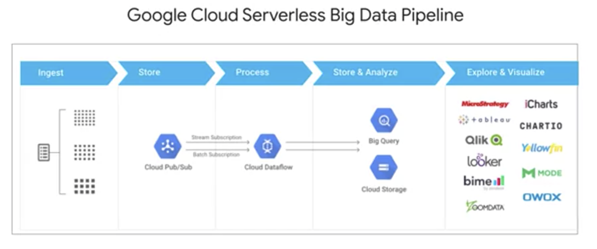
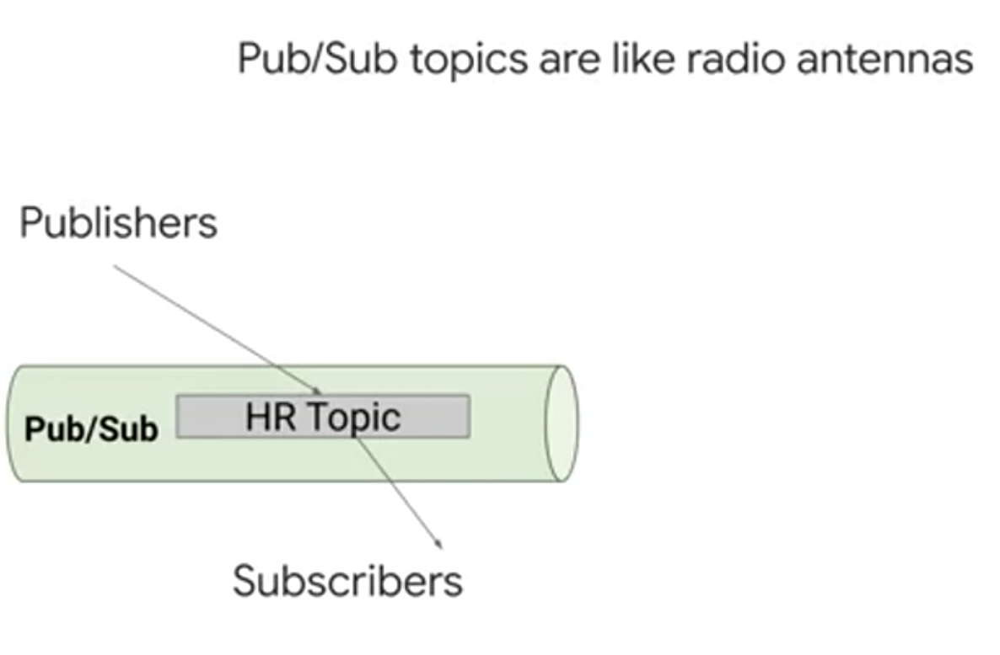
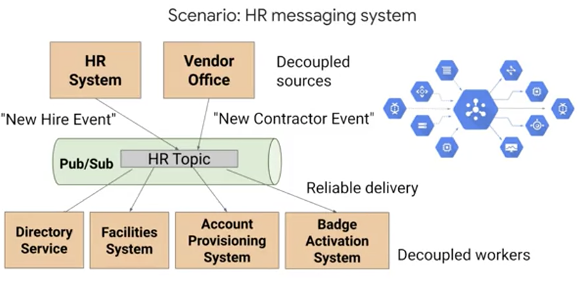
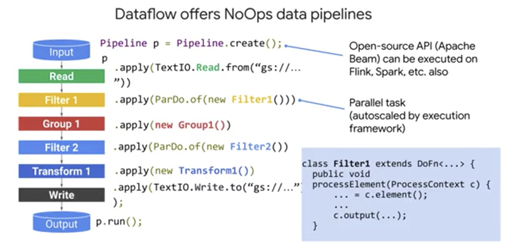
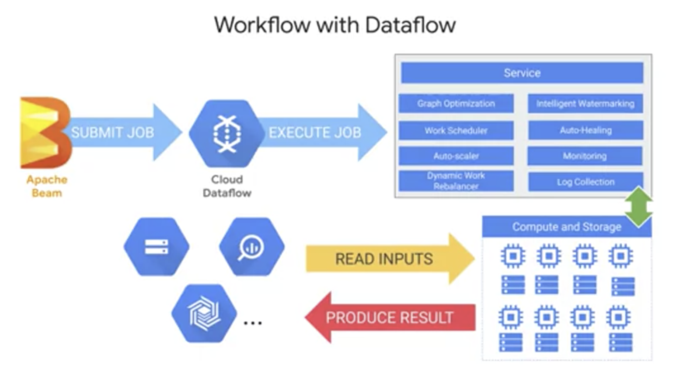
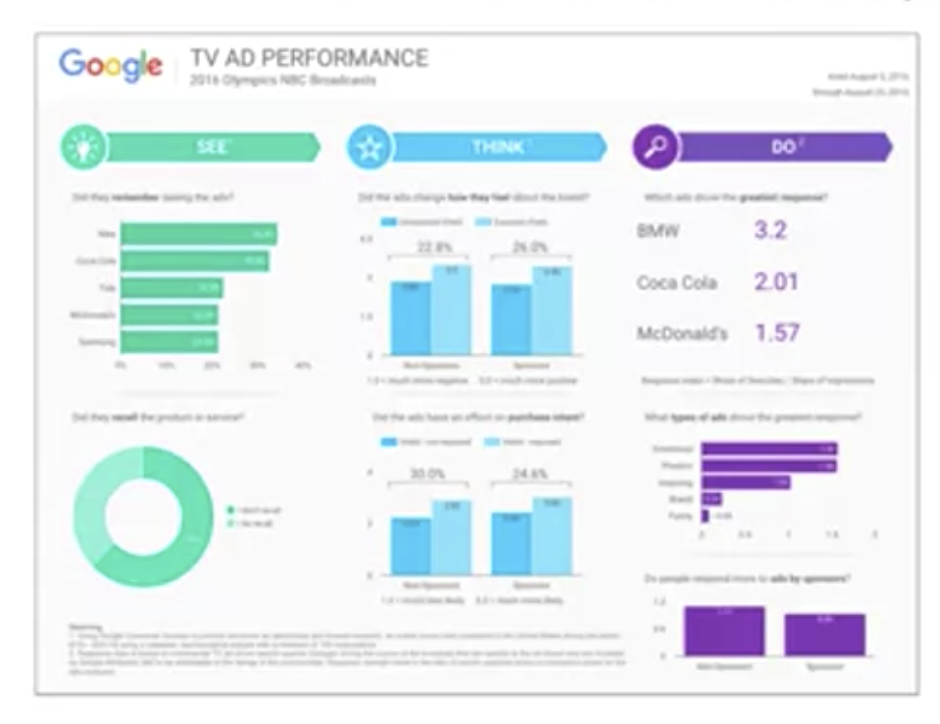
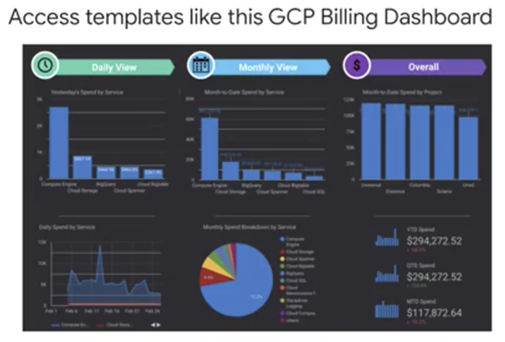
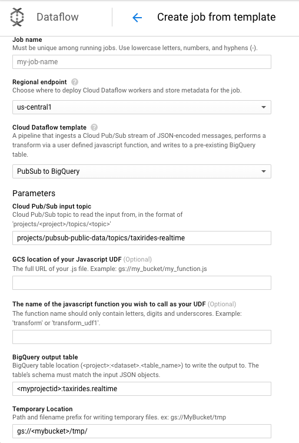

## データパイプラインの課題

ここまでのデータ（`cloudSQL_dataproc.md` や `study_about_bigquery.md` などの内容）はバッチ形式で読み込まれたもので Cloud SQLやBigQueryなど 既存の構造化データセットでした。しかし 数千個のセンサーのデータが 世界中でストリーミングされたとしたら？ 新しいメッセージが 毎分間隔で送信されたとしたら？ そのようなデータソースを どう分析に利用できるでしょうか 

今回は ストリーミングデータ処理の課題と解決方法を取り上げます。まずデータエンジニアにとって頭の痛い課題である **パイプラインの設定と管理** を取り上げます。 次に **ストリーミングメッセージをキャプチャしてグローバルかつスケーラブルな信頼性できる方法でパイプラインにまとめます**。その後でこのデータをストリーミングするサーバーレスのデータパイプラインの構築方法を紹介します。どのようにサーバーレスでスケーラブルなパイプラインを 設計、制御するのでしょう。この点については Apache Beam と Cloud Dataflow というよく使われるパイプライン技術のセクションで説明します。データのキャプチャ、処理、 保存が終わったらレポートダッシュボードを使った可視化に進みます スケーラブルで信頼できるパイプラインを構築することはデータエンジニアの重要な責務です。

現代の組織にはさまざまなデータソースがあります たとえばゲーム会社ではユーザーのハイスコアを追跡したりプレイヤーのゲーム内目標の達成度を記録したりします。また世界各地の気象情報を報告する分散型 IoT センサーなどもあります。さまざまな店舗から集められる POS データはどうでしょうか。どうすれば新規注文を組織的に重複なく下流システムに通知できるでしょう。

ここで話の規模を広げてみます。入力ソースが多様なだけでなくデータ量も大きく変化してギガバイトからペタバイトに増えたらどうなるか？ パイプラインコードとインフラは対応できるか？ パイプラインが停止またはクラッシュすることはないか？ データがシステムに到達したらすぐにほぼリアルタイムで処理する必要があります。さらにデータが遅れて届く場合やメッセージが不正なデータを含む場合ストリーミングの前に変換が必要な場合も考える必要があります。頭を抱えたくなりますね。

以降ではパイプラインデベロッパーが直面する難しい課題を１つ１つ見ていきます。このモジュールが終わる頃にはそれぞれの課題の解決方法を知り実際の IoT データでストリーミングデータパイプラインを構築できるようになるでしょう。

## Cloud Pub/Sub によるメッセージ指向アーキテクチャ

パイプラインの構築で難しいのが _処理すべき大量のストリーミングデータが単一の構造化データベースからは入って来ない_ ことです。これらイベントメッセージは 数千、数百万の異なるイベントからすべて非同期で入ってきます。このパターンが起こる一般的なユースケースは IoT アプリケーションです IoTデバイスの一例は GO-JEKドライバーのバイクに搭載されたセンサーで 30 秒ごとに各ドライバーに位置情報を送信しています。データセンターに設置された温度センサーもあります。これは冷暖房コストを計測して最適化しています。どのユースケースでも次の４つの主要要素に取り組む必要があります。

- さまざまなデバイスやプロセスからのストリーミングデータは相互に通信せず不正データや遅延データを送信する可能性もあります
- ストリーミングメッセージはバッファ内で確認したり収集したりできません。パブリッシュされた新メッセージを他のサービスがサブスクライブできる必要もあります。
- 当然このサービスはメッセージを消失しないように大量のデータを処理できて信頼性が高くなければなりません。
- すべてのメッセージが必要で重複があれば削除する方法も必要です 

これまで話したような分散型メッセージ指向アーキテクチャをスケーラブルに扱うツールの １つが **Cloud Pub/Sub** です。パブリッシャー/サブスクライバーモデルなので覚えやすい名前です。メッセージをサブスクライバーにパブリッシュすると考えてもよいでしょう。根本的に Pub/Subは分散型メッセージングサービスでゲームイベントやIoTデバイスといった上流データシステムからメッセージを受信できます。Pub/Subは **少なくとも１回** サブスクライバーアプリケーションに メッセージを配信して渡します。プロビジョニングは不要です。メッセージが大量でも皆無でも需要に応じてスケーリングが行われます。 また APIはオープンでデフォルトでグローバルなサービスです。メッセージは エンドツーエンドで暗号化されます。



アーキテクチャはこのようになります。上流データは左からスタートして世界中のデバイスに流れ込みます。その後 Googleシステムとの最初の接点となる Cloud Pub/Subに取り込まれます。Pub/Subはデータを読み込んで保存しこのトピックの全サブスクライバー宛にパブリッシュします。新しいメッセージが利用可能なトピックについては後で説明します。このPub/Subトピックのサブスクライバーの Cloud Dataflow は新着メッセージの有無を確認し融通の利かないストリーミングパイプラインのメッセージを取り込んで変換します。これらはどこでも出力できます。分析でよく使われるデータ同期方法に Google BigQueryがあります。最後に Tableau、Looker、 データポータルなどのツールを接続して ストリーミングデータパイプラインの結果を可視化したり監視したりできます。



次に Pub/Subのアーキテクチャについて 詳しく説明します。Pub/Subの中心部はトピックです・これはラジオのアンテナのようなものです。音楽が大音響で流れていても 電源が切れていてもアンテナ自体はいつもそこにあります 誰も聞いていない周波数で 音楽が放送されていても その音楽は依然として存在しています。同様に パブリッシャーは 受信するサブスクライバーがいなくても データを送信します。逆にサブスクライバーはデータが送信されてこないトピックの配信を待っているかもしれません。雑音の多い劣悪な周波数を聞いているようなものです。アプリケーションがサブスクライブ、 pullしているトピックに パブリッシャーがデータを送信するというように完全に動作させることもできます。

まとめると 0、1、それ以上のパブリッシャーと 0、1、それ以上のサブスクライバーが Pub/Subトピックに関わり両者は互いに完全に切り離されています。相手に影響を与えずに関係を断つことができるのです。



わかりやすい例があります たとえば人事のトピックがあります。新人が入社してきたら通知を行い新人に関わる他のアプリケーションがメッセージをサブスクライブして取得できるようにする必要があります。どのアプリケーションが 新人の入社を教えてくれるでしょうか？ 従業員には２種類いるかもしれません。フルタイム従業員と契約業者です。両者はお互いを知らないかもしれませんが、いずれも新人が入社したことを知らせるイベントをPub/Sub HRトピックにpushします。新人が入社したらすぐに知りたい事業分野は他に何があるでしょうか？ Pub/Subがメッセージを受信すると ディレクトリサービス、施設システム、 アカウントプロビジョニング、バッジアクティベーションシステムなどの下流アプリケーションのすべてが それをリッスンして 互いに独立して次のステップを処理します。Pub/Subはさまざまな上流のソースと下流のシンク、サブスクライバーからなる、緩やかに結合したアーキテクチャから生じる変化の衝撃を和らげる優れたソリューションです。さまざまな入出力をサポートし 必要な場合は そのトピックの Pub/Subイベントから 別のPub/Subサブトピックへの パブリッシュも可能です。これらのメッセージを確実にデータウェアハウスに取り込むには Pub/Subのスケールに対応できる柔軟性を備えたパイプラインが必要になります。

## Apache Beam によるストリーミング パイプラインの設計

ストリーミングソースからメッセージをすべて取得したらデータウェアハウスに取り込むパイプラインが必要です。データエンジニアがパイプラインを構築する際に 解決すべき２つの課題を考えます。建築家が設計図を描き 最終的にビルを建てるのに似ています。

- 1 つ目の課題はパイプライン設計をプログラミングすることです
- 2 つ目は実際の導入です。パイプラインを本番環境で大規模に稼働させなければなりません 

これらは各フェーズで考えるべき一般的な課題として、設計では次のことを考慮します。 

- コードはバッチとストリーミングデータの両方に互換性があるか？
- リファクタリングが必要か？
- パイプラインコードや SDK または使用する変換に多少の集約やウィンドウ処理機能が必要か？ 
- パイプラインに取り込まれる遅延データを処理できるか？ 
- すぐに設計に着手するために活用できる既存のテンプレートやソリューションがあるか？ 

広く利用されている方法の 1 つは **Apache Beam** によるパイプラインの構築です。これはバッチとストリーミングデータの 両方に対応します。変換と関数が オープンソースリポジトリに 続々と追加されています。このクラスで最高なのはパイプラインコードの既存のテンプレートを最初に使用できる点です。

では Apache Beamについて具体的な機能を見ていきましょう。Apache Beamは _移植可能なデータ処理プログラミングモデル_ です。オープンソースであり 高度な分散処理を実行できます。統合された単一のモデルなので１つのコードで バッチと ストリーミングデータの両方に対応できます。またコードを移植できるためベンダーロックインが発生しません。Cloud Dataflow や Apache Spark など複数の実行環境で動作します。拡張可能なオープンソースで独自のコネクタの検索や開発を行えます。必要なら変換ライブラリも構築可能です。Apache Beamパイプラインは Java、Python、Go で記述されています。この SDK がホストするライブラリでは変換機能とソースとシンクに接続する既存のデータコネクタを利用できます。

Apache Beamではコードのモデル表現が作成されさまざまなランナーに移植されます。ランナーはモデルを実行環境に渡します。そこではさまざまなエンジンを実行可能です。Cloud Dataflowは Apache Beamの エンジンとして広く普及しています。



これが Apache Beam SDK による実際のパイプラインです。Cloud Dataflowをエンジンとしています パイプラインの各ステップにフィルタ、グループ、変換、比較、結合などがあります。重要なのは 変換を並列で処理できる点です。このため 非常に高い柔軟性を得られます。このコードスニペットでは c.elementが入力を受け取りパイプラインの次のステップに c.outputが出力を渡しています。入力はさまざまなソースから同時に受け取ることができます。また多数のシンクに対する出力を記述できます。パイプラインコードは同じままです。このコードをサーブレットに配置して App Engine にデプロイし  cron タスクキューでスケジュールして コードを定期的に実行できます。インフラの管理が面倒にならないよう 少ないメンテナンスでパイプラインコードを大規模に導入する方法をご紹介します。

## Cloud Dataflow へのストリーミング パイプラインの実装

データパイプラインの設計とコードを確認したので本番環境への大規模な導入を見ていきましょう。パイプラインコードの実行エンジンを選択する際は 次の項目を検討します。

- メンテナンスのオーバーヘッドは？ 
- インフラ自体の信頼度は？
- 拡張方法は？
- パイプラインでの異常を監視する方法は？
- ベンダーロックインの有無は？

Cloud Dataflow は複雑なインフラの設定とメンテナンスを自動化します。Googleのインフラに構築されパイプラインの要求に応じて 自動スケーリングします。また Stackdriverなど他のGCPプロジェクトと緊密に連携します。これによりアラートと通知に優先付けを行いパイプラインとそこで処理されるデータの品質を常に監視できます。Dataflowは さまざまなデータ処理ツールの 代わりになります。また多数のHadoopワークロードの実行や管理を容易にします。しかもサーバーレスで NoOpsを目標に設計されています。サーバーレスのメリットとは？ Google がユーザーの代わりにインフラタスクを管理します。たとえば リソース、 パフォーマンス、パイプラインの管理などです。ユーザーは情報の分析に時間を使えるようになると同時に プロビジョニングの時間を削減できます。しばらくはパイプラインの安定稼働を期待できます。Dataflow はメンテナンスの削減を特に重視しています。



では Dataflow のジョブの処理方法とは？ ジョブを受信したCloud Dataflow サービスは モデルの実行グラフを最適化して非効率を防ぎます。分散処理のジョブをワーカーに対してスケジュールし必要に応じて拡張します。ワーカーに障害が発生すると自動的に修復します。自動的にリバランスして基礎となるワーカーの使用状況を最適化します。さまざまなデータシンクに接続して結果を生成します。BigQueryにもデータを出力できます。コンピューティングとストレージのリソースはすべて Cloud Dataflow がストリーミングデータパイプラインの要求に応じて柔軟に管理します。フルマネージドです。Java や Python のベテラン開発者の方もまずは既存の Dataflow テンプレートをご利用ください。


あらゆるGCPプロダクトの一般的なユースケースに対応可能です。利用できそうなテンプレートはありますか。IoTのユースケース向けに Dataflowを介してBigQueryに入力する Pub/Subがあり人気を集めています。

簡単にまとめると Cloud Dataflowでは パイプラインのデプロイと実行を容易に行えます。サーバーレス、フルマネージドで同じコードでバッチとストリーミングに柔軟に対応できます。Apache Beam のオープンソースプログラミングモデルに基づいており自動スケーリング、自動修復 リバランスに対応しています。

## 分析情報をダッシュボードで可視化する
### データポータルによる分析情報の可視化
BigQueryにあるデータは SQL　での情報分析に非常に役立ちますが、もっと直感的かつ視覚的にデータを操作したいという要望もあります。可視化はデータを調べるのに有効な手段です。結果を提示する前であってもです。「調べる」と言えば  BigQuery にはデータセットを調べる新しい方法があります。クエリを実行したらダッシュボード構成の一部としてデータポータルですぐにデータを可視化したり調査したりできます。



これがデータポータルで作成したレポートです。数字はさておき 表面的に見て これが何のレポートかわかりますか？ この例は 2016年のオリンピックの際に NBCで 放送された 広告の効果を示しています。レポートでは 見る人の関心を引く分析情報を 強調する必要があります 情報をすべて表示するのではなく見るべきデータポイントと情報に絞り込みます。重要なのは効果的なストーリーをデータで伝えることです。パイプラインがどれほど素晴らしくてもユーザーは関心がありません。経験から言うと、見栄えの悪いダッシュボードは使いにくいです。データポータルには既定のテンプレートがあります。



これは GCPの課金を示しています。これをGCPアカウントに結び付けて費用をモニタリングできます。BigQueryのジョブと 処理されるデータ量を 追跡するなどの分析も行えます。この画像でデータポータルUIの全体像がわかります。ただし開発チームが常に更新しているのでドキュメントで最適な例を参照して実践に役立ててください。ホームには ダッシュボードとアクセス可能なデータソースが表示されます。この２つの区別が重要です。接続済みのデータソースはダッシュボードに取り込めますが、ダッシュボードにアクセスした人にそのデータの表示権限が 自動的に付与されるわけではありません。これは BigQuery、他のGCPプロジェクトで制御できるからです。レポートを新たに作成する方法は 2 つあります。上にあるテンプレートパネルまたは右下のボタンから始めます。まず、データポータルでデータの取得先を指定します。これは「データソース」と呼ばれます。データはいくつも指定できますがここでは 1 つだけ使用します。このツールには アクセス可能なデータがすべて表示されます。いずれかまたはすべてのデータソースを 1 つのデータポータルレポートで使用できます。このレポートとデータセットは共有可能なのでデータソースを追加する際にはその影響に注意します。レポートに追加したデータソースをレポート閲覧権のある人と共有すると彼らにデータソース内のすべての データを見られる可能性があります。レポート編集権のある人が 追加されたデータソースのフィールドを使用して 新しいグラフを作成することも可能です。[レポートに追加]をクリックしてデータソースに接続すればいつでもデータを可視化できます。

## Cloud Dataflow を使用してリアルタイム ダッシュボード用のストリーミング データ パイプラインを作成する

### 概要
このラボでは、ニューヨーク市のタクシー車両を多数所有しているものとして、リアルタイムでビジネスの状況をモニタリングします。タクシーの運賃、乗客数、乗車状況などを収集し、その結果を管理ダッシュボードで可視化するためのストリーミング データ パイプラインを構築します。

### Cloud Pub/Sub のトピックを作成する
Cloud Pub/Sub は、非同期のグローバル メッセージング サービスです。送信者と受信者を分離することにより、独立して作成されたアプリケーション間で高可用性が確保された安全な通信を行えます。Cloud Pub/Sub は、レイテンシが短く耐久性に優れたメッセージングを実現します。

Cloud Pub/Sub では、トピックと呼ばれる共有文字列を使用して、パブリッシャー アプリケーションとサブスクライバー アプリケーションが相互に接続します。パブリッシャー アプリケーションによってメッセージが作成されてトピックに送信され、サブスクライバー アプリケーションによってトピックに対するサブスクリプションが作成されてメッセージが受信されます。

Google では、いくつかの Pub/Sub ストリーミング データ トピックをこのようなラボ向けに公開しています。今回は NYC Taxi & Limousine Commission のオープン データセットを使用します。

### BigQuery データセットを作成する
BigQuery はサーバーレス データ ウェアハウスです。BigQuery 内のテーブルは、データセットに編成されます。このラボでは、Pub/Sub に送信されたメッセージを集約し、BigQuery に保存します。

新しい BigQuery データセットを作成するには:

**オプション 1: コマンドライン（_うまくいかなかった_）**

Cloud Shell を開き、以下のコマンドを実行して taxirides データセットを作成します。

```bash
bq mk taxirides
```

次のコマンドを実行して、taxirides.realtime テーブルを作成します（後でデータのストリーミング先となる空のスキーマです）。

```bash
bq mk \
--time_partitioning_field timestamp \
--schema ride_id:string,point_idx:integer,latitude:float,longitude:float,\
timestamp:timestamp,meter_reading:float,meter_increment:float,ride_status:string,\
passenger_count:integer -t taxirides.realtime
```

**オプション 2: BigQuery コンソール UI**

コマンドラインを使用してテーブルを作成した場合、この手順はスキップしてください。

GCP Console で、ナビゲーション メニュー > [BigQuery] に移動します。

左側のメニューから GCP プロジェクト ID をクリックします。

クエリエディタの下にあるコンソールの右側の [データセットを作成] をクリックします。

新しいデータセットに taxirides という名前を付けます。その他のフィールドはすべてそのままにし、[データセットを作成] をクリックします。

左側のリソース メニューに、新しく作成されたデータセットが表示されます。

taxirides データセットをクリックします。

[テーブルを作成] をクリックします。

テーブルに realtime と名前を付けます。

[スキーマ] では、[テキストとして編集] をクリックし、下のスキーマを貼り付けます。

```
ride_id:string,
point_idx:integer,
latitude:float,
longitude:float,
timestamp:timestamp,
meter_reading:float,
meter_increment:float,
ride_status:string,
passenger_count:integer
```

[パーティションとクラスタの設定] で、[パーティショニング] に [タイムスタンプ] オプションを選択します。

以下のスクリーンショットを確認してください。


[テーブルを作成] ボタンをクリックします。
Cloud Storage バケットを作成する
すでにバケットを作成している場合、この手順はスキップしてください。

Cloud Storage では、世界中のどこからでも、いつでもデータを保存、取得できます。データの量に制限はありません。ウェブサイト コンテンツの提供、アーカイブと障害復旧のためのデータの保存、直接ダウンロードによるユーザーへの大きなデータ オブジェクトの配布など、さまざまなシナリオで Google Cloud Storage を使用できます。このラボでは、Cloud Dataflow パイプラインの作業スペースとして Cloud Storage を使用します。

GCP Console で、ナビゲーション メニュー > [Storage] に移動します。
[バケットを作成] をクリックします。
[名前] に GCP プロジェクト ID を貼り付けます。
[デフォルトのストレージ クラス] で、まだ選択されていない場合は [マルチリージョン] をクリックします。
[ロケーション] で最も近いものを選択します。
[作成] をクリックします。
Cloud Dataflow パイプラインを設定する
Cloud Dataflow では、サーバーレスでデータ分析を行うことができます。このラボでは、Pub/Sub からセンサーデータを読み取り、一定の期間における最高気温を計算し、これを BigQuery に書き込むストリーミング データ パイプラインを設定します。

GCP Console で、ナビゲーション メニュー > [Dataflow] に移動します。

上部のメニューバーの [テンプレートからジョブを作成] をクリックします。

Cloud Dataflow ジョブのジョブ名として streaming-taxi-pipeline と入力します。

[Cloud Dataflow テンプレート] で、[Cloud Pub/Sub Topic to BigQuery] テンプレートを選択します。

[Cloud Pub/Sub input topic] に「projects/pubsub-public-data/topics/taxirides-realtime」と入力します。

[BigQuery output table] に「<プロジェクト ID>:taxirides.realtime」と入力します。

注: プロジェクトとデータセット名の間にはコロン「:」を、データセットとテーブル名の間にはドット「.」を使用します。

[一時的なロケーション] に「gs://<バケット名>/tmp/」と入力します。

[ジョブを実行] ボタンをクリックします。

新しいストリーミング ジョブが開始されました。これで、データ パイプラインを視覚的に表示できるようになりました。



BigQuery を使用してタクシーデータを分析する
ストリーミング中にデータを分析するには:

GCP Console で、ナビゲーション メニューを開き、BigQuery を選択します。

クエリエディタに次のクエリを入力し、[実行] をクリックします。

```sql
SELECT * FROM taxirides.realtime LIMIT 10
```

レコードが返されない場合は、しばらく待ってから上記のクエリを再実行します（Dataflow によるストリームの設定に 3〜5 分かかります）。次のような出力が返されます。


### レポート用にストリームの集計を実行する
以下のクエリをコピーして貼り付け、実行します。

```sql
WITH streaming_data AS (

SELECT
  timestamp,
  TIMESTAMP_TRUNC(timestamp, HOUR, 'UTC') AS hour,
  TIMESTAMP_TRUNC(timestamp, MINUTE, 'UTC') AS minute,
  TIMESTAMP_TRUNC(timestamp, SECOND, 'UTC') AS second,
  ride_id,
  latitude,
  longitude,
  meter_reading,
  ride_status,
  passenger_count
FROM
  taxirides.realtime
WHERE ride_status = 'dropoff'
ORDER BY timestamp DESC
LIMIT 100000

)

# レポート用にストリームの集計を実行:
SELECT
 ROW_NUMBER() OVER() AS dashboard_sort,
 minute,
 COUNT(DISTINCT ride_id) AS total_rides,
 SUM(meter_reading) AS total_revenue,
 SUM(passenger_count) AS total_passengers
FROM streaming_data
GROUP BY minute, timestamp
```

結果には、タクシーの利用ごとの主な指標が分単位で表示されます。

### リアルタイム ダッシュボードを作成する
BigQuery のクエリ実行結果ページの中段にある、[データポータルで調べる]（「DataStudio」という名前になってるかも） をクリックします。

以下の設定を指定します。

```
グラフの種類: 縦棒グラフ
期間のディメンション: dashboard_sort
ディメンション: dashboard_sort、minute
ドリルダウン: dashboard_sort
指標: SUM() total_rides、SUM() total_passengers、SUM() total_revenue
並べ替え: dashboard_sort 昇順（最新が最上位）
```


注: データポータルでは現在、タイムスタンプとしてデータを分単位で可視化することはできません。Google では対策として、独自の dashboard_sort ディメンションを作成しています。

ダッシュボードに問題がない場合は、[保存] をクリックしてこのデータソースを保存します。

ダッシュボードにいつ誰がアクセスした場合でも、最新のトランザクションが表示されます。[保存] ボタンの近くの [更新] ボタンをクリックしてお試しください。

### Cloud Dataflow ジョブを停止する
Cloud Dataflow に戻ります。

[streaming-taxi-pipeline] をクリックします。

[ジョブを中止] をクリックし、[キャンセル] をクリックします。

これで、プロジェクトのためのリソースが解放されます。

お疲れさまでした
このラボでは、Pub/Sub を使用してタクシーからストリーミング データ メッセージを収集し、それを Dataflow パイプラインを経由して BigQuery に送りました。

## リソース

<ul><li><a href="https://cloud.google.com/pubsub/docs/?hl=ja" target="_blank" rel="noopener nofollow"><u>Cloud Pub/Sub のドキュメント</u></a><u> + </u><a href="https://cloud.google.com/pubsub/docs/release-notes?hl=ja" target="_blank" rel="noopener nofollow"><u>ブログ</u></a></li><li><a href="https://cloud.google.com/dataflow/docs/?hl=ja" target="_blank" rel="noopener nofollow"><u>Cloud Dataflow のドキュメント</u></a><u> + </u><a href="https://cloud.google.com/blog/products/data-analytics/" target="_blank" rel="noopener nofollow"><u>ブログ</u></a><u> + </u><a href="https://github.com/GoogleCloudPlatform/DataflowTemplates/" target="_blank" rel="noopener nofollow"><u>テンプレート</u></a></li><li><a href="https://developers.google.com/datastudio/?hl=ja" target="_blank" rel="noopener nofollow"><u>データポータルのドキュメント</u></a><u> + </u><a href="https://datastudiogallery.appspot.com/gallery" target="_blank" rel="noopener nofollow"><u>テンプレート</u></a></li></ul>