# Google Cloud Run Serverless Workshop

---

**所見：** Firestore や Firebase hosting、また、Cloud Run と Cloud Pub/Sub の連携などサーバレス領域のサービスの使い方を学べる。gcloud コマンドの使い方（特に Cloud Pub/Sub まわり）はまだ慣れない。Dockerfile の書き方なども基本的な部分は習熟している必要がある。実際のアプリのコードも、このコースでは Node.js でルーティングを書いている（express を使っている）が、実際に自分でアプリを作る際にはどう書いて GCP と連携させればいいのかはいろいろ悩みそう。。

ここらへんが参考になりそう。

- [Cloud Run チュートリアルで Pub/Sub を使用する](https://cloud.google.com/run/docs/tutorials/pubsub?hl=ja)
- [Cloud Storage の Pub/Sub 通知](https://cloud.google.com/storage/docs/pubsub-notifications?hl=ja)

---

## Firestore データベースへデータを読み込む

### 概要

「GCP サーバーレス ワークショップ: Pet Theory」クエストのラボでは、架空のビジネスシナリオを読み、サーバーレス移行計画において登場人物を支援します。

Lily さんは 12 年前、獣医クリニック チェーン「Pet Theory」を開業しました。Pet Theory チェーンはここ数年で急速に拡大しました。しかし、増大した負荷を古い予約システムで処理しきれなくなったため、より拡張性の高いクラウドベースのシステムが必要になっています。

Pet Theory の運用チームのメンバーは Patrick さんだけなので、運用中のメンテナンスにあまり手間のかからないソリューションが必要です。そこで、サーバーレス テクノロジーを採用することになりました。

Ruby さんは、Pet Theory のサーバーレス移行を支援するコンサルタントとして雇われています。サーバーレス データベースのオプションを比較した後、チームは Cloud Firestore を採用することにしました。Firestore はサーバーレスなので、容量を事前にプロビジョニングする必要がありません。これはつまり、ストレージやオペレーションが上限に達するリスクがないということです。Firestore では、リアルタイム リスナーを通じてクライアント アプリ間でデータの同期が維持され、モバイルとウェブのオフライン サポートも提供されるので、ネットワーク レイテンシやインターネット接続に関係なく機能する、応答性の高いアプリを構築できます。

このラボでは、Patrick さんが Pet Theory の既存のデータを Cloud Firestore データベースにアップロードする作業をサポートします。Patrick さんは Ruby さんと密接に連携しながら作業を完了します。

### アーキテクチャ

この図は、使用するサービスの概要と、サービスが相互に接続する様子を示しています。


### 学習内容

このラボでは、次の方法について学びます。

- GCP で Firestore をセットアップする。
- データベースのインポート コードを記述する。
- テスト用の顧客データのコレクションを生成する。
- テスト用の顧客データを Firestore に読み込む。
- Firestore のデータをコンソールから操作する。
- Firestore へのアクセス権を付与せずに、デベロッパーを GCP プロジェクトに追加する。
要件

これは基礎レベルのラボです。このラボは、GCP Console とシェル環境に精通していることを前提としています。Firebase を扱った経験は役立ちますが、必須ではありません。

ファイルの編集にも慣れている必要があります。お気に入りのテキスト エディタ（nano、viなど）を使用するか、上部のリボンにある Cloud Shell からコードエディタを起動できます。


準備ができたら下にスクロールし、手順に沿ってラボ環境を設定します。

gcloud は Google Cloud Platform のコマンドライン ツールです。このツールは、Cloud Shell にプリインストールされており、タブ補完がサポートされています。

次のコマンドを使用すると、有効なアカウント名を一覧表示できます。

```bash
gcloud auth list
```

出力:

```
Credentialed accounts:
- <myaccount>@<mydomain>.com (active)
```

出力例:

```
Credentialed accounts:
- google1623327_student@qwiklabs.net
```

次のコマンドを使用すると、プロジェクト ID を一覧表示できます。

```bash
gcloud config list project
```

出力:

```
[core]
project = <project_ID>
```

出力例:

```
[core]
project = qwiklabs-gcp-44776a13dea667a6
```

gcloud について詳しくは、gcloud の概要をご確認ください。

### GCP で Firestore を設定する

Patrick さんのタスクは、Pet Theory の既存のデータを Cloud Firestore データベースにアップロードすることです。彼はこの目標を達成するために Ruby さんと連携します。Ruby さんは、IT 部門の Patrick さんから次のメッセージを受け取りました。

**Patrick さん（IT 管理者）**

> Ruby さん、お世話になっております。
>
> サーバーレス化にあたり、まず GCP で Firestore データベースを作成しようと思います。こうした設定作業には不慣れなため、アドバイスをいただければと考えています。

**Ruby さん（ソフトウェア コンサルタント）**

> Patrick さん、ご連絡ありがとうございます。
>
> 承知しました。喜んでお手伝いさせていただきます。つきましては、作業を開始するためのリソースを送付いたします。データベースの作成が終わり次第、ご連絡いただけますでしょうか。よろしくお願いいたします。

Patrick さんが Firestore データベースを設定できるよう、GCP Console からサポートします。

ナビゲーション メニューを開き、[ストレージ] にある [Firestore] を選択します。

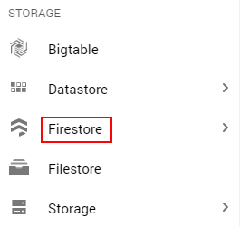

[ネイティブ モードを選択] ボタンをクリックします。

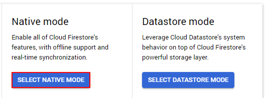

どちらのモードも高パフォーマンスで強整合性ですが、見た目が異なり、それぞれのユースケース向けに最適化されています。
ネイティブ モードは、多数のユーザーが同じデータに同時にアクセスできるようにするのに適しています。さらに、リアルタイム更新や、データベースとウェブ / モバイル クライアント間の直接接続のような機能も備えています。
データストア モードは、高スループット（大量の読み取りと書き込み）に重点が置かれています。
[ロケーションを選択] プルダウンで、自分のロケーションに最も近いデータベース リージョンを選択し、[データベースを作成] をクリックします。
タスクの完了後、Ruby さんから Patrick さんには次のメールが届きます。

**Ruby さん（ソフトウェア コンサルタント）**

> Patrick さん、ご連絡ありがとうございます。
>
> Firestore データベースの設定、お疲れさまでございました。データベースへのアクセスを管理するには、必要な権限で自動的に作成されたサービス アカウントを使用することになります。
>
> 以上で、古いデータベースから Firestore に移行する準備は完了です。

**Patrick さん（IT 管理者）**

> Ruby さん、お世話になっております。
>
> ご協力ありがとうございました。おかげさまで Firestore データベースは簡単に設定できました。
>
> データベースのインポート プロセスも簡単であることを祈っています。以前のデータベースでは、かなり複雑で手間がかかったように記憶しています。

### データベースのインポート コードを記述する
新しい Cloud Firestore データベースは準備できましたが、中身は空の状態です。Pet Theory の顧客データは、まだ古いデータベースにのみ存在します。

Patrick さんは Ruby さんに次のメッセージを送信します。

> Patrick さん（IT 管理者）
>
> Ruby さん、お世話になっております。
>
> 弊社の上司の意向により、新しい Firestore データベースに対して、顧客データの移行を開始したいと考えております。
>
> 従来のデータベースから CSV ファイルをエクスポートしましたが、このデータを Firestore に読み込む方法がわかりません。
>
> この方法につき、ご教示いただければ助かります。よろしくお願いいたします。

**Ruby さん（ソフトウェア コンサルタント）**

> Patrick さん、ご連絡ありがとうございます。
>
> 承知しました。では、どのような作業が必要になるか、打ち合わせにてお話しさせていただければと思います。よろしくお願いいたします。

Patrick さんが言うとおり、顧客データは CSV ファイルで用意されます。ここで Patrick さんをサポートしましょう。CSV ファイルから顧客レコードを読み取って Firestore に書き込むアプリを作成します。Patrick さんは JavaScript に精通しているので、Node.js JavaScript ランタイムを使用してこのアプリケーションを構築します。

Cloud Shell で次のコマンドを実行し、Pet Theory リポジトリのクローンを作成します。

```bash
git clone https://github.com/rosera/pet-theory
```

Cloud Shell コードエディタ（または任意のエディタ）を使用してファイルを編集します。Cloud Shell セッションの上部のリボンから、コードエディタ アイコンをクリックします。


次に、現在の作業ディレクトリを lab01 に変更します。

```bash
cd pet-theory/lab01
```

ディレクトリ内には、Patrick さんの package.json があります。このファイルは、Node.js プロジェクトが依存するパッケージをリストしたものです。これによりビルドの再作成が可能になり、他のユーザーとも簡単に共有できるようになります。

package.json の例を以下に示します。

```json
{
  "name": "lab01",
  "version": "1.0.0",
  "description": "This is lab01 of the Pet Theory labs",
  "main": "index.js",
  "scripts": {
    "test": "echo \"Error: no test specified\" && exit 1"
  },
  "keywords": [],
  "author": "Patrick - IT",
  "license": "MIT",
  "dependencies": {
    "csv-parse": "^4.4.5"
  }
}
```

Patrick さんはソースコードを読み込み、Ruby さんに連絡を取って、移行を実施するためにどのパッケージが必要なのかを確認します。

**Patrick さん（IT 管理者）**

> Ruby さん、お世話になっております。
>
> 古いデータベースで使用しているコードはかなり基本的なもので、インポートでは CSV しか作成できません。始める前にダウンロードが必要なものがあれば、お知らせいただけると助かります。

**Ruby さん（ソフトウェア コンサルタント）**

> Patrick さん、ご連絡ありがとうございます。
>
> Google Cloud には Node パッケージがたくさん用意されていますので、そのいずれかを使って Firestore を操作することをおすすめします。
>
> そうすれば、煩雑な作業をパッケージに任せられるので、既存のコードに簡単な変更を加えるだけで済みます。

Patrick さんのコードを Firestore データベースに書き込めるようにするには、追加のピア依存関係をインストールする必要があります。

以下のコマンドを実行します。

```bash
npm install @google-cloud/firestore
```

アプリから Stackdriver Logging にログを書き込めるように、追加のモジュールをインストールします。

```bash
npm install @google-cloud/logging
```

コマンドが正常に実行されると、package.json が自動的に更新され、新しいピア依存関係が含まれるようになります。これは次のようになります。

```json
...

"dependencies": {
  "@google-cloud/firestore": "^2.4.0",
  "@google-cloud/logging": "^5.4.1",
  "csv-parse": "^4.4.5"
}
```

次に、スクリプトについて見てみます。このスクリプトは、顧客の CSV ファイルを読み取り、その CSV ファイルの各行に対応するレコードを Firestore に書き込むものです。Patrick さんの元のアプリケーションを以下に示します。

```js
const {promisify} = require('util');
const parse       = promisify(require('csv-parse'));
const {readFile}  = require('fs').promises;

if (process.argv.length < 3) {
  console.error('Please include a path to a csv file');
  process.exit(1);
}

function writeToDatabase(records) {
  records.forEach((record, i) => {
    console.log(`ID: ${record.id} Email: ${record.email} Name: ${record.name} Phone: ${record.phone}`);
  });
  return ;
}

async function importCsv(csvFileName) {
  const fileContents = await readFile(csvFileName, 'utf8');
  const records = await parse(fileContents, { columns: true });
  try {
    await writeToDatabase(records);
  }
  catch (e) {
    console.error(e);
    process.exit(1);
  }
  console.log(`Wrote ${records.length} records`);
}

importCsv(process.argv[2]).catch(e => console.error(e));
```

これは、入力 CSV ファイルから出力を取得し、従来のデータベースに読み込むものです。次に、このコードを更新し、_Firestore に対して書き込むように_ します。

ファイル `pet-theory/lab01/importTestData.js` を開きます。
アプリケーションから Firestore API を参照するには、既存のコードベースにピア依存関係を追加する必要があります。

ファイルの 4 行目に次の Firestore 依存関係を追加します。

```js
const {Firestore} = require('@google-cloud/firestore');
```

コードが次のようになっていることを確認します。

```js
const {promisify} = require('util');
const parse       = promisify(require('csv-parse'));
const {readFile}  = require('fs').promises;
const {Firestore} = require('@google-cloud/firestore');   // これを追加します
```

Firestore データベースとの統合は、数行のコードで実現できます。そこで Ruby さんは、Patrick さんとあなたにテンプレート コードを共有しました。

9 行目の `if (process.argv.length < 3)` 句の下に次の内容を追加します。

```js
const db = new Firestore();

function writeToFirestore(records) {
  const batchCommits = [];
  let batch = db.batch();
  records.forEach((record, i) => {
    var docRef = db.collection('customers').doc(record.email);
    batch.set(docRef, record);
    if ((i + 1) % 500 === 0) {
      console.log(`Writing record ${i + 1}`);
      batchCommits.push(batch.commit());
      batch = db.batch();
    }
  });
  batchCommits.push(batch.commit());
  return Promise.all(batchCommits);
}
```

上記のコード スニペットは、新しいデータベース オブジェクトを宣言します。これは、ラボの前半で作成したデータベースを参照します。この関数は、各レコードが順番に処理されるバッチプロセスを使用し、追加された ID に基づいてドキュメント参照を設定します。関数の最後に、バッチ コンテンツがデータベースに書き込まれます。

最後に、新しい関数の呼び出しを追加する必要があります。`importCsv` 関数を更新して、writeToFirestore への関数呼び出しを追加し、「`writeToDatabase`」への呼び出しを削除します。次のようになります。

```js
async function importCsv(csvFileName) {
  const fileContents = await readFile(csvFileName, 'utf8');
  const records = await parse(fileContents, { columns: true });
  try {
    await writeToFirestore(records);
    // await writeToDatabase(records);
  }
  catch (e) {
    console.error(e);
    process.exit(1);
  }
  console.log(`Wrote ${records.length} records`);
}
```

次に、アプリケーションのロギングを追加します。アプリケーションを通じて Logging API を参照するには、既存のコードベースにピア依存関係を追加します。ファイルの上部にある他の `require` ステートメントのすぐ下に、行 `const {Logging} = require('@google-cloud/logging');` を追加します。

```js
const {promisify} = require('util');
const parse       = promisify(require('csv-parse'));
const {readFile}  = require('fs').promises;
const {Firestore} = require('@google-cloud/firestore');
const {Logging} = require('@google-cloud/logging');        //これを追加します
```

いくつかの定数変数を追加し、Logging クライアントを初期化します。これらはファイルの上記の行（～ 5 行目）のすぐ下に次のように追加します。

```js
const logName = 'pet-theory-logs-importTestData';

// Logging クライアントの作成
const logging = new Logging();
const log = logging.log(logName);

const resource = {
  type: 'global',
};
importCsv 関数にログを書き込むためのコードを、行 console.log(Wrote ${records.length} records); のすぐ下に追加します。次のようになります。

// テキスト ログエントリ
success_message = `Success: importTestData - Wrote ${records.length} records`
const entry = log.entry({resource: resource}, {message: `${success_message}`});
log.write([entry]);
上記の更新の後、importCsv 関数コードブロックは次のようになります。

async function importCsv(csvFileName) {
  const fileContents = await readFile(csvFileName, 'utf8');
  const records = await parse(fileContents, { columns: true });
  try {
    await writeToFirestore(records);
    //await writeToDatabase(records);
  }
  catch (e) {
    console.error(e);
    process.exit(1);
  }
  console.log(`Wrote ${records.length} records`);

  // テキスト ログエントリ
  success_message = `Success: importTestData - Wrote ${records.length} records`
  const entry = log.entry({resource: resource}, {message: `${success_message}`});
  log.write([entry]);
}
```

これで、アプリケーション コードを実行すると、Firestore データベースが CSV ファイルの内容で更新されるようになります。`importCsv` 関数はファイル名を取得し、コンテンツを行ごとに解析します。処理された各行は、Firestore 関数 `writeToFirestore` に送信されます。ここで、新しい各レコードが「顧客」データベースに書き込まれます。

> 注: 本番環境では、独自のバージョンのインポート スクリプトを記述します。

### テストデータを作成する

さて、それではデータを読み込みます。Patrick さんは、実際の顧客データを使ったテストの実行について懸念していることを Ruby さんに伝えます。

**Patrick さん（IT 管理者）**

> Ruby さん、お世話になっております。
>
> テストでは、顧客データを使用しないほうがよいと考えています。顧客のプライバシーを保つ必要があるのに加え、データ インポート スクリプトが正しく機能することにも、ある程度の確信が必要になります。
>
> 他のテスト方法などあれば、教えていただけますと助かります。

**Ruby さん（ソフトウェア コンサルタント）**

> Patrick さん、ご連絡ありがとうございます。
>
> ご心配なされていること、ごもっともと存じます。顧客データには個人を特定できる情報（PII）が含まれている可能性があるため、これは取り扱いが困難です。
> 
> つきましては、疑似顧客データを作成するスターター コードをいくつかご紹介いたします。作成したデータを使用して、インポート スクリプトをテストできます。

Patrick さんが、この疑似ランダムデータ生成ツールを起動して実行できるようにサポートしましょう。

最初に、疑似顧客データを生成するスクリプト用の「`faker`」ライブラリをインストールします。次のコマンドを実行して `package.json` の依存関係を更新します。

```bash
npm install faker
```

次に、コードエディタで `createTestData.js` という名前のファイルを開き、コードを調べます。次のようになっていることを確認します。

```js
const fs = require('fs');
const faker = require('faker');

function getRandomCustomerEmail(firstName, lastName) {
  const provider = faker.internet.domainName();
  const email = faker.internet.email(firstName, lastName, provider);
  return email.toLowerCase();
}

async function createTestData(recordCount) {
  const fileName = `customers_${recordCount}.csv`;
  var f = fs.createWriteStream(fileName);
  f.write('id,name,email,phone\n')
  for (let i=0; i<recordCount; i++) {
    const id = faker.random.number();
    const firstName = faker.name.firstName();
    const lastName = faker.name.lastName();
    const name = `${firstName} ${lastName}`;
    const email = getRandomCustomerEmail(firstName, lastName);
    const phone = faker.phone.phoneNumber();
    f.write(`${id},${name},${email},${phone}\n`);
  }
  console.log(`Created file ${fileName} containing ${recordCount} records.`);
}

recordCount = parseInt(process.argv[2]);
if (process.argv.length != 3 || recordCount < 1 || isNaN(recordCount)) {
  console.error('Include the number of test data records to create. Example:');
  console.error('    node createTestData.js 100');
  process.exit(1);
}

createTestData(recordCount);
```

コードベースに Logging を追加します。以下を使用して、アプリケーション コードから Logging API モジュールを参照します。

```js
const fs = require('fs');
const faker = require('faker');
const {Logging} = require('@google-cloud/logging');        //これを追加します
次に、いくつかの定数変数を追加し、Logging クライアントを初期化します。これは const ステートメントのすぐ下に追加します。

const logName = 'pet-theory-logs-createTestData';

// Logging クライアントの作成
const logging = new Logging();
const log = logging.log(logName);

const resource = {
  // この例では、単純化のために「global」リソースをターゲットにしています。
  type: 'global',
};
createTestData 関数にログを書き込むコードを、行 console.log(Created file ${fileName} containing ${recordCount} records.); のすぐ下に追加します。これは、次のようになります。

// テキスト ログエントリ
const success_message = `Success: createTestData - Created file ${fileName} containing ${recordCount} records.`
const entry = log.entry({resource: resource}, {name: `${fileName}`, recordCount: `${recordCount}`, message: `${success_message}`});
log.write([entry]);
更新後、createTestData 関数コードブロックは次のようになります。

async function createTestData(recordCount) {
  const fileName = `customers_${recordCount}.csv`;
  var f = fs.createWriteStream(fileName);
  f.write('id,name,email,phone\n')
  for (let i=0; i<recordCount; i++) {
    const id = faker.random.number();
    const firstName = faker.name.firstName();
    const lastName = faker.name.lastName();
    const name = `${firstName} ${lastName}`;
    const email = getRandomCustomerEmail(firstName, lastName);
    const phone = faker.phone.phoneNumber();
    f.write(`${id},${name},${email},${phone}\n`);
  }
  console.log(`Created file ${fileName} containing ${recordCount} records.`);

  // テキスト ログエントリ
  const success_message = `Success: createTestData - Created file ${fileName} containing ${recordCount} records.`
  const entry = log.entry({resource: resource}, {name: `${fileName}`, recordCount: `${recordCount}`, message: `${success_message}`});
  log.write([entry]);

}
```

次のコマンドを実行して Cloud Shell で GCP プロジェクト ID を構成します。PROJECT_ID を Qwiklabs プロジェクト ID に置き換えます。

```bash
gcloud config set project PROJECT_ID
```

ここで、プロジェクト ID を環境変数として設定します。

```bash
PROJECT_ID=$(gcloud config get-value project)
```

Cloud Shell で次のコマンドを実行して、customers_1000.csv ファイルを作成します。このファイルには、テストデータ 1,000 レコードが含まれます。

```bash
node createTestData 1000
```

次のような出力が返されます。

```
Created file customers_1000.csv containing 1000 records.
```

ファイル `Customers_1000.csv` を開き、テストデータが作成されていることを確認します。

### Firestore データベース用のテストデータを作成する

#### テスト用の顧客データを読み込む

インポート機能をテストするには、インポート スクリプトと前に作成したテストデータの両方を使用します。

```bash
node importTestData customers_1000.csv
```

次のようなエラーが発生することがあります。

```
Error: Cannot find module 'csv-parse'
```

その場合は、次のコマンドを実行して、csv-parse パッケージを環境に追加します。

```bash
npm install csv-parse
```

次に、コマンドを再実行します。次の出力が表示されます。

```
Writing record 500
Writing record 1000
Wrote 1000 records
```

この時点でもっと試してみたい場合は、より大きなテストデータ ファイルを作成して Firestore データベースに読み込むこともできます。

```bash
node createTestData 20000
node importTestData customers_20000.csv
```

ここまでは、テストデータとスクリプトを作成して、Firestore にデータを読み込む方法を見てきました。Patrick さんは、顧客データを Firestore データベースに読み込む作業に自信を持てるようになりました。

### Firestore データベースにテストデータを読み込む
#### Firestore でデータを調べる

あなたと Ruby さんが少しサポートしたおかげで、Patrick さんはテストデータを Firestore データベースに問題なく移行できました。Firestore を開いて、結果を確認してください。

GCP Console のタブに戻ります。ナビゲーション メニューで、[Firestore] をクリックします。そこで鉛筆アイコンをクリックします。

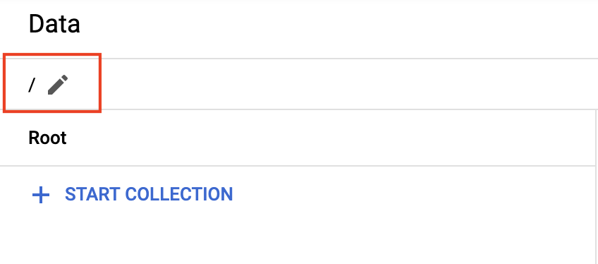

`/customers` と入力し、Enter キーを押します。

ブラウザのタブを更新すると、以下の顧客リストが正常に移行されたことがわかります。

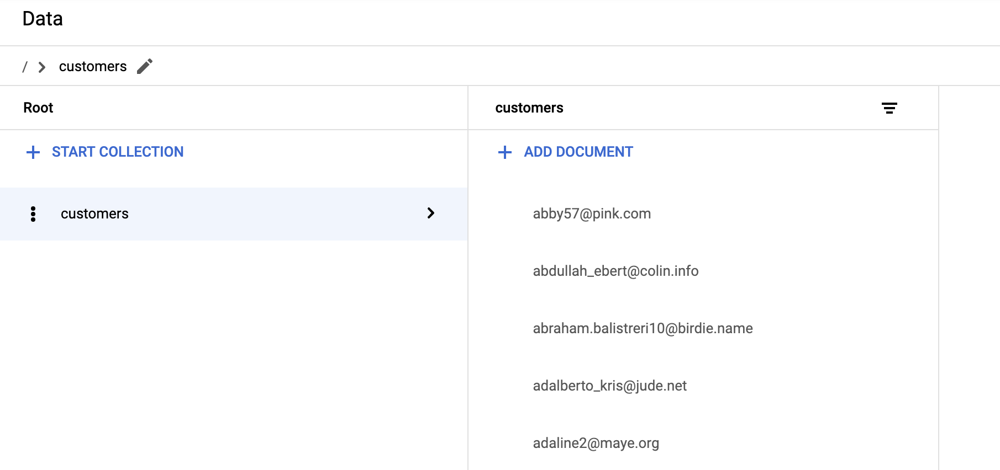

#### Firestore のデータを編集、削除する
customers コレクションから顧客を選択し、顧客の電話番号をクリックします。

[フィールドを編集] ポップアップが表示されます。顧客の電話番号を変更し、[更新] をクリックします。これでデータベース内で、そのレコードが更新済みになります。

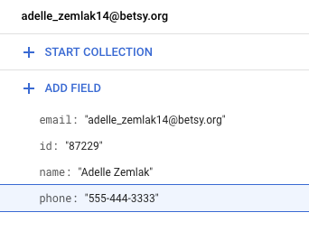

ここで、顧客のメールアドレスにカーソルを合わせ、[フィールドを削除] を選択します。[削除] をクリックして確定します。
移行スクリプトのテストについては、多くの場合はテストの完了時にすべてのレコードを削除する必要があります。

顧客の横にある縦に並んだ 3 つの点をクリックします。

ポップアップ メニューで [コレクションを削除] を選択します。続いて、[キャンセル] をクリックします。

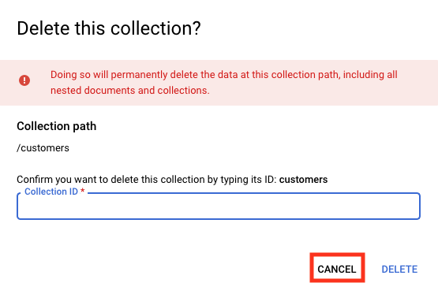

データベース内のレコードはテストデータです。実際のデータを読み込んだ後は、このユーザー インターフェースを使って本番データを編集、削除できるチームメンバーが数人（または 0 人）になるよう、アクセスを遮断できます。

Firestore へのアクセスを許可せずにプロジェクトにデベロッパーを追加する
これで、顧客データが Firestore に取り込まれたので、Patrick さんは Ruby さんと連絡を取り、データベース移行の最終フェーズを計画します。

**Patrick さん（IT 管理者）**

> Ruby さん、お世話になっております。
>
> 本日、弊社 Lily との打ち合わせがありましたが、彼女は Firestore へのデータベースの移行に本当に満足しています。
>
> 打ち合わせでは、セキュリティ権限が正しく設定されていることを確認するように依頼されました。
>
> デベロッパーによるシステムログの読み取りとソースコードのチェックインのみを可能にして、Firestore のデータの読み取りや変更はできないようにする必要があります。この設定について、サポートしていただけますでしょうか。よろしくお願いいたします。

**Ruby さん（ソフトウェア コンサルタント）**

> Patrick さん、ご連絡ありがとうございます。
>
> ご依頼の件、喜んでサポートいたします。
>
> 設定に役立つリソースをいくつか転送しますので、ご確認のほどよろしくお願いいたします。

Patrick さんが事前定義されたロールのリストを検索して、Pet Theory のデベロッパーに割り当てる必要のあるロールを見つけられるようにします。

1. [ロールについてのページ](https://cloud.google.com/iam/docs/understanding-roles#predefined_roles) を開き、「ログ閲覧」と検索します。メンバーにログの読み取りを許可する `roles/logging.viewer` という名前のロールがあります。

1. Patrick さんはまた、デベロッパーがコードをソース コントロールにチェックインできるようにしたいと考えています。そこで、「リポジトリ」という語でページを検索します。メンバーにソース コントロール リポジトリに対して読み取りと書き込みを許可する `roles/source.writer` と呼ばれるロールがあります。

1. [ロールについてのページ](https://cloud.google.com/iam/docs/understanding-roles) で「ログ閲覧」と検索します。メンバーにログの読み取りを許可する `roles/logging.viewer` という名前のロールがあります。

1. 次に、これらの 2 つのロールをデベロッパーに追加します。[EMAIL] を、このラボ用のユーザーの 2 番目のユーザー ID に置き換えます。

    ```bash
    gcloud projects add-iam-policy-binding $PROJECT_ID \
    --member=user:[EMAIL] --role=roles/logging.viewer
    ```

    ```bash
    gcloud projects add-iam-policy-binding $PROJECT_ID \
    --member=user:[EMAIL] --role roles/source.writer
    ```

    > このラボではログインに使ったメールアドレスを使用しますが、本番環境では、ユーザーのメールアドレスを使用してロールを割り当てます。

1. Console URL をコピーして、新しいタブで開きます。

1. 新しいコンソールでログアウトしてから、用意されている 2 番目の Qwiklabs GCP Google アカウントで再度ログインします。

これで、デベロッパーとしてログインしました。デベロッパーは Cloud Console にログインしてこのプロジェクトを開くことができますが、行える操作はログの閲覧とソースコード リポジトリでの読み取り / 書き込みのみです。Firebase データベースを読み取ったり変更したりすることはできません。

**Ruby さん（ソフトウェア コンサルタント）**

> Patrick さん、ご連絡ありがとうございます。
>
> 本日は、大変お疲れさまでした。これで、かなり作業を先に進めることができたと存じます。

**Patrick さん（IT 管理者）**

> Ruby さん、お世話になっております。
>
> 多くのアドバイスをいただき感謝しております。Firestore は設定が簡単で柔軟なので、本当に感動しました。
>
> 以前の JavaScript コードを活用して若干変更を加えるだけで、Firestore データベースへのデータ入力用に変えられたのは、驚きでした。
>
> 移行作業についてお時間を取って説明してくださり、本当にありがとうございました。

**お疲れさまでした**

このラボでは、Firestore の実践演習を行いました。テスト用顧客データのコレクションを生成してから、スクリプトを実行してデータを Firestore に読み込みました。次に、GCP Console を通じて Firestore のデータを操作する方法を学びました。最後に、Firestore へのアクセス権を付与せずに、GCP プロジェクトにデベロッパーを追加しました。これで、この学習プログラムのラボをさらに受講する準備が整いました。

## Firebase を使用してサーバーレス ウェブアプリをビルドする

### 概要

GCP サーバーレス ワークショップ: Pet Theory のクエスト ラボでは、架空のビジネス シナリオを読み、登場人物によるサーバーレス移行計画の実行をサポートしていきます。

12 年前、Lily は Pet Theory という獣医クリニック チェーンを始めました。Pet Theory チェーンはここ数年で急速に拡大しました。古い予約システムでは、増加したトラフィックを処理したり、クライアントが自分の予約をスケジュールしたりできないため、Lily は IT 部門の Patrick とコンサルタントの Ruby に対して、簡単にスケーリングできるクラウドベースのシステムを構築するよう依頼しました。

前のラボでは、Firestore を活用して顧客データをホストする方法を学習しました。このラボでは、ユーザーが情報をログに記録し、予約をリアルタイムでスケジュールできる本格的な Firebase ウェブアプリをビルドします。

### アーキテクチャ

この図は、使用するサービスの概要と、それらがどのようにつながっているかを示しています。

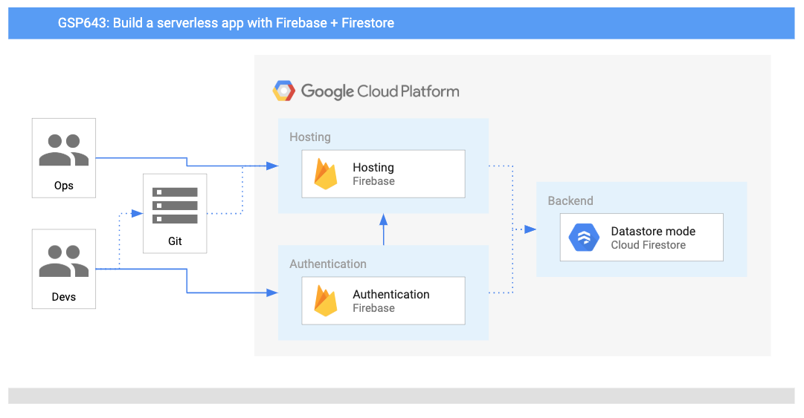

### 学習内容

このラボでは、次の方法について学びます。

- GCP プロジェクトで Firebase API を有効にする。
- Firebase プロジェクトを作成および構成する。
- サーバー側の認証と承認が自動化されるように Firestore セキュリティ ルールを構成する。
- Google ログインをウェブ アプリに追加する。
- ユーザーが連絡先情報を追加できるようにデータベースを構成する。
- ユーザーによる予約のスケジュールを可能にするコードを確認してデプロイする。
- ウェブアプリで Firebase のリアルタイム アップデートを確認する。

### Firebase 環境のプロビジョニング

Ruby と Patrick は、データベースの移行プロジェクトが成功した後、Firebase Hosting を使用して Pet Theory ウェブ開発チームを支援するタスクを課せられています。

Ruby は Patrick にメールを送りました。

**Ruby（ソフトウェア コンサルタント）**

> Patrick さん
>
> 先週はお疲れ様でした。クリニックのデータが Firestore に移行されたことを確認しました。
>
> 次のタスクは Firebase を使用して Pet Theory のウェブサイトをホストすることですね。

**Patrick（IT 管理者）**

> Ruby さん
>
> Firebase Hosting については聞いたことがありませんが、どのようなメリットがありますか？何から始めればよいですか？

**Ruby（ソフトウェア コンサルタント）**

> こんにちは、Patrick さん
>
> Firebase Hosting の主なメリットは、サーバーレスであるため、インフラストラクチャを管理しなくてよいことです。セキュリティ ルールもアプリケーション内に埋め込まれているため、アクセス許可を制限して、顧客データを処理する際の問題を最小限に抑えることができます。
>
>「従量課金制」料金モデルも用意されているので、Firebase は今回のユースケースに合った包括的なモバイル開発プラットフォームといえます。

**Patrick（IT 管理者）**

> Ruby さん
>
> Firebase を使用すると、セキュリティとインフラストラクチャの管理（私の仕事の大部分）がずっと簡単になるように思います。アイドル状態のサーバーには課金されないというのもいいですね。

Ruby は Patrick に背景情報を電子メールで送信し、重要な作業について検討するための打ち合わせを設定します。この打ち合わせで、Patrick は次のことを行う必要があることが分かりました。

- Google Cloud Firestore API を有効にする。
- Firestore CLI を GCP プロジェクトに追加する。
- Firebase プロジェクトを作成する。
- セキュリティ ポリシーを確立する。

次に、Patrick が行うこれらの作業をサポートしていきます。

### Google Cloud Firestore API を有効にして、Firestore データベースをセットアップする

1. ナビゲーション メニューを開き、[API とサービス] > [ライブラリ] を選択します。次に、検索ボックスで「Firestore」を検索し[Google Cloud Firestore API] をクリックします。
1. まだ有効になっていない場合は、[有効にする] をクリックします。コンソールには次のように表示されます。
  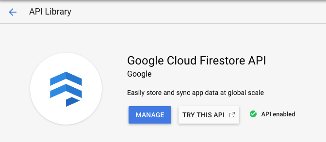
1. ナビゲーション メニューを開き、[Firestore] を選択します。
1. データを保存する場所を選択するように求められます。[ネイティブ モードを選択] をクリックします。
1. ロケーションとして [nam5 (United States)] を選択し、[データベースを作成] をクリックします。
1. データベースが初期化されると、同様のページが表示されます。
  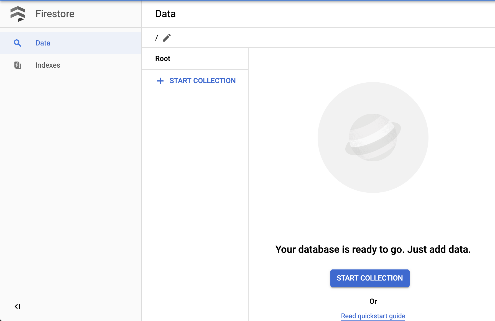

これで、Firestore プロジェクトを作成して GCP アカウントにリンクする準備ができました。

### Firebase プロジェクトを作成する

1. ブラウザで新しいタブを開き、[Firebase コンソール](https://console.firebase.google.com/) を開きます。

1. ページの右上隅にあるアカウント アイコンをクリックし、それがこのラボ用にプロビジョニングされている Qwiklabs 受講者アカウントであることを確認します。

1. [プロジェクトを追加] をクリックします。プロジェクト名の入力を求められたら、プルダウン メニューから Qwiklabs の GCP プロジェクト ID を選択します。

1. Firebase の利用規約に同意し、[続行] をクリックします。「従量課金制」料金プランを確認します。

1. [続行] をクリックし、次のページで Firebase プロジェクトの Google アナリティクスの選択を解除します。

1/ 次に、[Firebase を追加] をクリックします。新しいプロジェクトが準備できたというプロンプトが表示されたら、[続行] をクリックします。

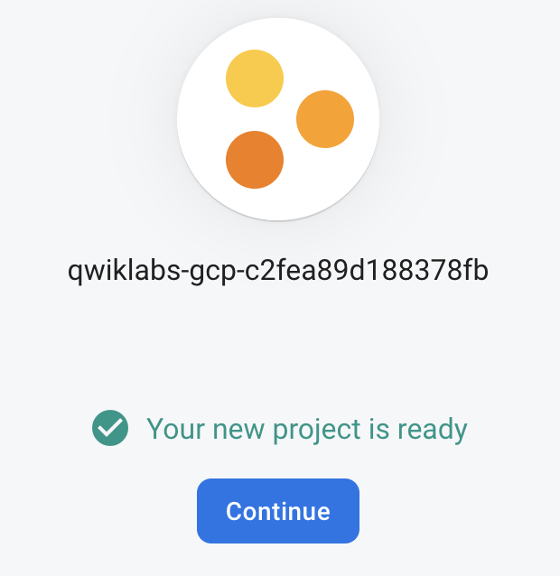

### アプリを登録する

最後の手順を完了すると、Firebase コンソールが表示されます。そのページを閉じた場合は、こちらにリンクがあります。

1. [アプリに Firebase を追加して始めましょう] の下に強調表示されるアイコンのリストから、ウェブアイコンを選択します。

    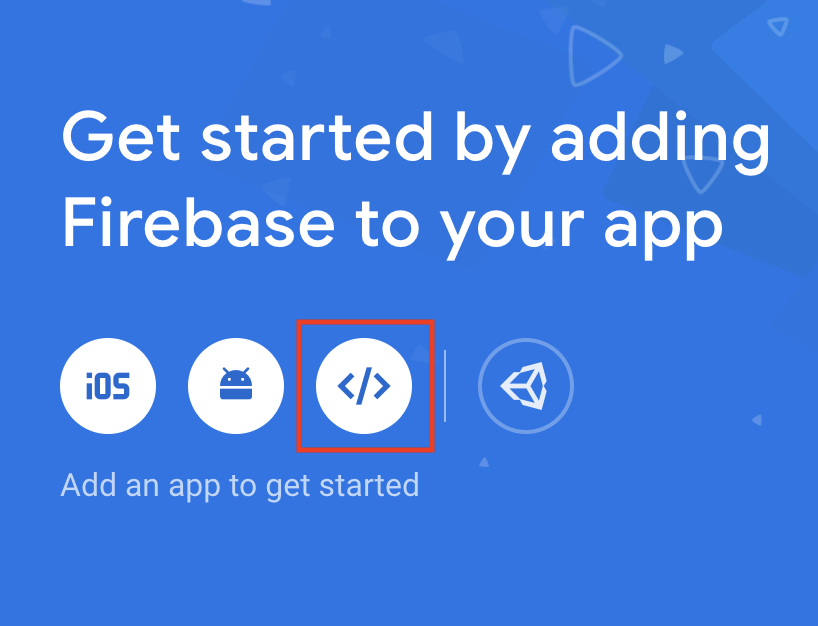

1. [アプリのニックネーム] の入力を求められたら、「Pet Theory」と入力します。

1. 次に、[このアプリの Firebase Hosting も設定します。] の横にあるチェックボックスをオンにします。

1. [アプリを登録] ボタンをクリックします。

1. [次へ] > [次へ] > [コンソールに進む] をクリックします。次のページが表示されます。

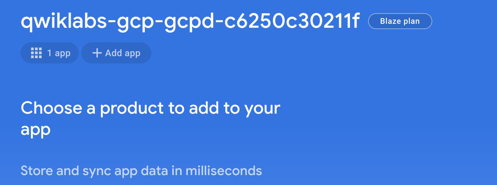

これで、プロジェクトの Firebase が構成されました。次に、Firebase Hosting を参照するようにプロジェクトを初期化します。

### Firebase CLI をインストールして Firebase Hosting にデプロイする

このステップでは GCP Console に戻ります。

1. Cloud Shell で次のコマンドを実行して、Pet Theory リポジトリのクローンを作成します。

    ```bash
    git clone https://github.com/rosera/pet-theory.git
    ```

1. 次に、現在の作業ディレクトリを変更します。

    ```bash
    cd pet-theory/lab02
    ```

1. Cloud Shell で次の npm コマンドを実行して新しいノードアプリを作成し、コマンドライン ツールである [Firebase CLI](https://firebase.google.com/docs/cli) をインストールします。

    ```bash
    npm init --yes
    npm install -g firebase-tools
    ```

    次のような出力が返されます。

    ```
    + firebase-tools@7.3.0
    added 3 packages from 11 contributors, removed 1 package and updated 8 packages in 79.808s
    ```

1. 次のコマンドを実行して、Google アカウントを Firebase にリンクします。

    ```bash
    firebase login --no-localhost
    ```

1. Firebase によるエラー報告情報の収集を許可するかどうかを尋ねられたら、「Y」と入力します。

1. 新しいブラウザタブで生成された URL をコピーして貼り付け、Enter キーを押します（リンクを直接クリックするとエラーが発生します）。

1. Qwiklabs の Google アカウントを選択し、[許可] をクリックします。その後、アクセスコードが付与されます。

    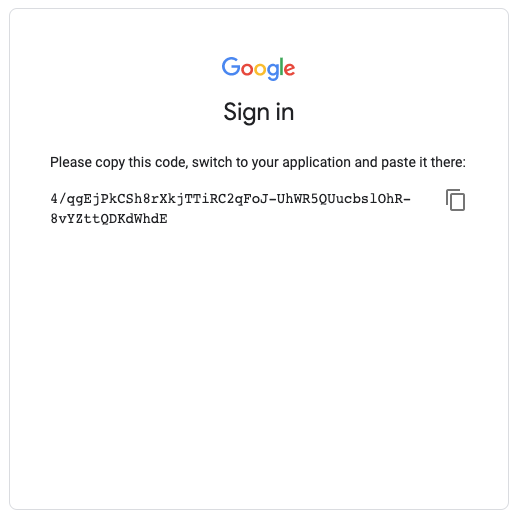

1. アクセスコードをコピーして Cloud Shell プロンプトに貼り付け、Enter キーを押します。次のような出力が返されます。

    ```
    ✔  Success! Logged in as gcpstaging86673_student@qwiklabs.net
    ```

1. 次のコマンドを実行して、プロジェクト リージョンを us-central に設定し、Firebase プロジェクトのリソースのロケーションと一致するようにします。

    ```bash
    gcloud config set compute/region us-central
    ```

1. ここで、現在の作業ディレクトリで新しい Firebase プロジェクトを初期化します。

    ```bash
    firebase init
    ```

    このコマンドを実行すると、プロジェクト ディレクトリと Firebase プロダクトを設定する手順が表示されます。

1. このフォルダに設定する Firebase CLI 機能を選択するよう求められます。矢印キーとスペースバーを使用して、[Firestore] と [Hosting] を選択します。シェルで次のように選択されていることを確認して、Enter キーを押します。

    ```
    ? Which Firebase CLI features do you want to set up for this folder? Press Space to select features, then Enter to confirm your choices.
    ◯ Database: Deploy Firebase Realtime Database Rules
    ◉ Firestore: Deploy rules and create indexes for Firestore
    ◯ Functions: Configure and deploy Cloud Functions
    ❯◉ Hosting: Configure and deploy Firebase Hosting sites
    ◯ Storage: Deploy Cloud Storage security rules
    ```

1. 次に、残りの手順を実行して Firebase を構成します。

- [Use an existing project] まで矢印キーを押して、Enter キーを押します。
- リストから Qwiklabs の GCP プロジェクト ID（「qwiklabs-gcp-」で始まる ID）を選択し、Enter キーを押します。
- Enter キーを押してから「N」と入力して、firestore.rules ファイルを保持します。
- Enter キーを押してから「Y」と入力して、firestore.indexes.json ファイルを保持します。
- Enter キーを押して public ディレクトリを保持し、次に「N」と入力して /index.html ファイルへの書き換えを禁止します。
- 404.html ファイルの上書きを確認するメッセージが表示されたら、「N」と入力します。
- index.html ファイルの上書きを確認するメッセージが表示されたら、「N」と入力します。

次の出力が表示されます。

```
✔  Wrote public/404.html
✔  Wrote public/index.html

i  Writing configuration info to firebase.json...
i  Writing project information to .firebaserc...
i  Writing gitignore file to .gitignore...

✔  Firebase initialization complete!
```

これでローカル設定が完了しました。次にサービス間のアクセスを実現するには、データベース認証ステップが必要です。

<details close>
<summary>ここまでのコマンドライン（抄）</summary>

```
student_02_6b3e2733526f@cloudshell:~/pet-theory/lab02 (qwiklabs-gcp-02-b036ff2b70bd)$ firebase init
     ######## #### ########  ######## ########     ###     ######  ########
     ##        ##  ##     ## ##       ##     ##  ##   ##  ##       ##
     ######    ##  ########  ######   ########  #########  ######  ######
     ##        ##  ##    ##  ##       ##     ## ##     ##       ## ##
     ##       #### ##     ## ######## ########  ##     ##  ######  ########
You're about to initialize a Firebase project in this directory:
  /home/student_02_6b3e2733526f/pet-theory/lab02
Before we get started, keep in mind:
  * You are initializing in an existing Firebase project directory
? Which Firebase CLI features do you want to set up for this folder? Press Space to select features, then Enter to confirm your choices. Firestore: Deploy rules and create indexes for Firestore, Hosting: Configure and deploy Fi
rebase Hosting sites
=== Project Setup
First, let's associate this project directory with a Firebase project.
You can create multiple project aliases by running firebase use --add,
but for now we'll just set up a default project.
? Please select an option: Use an existing project
? Select a default Firebase project for this directory: qwiklabs-gcp-02-b036ff2b70bd (qwiklabs-gcp-02-b036ff2b70bd)
i  Using project qwiklabs-gcp-02-b036ff2b70bd (qwiklabs-gcp-02-b036ff2b70bd)

=== Firestore Setup

Firestore Security Rules allow you to define how and when to allow
requests. You can keep these rules in your project directory
and publish them with firebase deploy.

? What file should be used for Firestore Rules? firestore.rules
? File firestore.rules already exists. Do you want to overwrite it with the Firestore Rules from the Firebase Console? No

Firestore indexes allow you to perform complex queries while
maintaining performance that scales with the size of the result
set. You can keep index definitions in your project directory
and publish them with firebase deploy.

? What file should be used for Firestore indexes? firestore.indexes.json
? File firestore.indexes.json already exists. Do you want to overwrite it with the Firestore Indexes from the Firebase Console? Yes

=== Hosting Setup

Your public directory is the folder (relative to your project directory) that
will contain Hosting assets to be uploaded with firebase deploy. If you
have a build process for your assets, use your build's output directory.

? What do you want to use as your public directory? public
? Configure as a single-page app (rewrite all urls to /index.html)? No
 File public/404.html already exists. Overwrite? No
i  Skipping write of public/404.html
? File public/index.html already exists. Overwrite? No
i  Skipping write of public/index.html

i  Writing configuration info to firebase.json...
i  Writing project information to .firebaserc...
i  Writing gitignore file to .gitignore...

✔  Firebase initialization complete!
```
</details>

### 認証とデータベースを設定する

このステップでは Firebase コンソールに戻ります。

1. 左側のナビゲーション メニューで [プロジェクトの概要] ボタンをクリックします。

1. [開発] ヘッダーの下で、[Authentication] を選択し、[ログイン方法を設定] ボタンをクリックします。

    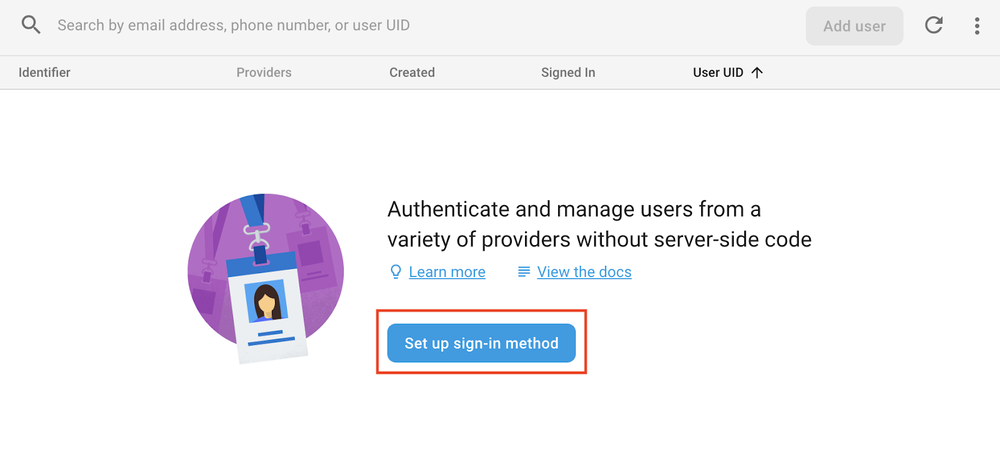

1. [ログイン プロバイダ] リストから、Google アイテムの横にある鉛筆アイコンをクリックします。

1. [プロジェクトのサポートメール] では、プルダウン リストから Qwiklabs に使用している Google アカウントを選択し、右上隅の [有効にする] 切り替えボタンをクリックします。ページは以下のようになります。

    

1. そちらを確認したら、[保存] ボタンをクリックします。
これで、Firestore 認証が設定されました。次のステップでは、Firebase でアプリケーションをホストする作業を行います。

### シナリオ: アプリケーションを設定する

ウェブ開発者がコードをデプロイできるように、Patrick が Firebase Hosting 環境をセットアップする作業をあなたはサポートしました。しかし、Patrick は Firebase 認証を有効にしたことも、コードを Firebase にデプロイしたこともないため、メールで Ruby にサポートを求めます...

**Patrick（IT 管理者）**

> Ruby さん
>
> ヒントをいただきありがとうございます。Firebase 環境はすべて設定できたようです。次のタスクは、ウェブ開発者によるコードのデプロイですね。
>
> コードのデプロイにはどのような作業がともなうのか、次に何をする必要があるか教えていただけませんか？

**Ruby（コンサルタント）**

> Patrick さん
>
> 環境を設定できたんですね。アプリケーションを実行して、次の機能を追加する方法をメールにてご説明します。
>
> - ログインする際のウェブ認証をセットアップする。
> - 顧客の詳細をプロフィール ページに記録できるようにする。
> - 予約用のセルフサービス ポータルを作成する。

**Patrick（DevOps エンジニア）**

> Ruby さん
>
> かなりの作業量になりそうですね。
>
> 新しい機能を追加するたびに構造を変更する必要があるということですか？確認するだけでも時間がかかりますが...

**Ruby（コンサルタント）**

> Patrick さん
>
> 面倒な作業のほとんどは Firebase ライブラリで行うことができます。
>
> ブラウザで更新内容を確認するのは、コマンドラインから `firebase deploy` を呼び出すだけでいいんです。
>
> 変更を加えてデプロイし、ウェブサイトで変更を確認してみてください。

**Patrick（IT 管理者）**

> Ruby さん
>
> それを聞いて安心しました。Firebase Hosting は性能がとても向上していますね。

必要な作業について Patrick の理解が深まったところで、あなたは Patrick が Pet Theory に Firebase アプリケーションをデプロイすることをサポートしていきます。

### Firestore 認証を構成し、ログインをウェブアプリに追加する

このステップでは GCP Console に戻ります。前の手順で Firebase を初期化した Cloud Shell セッションで、

1. 次のコマンドを実行して、lab02 ディレクトリ内のフォルダとファイルを一覧表示します。

    ```bash
    ls
    ```

    出力が次のようになることを確認します。

    ```
    firebase.json  firestore.indexes.json  firestore.rules  package.json  public  README.md  solution
    ```

    これらのファイルのうち一部を更新します。

1. Cloud Shell の上部にあるリボンからコード エディタを起動します。

    

1. 左側のメニューから、エディタで lab02/firestore.rules ファイルを開きます。ファイルの内容が、次のように表示されることを確認します。

    ```
    service cloud.firestore {
      match /databases/{database}/documents {
        match /customers/{email} {
          allow read, write: if request.auth.token.email == email;
        }
        match /customers/{email}/{document=**} {
          allow read, write: if request.auth.token.email == email;
        }
      }
    }
    ```

    これにより、各ユーザーが自分のデータのみにアクセスできるように Firestore データベースが構成されます。

1. 次に public フォルダを開き、index.html を選択してコード エディタで表示します。

### アプリケーションをデプロイする

1. 次のコマンドを実行して、`pet-theory/lab02/` ディレクトリにいることを確認します。

    ```bash
    cd pet-theory/lab02/
    ```

1. 次のコマンドを実行して、Firebase アプリケーションをデプロイします。

    ```bash
    firebase deploy
    ```

1. 次の出力が表示されます。

    ```
    ✔  Deploy complete!

    Project Console: https://console.firebase.google.com/project/qwiklabs-gcp-7d652f8cf1f91cce/overview
    Hosting URL: https://qwiklabs-gcp-7d652f8cf1f91cce.firebaseapp.com
    ```

1. ホスティング URL（[プロジェクト ID].firebaseapp.com のようになります）をコピーして、新しいタブで開きます。次に、[Google でログイン] ボタンをクリックします。

    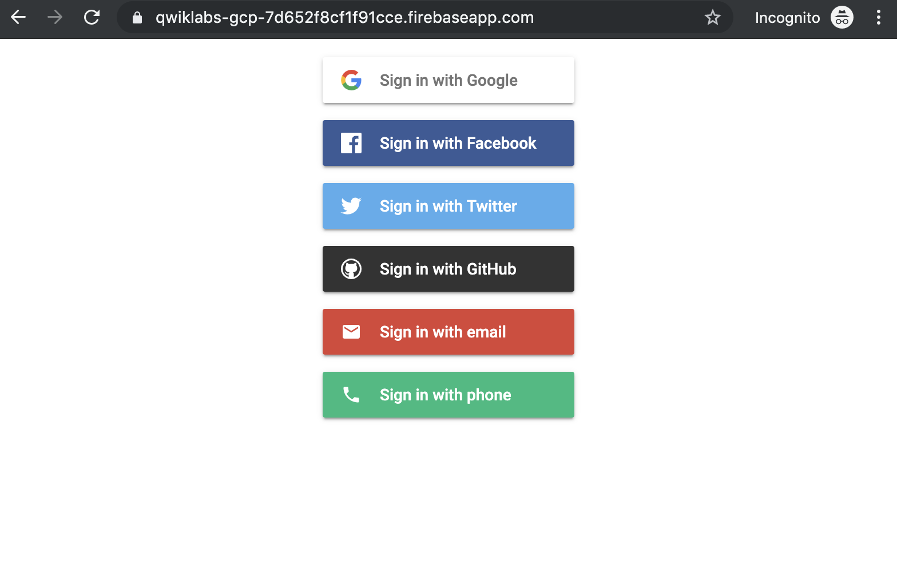

1. ご自分の Qwiklabs Google アカウントを選択します。次のようなページが表示されます。

    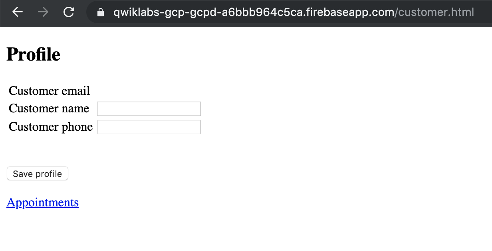

これで、ユーザーが Google 認証を使用して予約アプリにアクセスするためのコードがデプロイされました。

> 注: パスワードの管理は難しく、会社側のリスクを高める可能性があります。ユーザーも、別のユーザー ID やパスワードを作成することは望みません。Pet Theory のような小さな会社には、これを行うためのリソースや必要なスキルがありません。この場合、アプリケーション ユーザーが既存の Google アカウント（または他の ID プロバイダ）でログインできるようにする方が効率的です。

### ウェブアプリに顧客ページを追加する

1. コードエディタのタブに戻ります。次に、public ディレクトリにある 3 つのファイルを確認します。
1. サイドメニューから `customer.html` ファイルを開き、コードを確認します。
1. 次に、`customer.js` ファイルを開き、次のコードをコピーして貼り付けます。

    ```js
    let user;

    firebase.auth().onAuthStateChanged(function(newUser) {
      user = newUser;
      if (user) {
        const db = firebase.firestore();
        db.collection("customers").doc(user.email).onSnapshot(function(doc) {
          const cust = doc.data();
          if (cust) {
            document.getElementById('customerName').setAttribute('value', cust.name);
            document.getElementById('customerPhone').setAttribute('value', cust.phone);
          }
          document.getElementById('customerEmail').innerText = user.email;
        });
      }
    });

    document.getElementById('saveProfile').addEventListener('click', function(ev) {
      const db = firebase.firestore();
      var docRef = db.collection('customers').doc(user.email);
      docRef.set({
        name: document.getElementById('customerName').value,
        email: user.email,
        phone: document.getElementById('customerPhone').value,
      })
    })
    ```

1. 次に、styles.css ファイルを開き、次のコードを貼り付けます。

    ```css
    body { background: #ECEFF1; color: rgba(0,0,0,0.87); font-family: Roboto, Helvetica, Arial, sans-serif; margin: 0; padding: 0; }
    #message { background: white; max-width: 360px; margin: 100px auto 16px; padding: 32px 24px 16px; border-radius: 3px; }
    #message h3 { color: #888; font-weight: normal; font-size: 16px; margin: 16px 0 12px; }
    #message h2 { color: #ffa100; font-weight: bold; font-size: 16px; margin: 0 0 8px; }
    #message h1 { font-size: 22px; font-weight: 300; color: rgba(0,0,0,0.6); margin: 0 0 16px;}
    #message p { line-height: 140%; margin: 16px 0 24px; font-size: 14px; }
    #message a { display: block; text-align: center; background: #039be5; text-transform: uppercase; text-decoration: none; color: white; padding: 16px; border-radius: 4px; }
    #message, #message a { box-shadow: 0 1px 3px rgba(0,0,0,0.12), 0 1px 2px rgba(0,0,0,0.24); }
    #load { color: rgba(0,0,0,0.4); text-align: center; font-size: 13px; }
    @media (max-width: 600px) {
      body, #message { margin-top: 0; background: white; box-shadow: none; }
      body { border-top: 16px solid #ffa100; }
    }
    ```

1. 顧客ページが更新されたので、コンソールと Cloud Shell セッションに戻り、次のコマンドを実行してアプリケーションをデプロイします。

    ```bash
    firebase deploy
    ```

    次の出力が表示されます。

    ```
    ✔  Deploy complete!

    Project Console: https://console.firebase.google.com/project/qwiklabs-gcp-7d652f8cf1f91cce/overview
    Hosting URL: https://qwiklabs-gcp-7d652f8cf1f91cce.firebaseapp.com
    ```

1. アプリのタブに移動し、CMND + SHIFT + R（Mac の場合）または CTRL + SHIFT + R（Windows の場合）でページをハード再読み込みします。通常の更新だけでは、必要な更新内容は表示されません。いくつかの顧客情報を入力します。名前と電話番号を入力し、[プロフィールを保存] をクリックします。

1. Firebase コンソールに移動し、[Database] をクリックして、保存されたプロフィール情報を表示します。


1. ウェブアプリのページに戻り、[Appointments] リンクをクリックします。予約コードがまだデプロイされていないため、空白のページが表示されます。

### ユーザーが予約をスケジュールできるようにする

次に、ユーザーが予約をスケジュールできるページを作成します。

1. コードエディタのタブに戻ります。public ディレクトリの 2 つのファイルにコードを追加します。

1. サイドメニューから appointments.html を選択し、次のコードを貼り付けます。

    ```html
    <!DOCTYPE html>
    <html>
      <head>
        <meta charset="utf-8">
        <meta name="viewport" content="width=device-width, initial-scale=1">
        <title>Pet Theory appointments</title>
        <script src="/__/firebase/6.4.2/firebase-app.js"></script>
        <script src="/__/firebase/6.4.2/firebase-auth.js"></script>
        <script src="/__/firebase/6.4.2/firebase-firestore.js"></script>
        <script src="/__/firebase/init.js"></script>
        <link type="text/css" rel="stylesheet" href="styles.css" />
      </head>
      <body>
        <div id="message">
          <h2>Scheduled appointments</h2>
          <div id="appointments"></div>
          <hr/>
          <h2>Schedule a new appointment</h2>
          <select id="timeslots">
            <option value="0">Choose time</option>
          </select>
          <br><br>
          <button id="makeAppointment">Schedule</button>
        </div>
        <script src="appointments.js"></script>
      </body>
    </html>
    ```

1. appointments.js ファイルを開いて、次のコードを貼り付けます。

    ```js
    let user;

    firebase.auth().onAuthStateChanged(function(newUser) {
      user = newUser;
      if (user) {
        const db = firebase.firestore();
        const appColl = db.collection('customers').doc(user.email).collection('appointments');
        appColl.orderBy('time').onSnapshot(function(snapshot) {
          const div = document.getElementById('appointments');
          div.innerHTML = '';
          snapshot.docs.forEach(appointment => {
            div.innerHTML += formatDate(appointment.data().time) + '<br/>';
          })
          if (div.innerHTML == '') {
            div.innerHTML = 'No appointments scheduled';
          }
        });
      }
    });

    const timeslots = document.getElementById('timeslots');
    getOpenTimes().forEach(time => {
      timeslots.add(new Option(formatDate(time), time));
    });

    document.getElementById('makeAppointment').addEventListener('click', function(ev) {
      const millis = parseInt(timeslots.selectedOptions[0].value);
      if (millis > 0) {
        const db = firebase.firestore();
        db.collection('customers').doc(user.email).collection('appointments').add({
          time: millis
        })
        timeslots.remove(timeslots.selectedIndex);
      }
    })

    function getOpenTimes() {
      const retVal = [];
      let startDate = new Date();
      startDate.setMinutes(0);
      startDate.setSeconds(0);
      startDate.setMilliseconds(0);
      let millis = startDate.getTime();
      while (retVal.length < 5) {
        const hours = Math.floor(Math.random() * 5) + 1;
        millis += hours * 3600 * 1000;
        if (isDuringOfficeHours(millis)) {
          retVal.push(millis);
        }
      }
      return retVal;
    }

    function isDuringOfficeHours(millis) {
      const aDate = new Date(millis);
      return aDate.getDay() != 0 && aDate.getDay() != 6 &&
            aDate.getHours() >= 9 && aDate.getHours() <= 17;
    }

    function formatDate(millis) {
      const aDate = new Date(millis);
      const days = ['Sun', 'Mon', 'Tue', 'Wed', 'Thu', 'Fri', 'Sat'];
      const months = ['Jan', 'Feb', 'Mar', 'Apr', 'May', 'Jun',
                      'Jul', 'Aug', 'Sep', 'Oct', 'Nov', 'Dec'];
      return days[aDate.getDay()] + ' ' + aDate.getDate() + ' ' +
            months[aDate.getMonth()] + ', ' + aDate.getHours() + ':' +
            (aDate.getMinutes() < 10? '0'+aDate.getMinutes(): aDate.getMinutes());
    }
    ```

1. ファイルが作成されたので、変更を確認することができます。Cloud Shell で次のコマンドを実行して、アプリケーションをデプロイします。

    ```bash
    firebase deploy
    ```

    次の出力が表示されます。

    ```
    ✔  Deploy complete!

    Project Console: https://console.firebase.google.com/project/qwiklabs-gcp-7d652f8cf1f91cce/overview
    Hosting URL: https://qwiklabs-gcp-7d652f8cf1f91cce.firebaseapp.com
    ```

1. 以前に 404 エラー メッセージが表示された他のブラウザタブを更新します。予約をいくつかスケジュールしてください。

    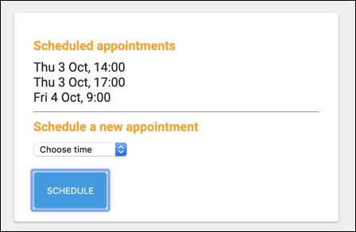

1. 次に、Firebase コンソールに移動し、[Database] をクリックして、ユーザーの中に作成した「appointments」コレクションを選択します。

1. 次のような予約コードのコレクションが表示されます。

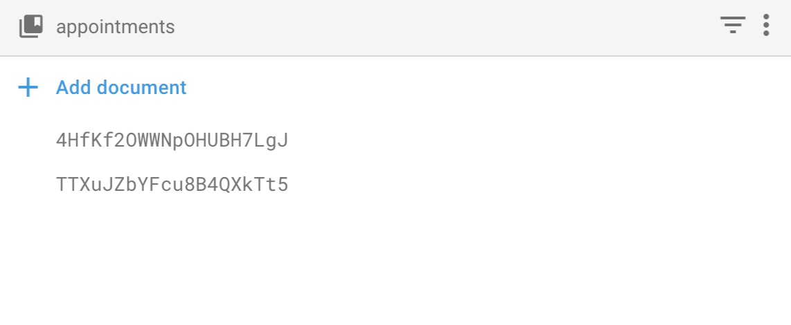

### Firestore のリアルタイム更新を確認する

1. 新しいブラウザタブを開き、[プロジェクト ID].firebaseapp.com をポイントしてから Google ボタンを使ってログインし、[Appointments] をクリックします。

1. 2 つのブラウザタブを並べて配置します。最初のブラウザ ウィンドウで、新しい予約をスケジュールします。

1. 次に、他のブラウザタブを確認します。更新しなくても、自動的に追加された予約が表示されます。

    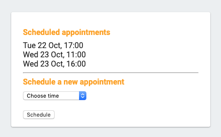

    正しく表示されました。Firestore では、クライアント（ウェブアプリとネイティブ モバイルアプリ）がリアルタイムで更新されるので、ユーザーが更新または再読み込みを行う必要はありません。

1. Firebase コンソールに移動し、[Database] をクリックして、データを編集します。ユーザー レコードに含まれる「appointments」コレクションを削除することもできます。どちらのブラウザ ウィンドウもリアルタイムで更新され続けます。

### まとめ

このラボでは、Firebase を使用して堅牢なサーバーレス ウェブ アプリケーションを作成しました。Firebase プロジェクトを作成して構成してから、サーバー側の認証と承認を自動化する Firestore セキュリティを追加しました。次に、Google ログインをウェブアプリに追加し、ユーザーが連絡先情報や予約を追加できるようにデータベースを構成しました。最後に、ユーザーによる予約とスケジュールを可能にするコードを確認してデプロイし、ウェブアプリで Firebase のリアルタイムの更新を確認しました。これで、この学習パスの他のラボを受講する準備が整いました。

**参考**

[Google Cloud - サーバーレスとは](https://cloud.google.com/serverless-options/)

## Cloud Run を使用して PDF ファイルを作成するサーバーレス アプリをビルドする

<h2 id="step2">概要</h2>
<p><a href="https://google.qwiklabs.com/quests/98">「GCP サーバーレス ワークショップ: Pet Theory」クエスト</a>のラボでは、架空のビジネス シナリオを読み、サーバーレス移行計画において登場人物をサポートしていきます。</p>
<p>Lily さんは 12 年前、獣医クリニック チェーン「Pet Theory」を開業しました。現在、Pet Theory では請求書を DOCX 形式でクライアントに送っていますが、ファイルを開けないという苦情が多く寄せられています。クライアント満足度の向上に向けて、Lily さんは IT 部門の Patrick さんに現状を改善するための代替案の調査を依頼しました。</p>
<p>運用チームのメンバーが 1 人しかいないため、望ましいのは運用中のメンテナンスに手間がかからないコスト効率の良いソリューションです。さまざまな選択肢を検討した結果、Patrick さんは <a href="https://cloud.google.com/run/">Cloud Run</a> を使用することにしました。</p>
<p>Cloud Run はサーバーレスであるため、すべてのインフラストラクチャ管理を抽象化し、オーバーヘッドを心配せずにアプリケーションのビルドに集中できます。しかも、Google サーバーレス プロダクトとして、使用しない場合はゼロにスケールできコストが発生しません。また、コンテナに基づくカスタム バイナリ パッケージを使用できるため、一貫性のある分離されたアーティファクトをビルドできるようになりました。</p>
<p>このラボでは、Cloud Storage に保存されているファイルを PDF に自動的に変換して別のフォルダに保存する機能を持つ、PDF コンバータ ウェブ アプリを Cloud Run 上でビルドします。</p>
<h3>アーキテクチャ</h3>
<p>この図は、使用するサービスの概要と、サービスが相互に接続する様子を示しています。</p>
<p></p>
<h3>学習内容</h3>
<p>このラボでは、次の方法について学びます。</p>
<ul>
<li>Node JS アプリケーションをコンテナに変換する。</li>
<li>Google Cloud Build でコンテナをビルドする。</li>
<li>クラウドでファイルを PDF ファイルに変換する Cloud Run サービスを作成する。</li>
<li>Google Cloud Storage でイベント処理を使用する。</li>
</ul>

<h2 id="step4">タスクについて</h2>
<p>Pet theory では、PDF に変換された請求書をクライアントが確実に開けるようにしたいと考えています。さらに、チームはこの変換を自動化して、オフィス マネージャーである Lisa さんの作業負荷を最小限に抑えたいと考えています。</p>
<p>Pet Theory のコンピュータ コンサルタントである Ruby さんは、IT 部門の Patrick さんから次のメッセージを受け取りました。</p>
<table>
<tr>
<td colspan="1" rowspan="1">
<p></p>
<p>Patrick さん（IT 管理者）<em></em></p>
</td>
<td colspan="1" rowspan="1">
<p>Ruby さん、お世話になっております。</p>
<p>こちらで調べてみたところ、さまざまなファイル形式を PDF に変換するには <a href="https://www.libreoffice.org/" target="blank">LibreOffice</a> が良さそうです。</p>
<p>サーバーのメンテナンスを行う必要なく、クラウドで LibreOffice を実行することは可能でしょうか？</p>
<p>Patrick</p>
</td>
</tr>
<tr>
<td colspan="1" rowspan="1">
<p>Ruby さん（ソフトウェア コンサルタント）<em></em></p>
</td>
<td colspan="1" rowspan="1">
<p>Patrick さん、ご連絡ありがとうございます。</p>
<p>そのようなご要望であれば、ぜひおすすめしたいものがあります。</p>
<p>Next 19 で発表された <a href="https://youtu.be/16vANkKxoAU?t=1317" target="blank">Cloud Run</a> です。YouTube の動画で視聴したのですが、サーバーレス環境で Cloud Run を使用して LibreOffice を実行できるようです。サーバーのメンテナンスも不要です。</p>
<p>設定に役立つリソースをいくつかお送りしますので、ご確認のほどよろしくお願いいたします。</p>
<p>Ruby</p>
</td>
</tr>
</table>
<p>Patrick さんが Cloud Run の設定とデプロイを行えるようサポートしましょう。</p>
<h2 id="step5">Cloud Run API を有効にする</h2>
<ol>
<li>
<p>ナビゲーション メニューを開き、[<strong>API とサービス</strong>] &gt; [<strong>ライブラリ</strong>] を選択します。検索バーに「Cloud Run」と入力し、検索結果のリストで Cloud Run API を選択します。</p>
</li>
<li>
<p>[<strong>有効にする</strong>] をクリックします。ブラウザの戻るボタンを 2 回<em></em>クリックすると、Cloud Platform Console は次のようになります。</p>
</li>
</ol>
<p></p>
<h2 id="step6">シンプルな Cloud Run サービスをデプロイする</h2>
<p>Ruby さんは開発した Cloud Run プロトタイプを、Patrick さんに GCP にデプロイしてもらいたいと思っています。ここで、Patrick さんが Pet Theory の PDF Cloud Run サービスを確立するのをサポートしましょう。</p>
<ol>
<li>
<p>新しい Cloud Shell セッションを開き、次のコマンドを実行して Pet Theory のリポジトリのクローンを作成します。</p>
</li>
</ol>
<pre><code>git clone https://github.com/rosera/pet-theory.git&#x000A;</code></pre>
<ol start="2">
<li>
<p>次に、現在の作業ディレクトリを lab03 に変更します。</p>
</li>
</ol>
<pre><code>cd pet-theory/lab03&#x000A;</code></pre>
<ol start="3">
<li>
<p>Cloud Shell コードエディタまたは任意のテキスト エディタで <code>package.json</code> を編集します。"scripts" セクションに以下のように <code>"start": "node index.js"</code> を追加します。</p>
</li>
</ol>
<pre><code>...&#x000A;&#x000A;"scripts": {&#x000A;    "start": "node index.js",&#x000A;    "test": "echo \"Error: no test specified\" &amp;&amp; exit 1"&#x000A;  },&#x000A;&#x000A;...&#x000A;</code></pre>
<ol start="4">
<li>次に、Cloud Shell で次のコマンドを実行して、変換スクリプトで使用するパッケージをインストールします。</li>
</ol>
<pre><code>npm install express&#x000A;npm install body-parser&#x000A;npm install child_process&#x000A;npm install @google-cloud/storage&#x000A;</code></pre>
<ol start="5">
<li>次に、<code>lab03 /index.js</code> ファイルを開いてコードを確認します。</li>
</ol>
<p>アプリケーションは、HTTP POST を受け入れる Cloud Run サービスとしてデプロイされます。POST リクエストがアップロードされたファイルに関する Pub/Sub 通知である場合、サービスはファイルの詳細をログに書き込みます。そうでない場合、サービスは単に文字列「OK」を返します。</p>
<ol start="6">
<li>
<code>lab03/Dockerfile</code> というファイルを確認します。</li>
</ol>
<p>上記のファイルはマニフェストと呼ばれ、Docker コマンドがイメージをビルドするためのレシピを提供します。各行は、Docker に次の情報の処理方法を指示するコマンドで始まります。</p>
<ul>
<li>
<p>最初のリストは、ベースイメージが、作成されるイメージのテンプレートとしてノード v12 を使用する必要があることを示しています。</p>
</li>
<li>
<p>最後の行は、実行するコマンドを示しています。この例では、"npm start" を参照しています。</p>
</li>
</ul>
<ol start="7">
<li>
<p>REST API をビルドしてデプロイするには、Google Cloud Build を使用します。次のコマンドを実行して、ビルドプロセスを開始します。</p>
</li>
</ol>
<pre><code>gcloud builds submit \&#x000A;  --tag gcr.io/$GOOGLE_CLOUD_PROJECT/pdf-converter&#x000A;</code></pre>
<p>このコマンドは、コードでコンテナをビルドし、プロジェクトの Container Registry にそのコンテナを配置します。</p>
<ol start="8">
<li>GCP Console に戻り、ナビゲーション メニューから [<strong>Container Registry</strong>] &gt; [<strong>イメージ</strong>] を選択します。ホストされているコンテナが表示されます。</li>
</ol>
<p></p>
<h3>完了したタスクをテストする</h3>
<p>[<strong>進行状況を確認</strong>] をクリックして、上記のタスクを実行したことを確認します。</p>
<ql-activity-tracking step="1">
    シンプルな REST API をビルドする
</ql-activity-tracking>
<ol start="9">
<li>
<p>コードエディタのタブに戻り、Cloud Shell で次のコマンドを実行してアプリケーションをデプロイします。</p>
</li>
</ol>
<pre><code>gcloud beta run deploy pdf-converter \&#x000A;  --image gcr.io/$GOOGLE_CLOUD_PROJECT/pdf-converter \&#x000A;  --platform managed \&#x000A;  --region us-central1 \&#x000A;  --no-allow-unauthenticated&#x000A;</code></pre>
<ol start="11">
<li>
<p>デプロイが完了すると、次のようなメッセージが表示されます。</p>
</li>
</ol>
<pre><code class="language-output prettyprint">Service [pdf-converter] revision [pdf-converter-00001] has been deployed and is serving 100 percent of traffic at https://pdf-converter-[hash].a.run.app&#x000A;</code></pre>
<ol start="12">
<li>
<p>アプリに簡単にアクセスできるように、アプリ用の環境変数 <code>$SERVICE_URL</code> を作成します。</p>
</li>
</ol>
<pre><code>SERVICE_URL=$(gcloud beta run services describe pdf-converter --platform managed --region us-central1 --format="value(status.url)")&#x000A;</code></pre>
<pre><code>echo $SERVICE_URL&#x000A;</code></pre>
<h3>完了したタスクをテストする</h3>
<p>[<strong>進行状況を確認</strong>] をクリックして、上記のタスクを実行したことを確認します。</p>
<ql-activity-tracking step="2">
    Cloud Run のリビジョンを作成する
</ql-activity-tracking>
<ol start="13">
<li>
<p>新しいサービスに匿名の POST リクエストを行います。</p>
</li>
</ol>
<pre><code>curl -X POST $SERVICE_URL&#x000A;</code></pre>
<p>これにより、「<code>Your client does not have permission to get the URL</code>」というエラー メッセージが表示されます。これは「匿名ユーザーはサービスを呼び出せない」ということですので、表示されても問題ありません。</p>
<ol start="14">
<li>
<p>次に、承認されたユーザーとしてサービスを呼び出してみます。</p>
</li>
</ol>
<pre><code>curl -X POST -H "Authorization: Bearer $(gcloud auth print-identity-token)" $SERVICE_URL&#x000A;</code></pre>
<p>「<code>OK</code>」という応答が得られれば、Cloud Run サービスは正常にデプロイされています。以上で終了です。</p>
<h2 id="step7">新しいファイルがアップロードされたときに Cloud Run サービスをトリガーする</h2>
<p>Cloud Run サービスが正常にデプロイされたので、Ruby さんは Patrick さんにデータを変換するためのステージング領域を作成してしてもらうことにします。Google Cloud Storage バケットは、イベント トリガーを使用して、ファイルがアップロードされて処理が必要になったときにアプリケーションに通知します。</p>
<ol>
<li>
<p>次のコマンドを実行して、アップロードされたドキュメント用のバケットを Cloud Storage に作成します。</p>
</li>
</ol>
<pre><code>gsutil mb gs://$GOOGLE_CLOUD_PROJECT-upload&#x000A;</code></pre>
<ol start="2">
<li>処理された PDF のための別のバケットを次のように作成します。</li>
</ol>
<pre><code>gsutil mb gs://$GOOGLE_CLOUD_PROJECT-processed&#x000A;</code></pre>
<ol start="3">
<li>
<p>次に GCP Console のタブに戻り、<strong>ナビゲーション メニュー</strong>を開いて、[<strong>Storage</strong>] を選択します。バケットが作成されたことを確認します（プラットフォームによって使用される他のバケットも確認できます）。</p>
</li>
</ol>
<h3>完了したタスクをテストする</h3>
<p>[<strong>進行状況を確認</strong>] をクリックして、上記のタスクを実行したことを確認します。</p>
<ql-activity-tracking step="3">
    2 つの Cloud Storage バケットを作成する
</ql-activity-tracking>
<ol start="4">
<li>
<p>Cloud Shell で次のコマンドを実行して、新しいファイルがドキュメント バケットへのアップロードを完了するたびに、Pub/Sub 通知を送信するように Cloud Storage に指示します。
</p>
</li>
</ol>
<pre><code>gsutil notification create -t new-doc -f json -e OBJECT_FINALIZE gs://$GOOGLE_CLOUD_PROJECT-upload&#x000A;</code></pre>
<p>通知にはトピック「new-doc」というラベルが付けられます。</p>
<h3>完了したタスクをテストする</h3>
<p>[<strong>進行状況を確認</strong>] をクリックして、上記のタスクを実行したことを確認します。</p>
<ql-activity-tracking step="4">
    ストレージ バケットからの通知を処理するための Pub/Sub トピックを作成する
</ql-activity-tracking>
<ol start="5">
<li>
<p>Pub/Sub が Cloud Run サービスをトリガーするために使用する新しいサービス アカウントを作成します。</p>
</li>
</ol>
<pre><code>gcloud iam service-accounts create pubsub-cloud-run-invoker --display-name "PubSub Cloud Run Invoker"&#x000A;</code></pre>
<ol start="6">
<li>
<p>新しいサービス アカウントに PDF コンバータ サービスを呼び出す権限を付与します。</p>
</li>
</ol>
<pre><code>gcloud beta run services add-iam-policy-binding pdf-converter --member=serviceAccount:pubsub-cloud-run-invoker@$GOOGLE_CLOUD_PROJECT.iam.gserviceaccount.com --role=roles/run.invoker --platform managed --region us-central1&#x000A;</code></pre>
<ol start="7">
<li>
<p>次のコマンドを実行して、プロジェクト番号を見つけます。</p>
</li>
</ol>
<pre><code>gcloud projects list&#x000A;</code></pre>
<p>名前が「qwiklabs-gcp-」で始まるプロジェクトを探します。プロジェクト番号の値は次のコマンドで使用します。</p>
<p></p>
<ol start="8">
<li>
<p>[project number] を最後のコマンドで取得したプロジェクト番号に置き換えて、<code>PROJECT_NUMBER</code> 環境変数を作成します。</p>
</li>
</ol>
<pre><code>PROJECT_NUMBER=[project number]&#x000A;</code></pre>
<ol start="9">
<li>
<p>プロジェクトで Cloud Pub/Sub 認証トークンを作成できるようにします。</p>
</li>
</ol>
<pre><code>gcloud projects add-iam-policy-binding $GOOGLE_CLOUD_PROJECT --member=serviceAccount:service-$PROJECT_NUMBER@gcp-sa-pubsub.iam.gserviceaccount.com --role=roles/iam.serviceAccountTokenCreator&#x000A;</code></pre>
<ol start="10">
<li>
<p>最後に、Pub/Sub サブスクリプションを作成して、トピック「new-doc」でメッセージが公開されるときはいつでも PDF コンバータを実行できるようにします。</p>
</li>
</ol>
<pre><code>gcloud beta pubsub subscriptions create pdf-conv-sub --topic new-doc --push-endpoint=$SERVICE_URL --push-auth-service-account=pubsub-cloud-run-invoker@$GOOGLE_CLOUD_PROJECT.iam.gserviceaccount.com&#x000A;</code></pre>
<h3>完了したタスクをテストする</h3>
<p>[<strong>進行状況を確認</strong>] をクリックして、上記のタスクを実行したことを確認します。</p>
<ql-activity-tracking step="5">
    Pub/Sub サブスクリプションを作成する
</ql-activity-tracking>
<h2 id="step8">ファイルが Cloud Storage にアップロードされたときに Cloud Run サービスがトリガーされるかを確認する</h2>
<p>Ruby さんは、アプリケーションが期待どおりに動作していることを確認するために、名前を付けたストレージ バケットにテストデータをアップロードして、Stackdriver Logging を確認するよう Patrick さんに依頼します。</p>
<ol>
<li>
<p>テストファイルをアップロード バケットにコピーします。</p>
</li>
</ol>
<pre><code>gsutil -m cp gs://spls/gsp644/* gs://$GOOGLE_CLOUD_PROJECT-upload&#x000A;</code></pre>
<ol start="2">
<li>
<p>アップロードが完了したら、GCP Console のタブに戻り、ナビゲーション メニューを開いて、[オペレーション] セクションの [<strong>Logging</strong>] を選択します。</p>
</li>
<li>
<p>最初のプルダウンで、[<strong>Cloud Run のリビジョン</strong>] を指定して結果をフィルタします。</p>
</li>
<li>
<p>ログ結果から、<code>file:</code> で始まるログエントリを探してクリックします。新しいファイルがアップロードされると、Pub/Sub が Cloud Run サービスに送信するファイルデータのダンプが表示されます。</p>
</li>
<li>
<p>このオブジェクトでアップロードしたファイルの名前を確認します。</p>
</li>
</ol>
<p></p>
<aside><b>注:</b>「file」で始まるログエントリが表示されない場合は、ページの下部にある [新しいログを読み込む] ボタンをクリックしてください。
</aside>
<ol start="6">
<li>
<p>次に、コードエディタのタブに戻り、Cloud Shell で次のコマンドを実行して、<code>upload</code> ディレクトリ内のファイルを削除し、ディレクトリをクリーンアップします。</p>
</li>
</ol>
<pre><code>gsutil -m rm gs://$GOOGLE_CLOUD_PROJECT-upload/*&#x000A;</code></pre>
<h2 id="step9">Docker コンテナ</h2>
<p>Patrick さんは、すべてのクライアントが請求書を開けるように請求書のバックログを PDF に変換する必要があります。そこで、メールで Ruby さんにサポートを求めることにしました。</p>
<table>
<tr>
<td colspan="1" rowspan="1">
<p></p>
<p>Patrick さん（IT 管理者）<em></em></p>
</td>
<td colspan="1" rowspan="1">
<p>Ruby さん、お世話になっております。</p>
<p>いただいた情報をもとにこのプロセスを自動化したうえで、PDF を請求書の形式として使用できるようにすることも可能だと思います。</p>
<p>昨日少し時間をかけてソリューションをコーディングし、必要なことを実行するための Node.js スクリプトを作成しました。ご確認いただけますか？</p>
<p>Patrick</p>
</td>
</tr>
</table>
<p>Patrick さんは、ファイルから PDF を生成するために作成した次のコード フラグメントを Ruby に送信します。</p>
<pre><code>const {promisify} = require('util');&#x000A;const exec        = promisify(require('child_process').exec);&#x000A;&#x000A;const cmd = 'libreoffice --headless --convert-to pdf --outdir ' +&#x000A;            `/tmp "/tmp/${fileName}"`;&#x000A;&#x000A;const { stdout, stderr } = await exec(cmd);&#x000A;if (stderr) {&#x000A;  throw stderr;&#x000A;}&#x000A;</code></pre>
<p>Ruby さんは Patrick さんに返事を書きます。</p>
<table>
<tr>
<td colspan="1" rowspan="1">
<p></p>
<p>Ruby さん（ソフトウェア コンサルタント）<em></em></p>
</td>
<td colspan="1" rowspan="1">
<p>Patrick さん、ご連絡ありがとうございます。</p>
<p>Cloud Run はコンテナを使用するため、その形式でアプリケーションを用意する必要があります。次のステップとしてアプリケーションの <a href="https://source.cloud.google.com/serverless-quest/labs/+/master:lab-3/Dockerfile?authuser=1" target="blank">Dockerfile マニフェスト</a>を作成してください。</p>
<p>作成したコードでは LibreOffice を使用します。そのソフトウェアをインストールするためのコマンドをお送りいただけますか？それをコンテナに含める必要があります。</p>
<p>Ruby</p>
</td>
</tr>
<tr>
<td colspan="1" rowspan="1">
<p></p>
<p>Patrick さん（IT 管理者）<em></em></p>
</td>
<td colspan="1" rowspan="1">
<p>Ruby さん、お世話になっております。</p>
<p>早速ありがとうございます。LibreOffice をオフィスのサーバーにインストールするのに、通常は以下のコマンドを使っています。</p>
<p><code>apt-get update -y &amp;&amp; apt-get install -y libreoffice &amp;&amp; apt-get clean</code></p>
<p>他にも必要な情報がありましたら、ご連絡ください。</p>
<p>Patrick</p>
</td>
</tr>
</table>
<p>コンテナをビルドするには、いくつかのコンポーネントを統合する必要があります。</p>
<p></p>
<h3>Docker コンテナを更新する</h3>
<p>すべてのファイルが特定されたら、Dockerfile を作成できます。Ruby さんがコンテナの設定とデプロイを行うのをサポートしましょう。</p>
<p>LibreOffice のパッケージはコンテナに含まれていなかったので、追加する必要があります。Patrick さんからアプリケーションのビルドに使用するコマンドが提供されましたが、Ruby さんはそのコマンドを Dockerfile 内に <code>RUN</code> コマンドとして追加します。</p>
<ol>
<li>
<p><code>Dockerfile</code> マニフェストを開き、コマンドライン <code>RUN apt-get update -y &amp;&amp; apt-get install -y libreoffice &amp;&amp; apt-get clean</code> を次のように追加します。</p>
</li>
</ol>
<pre><code>FROM node:12&#x000A;RUN apt-get update -y \&#x000A;    &amp;&amp; apt-get install -y libreoffice \&#x000A;    &amp;&amp; apt-get clean&#x000A;WORKDIR /usr/src/app&#x000A;COPY package.json package*.json ./&#x000A;RUN npm install --only=production&#x000A;COPY . .&#x000A;CMD [ "npm", "start" ]&#x000A;</code></pre>
<h3>新しいバージョンの PDF 変換サービスをデプロイする</h3>
<ol start="2">
<li>
<p><code>index.js</code> ファイルを開き、ファイルの先頭に次のパッケージ要件を追加します。</p>
</li>
</ol>
<pre><code>const {promisify} = require('util');&#x000A;const {Storage}   = require('@google-cloud/storage');&#x000A;const exec        = promisify(require('child_process').exec);&#x000A;const storage     = new Storage();&#x000A;</code></pre>
<ol start="3">
<li>
<p><code>app.post('/', async (req, res)</code> を次のコードに<strong>置き換えます</strong>。</p>
</li>
</ol>
<pre><code>app.post('/', async (req, res) =&gt; {&#x000A;  try {&#x000A;    const file = decodeBase64Json(req.body.message.data);&#x000A;    await downloadFile(file.bucket, file.name);&#x000A;    const pdfFileName = await convertFile(file.name);&#x000A;    await uploadFile(process.env.PDF_BUCKET, pdfFileName);&#x000A;    await deleteFile(file.bucket, file.name);&#x000A;  }&#x000A;  catch (ex) {&#x000A;    console.log(`Error: ${ex}`);&#x000A;  }&#x000A;  res.set('Content-Type', 'text/plain');&#x000A;  res.send('\n\nOK\n\n');&#x000A;})&#x000A;</code></pre>
<ol start="4">
<li>
<p>次に、LibreOffice ドキュメントを処理する次のコードをファイルの末尾に追加します。</p>
</li>
</ol>
<pre><code>async function downloadFile(bucketName, fileName) {&#x000A;  const options = {destination: `/tmp/${fileName}`};&#x000A;  await storage.bucket(bucketName).file(fileName).download(options);&#x000A;}&#x000A;&#x000A;async function convertFile(fileName) {&#x000A;  const cmd = 'libreoffice --headless --convert-to pdf --outdir /tmp ' +&#x000A;              `"/tmp/${fileName}"`;&#x000A;  console.log(cmd);&#x000A;  const { stdout, stderr } = await exec(cmd);&#x000A;  if (stderr) {&#x000A;    throw stderr;&#x000A;  }&#x000A;  console.log(stdout);&#x000A;  pdfFileName = fileName.replace(/\.\w+$/, '.pdf');&#x000A;  return pdfFileName;&#x000A;}&#x000A;&#x000A;async function deleteFile(bucketName, fileName) {&#x000A;  await storage.bucket(bucketName).file(fileName).delete();&#x000A;}&#x000A;&#x000A;async function uploadFile(bucketName, fileName) {&#x000A;  await storage.bucket(bucketName).upload(`/tmp/${fileName}`);&#x000A;}&#x000A;</code></pre>
<ol start="5">
<li>
<p><code>index.js</code> ファイルが次のようになっていることを確認します。</p>
</li>
</ol>
<pre><code class="language-javascript prettyprint">const {promisify} = require('util');&#x000A;const {Storage}   = require('@google-cloud/storage');&#x000A;const exec        = promisify(require('child_process').exec);&#x000A;const storage     = new Storage();&#x000A;const express     = require('express');&#x000A;const bodyParser  = require('body-parser');&#x000A;const app         = express();&#x000A;&#x000A;app.use(bodyParser.json());&#x000A;&#x000A;const port = process.env.PORT || 8080;&#x000A;app.listen(port, () =&gt; {&#x000A;  console.log('Listening on port', port);&#x000A;});&#x000A;&#x000A;app.post('/', async (req, res) =&gt; {&#x000A;  try {&#x000A;    const file = decodeBase64Json(req.body.message.data);&#x000A;    await downloadFile(file.bucket, file.name);&#x000A;    const pdfFileName = await convertFile(file.name);&#x000A;    await uploadFile(process.env.PDF_BUCKET, pdfFileName);&#x000A;    await deleteFile(file.bucket, file.name);&#x000A;  }&#x000A;  catch (ex) {&#x000A;    console.log(`Error: ${ex}`);&#x000A;  }&#x000A;  res.set('Content-Type', 'text/plain');&#x000A;  res.send('\n\nOK\n\n');&#x000A;})&#x000A;&#x000A;function decodeBase64Json(data) {&#x000A;  return JSON.parse(Buffer.from(data, 'base64').toString());&#x000A;}&#x000A;&#x000A;async function downloadFile(bucketName, fileName) {&#x000A;  const options = {destination: `/tmp/${fileName}`};&#x000A;  await storage.bucket(bucketName).file(fileName).download(options);&#x000A;}&#x000A;&#x000A;async function convertFile(fileName) {&#x000A;  const cmd = 'libreoffice --headless --convert-to pdf --outdir /tmp ' +&#x000A;              `"/tmp/${fileName}"`;&#x000A;  console.log(cmd);&#x000A;  const { stdout, stderr } = await exec(cmd);&#x000A;  if (stderr) {&#x000A;    throw stderr;&#x000A;  }&#x000A;  console.log(stdout);&#x000A;  pdfFileName = fileName.replace(/\.\w+$/, '.pdf');&#x000A;  return pdfFileName;&#x000A;}&#x000A;&#x000A;async function deleteFile(bucketName, fileName) {&#x000A;  await storage.bucket(bucketName).file(fileName).delete();&#x000A;}&#x000A;&#x000A;async function uploadFile(bucketName, fileName) {&#x000A;  await storage.bucket(bucketName).upload(`/tmp/${fileName}`);&#x000A;}&#x000A;</code></pre>
<ol start="6">
<li>
<p>メインロジックは次の関数に含まれています。</p>
</li>
</ol>
<pre><code class="language-javascript prettyprint">    const file = decodeBase64Json(req.body.message.data);&#x000A;    await downloadFile(file.bucket, file.name);&#x000A;    const pdfFileName = await convertFile(file.name);&#x000A;    await uploadFile(process.env.PDF_BUCKET, pdfFileName);&#x000A;    await deleteFile(file.bucket, file.name);&#x000A;</code></pre>
<p>ファイルがアップロードされるときはいつでも、このサービスがトリガーされます。上記の各行に 1 つずつ、次のタスクを実行します。</p>
<ul>
<li>Pub/Sub 通知からファイルの詳細を抽出します。</li>
<li>Cloud Storage からローカルのハードドライブにファイルをダウンロードします。これは実際には物理ディスクではなく、ディスクのように動作する仮想メモリのセクションです。</li>
<li>ダウンロードしたファイルを PDF に変換します。</li>
<li>PDF ファイルを Cloud Storage にアップロードします。環境変数 <code>process.env.PDF_BUCKET</code> には、PDF を書き込む Cloud Storage バケットの名前が含まれています。以下のサービスをデプロイするときに、この変数に値を割り当てます。</li>
<li>元のファイルを Cloud Storage から削除します。</li>
</ul>
<p><code>index.js</code> の残りの部分では、このトップレベルのコードによって呼び出される関数を実装します。</p>
<p>ここでサービスをデプロイし、<code>PDF_BUCKET</code> 環境変数を設定します。LibreOffice の処理用に、2 GB の RAM を指定することもおすすめします（<code>--memory</code> オプションのある行を参照）。</p>
<ol start="7">
<li>
<p>次のコマンドを実行してコンテナをビルドします。</p>
</li>
</ol>
<pre><code>gcloud builds submit \&#x000A;  --tag gcr.io/$GOOGLE_CLOUD_PROJECT/pdf-converter&#x000A;</code></pre>
<h3>完了したタスクをテストする</h3>
<p>[<strong>進行状況を確認</strong>] をクリックして、上記のタスクを実行したことを確認します。</p>
<ql-activity-tracking step="6">
    REST API 用の別のビルドを作成する
</ql-activity-tracking>
<ol start="8">
<li>
<p>最新バージョンのアプリケーションをデプロイします。</p>
</li>
</ol>
<pre><code>gcloud beta run deploy pdf-converter \&#x000A;  --image gcr.io/$GOOGLE_CLOUD_PROJECT/pdf-converter \&#x000A;  --platform managed \&#x000A;  --region us-central1 \&#x000A;  --memory=2Gi \&#x000A;  --no-allow-unauthenticated \&#x000A;  --set-env-vars PDF_BUCKET=$GOOGLE_CLOUD_PROJECT-processed&#x000A;</code></pre>
<p>コンテナの LibreOffice の部分があるため、このビルドには以前のビルドよりも時間がかかります。待ってる間、立ち上がってストレッチでもしましょう。</p>
<p>[<strong>進行状況を確認</strong>] をクリックして目的を確認します。</p>
<ql-activity-tracking step="7">
    新しいリビジョンを作成する
</ql-activity-tracking>
<h2 id="step10">PDF 変換サービスをテストする</h2>
<ol>
<li>
<p>デプロイ コマンドが完了したら、次のコマンドを実行して、サービスが正しくデプロイされたことを確認します。</p>
</li>
</ol>
<pre><code>curl -X POST -H "Authorization: Bearer $(gcloud auth print-identity-token)" $SERVICE_URL&#x000A;</code></pre>
<ol start="2">
<li>
<p>「<code>OK</code>」という応答が得られれば、更新された Cloud Run サービスは正常にデプロイされています。LibreOffice は、DOCX、XLSX、JPG、PNG、GIF などの多くのファイル形式を PDF に変換できます。</p>
</li>
<li>
<p>次のコマンドを実行して、いくつかのサンプル ファイルをアップロードします。</p>
</li>
</ol>
<pre><code>gsutil -m cp gs://spls/gsp644/* gs://$GOOGLE_CLOUD_PROJECT-upload&#x000A;</code></pre>
<ol start="4">
<li>
<p>GCP Console に戻り、<strong>ナビゲーション メニュー</strong>を開いて [<strong>Storage</strong>] を選択します。<code>-upload</code> バケットを開き、[<strong>バケットを更新</strong>] ボタンを数回クリックして、ファイルが PDF に変換されるときに、ファイルが 1 つずつ削除される様子を確認します。</p>
</li>
<li>
<p>次に、左側のメニューから [<strong>ブラウザ</strong>] をクリックし、名前が「-processed」で終わるバケットをクリックします。それらにはすべてのファイルの PDF バージョンが含まれています。PDF ファイルを開いて、適切に変換されていることを確認してください。</p>
</li>
</ol>
<p></p>
<h2 id="step11">お疲れさまでした</h2>
<p>Pet Theory で、元のファイルのアーカイブを PDF に変換するシステムが確立されました。元のファイルを「upload」バケットにアップロードするだけで、PDF コンバータ サービスで変換し、PDF として「processed」バケットに書き込みます。</p>

<h2 id="step2">概要</h2>
<p>「GCP サーバーレス ワークショップ: Pet Theory」クエストのラボでは、架空のビジネス シナリオの登場人物を支援してサーバーレスへの移行計画を進めていきます。</p>
<p>Lily さんは 12 年前、獣医クリニック チェーン「Pet Theory」を開業しました。年を追うごとにクリニックの数は増え続け、自動化が必要になりました。Pet Theory では、試験室から戻ってきた医学的検査の結果の処理に時間がかかっており、ミスも増えているので、Lily さんはこの状態を改善したいと思っています。</p>
<p>現在、Pet Theory の IT 管理者である Patrick さんは手作業で検査結果を処理しています。検査結果が戻ってくると、検査したペットの飼い主にメールを作成して送信します。その後、スマートフォンでテキスト メッセージを打ち、テキストとして結果を飼い主に送っています。</p>
<p>Patrick さんはソフトウェア コンサルタントの Ruby さんと協力し、よりスケーラブルなシステムを設計しようとしています。多くの継続的なメンテナンスを必要としないソリューションを構築したいと考えた Patrick さんと Ruby さんは、サーバーレス テクノロジーを採用することにしました。</p>

<p>Pet Theory では、飼い主に検査結果を伝えるプロセスを自動化したいと考えています。増え続ける予約件数に対応するのが難しくなっていたので、Lily さんは Ruby さんに助けを求めることにしました。</p>
<table>
<tr>
<td colspan="1" rowspan="1">
<p></p>
<p>Lily さん（Pet Theory の創設者）<em></em></p>
</td>
<td colspan="1" rowspan="1">
<p>Ruby さん、お世話になっております。</p>
<p>先日は保険ポータルを整理していただきありがとうございました。</p>
<p>さて、この度は医学的検査の結果についてお手伝いいただけないかと考えています。もっと効率的に飼い主さんに結果を送りたいのです。</p>
<p>Lily</p>
</td>
</tr>
<tr>
<td colspan="1" rowspan="1">
<p></p>
<p>Ruby さん（ソフトウェア コンサルタント）<em></em></p>
</td>
<td colspan="1" rowspan="1">
<p>Lily さん、ご連絡ありがとうございます。</p>
<p>わかりました。現状を改善できそうなアイデアがいくつかありますので、検討したいと思います。</p>
<p>Ruby</p>
</td>
</tr>
</table>
<h2 id="step4">アーキテクチャ</h2>
<p>Pet Theory では、外部の検査会社で医学的検査を実施しています。検査会社で医学的検査が終わると、結果が Pet Theory に送られます。</p>
<p>検査会社では、HTTP(S) POST を使用して Pet Theory のウェブ エンドポイントに接続し、医学的検査の結果を送信しています。次の図に、全般的なアーキテクチャの概要を示します。</p>
<p></p>
<p>Ruby さんは、既存のプロセス全体を確認し、以下の処理を実行するシステムを設計できると考えました。</p>
<ol>
<li>HTTP POST リクエストを受信し、受信確認を検査の試験室に送ります。</li>
<li>飼い主に検査結果をメールで送ります。</li>
<li>飼い主に検査結果をテキスト メッセージ（SMS）とメールで送ります。</li>
</ol>
<p>Ruby さんは上記の各アクティビティを分離する設計にしたため、以下の要素が必要になりました。</p>
<ul>
<li>検査結果のリクエストとレスポンスを実行するサービス</li>
<li>飼い主に検査結果をメールで送るサービス</li>
<li>飼い主にテキスト メッセージ（SMS）を送るサービス</li>
<li>サービス間の通信に使用する Pub/Sub</li>
<li>アプリケーション アーキテクチャとして使用するサーバーレス インフラストラクチャ</li>
</ul>
<p>Ruby さんは、単一用途のファンクションを使用することで、記述しやすくバグの少ないコードの開発を目指しています。</p>
<table>
<tr>
<td colspan="1" rowspan="1">
<p></p>
<p>Ruby さん（ソフトウェア コンサルタント）<em></em></p>
</td>
<td colspan="1" rowspan="1">
<p>Patrick さん、お世話になっております。</p>
<p>Lily さんから検査記録を処理するプロトタイプを作成するよう依頼がありました。</p>
<p>まず、<code>new-lab-report</code> という名前の Pub/Sub トピックを設定していただけますでしょうか。
</p>
<p>Ruby</p>
</td>
</tr>
<tr>
<td colspan="1" rowspan="1">
<p></p>
<p>Patrick さん（IT 管理者）<em></em></p>
</td>
<td colspan="1" rowspan="1">
<p>Ruby さん、ご連絡ありがとうございます。</p>
<p>素晴らしいプロジェクトですね。どちらも GCP ですぐに設定できる作業ですので、今朝のうちに終わらせようと思います。</p>
<p>Patrick</p>
</td>
</tr>
</table>
<h3><strong>Pub/Sub トピックの作成</strong></h3>
<p>Patrick さんが <code>new-lab-report</code> という Pub/Sub トピックを作成するお手伝いをしましょう。</p>
<p></p>
<p>サービスが Pub/Sub メッセージをパブリッシュする際、メッセージにトピックをタグ付けする必要があります。ここで作成されるサービスが、検査報告書を取得し、見つかった各報告書に対してメッセージをパブリッシュします。</p>
<p>まず、このタスクで使用するトピックを作成する必要があります。</p>
<p>次のコマンドを実行して、Pub/Sub トピックを作成します。</p>
<pre><code>gcloud pubsub topics create new-lab-report&#x000A;</code></pre>
<p>トピック「new-lab-report」にサブスクライブした任意のサービスは、検査報告書サービスがパブリッシュするメッセージを取得することができます。上記の図には、このようにメッセージを取得するサービスとして、メールサービスと SMS サービスの 2 つが示されています。</p>
<p>その後、クラウドでコードを実行する Cloud Run を有効にします。</p>
<pre><code>gcloud services enable run.googleapis.com&#x000A;</code></pre>
<p>[<strong>進行状況を確認</strong>] をクリックして、目標に沿って進んでいることを確認します。</p>
<ql-activity-tracking step="1">
    Pub/Sub トピックの作成
</ql-activity-tracking>
<p>Pub/Sub トピックの準備ができたことを Ruby さんに伝えましょう。</p>
<table>
<tr>
<td colspan="1" rowspan="1">
<p></p>
<p>Patrick さん（IT 管理者）<em></em></p>
</td>
<td colspan="1" rowspan="1">
<p>Ruby さん、お世話になっております。</p>
<p>作業が終わりました。</p>
<p>お手数でなければ、このプロトタイプがどのような形になるか知りたいです。一緒に作業していただくことはできますか。</p>
<p>Patrick</p>
</td>
</tr>
<tr>
<td colspan="1" rowspan="1">
<p></p>
<p>Ruby さん（ソフトウェア コンサルタント）<em></em></p>
</td>
<td colspan="1" rowspan="1">
<p>Patrick さん、ご連絡ありがとうございます。</p>
<p>迅速に対応していただきありがとうございました。時間を作りますので、一緒に作成作業を進めましょう。</p>
<p>Ruby</p>
</td>
</tr>
</table>
<h2 id="step5">検査報告書サービスのビルド</h2>
<p>Ruby さんが新しい検査報告書サービスを設定するお手伝いをしましょう。</p>
<p></p>
<p>このサービスはプロトタイピング用なので、2 つの機能のみを持ちます。</p>
<ol>
<li>
<p>報告書のデータを含む検査報告書の HTTPS POST を受信する</p>
</li>
<li>
<p>Pub/Sub にメッセージをパブリッシュする</p>
</li>
</ol>
<h3><strong>検査報告書サービス用のコードの追加</strong></h3>
<p>Cloud Shell に戻り、このラボに必要なリポジトリのクローンを作成します。</p>
<pre><code>git clone https://github.com/rosera/pet-theory.git&#x000A;</code></pre>
<p><code>lab-service</code> ディレクトリに移動します。</p>
<pre><code>cd pet-theory/lab05/lab-service&#x000A;</code></pre>
<p>HTTPS リクエストを受信し、Pub/Sub にパブリッシュするのに必要な以下のパッケージをインストールします。</p>
<pre><code>npm install express&#x000A;npm install body-parser&#x000A;npm install @google-cloud/pubsub&#x000A;</code></pre>
<p>これらのコマンドは <code>package.json</code> ファイルを更新し、このサービスに必要な依存関係を指定します。</p>
<p>Cloud Run にコードをどのように開始するかを指示できるよう、<code>package.json</code> ファイルを編集します。</p>
<p><code>package.json</code> ファイルを開きます。</p>
<p>scripts セクションに以下のように <code>"start": "node index.js"</code> の行を追加して、ファイルを保存します。</p>
<pre><code>  "scripts": {&#x000A;    "start": "node index.js",&#x000A;    "test": "echo \"Error: no test specified\" &amp;&amp; exit 1"&#x000A;  },&#x000A;</code></pre>
<p><code>index.js</code> という名前の新しいファイルを作成して、次のコードを追加します。</p>
<pre><code>const {PubSub} = require('@google-cloud/pubsub');&#x000A;const pubsub = new PubSub();&#x000A;const express = require('express');&#x000A;const app = express();&#x000A;const bodyParser = require('body-parser');&#x000A;app.use(bodyParser.json());&#x000A;const port = process.env.PORT || 8080;&#x000A;&#x000A;app.listen(port, () =&gt; {&#x000A;  console.log('Listening on port', port);&#x000A;});&#x000A;&#x000A;app.post('/', async (req, res) =&gt; {&#x000A;  try {&#x000A;    const labReport = req.body;&#x000A;    await publishPubSubMessage(labReport);&#x000A;    res.status(204).send();&#x000A;  }&#x000A;  catch (ex) {&#x000A;    console.log(ex);&#x000A;    res.status(500).send(ex);&#x000A;  }&#x000A;})&#x000A;&#x000A;async function publishPubSubMessage(labReport) {&#x000A;  const buffer = Buffer.from(JSON.stringify(labReport));&#x000A;  await pubsub.topic('new-lab-report').publish(buffer);&#x000A;}&#x000A;</code></pre>
<p>このコードの中核となるのは以下の部分です。</p>
<pre><code>    const labReport = req.body;&#x000A;    await publishPubSubMessage(labReport);&#x000A;</code></pre>
<p>これら 2 つの行で、サービスの主な処理が以下のとおり行われます。</p>
<ol>
<li>POST リクエストから検査報告書を抽出します。</li>
<li>新たに POST で送信された検査報告書を含む Pub/Sub メッセージをパブリッシュします。</li>
</ol>
<p>次に、<code>Dockerfile</code> という名前のファイルを作成して、以下のコードを追加します。</p>
<pre><code>FROM node:10&#x000A;WORKDIR /usr/src/app&#x000A;COPY package.json package*.json ./&#x000A;RUN npm install --only=production&#x000A;COPY . .&#x000A;CMD [ "npm", "start" ]&#x000A;</code></pre>
<p>このファイルで、Cloud Run サービスをコンテナにパッケージ化する方法を定義します。</p>
<h3><strong>lab-report-service のデプロイ</strong></h3>
<p><code>deploy.sh</code> という名前のスクリプトを作成して、次のコマンドを貼り付けます。</p>
<pre><code>gcloud builds submit \&#x000A;  --tag gcr.io/$GOOGLE_CLOUD_PROJECT/lab-report-service&#x000A;gcloud run deploy lab-report-service \&#x000A;  --image gcr.io/$GOOGLE_CLOUD_PROJECT/lab-report-service \&#x000A;  --platform managed \&#x000A;  --region us-central1 \&#x000A;  --allow-unauthenticated&#x000A;</code></pre>
<p>以下のコマンドを実行して、このファイルを実行可能にします。</p>
<pre><code>chmod u+x deploy.sh&#x000A;</code></pre>
<p>では、検査報告書サービスをデプロイします。次のようにデプロイ スクリプトを実行します。</p>
<pre><code>./deploy.sh&#x000A;</code></pre>
<p>タイミングにより、このコマンドを最初に実行したときにエラーが表示される場合があります。その場合は、<code>deploy.sh</code> を再実行します。</p>
<p>デプロイが正常に完了したら、以下のようなメッセージが表示されます。</p>
<pre><code>Service [lab-report-service] revision [lab-report-service-00001] has been deployed and is serving traffic at https://lab-report-service-[hash].a.run.app&#x000A;</code></pre>
<p>検査報告書サービスがデプロイされ、HTTP 経由で医学的検査の結果を取得できるようになりました。これで、新しいサービスが稼働しているかをテストできます。</p>
<p>[<strong>進行状況を確認</strong>] をクリックして、目標に沿って進んでいることを確認します。</p>
<ql-activity-tracking step="2">
検査報告書サービスのデプロイ
</ql-activity-tracking>
<p>[<strong>進行状況を確認</strong>] をクリックして、目標に沿って進んでいることを確認します。</p>
<ql-activity-tracking step="3">
検査報告書サービスのデプロイ: リビジョンの作成
</ql-activity-tracking>
<h3><strong>検査報告書サービスのテスト</strong></h3>
<p>検査報告書サービスを検証するために、検査会社から送信される 3 件の HTTPS POST をシミュレートします。これら 3 件の POST には、それぞれ 1 つの検査報告書が含まれています。テストのために、作成する検査報告書には ID のみを含めます。</p>
<p>まず、検査報告書サービスへの URL を環境変数に設定し、使用しやすくします。</p>
<pre><code>export LAB_REPORT_SERVICE_URL=$(gcloud run services describe lab-report-service --platform managed --region us-central1 --format="value(status.address.url)")&#x000A;</code></pre>
<p>LAB_REPORT_SERVICE_URL が正しく取得されたことを確認します。</p>
<pre><code>echo $LAB_REPORT_SERVICE_URL&#x000A;</code></pre>
<p><code>post-reports.sh</code> という名前の新しいファイルを作成して、以下のコードを追加します。</p>
<pre><code>curl -X POST \&#x000A;  -H "Content-Type: application/json" \&#x000A;  -d "{\"id\": 12}" \&#x000A;  $LAB_REPORT_SERVICE_URL &amp;&#x000A;curl -X POST \&#x000A;  -H "Content-Type: application/json" \&#x000A;  -d "{\"id\": 34}" \&#x000A;  $LAB_REPORT_SERVICE_URL &amp;&#x000A;curl -X POST \&#x000A;  -H "Content-Type: application/json" \&#x000A;  -d "{\"id\": 56}" \&#x000A;  $LAB_REPORT_SERVICE_URL &amp;&#x000A;</code></pre>
<p>上記のスクリプトでは、<code>curl</code> コマンドを使用して、検査報告書サービスの URL に 3 つの異なる ID を POST で送信します。各コマンドはバックグラウンドで個別に実行されます。</p>
<p><code>post-reports.sh</code> スクリプトを実行可能にします。</p>
<pre><code>chmod u+x post-reports.sh&#x000A;</code></pre>
<p>上記のスクリプトを使用して 3 件の検査報告書を POST で送信し、検査報告書サービスのエンドポイントをテストします。</p>
<pre><code>./post-reports.sh&#x000A;</code></pre>
<p>このスクリプトによって、検査報告書サービスに 3 件の検査報告書が POST で送信されました。ログで結果を確認します。</p>
<p><strong>ナビゲーション メニュー</strong>で [<strong>Cloud Run</strong>] をクリックします。</p>
<p></p>
<p>新しくデプロイした <strong>lab-report-service</strong> が表示されたら、これをクリックします。</p>
<p></p>
<p>次のページに、lab-report-service の詳細が表示されます。[<strong>ログ</strong>] タブをクリックします。</p>
<p></p>
<p>[ログ] ページには、先ほどスクリプトを使用して POST で送信した 3 件の検査報告書の結果が表示されます。以下のように、OK を意味する HTTP コード 204（No Content）が返されると成功です。エントリが表示されない場合は、右側にあるスクロールバーを上下に動かします。これにより、ログが再読み込みされます。</p>
<p></p>
<p>次に、SMS とメールのサービスを記述します。これらのサービスは、検査報告書サービスが「new-lab-report」トピックに Pub/Sub メッセージをパブリッシュしたときにトリガーされます。</p>
<h2 id="step6">メールサービス</h2>
<p>Ruby さんが新しいメールサービスを設定するお手伝いをしましょう。</p>
<p></p>
<h3><strong>メールサービス用のコードの追加</strong></h3>
<p>メールサービスのディレクトリに移動します。</p>
<pre><code>cd ~/pet-theory/lab05/email-service&#x000A;</code></pre>
<p>受信する HTTPS リクエストをコードで処理できるように、以下のパッケージをインストールします。</p>
<pre><code>npm install express&#x000A;npm install body-parser&#x000A;</code></pre>
<p>上記のコマンドで、アプリとその依存関係を記述する <code>package.json</code> ファイルを更新します。<code>start</code> 命令を追加して Cloud Run にコードの実行方法を指示します。</p>
<p><code>package.json</code> ファイルを開きます。</p>
<p>scripts セクションに以下のように <code>"start": "node index.js"</code> の行を追加して、ファイルを保存します。</p>
<pre><code>  "scripts": {&#x000A;    "start": "node index.js",&#x000A;    "test": "echo \"Error: no test specified\" &amp;&amp; exit 1"&#x000A;  },&#x000A;</code></pre>
<p><code>index.js</code> という名前の新しいファイルを作成して、以下のコードを追加します。</p>
<pre><code>const express = require('express');&#x000A;const app = express();&#x000A;const bodyParser = require('body-parser');&#x000A;app.use(bodyParser.json());&#x000A;&#x000A;const port = process.env.PORT || 8080;&#x000A;app.listen(port, () =&gt; {&#x000A;  console.log('Listening on port', port);&#x000A;});&#x000A;&#x000A;app.post('/', async (req, res) =&gt; {&#x000A;  const labReport = decodeBase64Json(req.body.message.data);&#x000A;  try {&#x000A;    console.log(`Email Service: Report ${labReport.id} trying...`);&#x000A;    sendEmail();&#x000A;    console.log(`Email Service: Report ${labReport.id} success :-)`);&#x000A;    res.status(204).send();&#x000A;  }&#x000A;  catch (ex) {&#x000A;    console.log(`Email Service: Report ${labReport.id} failure: ${ex}`);&#x000A;    res.status(500).send();&#x000A;  }&#x000A;})&#x000A;&#x000A;function decodeBase64Json(data) {&#x000A;  return JSON.parse(Buffer.from(data, 'base64').toString());&#x000A;}&#x000A;&#x000A;function sendEmail() {&#x000A;  console.log('Sending email');&#x000A;}&#x000A;</code></pre>
<p>このコードは、Pub/Sub がメッセージをサービスにパブリッシュしたときに実行され、以下の処理を行います。</p>
<ul>
<li>Pub/Sub メッセージを解読し、<code>sendEmail()</code> 関数の呼び出しを試みます。</li>
<li>呼び出しに成功し、例外がスローされなければ、ステータス コード 204 を返し、メッセージが処理されたことを Pub/Sub に通知します。</li>
<li>例外が発生した場合、サービスはステータス コード 500 を返し、メッセージが処理されなかったことを Pub/Sub に通知します。Pub/Sub は、後でサービスにもう一度メッセージを配信する必要があります。</li>
</ul>
<p>サービス間の通信が正常に動作していることを確認した後、Ruby さんは <code>sendEmail()</code> 関数にコードを追加して、実際にメールを送信します。</p>
<p>次に、Dockerfile という名前のファイルを作成して、以下のコードを追加します。</p>
<pre><code>FROM node:10&#x000A;WORKDIR /usr/src/app&#x000A;COPY package.json package*.json ./&#x000A;RUN npm install --only=production&#x000A;COPY . .&#x000A;CMD [ "npm", "start" ]&#x000A;</code></pre>
<p>このファイルで、Cloud Run サービスをコンテナにパッケージ化する方法を定義します。</p>
<h3><strong>メールサービスのデプロイ</strong></h3>
<p><code>deploy.sh</code> という名前の新しいファイルを作成して、以下のコードを追加します。</p>
<pre><code>gcloud builds submit \&#x000A;  --tag gcr.io/$GOOGLE_CLOUD_PROJECT/email-service&#x000A;&#x000A;gcloud run deploy email-service \&#x000A;  --image gcr.io/$GOOGLE_CLOUD_PROJECT/email-service \&#x000A;  --platform managed \&#x000A;  --region us-central1 \&#x000A;  --no-allow-unauthenticated&#x000A;</code></pre>
<p><code>deploy.sh</code> を実行可能にします。</p>
<pre><code>chmod u+x deploy.sh&#x000A;</code></pre>
<p>メールサービスをデプロイします。</p>
<pre><code>./deploy.sh&#x000A;</code></pre>
<p>デプロイが完了したら、以下のようなメッセージが表示されます。</p>
<pre><code>Service [email-service] revision [email-service-00001] has been deployed and is serving traffic at https://email-service-[hash].a.run.app&#x000A;</code></pre>
<p>サービスが正常にデプロイされました。Pub/Sub メッセージが配信されたときにメールサービスがトリガーされることを確認する必要があります。</p>
<p>[<strong>進行状況を確認</strong>] をクリックして、目標に沿って進んでいることを確認します。</p>
<ql-activity-tracking step="4">
メールサービスのデプロイ: ビルド
</ql-activity-tracking>
<p>[<strong>進行状況を確認</strong>] をクリックして、目標に沿って進んでいることを確認します。</p>
<ql-activity-tracking step="5">
メールサービスのデプロイ: リビジョンの作成
</ql-activity-tracking>
<h3><strong>Pub/Sub にメールサービスをトリガーさせるための設定</strong></h3>
<p>「new-lab-report」トピックを使用して新しい Pub/Sub メッセージがパブリッシュされたときに、メールサービスをトリガーする必要があります。このためには、このサービスに関連するリクエストを自動的に処理するようサービス アカウントを設定します。</p>
<p></p>
<p>Pub/Sub メッセージに反応してサービスをトリガーするのに使用する新しいサービス アカウントを作成します。</p>
<pre><code>gcloud iam service-accounts create pubsub-cloud-run-invoker --display-name "PubSub Cloud Run Invoker"&#x000A;</code></pre>
<p>[<strong>進行状況を確認</strong>] をクリックして、目標に沿って進んでいることを確認します。</p>
<ql-activity-tracking step="6">
サービス アカウントの作成
</ql-activity-tracking>
<p>新しいサービス アカウントに、メールサービスを呼び出す権限を付与します。</p>
<pre><code>gcloud run services add-iam-policy-binding email-service --member=serviceAccount:pubsub-cloud-run-invoker@$GOOGLE_CLOUD_PROJECT.iam.gserviceaccount.com --role=roles/run.invoker --region us-central1 --platform managed&#x000A;</code></pre>
<p>次に、「new-lab-report」メッセージがパブリッシュされたときに SMS サービスを呼び出すよう Pub/Sub を設定します。</p>
<p>簡単に利用できるように、プロジェクト番号を環境変数に設定します。</p>
<pre><code>PROJECT_NUMBER=$(gcloud projects list --filter="qwiklabs-gcp" --format='value(PROJECT_NUMBER)')&#x000A;</code></pre>
<p>次に、プロジェクトで Pub/Sub 認証トークンを作成できるようにします。</p>
<p>次のコマンドを実行します。</p>
<pre><code>gcloud projects add-iam-policy-binding $GOOGLE_CLOUD_PROJECT --member=serviceAccount:service-$PROJECT_NUMBER@gcp-sa-pubsub.iam.gserviceaccount.com --role=roles/iam.serviceAccountTokenCreator&#x000A;</code></pre>
<p>別の環境変数にメールサービスの URL を設定します。</p>
<pre><code>EMAIL_SERVICE_URL=$(gcloud run services describe email-service --platform managed --region us-central1 --format="value(status.address.url)")&#x000A;</code></pre>
<p>EMAIL_SERVICE_URL が正しく取得されたことを確認します。</p>
<pre><code>echo $EMAIL_SERVICE_URL&#x000A;</code></pre>
<p>メールサービス用に Pub/Sub サブスクリプションを作成します。</p>
<pre><code>gcloud pubsub subscriptions create email-service-sub --topic new-lab-report --push-endpoint=$EMAIL_SERVICE_URL --push-auth-service-account=pubsub-cloud-run-invoker@$GOOGLE_CLOUD_PROJECT.iam.gserviceaccount.com&#x000A;</code></pre>
<p>これで、Cloud Pub/Sub メッセージに反応するようにサービスを設定できました。次のステップでは、コードを検証して、要件に合っているかを確認します。</p>
<p>[<strong>進行状況を確認</strong>] をクリックして、目標に沿って進んでいることを確認します。</p>
<ql-activity-tracking step="7">
Pub/Sub サブスクリプションの作成
</ql-activity-tracking>
<h3><strong>検査報告書サービスとメールサービスのテスト</strong></h3>
<p>先ほど作成したスクリプトを使用して、もう一度検査報告書を POST で送信します。</p>
<pre><code>~/pet-theory/lab05/lab-service/post-reports.sh&#x000A;</code></pre>
<p>ログを開きます（<strong>ナビゲーション メニュー</strong> &gt; [<strong>Cloud Run</strong>]）。アカウントに 2 つの Cloud Run サービスが表示されます。</p>
<p></p>
<p>[<strong>email-service</strong>]、[<strong>ログ</strong>] の順にクリックします。このサービスが Pub/Sub によってトリガーされた結果が表示されます。目的のメッセージが表示されない場合は、スクロールバーを上下に動かしてログを更新してください。</p>
<p></p>
<p>お疲れさまでした。Cloud Pub/Sub トピックキューからメッセージが処理されるたびに、メールサービスからログに情報が書き込まれるようになりました。最後のタスクとして、SMS サービスを記述します。</p>
<h2 id="step7">SMS サービス</h2>
<p>Ruby さんが新しい SMS サービスを設定するお手伝いをしましょう。</p>
<p></p>
<h3><strong>SMS サービス用のコードの追加</strong></h3>
<p>SMS サービス用のディレクトリを作成します。</p>
<pre><code>cd ~/pet-theory/lab05/sms-service&#x000A;</code></pre>
<p>HTTPS リクエストを受信するのに必要なパッケージをインストールします。</p>
<pre><code>npm install express&#x000A;npm install body-parser&#x000A;</code></pre>
<p><code>package.json</code> ファイルを開きます。</p>
<p>scripts セクションに以下のように <code>"start": "node index.js"</code> の行を追加して、ファイルを保存します。</p>
<pre><code>...&#x000A;&#x000A;"scripts": {&#x000A;    "start": "node index.js",&#x000A;    "test": "echo \"Error: no test specified\" &amp;&amp; exit 1"&#x000A;  },&#x000A;&#x000A;...&#x000A;</code></pre>
<p><code>index.js</code> という名前の新しいファイルを作成して、以下のコードを追加します。</p>
<pre><code>const express = require('express');&#x000A;const app = express();&#x000A;const bodyParser = require('body-parser');&#x000A;app.use(bodyParser.json());&#x000A;&#x000A;const port = process.env.PORT || 8080;&#x000A;app.listen(port, () =&gt; {&#x000A;  console.log('Listening on port', port);&#x000A;});&#x000A;&#x000A;app.post('/', async (req, res) =&gt; {&#x000A;  const labReport = decodeBase64Json(req.body.message.data);&#x000A;  try {&#x000A;    console.log(`SMS Service: Report ${labReport.id} trying...`);&#x000A;    sendSms();&#x000A;&#x000A;    console.log(`SMS Service: Report ${labReport.id} success :-)`);    &#x000A;    res.status(204).send();&#x000A;  }&#x000A;  catch (ex) {&#x000A;    console.log(`SMS Service: Report ${labReport.id} failure: ${ex}`);&#x000A;    res.status(500).send();&#x000A;  }&#x000A;})&#x000A;&#x000A;function decodeBase64Json(data) {&#x000A;  return JSON.parse(Buffer.from(data, 'base64').toString());&#x000A;}&#x000A;&#x000A;function sendSms() {&#x000A;  console.log('Sending SMS');&#x000A;}&#x000A;</code></pre>
<p>次に、Dockerfile という名前のファイルを作成して、以下のコードを追加します。</p>
<pre><code>FROM node:10&#x000A;WORKDIR /usr/src/app&#x000A;COPY package.json package*.json ./&#x000A;RUN npm install --only=production&#x000A;COPY . .&#x000A;CMD [ "npm", "start" ]&#x000A;</code></pre>
<p>このファイルで、Cloud Run サービスをコンテナにパッケージ化する方法を定義します。コードを作成したら、次にサービスをデプロイします。</p>
<h3><strong>SMS サービスのデプロイ</strong></h3>
<p><code>deploy.sh</code> という名前のファイルを作成し、次のコードを追加します。</p>
<pre><code>gcloud builds submit \&#x000A;  --tag gcr.io/$GOOGLE_CLOUD_PROJECT/sms-service&#x000A;&#x000A;gcloud run deploy sms-service \&#x000A;  --image gcr.io/$GOOGLE_CLOUD_PROJECT/sms-service \&#x000A;  --platform managed \&#x000A;  --region us-central1 \&#x000A;  --no-allow-unauthenticated&#x000A;</code></pre>
<p><code>deploy.sh</code> を実行可能にします。</p>
<pre><code>chmod u+x deploy.sh&#x000A;</code></pre>
<p>SMS サービスをデプロイします。</p>
<pre><code>./deploy.sh&#x000A;</code></pre>
<p>デプロイが完了したら、以下のようなメッセージが表示されます。</p>
<pre><code>Service [sms-service] revision [sms-service-00001] has been deployed and is serving traffic at https://sms-service-[hash].a.run.app&#x000A;</code></pre>
<p>SMS サービスが正常にデプロイされましたが、Cloud Pub/Sub サービスにリンクされていません。次のセクションでは、この部分を修正します。</p>
<p>[<strong>進行状況を確認</strong>] をクリックして、目標に沿って進んでいることを確認します。</p>
<ql-activity-tracking step="8">
SMS サービスのデプロイ
</ql-activity-tracking><h3><strong>Cloud Pub/Sub に SMS サービスをトリガーさせるための設定</strong></h3>
<p>メールサービスと同様に、Cloud Pub/Sub と SMS サービスとの間のリンクを設定して、メッセージを取得できるようにします。</p>
<p></p>
<p>Pub/Sub に SMS サービスをトリガーする権限を設定します。</p>
<pre><code>gcloud run services add-iam-policy-binding sms-service --member=serviceAccount:pubsub-cloud-run-invoker@$GOOGLE_CLOUD_PROJECT.iam.gserviceaccount.com --role=roles/run.invoker --region us-central1 --platform managed&#x000A;</code></pre>
<p>次に、「new-lab-report」メッセージがパブリッシュされたときに SMS サービスを呼び出すよう Pub/Sub を設定します。</p>
<p>まず、環境変数に SMS サービスの URL アドレスを設定します。</p>
<pre><code>SMS_SERVICE_URL=$(gcloud run services describe sms-service --platform managed --region us-central1 --format="value(status.address.url)")&#x000A;</code></pre>
<p>SMS_SERVICE_URL が正しく取得されたことを確認します。</p>
<pre><code>echo $SMS_SERVICE_URL&#x000A;</code></pre>
<p>次に、Pub/Sub サブスクリプションを作成します。</p>
<pre><code>gcloud pubsub subscriptions create sms-service-sub --topic new-lab-report --push-endpoint=$SMS_SERVICE_URL --push-auth-service-account=pubsub-cloud-run-invoker@$GOOGLE_CLOUD_PROJECT.iam.gserviceaccount.com&#x000A;</code></pre>
<p>再度テスト スクリプトを実行して、3 件の検査報告書を検査報告書サービスに POST で送信します。</p>
<pre><code>~/pet-theory/lab05/lab-service/post-reports.sh&#x000A;</code></pre>
<p>ログを開きます（<strong>ナビゲーション メニュー</strong> &gt; [<strong>Cloud Run</strong>]）。アカウントに 3 つの Cloud Run サービスが表示されます。</p>
<p></p>
<p>[<strong>sms-service</strong>]、[<strong>ログ</strong>] の順にクリックします。このサービスが Pub/Sub によってトリガーされた結果が表示されます。</p>
<p>これで、プロトタイプ システムが作成され、テストが正常に終わりました。ですが、Patrick さんは最初の検証プロセスで復元性をテストしていないことを心配しています。</p>
<h2 id="step8">システムの復元性のテスト</h2>
<p>いずれかのサービスが停止したらどうなるでしょう。サービスの停止はよくあることで、Patrick さんも以前にこのような状況に遭遇したことがあります。</p>
<p>システムがこのような状況に対処できる方法を Ruby さんが調査するお手伝いをしましょう。彼女は、不正なバージョンのメールサービスをデプロイして、サービスが停止したときにどうなるかテストしたいと考えています。</p>
<p><code>email-service</code> ディレクトリに戻ります。</p>
<pre><code>cd ~/pet-theory/lab05/email-service&#x000A;</code></pre>
<p>エラーを発生させるために、正しくないテキストをメールサービス アプリケーションに追加します。</p>
<p>以下のように、<code>index.js</code> を編集して <code>sendEmail()</code> 関数に <code>throw</code> の行を追加します。これにより、メールサーバーが停止している場合と同様に例外がスローされます。</p>
<pre><code>...&#x000A;&#x000A;function sendEmail() {&#x000A;  throw 'Email server is down';&#x000A;  console.log('Sending email');&#x000A;}&#x000A;...&#x000A;</code></pre>
<p>このコードを追加すると、サービスが呼び出されたときにクラッシュします。</p>
<p>この不正なバージョンのメールサービスをデプロイします。</p>
<pre><code>./deploy.sh&#x000A;</code></pre>
<p>メールサービスのデプロイが正常に完了したら、検査報告書サービスに再度データを POST で送信し、<strong>email-service</strong> のログの状況を詳しく調べます。</p>
<pre><code>~/pet-theory/lab05/lab-service/post-reports.sh&#x000A;</code></pre>
<p>不正なメールサービスのログを開きます（<strong>ナビゲーション メニュー</strong> &gt; [<strong>Cloud Run</strong>]）。アカウントに 3 つの Cloud Run サービスを確認したら、[<strong>email-service</strong>] をクリックします。</p>
<p>メールサービスが呼び出されていますが、クラッシュを繰り返しています。ログを少し戻って確認すると、「Email server is down」と表示されているのがわかります。これが根本的な原因です。サービスがステータス コード 500 を返しており、Pub/Sub がサービスを繰り返し呼び出していることがわかります。</p>
<p></p>
<p>SMS サービスのログを見ると、正常に動作していることがわかります。</p>
<p>メールサービスのエラーを修正して、アプリケーションを復元します。</p>
<p><code>index.js</code> ファイルを開き、先ほど入力した throw の行を削除してファイルを保存します。</p>
<p><code>index.js</code> の <code>sendEmail</code> 関数は以下のようになります。</p>
<pre><code>function sendEmail() {&#x000A;  console.log('Sending email');&#x000A;}&#x000A;</code></pre>
<p>修正したバージョンのメールサービスをデプロイします。</p>
<pre><code>./deploy.sh&#x000A;</code></pre>
<p>デプロイが完了したら、右上隅の<strong>更新</strong>アイコンをクリックします。</p>
<p>報告書 12、34、56 のメールが正常に送信され、メールサービスがステータス コード 204 を返し、Pub/Sub がサービス呼び出しの再試行を停止したことがわかります。Pub/Sub は正常にサービスを呼び出せるまで再試行を続けていたので、データは失われていません。これで堅牢なシステムの基盤ができあがりました。</p>
<p></p>
<h3><strong>要点</strong></h3>
<ol>
<li>
<p>複数のサービスが直接お互いを呼び出すのではなく、Pub/Sub を介して相互に非同期通信を行うことで、システムの復元性を高めることができます。</p>
</li>
<li>
<p>検査報告書サービスは、Pub/Sub を使用することで他のサービスとは独立してトリガーされます。たとえば、顧客が別のメッセージング サービスを通して検査結果を受け取りたい場合でも、検査報告書サービスを更新することなくその機能を追加できます。</p>
</li>
<li>
<p>再試行の処理は Cloud Pub/Sub が担当するので、サービスによる再試行は不要です。サービスは、成功または失敗を示すステータス コードを返すだけです。</p>
</li>
<li>
<p>サービスが停止した場合でも Pub/Sub が再試行を続けるので、サービスがオンラインに戻ったときにシステムを自動的に回復できます。</p>
</li>
</ol>
<h2 id="step9">お疲れさまでした</h2>
<p>あなたのサポートにより、Ruby さんは復元性に優れたプロトタイプ システムを構築することに成功しました。サービスを通して、すべての飼い主にメールと SMS メッセージを自動的に送信できます。個別のサービスが一時的に停止した場合でも、システムに再試行のメカニズムが組み込まれているので、データが失われることはありません。Ruby さんは素晴らしい成果を上げたことで、称賛されました。</p>
<table>
<tr>
<td colspan="1" rowspan="1">
<p></p>
<p>Lily さん（Pet Theory の創設者）<em></em></p>
</td>
<td colspan="1" rowspan="1">
<p>Ruby さん、お世話になっております。</p>
<p>リーダーシップを発揮して一生懸命作業に取り組んでいただき、感謝の言葉もありません。</p>
<p>非常に短期間で、当院の重要なシステムを一新することができました。</p>
<p>金曜日にささやかな祝賀会を開きますので、主賓としてお招きできればと思います。</p>
<p>Lily</p>
</td>
</tr>
<tr>
<td colspan="1" rowspan="1">
<p>Melody さん（マネージング ディレクター）<em></em></p>
</td>
<td colspan="1" rowspan="1">
<p>Ruby さん、お疲れ様です。</p>
<p>Pet Theory 様から、すばらしい仕事をしたとお褒めの言葉をいただきました。あなたのおかげで、チームの評価が非常に高まりました。</p>
<p>この業務を見事に成し遂げてくれたので、次のプロジェクトではより責任のある役割を任せたいと思います。相談させてください。</p>
<p>Melody </p>
<p>マネージング ディレクター</p>
<p>Computer Consulting Inc.</p>
</td>
</tr>
</table>

<h3>次のステップと詳細情報</h3>
<p>Medium の記事: <a href="https://medium.com/google-cloud/cloud-run-as-an-internal-async-worker-480a772686e">Cloud Run as an internal async worker</a></p>