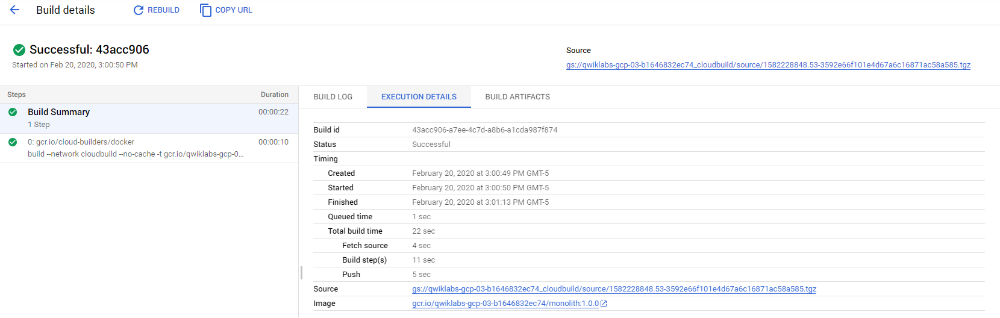
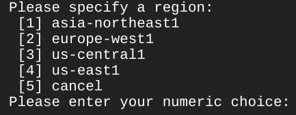
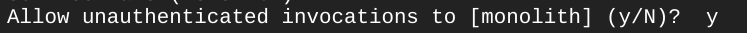
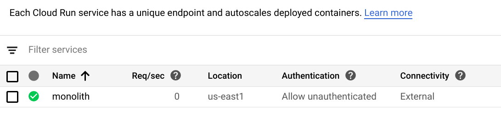
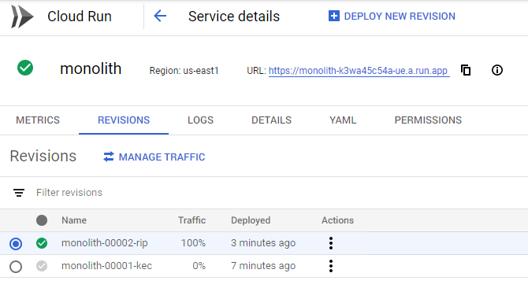
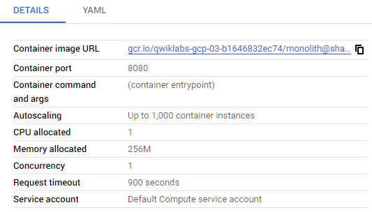
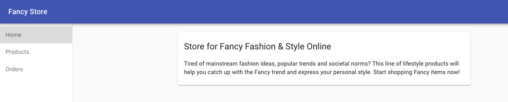
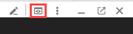
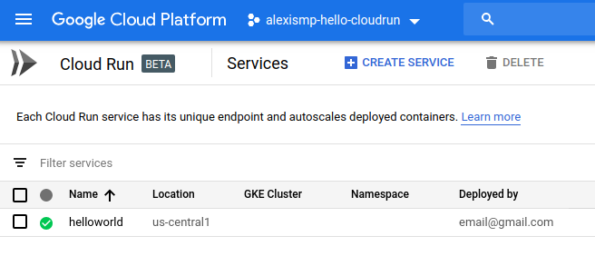

# Deploy your Website on Cloud Run
## Overview
Running websites can be difficult with all of the overhead of creating and managing VMs, clusters, pods, services, etc. This is fine for larger, multi-tiered applications, but if you are just trying to get your website deployed and visible, it's a lot of overhead.

With Cloud Run, Google Cloud's implementation of Google's KNative framework, you can manage and deploy your website without any of the infrastructure overhead you experience with a VM or pure Kubernetes-based deployments. Not only is this a simpler approach from a management perspective, it also gives you the ability to "scale to zero" when there are no requests coming into your website.

Cloud Run brings "serverless" development to containers and can be run either on your own Google Kubernetes Engine (GKE) clusters or on a fully managed PaaS solution provided by Cloud Run. You will be running the latter scenario in this lab.

The exercises are ordered to reflect a common cloud developer experience:

1. Create a Docker container from your application
1. Deploy the container to Cloud Run
1. Modify the website
1. Roll out a new version with zero downtime

### Architecture diagram

Below you can see the flow of the deployment and Cloud Run hosting.

Begin with a Docker image created via Cloud Build, which gets triggered from Cloud Shell, then deploy the image out to Cloud Run from a command in Cloud Shell.


### What you'll learn

- How to build a Docker image using Cloud Build and upload it to gcr.io
- How to deploy Docker images to Cloud Run
- How to manage Cloud Run deployments
- How to setup an endpoint for an application on Cloud Run

## Clone Source Repository

Since you are deploying an existing website, you just need to clone the source, so you can focus on creating Docker images and deploying to Cloud Run.

Run the following commands to clone the git repo to your Cloud Shell instance and change to the appropriate directory. You will also install the NodeJS dependencies so you can test the application before deploying:

```bash
git clone https://github.com/googlecodelabs/monolith-to-microservices.git
cd ~/monolith-to-microservices
./setup.sh
```

This will take a few minutes to run. You will see a success message when it finishes.

Test your application by running the following command to start the web server:

```bash
cd ~/monolith-to-microservices/monolith
npm start
```

Output:

```
Monolith listening on port 8080!
```

Preview your application by clicking the web preview icon and selecting Preview on port 8080.


This should open a new window where you can see your Fancy Store web page in action.


Close this window after viewing the website, and stop the web server process by pressing CTRL+C in Cloud Shell.

## Create Docker Container with Cloud Build

Now that you have the source files ready to go, it is time to Dockerize your application!

Normally you would have to take a two step approach that entails building a docker container and pushing it to a registry to store the image for GKE to pull from. Make life easier and use Cloud Build to build the Docker container and put the image in Container Registry with a single command! To view the manual process of creating a Docker file and pushing it, go [here](https://cloud.google.com/container-registry/docs/quickstart).

Cloud Build will compress the files from the directory and move them to a Cloud Storage bucket. The build process will then take all the files from the bucket and use the Dockerfile, which is present in the same directory, to run the Docker build process. Since you specified the `--tag` flag with the host as gcr.io for the Docker image, the resulting Docker image will be pushed to Container Registry.

First run the following command to enable the Cloud Build API:

```bash
gcloud services enable cloudbuild.googleapis.com
```

After the API is enabled, run the following command to start the build process:

```bash
gcloud builds submit --tag gcr.io/${GOOGLE_CLOUD_PROJECT}/monolith:1.0.0 .
```

This process will take a few minutes, but after it is completed, there will be output in the terminal similar to the following:

```
-----------------------------------------------------------------------------------------------------------------------------------------------------------------------------------------------------------
ID                                    CREATE_TIME                DURATION  SOURCE                                                                                  IMAGES                              STATUS
1ae295d9-63cb-482c-959b-bc52e9644d53  2019-08-29T01:56:35+00:00  33S       gs://<PROJECT_ID>_cloudbuild/source/1567043793.94-abfd382011724422bf49af1558b894aa.tgz  gcr.io/<PROJECT_ID>/monolith:1.0.0  SUCCESS
```

To view your build history, or watch the process in real time, in the Console, from the Navigation menu click Cloud Build > History. Here you can see a list of all your builds; there should only be 1 that you just created.


If you click on the Build ID, you can see all the details for that build including the log output.

From the Build Details page you can view the container image that was created by clicking the Execution Details tab, then clicking on on the image link.



## Deploy Container To Cloud Run

Now that you have containerized your website and pushed the container to Container Registry, it is time to deploy to Cloud Run!

There are two approaches for deploying to Cloud Run:

- **Managed Cloud Run :** The Platform as a Service model where all container lifecycle is managed by the Cloud Run product itself. You'll be using this approach in this lab.
- **Cloud Run on GKE :** Cloud Run with an additional layer of control which allows you to bring your own clusters & pods from GKE. [You can read more about it here](https://cloud.google.com/run/docs/gke/setup).

### Command-Line

You will deploy the image that was built earlier, and choose the managed version of Cloud Run by specifying --platform managed.

First you need to enable the Cloud Run API. Run the following command to enable it:

```bash
gcloud services enable run.googleapis.com
```

Run the following command to deploy your application:

```bash
gcloud run deploy --image=gcr.io/${GOOGLE_CLOUD_PROJECT}/monolith:1.0.0 --platform managed
```

Specify which region you'd like to run in. Type the number for the region closest to you.



Accept the default suggested service name (it will be "monolith") by pressing Enter.

For this lab, allow unauthenticated requests into the application. Type "Y" at the prompt:



## Verify deployment
To verify the deployment was created successfully, run the following command:

```bash
gcloud run services list
```

It may take a few moments for the pod status to be Running.

Type "1" to choose the first option: [1] Cloud Run (fully managed)

Output:

```bash
SERVICE   REGION    URL  LAST DEPLOYED BY          LAST DEPLOYED AT
✔  monolith  us-east1 <your url>  <your email>  2019-09-16T21:07:38.267Z
```

This output shows several things. You can see the deployment, as well as the user that deployed it (your email) and the URL you can use to access the app. Looks like everything was created successfully!

Click on the URL provided in the list of services. You should see the same website you previewed locally.

> **Helpful Hint:** You can also view your Cloud Run deployments via the Console if you navigate to **Cloud Run** in the **Navigation menu**.

## Create new revision with lower concurrency
Deploy your application again, but this time adjust one of the parameters.

By default, a Cloud Run application will have a concurrency value of 80, meaning that each container instance will serve up to 80 requests at a time. This is a big departure from the Functions-as-a-Service model, where one instance handles one request at a time.

Re-deploy the same container image with a concurrency value of 1 (just for testing), and see what happens:

```bash
gcloud run deploy --image=gcr.io/${GOOGLE_CLOUD_PROJECT}/monolith:1.0.0 --platform managed --concurrency 1
```

Answer the subsequent questions just as you did the first time. Once the command is successful, check the Console to see the result.

To see the details, from the **Navigation menu**, click on **_Cloud Run**, then click on the **monolith** service :



On the Service Details page, click on the Revisions tab. You should now see 2 revisions created.

The most recent deployment has Details on the right hand side.



You will see that the concurrency value has been reduced to "1".



Although this configuration is sufficient for testing, in most production scenarios you will have containers supporting multiple concurrent requests.

Next, restore the original concurrency without re-deploying.

You could set the concurrency value back to the default of "80", or you could just set the value to "0", which will remove any concurrency restrictions and set it to the default max (which happens to be 80).

Run the following command from Cloud Shell to update the current revision:

```bash
gcloud run deploy --image=gcr.io/${GOOGLE_CLOUD_PROJECT}/monolith:1.0.0 --platform managed --concurrency 80
```

Answer the subsequent questions just as you have before.

You will notice that another revision has been created, that traffic has now been redirected, and that the concurrency is back up to 80.

> You may need to leave the Revisions tab and then return to it to see the most up to date information.

## Make Changes To The Website

> **Scenario:** Your marketing team has asked you to change the homepage for your site. They think it should be more informative of who your company is and what you actually sell.

**Task:** You will add some text to the homepage to make the marketing team happy! It looks like one of our developers already created the changes with the file name `index.js.new`. You can just copy this file to index.js and your changes should be reflected. Follow the instructions below to make the appropriate changes.

Run the following commands to copy the updated file to the correct file name and then print its contents to verify the changes:

```bash
cd ~/monolith-to-microservices/react-app/src/pages/Home
mv index.js.new index.js
cat ~/monolith-to-microservices/react-app/src/pages/Home/index.js
```

The resulting code should look like this:

```jsx
/*
Copyright 2019 Google LLC

Licensed under the Apache License, Version 2.0 (the "License");
you may not use this file except in compliance with the License.
You may obtain a copy of the License at

    https://www.apache.org/licenses/LICENSE-2.0

Unless required by applicable law or agreed to in writing, software
distributed under the License is distributed on an "AS IS" BASIS,
WITHOUT WARRANTIES OR CONDITIONS OF ANY KIND, either express or implied.
See the License for the specific language governing permissions and
limitations under the License.
*/

import React from "react";
import { makeStyles } from "@material-ui/core/styles";
import Paper from "@material-ui/core/Paper";
import Typography from "@material-ui/core/Typography";
const useStyles = makeStyles(theme => ({
  root: {
    flexGrow: 1
  },
  paper: {
    width: "800px",
    margin: "0 auto",
    padding: theme.spacing(3, 2)
  }
}));
export default function Home() {
  const classes = useStyles();
  return (
    <div className={classes.root}>
      <Paper className={classes.paper}>
        <Typography variant="h5">
          Fancy Fashion &amp; Style Online
        </Typography>
        <br />
        <Typography variant="body1">
          Tired of mainstream fashion ideas, popular trends and societal norms?
          This line of lifestyle products will help you catch up with the Fancy trend and express your personal style.
          Start shopping Fancy items now!
        </Typography>
      </Paper>
    </div>
  );
}
```

You updated the React components, but you need to build the React app to generate the static files.

Run the following command to build the React app and copy it into the monolith public directory:

```bash
cd ~/monolith-to-microservices/react-app
npm run build:monolith
```

Now that the code is updated, rebuild the Docker container and publish it to Container Registry. You can use the same command as before, except this time you will update the version label.

Run the following command to trigger a new Cloud Build with an updated image version of 2.0.0:

```bash
cd ~/monolith-to-microservices/monolith
```

Optional

```bash
#Feel free to test your application
npm start
```

```bash
gcloud builds submit --tag gcr.io/${GOOGLE_CLOUD_PROJECT}/monolith:2.0.0 .
```

In the next section you will use this image to update your application with zero downtime.

## Update website with zero downtime

The changes are complete and the marketing team is happy with your updates! It is time to update the website without interruption to the users.

Cloud Run treats each deployment as a new Revision which will first be brought online, then have traffic redirected to it. By default the latest revision will be assigned 100% of the inbound traffic for a service. It is possible to use "Routes" to allocate different percentages of traffic to different revisions within a service.

Follow the instructions below to update your website.

From Cloud Shell, re-deploy the service to update the image to a new version with the following command:

```bash
gcloud run deploy --image=gcr.io/${GOOGLE_CLOUD_PROJECT}/monolith:2.0.0 --platform managed
```

Answer the subsequent questions just as you have before.

## Verify Deployment
Validate that your deployment updated by running the following command:

```bash
gcloud run services describe monolith --platform managed
```

Type in the number for the region you've been using.

Output:

```
✔ Service monolith in region us-east1
https://monolith-k3wa45c54a-ue.a.run.app

Traffic:
  100%               LATEST (currently monolith-00003-ten)

Last updated on 2020-02-20T20:26:56.049Z by student-03-e32055b0be3a@qwiklabs.net:
  Revision monolith-00003-ten
  Image:             gcr.io/qwiklabs-gcp-03-b1646832ec74/monolith:2.0.0
  Port:              8080
  Memory:            256M
  CPU:               1000m
  Concurrency:       1
  Timeout:           900s
```

Here you will see that the Service is now using the latest version of your image, deployed in a new revision.

To verify the changes, navigate to the external URL of the Cloud Run service, refresh the page, and notice that the application title has been updated.

Run the following command to list the services and view the IP address:

```bash
gcloud beta run services list
```

Choose the first option, **Cloud Run (fully managed)** and press **Enter**.

Click on the URL of the service. Your web site should now be displaying the text you just added to the homepage component!



## Cleanup

When you end this lab all of the resources you used will be destroyed. It's good to know how to delete resources so you can do so in your own environment.

Run the following to delete Container Registry images:

```bash
# Delete the container image for version 1.0.0 of our monolith
gcloud container images delete gcr.io/${GOOGLE_CLOUD_PROJECT}/monolith:1.0.0 --quiet

# Delete the container image for version 2.0.0 of our monolith
gcloud container images delete gcr.io/${GOOGLE_CLOUD_PROJECT}/monolith:2.0.0 --quiet
```

Run the following to delete Cloud Build artifacts from Cloud Storage:

```bash
# The following command will take all source archives from all builds and delete them from cloud storage

# Run this command to print all sources:
# gcloud builds list | awk 'NR > 1 {print $4}'

gcloud builds list | awk 'NR > 1 {print $4}' | while read line; do gsutil rm $line; done
```

Finally, delete Cloud Run service:

```bash
gcloud beta run services delete monolith --platform managed
```

Choose the region where you've been running the service for this lab, then confirm that you want `monolith` deleted.

**Congratulations!**

You successfully deployed, de-scaled, re-scaled, and updated your website on Cloud Run.

## Finish Your Quest

This self-paced lab is part of the Qwiklabs [Deploying Applications](https://google.qwiklabs.com/quests/26), [Cloud SQL](https://google.qwiklabs.com/quests/52), [Websites and Web Apps](https://google.qwiklabs.com/quests/39) and [Website on Google Cloud](https://google.qwiklabs.com/quests/125) Quests. A Quest is a series of related labs that form a learning path. Completing this Quest earns you the badge above, to recognize your achievement. You can make your badge (or badges) public and link to them in your online resume or social media account. Enroll in a Quest and get immediate completion credit if you've taken this lab. [See other available Qwiklabs Quests](https://google.qwiklabs.com/catalog).

## Take Your Next Lab
Continue your learning with [Build and Launch an ASP.NET Core App from Google Cloud Shell](https://google.qwiklabs.com/catalog_lab/499) or check out these suggestions:

- [Deploy ASP.NET Core App to App Engine](https://google.qwiklabs.com/catalog_lab/500)
- [Deploy Refinery CMS to App Engine Flexible Environment](https://google.qwiklabs.com/catalog_lab/520)

## Next Steps / Learn More
If you're not familiar with these products, here are links to learn more:

- [Docker](https://docs.docker.com/), [Docker's "Getting Started" page](https://docs.docker.com/get-started/)
- Kubernetes Engine - https://cloud.google.com/kubernetes-engine/docs/
- Cloud Build - https://cloud.google.com/cloud-build/docs/
- Container Registry - https://cloud.google.com/container-registry/docs/

# Hello Cloud Run

**内容的に、上記の "deploy your website on Cloud Run" とほぼ重複するが、同じ教材ではない**

Cloud Run は、マネージド型のコンピューティング プラットフォームで、HTTP リクエスト経由で呼び出し可能なステートレス コンテナを実行できます。Cloud Run はサーバーレスです。インフラストラクチャ管理が一切不要なため、最も重要な作業であるアプリケーション構築に集中できます。

Knative から作成されているため、Cloud Run を使用してフルマネージド型でコンテナを実行するか、Cloud Run on GKE を使用して Google Kubernetes Engine クラスタ内でコンテナを実行するかを選択できます。

このラボの目標は、コンテナ イメージをビルドして Cloud Run にデプロイすることです。このラボでは、ステートレス コンテナをサーバーレスな方法（インフラストラクチャを抽象化した方法）でデプロイして実行することで、Cloud Run の基本的な使い方を学ぶことができます。Cloud Run は、フルマネージド型で実行することも、GKE クラスタ上で実行することもできます。

## Cloud Run API を有効にする

Cloud Shell で、Cloud Run API を有効にします。

```bash
gcloud services enable run.googleapis.com
```

成功すると次のようなメッセージが表示されます。

```
Operation "operations/acf.cc11852d-40af-47ad-9d59-477a12847c9e" finished successfully.
```

注: Console の [API とサービス] セクションでこの API を有効にすることもできます。

## サンプル アプリケーションを作成する

まず、HTTP リクエストに応答する Express ベースのシンプルな Node.js アプリケーションを作成します。

Cloud Shell で、helloworld-nodejs という名前の新しいディレクトリを作成し、そのディレクトリに移動します。

```bash
mkdir helloworld-nodejs
cd helloworld-nodejs
```

次に、いくつかのファイルを作成して編集します。ファイルの編集には、vi、emac、nano のいずれかを使用するか、Cloud Shell コードエディタを使用します。Cloud Shell コードエディタを使用するには、Cloud Shell ウィンドウ上部の鉛筆アイコン（「エディタを立ち上げる」）をクリックします。


package.json ファイルを作成し、次の内容を追加します。

```json
{
  "name": "cloudrun-helloworld",
  "version": "1.0.0",
  "description": "Simple hello world sample in Node",
  "main": "index.js",
  "scripts": {
    "start": "node index.js"
  },
  "author": "",
  "license": "Apache-2.0",
  "dependencies": {
    "express": "^4.16.4"
  }
}
```

上のファイルで最も重要な点は、スクリプトを開始するコマンドと、Express ウェブ アプリケーション フレームワークへの依存関係が含まれていることです。

次に、同じディレクトリに index.js ファイルを作成し、次の行をコピーします。

```js
const express = require('express');
const app = express();

app.get('/', (req, res) => {
  console.log('Hello world received a request.');

  const target = process.env.TARGET || 'World';
  res.send(`Hello ${target}!`);
});

const port = process.env.PORT || 8080;
app.listen(port, () => {
  console.log('Hello world listening on port', port);
});
```

このコードは、`PORT` 環境変数で定義されたポートをリッスンする基本的なウェブサーバーを作成します。これでアプリは完成しました。このアプリをコンテナ化し、Container Registry にアップロードします。

> Cloud Run の基本的な使い方については、このほかにも多くの言語のドキュメントが用意されています。Go、Python、Java、PHP、Ruby、シェル スクリプトなどの手順については、https://cloud.google.com/run/docs/quickstarts/build-and-deploy をご覧ください。

## アプリをコンテナ化して Container Registry にアップロードする

サンプルアプリをコンテナ化するには、ソースファイルと同じディレクトリに Dockerfile という名前の新しいファイルを作成し、次の内容を追加します。

```Dockerfile
# Node.js 10 の公式イメージを使用します。
# https://hub.docker.com/_/node
FROM node:10

# app ディレクトリを作成してそのディレクトリに移動します。
WORKDIR /usr/src/app

# アプリケーション依存関係マニフェストをコンテナ イメージにコピーします。
# package.json と package-lock.json の両方がコピーされるようにワイルドカードを使用します。
# これを別にコピーすると、コードを変更するたびに npm install を再実行する必要がなくなります。
COPY package*.json ./

# 本番環境の依存関係をインストールします。
RUN npm install --only=production

# ローカルコードをコンテナ イメージにコピーします。
COPY . .

# コンテナの起動時にウェブサービスを実行します。
CMD [ "npm", "start" ]
```

次のコマンドを実行してプロジェクト ID を取得します。次のステップで必要になります。

```bash
gcloud config get-value project
```

次に、Cloud Build を使用してコンテナ イメージをビルドします。そのためには、Dockerfile を含むディレクトリから次のコマンドを実行します。前の出力のプロジェクト ID を追加してください。

```bash
gcloud builds submit --tag gcr.io/[PROJECT-ID]/helloworld
```

Cloud Build は GCP 上でビルドを行うサービスで、一連のビルドステップを実行します。各ビルドステップが Docker コンテナで実行されてアプリケーション コンテナ（またはその他のアーティファクト）が生成され、Cloud Registry に push されます。そのすべてを 1 つのコマンドで実行できます。

Cloud Registry への push が完了すると、イメージ名（gcr.io/[PROJECT-ID]/helloworld）を含む SUCCESS メッセージが表示されて、イメージが Container Registry に保存されます。このイメージは必要に応じて再利用できます。

現在のプロジェクトに関連付けられているすべてのコンテナ イメージを一覧表示するには、次のコマンドを使用します。

```bash
gcloud container images list
```

Cloud Shell からローカルでアプリケーションを実行してテストするには、次のように、標準の docker コマンドを使用してアプリケーションを開始します。

```bash
docker run -d -p 8080:8080 gcr.io/[PROJECT-ID]/helloworld
```

Cloud Shell ウィンドウで、[ウェブでプレビュー] をクリックし、[ポート 8080 でプレビュー] を選択します。



ブラウザ ウィンドウが開いて「Hello World!」というメッセージが表示されるはずです。単純に curl localhost:8080 を使用してテストすることもできます。

> 注: docker コマンドでリモート コンテナ イメージを pull できない場合は、gcloud auth configure-docker を実行してみてください。

## Cloud Run にデプロイする

コンテナ化されたアプリケーションを Cloud Run にデプロイするには次のコマンドを使用します。実際のプロジェクト ID を追加してください。

```bash
gcloud beta run deploy --image gcr.io/[PROJECT-ID]/helloworld
```

プロンプトが表示されたら、次の操作を行います。（注：リージョン選択とサービス名の確認の順番が逆になったりするけどまああんまり気にしなくてよい）

- 「Cloud Run (fully managed)」を選択する
- リージョンを選択する （us-central1）
- Enter キーを押してサービス名を確認する
- 「y」と入力して未認証の呼び出しを許可する（この最後のステップは重要です。
`--allow-unauthenticated` デプロイ オプションを使用してこのステップを回避することもできます）

デプロイが完了するまで少しお待ちください。

成功すると、コマンドラインにサービス URL が表示されます。

```
Service [helloworld] revision [helloworld-00001] has been deployed
and is serving traffic at https://helloworld-wdl7fdwaaa-uc.a.run.app
```

ブラウザ ウィンドウでこのサービス URL を開くと、デプロイしたコンテナにアクセスできます。


これで、コンテナ イメージにパッケージ化されたアプリケーションが Cloud Run にデプロイされました。Cloud Run は、受信したリクエストを処理するためにコンテナ イメージを自動的に水平方向にスケーリングします。リクエスト数が減少すると、インスタンス数が少なくなります。実際の環境で使用した場合、料金は、リクエストの処理中に使用した CPU、メモリ、ネットワークに対してのみ発生します。

このラボでは gcloud コマンドラインを使用しましたが、Cloud Run は Cloud Console でも使用できます。

ナビゲーション メニューの [コンピューティング] セクションで [Cloud Run] をクリックすると、サービスのリストに helloworld サービスが表示されるはずです。



お疲れさまでした。

## 破棄

ここで使用したすべてのリソースのシャットダウンは Qwiklabs によって行われますが、クラウドのマナーを守りながら費用を節約するために、ご自身の環境で行う必要がある操作を以下に示します。

サービスが使用されていない場合、Cloud Run の料金は発生しませんが、ビルドしたコンテナ イメージが保存されていると課金される場合があります。

課金されないようにするには、GCP プロジェクトを削除してプロジェクト内のすべてのリソースへの課金を停止するか、次のコマンドを使用して helloworld イメージを単純に削除します。

```bash
gcloud container images delete gcr.io/[PROJECT-ID]/helloworld
```

この Cloud Run サービスを削除するには次のコマンドを使用します。

```bash
gcloud beta run services delete helloworld
```

## 次のステップと詳細情報

Cloud Run に適したステートレス HTTP コンテナをコードソースからビルドして Container Registry に push する方法の詳細については、次のページをご覧ください。

- [Cloud Run サービスを開発する](https://cloud.google.com/run/docs/developing)
- [コンテナをビルドする](https://cloud.google.com/run/docs/building/containers)