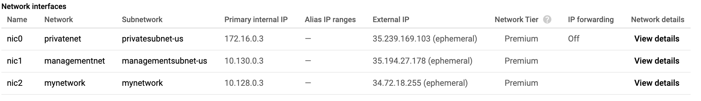

**Networking in the Google Cloud**

# ユーザー認証（Identity Aware Proxy）
[IAP についてはこちら](https://github.com/thesugar/memo/blob/fff89264f87487b026a05b437c876f90d25f3e26/gcp/security-and-identity.md#%E3%83%A6%E3%83%BC%E3%82%B6%E3%83%BC%E8%AA%8D%E8%A8%BC-identity-aware-proxy)。

# 複数の VPC ネットワーク
<h2 id="step2">概要</h2>

このラボでは、複数の VPC ネットワークと VM インスタンスを作成し、ネットワーク間で接続をテストします。具体的には次のネットワーク図のように、ファイアウォール ルールと VM インスタンスを持つカスタムモード ネットワークを 2 つ（<strong>managementnet</strong> と <strong>privatenet</strong>）作成します。

この Qwiklabs プロジェクトには、ファイアウォール ルールと 2 つの VM インスタンス（<strong>mynet-eu-vm</strong> と <strong>mynet-us-vm</strong>）が設定された <strong>mynetwork</strong> ネットワークがすでに作成されています。

<h3>目標</h3>

このラボでは、次のタスクの実行方法について学びます。

<ul>
<li>ファイアウォール ルールを持つカスタムモードの VPC ネットワークを作成する</li>
<li>Compute Engine を使用して VM インスタンスを作成する</li>
<li>VPC ネットワーク間の VM インスタンスの接続性を調べる</li>
<li>複数のネットワーク インターフェースを持つ VM インスタンスを作成する</li>
</ul>

<h2 id="step4">ファイアウォール ルールを持つカスタムモードの VPC ネットワークを作成する</h2>

<strong>managementnet</strong> と <strong>privatenet</strong> の 2 つのカスタム ネットワークを、<strong>SSH</strong>、<strong>ICMP</strong>、および <strong>RDP</strong> の上りトラフィックを許可するファイウォール ルールとともに作成する

<h3><strong>managementnet ネットワークを作成する</strong></h3>

GCP Console を使用して <strong>managementnet</strong> ネットワークを作成します。

<ol>
<li>Console で、<strong>ナビゲーション メニュー</strong>（） &gt; [<strong>VPC ネットワーク</strong>] &gt; [<strong>VPC ネットワーク</strong>] に移動します。</li>
</ol>

<ol start="2">
<li>

<strong>default</strong> ネットワークと <strong>mynetwork</strong> ネットワーク、そのサブネットワークがあることを確認します。

GCP プロジェクトはいずれも <strong>default</strong> ネットワークで開始します。また、<strong>mynetwork</strong> ネットワークは、ネットワーク図の一部としてあらかじめ作成されています。

</li>
<li>

[<strong>VPC ネットワークを作成</strong>] をクリックします。

</li>
<li>

[<strong>名前</strong>] を「<code>managementnet</code>」に設定します。

</li>
<li>

[<strong>サブネット作成モード</strong>] で [<strong>カスタム</strong>] をクリックします。

</li>
<li>

以下の値を設定し、他はすべてデフォルト値のままにします。

<table>

<tr>
<th>プロパティ</th>
<th>値（値を入力するか、指定されたオプションを選択）</th>
</tr>

<tr>
<td>名前</td>
<td>managementsubnet-us</td>
</tr>
<tr>
<td>リージョン</td>
<td>us-central1</td>
</tr>
<tr>
<td>IP アドレス範囲</td>
<td>10.130.0.0/20</td>
</tr>

</table>
</li>
<li>

[<strong>完了</strong>] をクリックします。

</li>
<li>

[<strong>コマンドライン</strong>] をクリックします。

これらのコマンドは、Cloud Shell コマンドラインを使用してネットワークとサブネットを作成できることを示しています。これらのコマンドに同様のパラメータを指定して、<strong>privatenet</strong> ネットワークを作成します。

</li>
<li>

[<strong>閉じる</strong>] をクリックします。

</li>
<li>

[<strong>作成</strong>] をクリックします。

</li>
</ol>

<h3><strong>privatenet ネットワークを作成する</strong></h3>

Cloud Shell コマンドラインを使用して <strong>privatenet</strong> ネットワークを作成します。

<ol>
<li>

次のコマンドを実行して、<strong>privatenet</strong> ネットワークを作成します。

</li>
</ol>
<pre><code>gcloud compute networks create privatenet --subnet-mode=custom&#x000A;</code></pre>
<ol start="2">
<li>

次のコマンドを実行して、<strong>privatesubnet-us</strong> サブネットを作成します。

</li>
</ol>
<pre><code>gcloud compute networks subnets create privatesubnet-us --network=privatenet --region=us-central1 --range=172.16.0.0/24&#x000A;</code></pre>
<ol start="3">
<li>

次のコマンドを実行して、<strong>privatesubnet-eu</strong> サブネットを作成します。

</li>
</ol>
<pre><code>gcloud compute networks subnets create privatesubnet-eu --network=privatenet --region=europe-west1 --range=172.20.0.0/20&#x000A;</code></pre>

<ol start="4">
<li>

次のコマンドを実行して、使用可能な VPC ネットワークを一覧表示します。

</li>
</ol>
<pre><code>gcloud compute networks list&#x000A;</code></pre>

出力は次のようになります（<strong>コピーしないでください。これは出力例です</strong>）。

<pre><code>NAME           SUBNET_MODE  BGP_ROUTING_MODE  IPV4_RANGE  GATEWAY_IPV4&#x000A;default        AUTO         REGIONAL&#x000A;managementnet  CUSTOM       REGIONAL&#x000A;mynetwork      AUTO         REGIONAL&#x000A;privatenet     CUSTOM       REGIONAL&#x000A;</code></pre>
<ql-infobox><b>default</b> と <b>mynetwork</b> は自動モードのネットワーク、<b>managementnet</b> と <b>privatenet</b> はカスタムモードのネットワークです。自動モードのネットワークは、各リージョンにサブネットを自動的に作成します。一方、カスタムモードのネットワークはサブネットがない状態で開始して、サブネットはユーザー側で柔軟に作成できます。
</ql-infobox>
<ol start="5">
<li>

次のコマンドを実行して、使用可能な VPC サブネットを（VPC ネットワークで並べ替えて）一覧表示します。

</li>
</ol>
<pre><code>gcloud compute networks subnets list --sort-by=NETWORK&#x000A;</code></pre>

出力は次のようになります（<strong>コピーしないでください。これは出力例です</strong>）。

<pre><code>NAME                REGION                   NETWORK        RANGE&#x000A;default             asia-northeast1          default        10.146.0.0/20&#x000A;default             us-west1                 default        10.138.0.0/20&#x000A;default             southamerica-east1       default        10.158.0.0/20&#x000A;default             europe-west4             default        10.164.0.0/20&#x000A;default             asia-east1               default        10.140.0.0/20&#x000A;default             europe-north1            default        10.166.0.0/20&#x000A;default             asia-southeast1          default        10.148.0.0/20&#x000A;default             us-east4                 default        10.150.0.0/20&#x000A;default             europe-west1             default        10.132.0.0/20&#x000A;default             europe-west2             default        10.154.0.0/20&#x000A;default             europe-west3             default        10.156.0.0/20&#x000A;default             australia-southeast1     default        10.152.0.0/20&#x000A;default             asia-south1              default        10.160.0.0/20&#x000A;default             us-east1                 default        10.142.0.0/20&#x000A;default             us-central1              default        10.128.0.0/20&#x000A;default             northamerica-northeast1  default        10.162.0.0/20&#x000A;managementsubnet-us us-central1              managementnet  10.130.0.0/20&#x000A;mynetwork           asia-northeast1          mynetwork      10.146.0.0/20&#x000A;mynetwork           us-west1                 mynetwork      10.138.0.0/20&#x000A;mynetwork           southamerica-east1       mynetwork      10.158.0.0/20&#x000A;mynetwork           europe-west4             mynetwork      10.164.0.0/20&#x000A;mynetwork           asia-east1               mynetwork      10.140.0.0/20&#x000A;mynetwork           europe-north1            mynetwork      10.166.0.0/20&#x000A;mynetwork           asia-southeast1          mynetwork      10.148.0.0/20&#x000A;mynetwork           us-east4                 mynetwork      10.150.0.0/20&#x000A;mynetwork           europe-west1             mynetwork      10.132.0.0/20&#x000A;mynetwork           europe-west2             mynetwork      10.154.0.0/20&#x000A;mynetwork           europe-west3             mynetwork      10.156.0.0/20&#x000A;mynetwork           australia-southeast1     mynetwork      10.152.0.0/20&#x000A;mynetwork           asia-south1              mynetwork      10.160.0.0/20&#x000A;mynetwork           us-east1                 mynetwork      10.142.0.0/20&#x000A;mynetwork           us-central1              mynetwork      10.128.0.0/20&#x000A;mynetwork           northamerica-northeast1  mynetwork      10.162.0.0/20&#x000A;privatesubnet-eu    europe-west1             privatenet     172.20.0.0/20&#x000A;privatesubnet-us    us-central1              privatenet     172.16.0.0/24&#x000A;</code></pre>
<ql-infobox><b>default</b> ネットワークと <b>mynetwork</b> ネットワークは自動モードのネットワークなので、想定どおり<a href="https://cloud.google.com/compute/docs/regions-zones/#available" target="blank">各リージョン</a>内にサブネットが含まれています。<b>managementnet</b> ネットワークと <b>privatenet</b> ネットワークはカスタムモードのネットワークなので、作成したサブネットのみが含まれています。
</ql-infobox>
<ol start="6">
<li>

Console で、<strong>ナビゲーション メニュー</strong>（） &gt; [<strong>VPC ネットワーク</strong>] &gt; [<strong>VPC ネットワーク</strong>] に移動します。

</li>
<li>

Console には同じネットワークとサブネットが一覧表示されています。

</li>
</ol>
<h3><strong>managementnet 用のファイルウォール ルールを作成する</strong></h3>

<strong>managementnet</strong> ネットワーク上の VM インスタンスに対する <strong>SSH</strong>、<strong>ICMP</strong>、および <strong>RDP</strong> の上りトラフィックを許可するように、ファイアウォール ルールを作成します。

<ol>
<li>

Console で、<strong>ナビゲーション メニュー</strong>（） &gt; [<strong>VPC ネットワーク</strong>] &gt; [<strong>ファイアウォール ルール</strong>] に移動します。

</li>
<li>

[<strong>ファイアウォール ルールを作成</strong>] をクリックします。

</li>
<li>

以下の値を設定し、他はすべてデフォルト値のままにします。

<table>

<tr>
<th>プロパティ</th>
<th>値（値を入力するか、指定されたオプションを選択）</th>
</tr>

<tr>
<td>名前</td>
<td>managementnet-allow-icmp-ssh-rdp</td>
</tr>
<tr>
<td>ネットワーク</td>
<td>managementnet</td>
</tr>
<tr>
<td>ターゲット</td>
<td>ネットワーク上のすべてのインスタンス</td>
</tr>
<tr>
<td>ソースフィルタ</td>
<td>IP 範囲</td>
</tr>
<tr>
<td>ソース IP の範囲</td>
<td>0.0.0.0/0</td>
</tr>
<tr>
<td>プロトコルとポート</td>
<td>[指定したプロトコルとポート]、および [tcp] の<em>チェックボックスをオンにして</em>、「22, 3389」と<em>入力</em>し、次に [その他のプロトコル] を<em>オンにして</em>、「icmp」<em>と入力します</em>。</td>
</tr>

</table>
</li>
</ol>
<ql-infobox>すべてのネットワークを指定するために、[<strong>ソース IP の範囲</strong>] には「<strong>/0</strong>」を追加します。
</ql-infobox>
<ol start="4">
<li>

[<strong>コマンドライン</strong>] をクリックします。

これらのコマンドは、Cloud Shell コマンドラインを使用してファイアウォール ルールを作成できることを示しています。これらのコマンドに同様のパラメータを指定して、<strong>privatenet</strong> のファイアウォール ルールを作成します。

</li>
<li>

[<strong>閉じる</strong>] をクリックします。

</li>
<li>

[<strong>作成</strong>] をクリックします。

</li>
</ol>

<h3><strong>privatenet 用のファイアウォール ルールを作成する</strong></h3>

Cloud Shell コマンドラインを使用して <strong>privatenet</strong> ネットワークのファイアウォール ルールを作成します。

<ol>
<li>

Cloud Shell で次のコマンドを実行して、<strong>privatenet-allow-icmp-ssh-rdp</strong> ファイアウォール ルールを作成します。

</li>
</ol>
<pre><code>gcloud compute firewall-rules create privatenet-allow-icmp-ssh-rdp --direction=INGRESS --priority=1000 --network=privatenet --action=ALLOW --rules=icmp,tcp:22,tcp:3389 --source-ranges=0.0.0.0/0&#x000A;</code></pre>

出力は次のようになります（<strong>コピーしないでください。これは出力例です</strong>）。

<pre><code>NAME                           NETWORK     DIRECTION  PRIORITY  ALLOW                 DENY&#x000A;privatenet-allow-icmp-ssh-rdp  privatenet  INGRESS    1000      icmp,tcp:22,tcp:3389&#x000A;</code></pre>

<ol start="2">
<li>

次のコマンドを実行して、すべてのファイアウォール ルールを（VPC ネットワークで並べ替えて）一覧表示します。

</li>
</ol>
<pre><code>gcloud compute firewall-rules list --sort-by=NETWORK&#x000A;</code></pre>

出力は次のようになります（<strong>コピーしないでください。これは出力例です</strong>）。

<pre><code>NAME                              NETWORK        DIRECTION  PRIORITY  ALLOW                         DENY&#x000A;default-allow-icmp                default        INGRESS    65534     icmp&#x000A;default-allow-internal            default        INGRESS    65534     tcp:0-65535,udp:0-65535,icmp&#x000A;default-allow-rdp                 default        INGRESS    65534     tcp:3389&#x000A;default-allow-ssh                 default        INGRESS    65534     tcp:22&#x000A;managementnet-allow-icmp-ssh-rdp  managementnet  INGRESS    1000      icmp,tcp:22,tcp:3389&#x000A;mynetwork-allow-icmp              mynetwork      INGRESS    1000      icmp&#x000A;mynetwork-allow-rdp               mynetwork      INGRESS    1000      tcp:3389&#x000A;mynetwork-allow-ssh               mynetwork      INGRESS    1000      tcp:22&#x000A;privatenet-allow-icmp-ssh-rdp     privatenet     INGRESS    1000      icmp,tcp:22,tcp:3389&#x000A;</code></pre>

<strong>mynetwork</strong> ネットワークのファイアウォール ルールはすでに作成されています。複数のプロトコルとポートを、1 つのファイアウォール ルール（<strong>privatenet</strong> と <strong>managementnet</strong>）に定義することも、複数のルール（<strong>default</strong> と <strong>mynetwork</strong>）間で分けることも可能です。

<ol start="3">
<li>

Console で、<strong>ナビゲーション メニュー</strong>（） &gt; [<strong>VPC ネットワーク</strong>] &gt; [<strong>ファイアウォール ルール</strong>] に移動します。

</li>
<li>

Console には同じファイアウォール ルールが一覧表示されています。

</li>
</ol>
<h2 id="step5">VM インスタンスを作成する</h2>

以下のように 2 つの VM インスタンスを作成します。

<ul>
<li>

<strong>managementnet-us-vm</strong> を <strong>managementsubnet-us</strong> に作成

</li>
<li>

<strong>privatenet-us-vm</strong> を <strong>privatesubnet-us</strong> に作成

</li>
</ul>
<h3><strong>managementnet-us-vm インスタンスを作成する</strong></h3>

GCP Console を使用して <strong>managementnet-us-vm</strong> インスタンスを作成します。

<ol>
<li>

Console で、<strong>ナビゲーション メニュー</strong>（） &gt; [<strong>Compute Engine</strong>] &gt; [<strong>VM インスタンス</strong>] に移動します。

<strong>mynet-eu-vm</strong> と <strong>mynet-us-vm</strong> はネットワーク図の一部として作成されています。

</li>
<li>

[<strong>インスタンスを作成</strong>] をクリックします。

</li>
<li>

以下の値を設定し、他はすべてデフォルト値のままにします。

<table>

<tr>
<th>プロパティ</th>
<th>値（値を入力するか、指定されたオプションを選択）</th>
</tr>

<tr>
<td>名前</td>
<td>managementnet-us-vm</td>
</tr>
<tr>
<td>リージョン</td>
<td>us-central1</td>
</tr>
<tr>
<td>ゾーン</td>
<td>us-central1-c</td>
</tr>
<tr>
<td>マシンタイプ</td>
<td>1 vCPU（f1-micro）</td>
</tr>

</table>
</li>
<li>

[<strong>管理、セキュリティ、ディスク、ネットワーク、単一テナンシー</strong>] をクリックします。

</li>
<li>

[<strong>ネットワーキング</strong>] をクリックします。

</li>
<li>

[<strong>ネットワーク インターフェース</strong>] で、鉛筆アイコンをクリックして編集モードにします。

</li>
<li>

以下の値を設定し、他はすべてデフォルト値のままにします。

<table>

<tr>
<th>プロパティ</th>
<th>値（値を入力、または指定されたオプションを選択）</th>
</tr>

<tr>
<td>ネットワーク</td>
<td>managementnet</td>
</tr>
<tr>
<td>サブネットワーク</td>
<td>managementsubnet-us</td>
</tr>

</table>
</li>
<li>

[<strong>完了</strong>] をクリックします。

</li>
<li>

[<strong>コマンドライン</strong>] をクリックします。

これは、Cloud Shell コマンドラインを使用して VM インスタンスも作成できることを示しています。これらのコマンドに同様のパラメータを指定して、<strong>privatenet-us-vm</strong> のファイアウォール ルールを作成します。

</li>
<li>

[<strong>閉じる</strong>] をクリックします。

</li>
<li>

[<strong>作成</strong>] をクリックします。

</li>
</ol>

<h3><strong>privatenet-us-vm インスタンスを作成する</strong></h3>

Cloud Shell コマンドラインを使用して <strong>privatenet-us-vm</strong> インスタンスを作成します。

<ol>
<li>

Cloud Shell で、次のコマンドを実行して <strong>privatenet-us-vm</strong> インスタンスを作成します。

</li>
</ol>
<pre><code>gcloud compute instances create privatenet-us-vm --zone=us-central1-c --machine-type=n1-standard-1 --subnet=privatesubnet-us&#x000A;</code></pre>

出力は次のようになります（<strong>コピーしないでください。これは出力例です</strong>）。

<pre><code>NAME              ZONE           MACHINE_TYPE   PREEMPTIBLE  INTERNAL_IP  EXTERNAL_IP    STATUS&#x000A;privatenet-us-vm  us-central1-c  n1-standard-1               172.16.0.2   35.184.221.40  RUNNING&#x000A;</code></pre>

<ol start="2">
<li>

次のコマンドを実行して、（ゾーンで並べ替えられた）すべての VM インスタンスを一覧表示します。

</li>
</ol>
<pre><code>gcloud compute instances list --sort-by=ZONE&#x000A;</code></pre>

出力は次のようになります（<strong>コピーしないでください。これは出力例です</strong>）。

<pre><code>NAME                 ZONE            MACHINE_TYPE   PREEMPTIBLE  INTERNAL_IP  EXTERNAL_IP     STATUS&#x000A;mynet-eu-vm          europe-west1-c  n1-standard-1               10.132.0.2   35.205.124.164  RUNNING&#x000A;managementnet-us-vm  us-central1-c   n1-standard-1               10.130.0.2   35.226.20.87    RUNNING&#x000A;mynet-us-vm          us-central1-c   n1-standard-1               10.128.0.2   35.232.252.86   RUNNING&#x000A;privatenet-us-vm     us-central1-c   n1-standard-1               172.16.0.2   35.184.221.40   RUNNING&#x000A;</code></pre>
<ol start="3">
<li>

Console で、<strong>ナビゲーション メニュー</strong>（） &gt; [<strong>Compute Engine</strong>] &gt; [<strong>VM インスタンス</strong>] に移動します。

</li>
<li>

コンソールには VM インスタンスが一覧表示されています。

</li>
<li>

[<strong>列</strong>] をクリックしてから [<strong>ネットワーク</strong>] を選択します。

<strong>us-central1-c</strong> にはインスタンスが 3 つ、<strong>europe-west1-c</strong> にはインスタンスが 1 つあります。ただし、これらのインスタンスは 3 つの VPC ネットワーク（<strong>managementnet</strong>、<strong>mynetwork</strong>、<strong>privatenet</strong>）に分散されており、どのインスタンスも他のインスタンスと同じゾーンまたはネットワーク内にありません。次のセクションでは、内部接続に及ぼす影響を調べます。

</li>
</ol>
<h2 id="step6">VM インスタンス間の接続性を調べる</h2>

VM インスタンス間の接続性を調べます。具体的には、VM インスタンスが同じゾーン内にある場合と、同じ VPC ネットワーク内にある場合についてそれぞれの影響を確認します。

<h3><strong>外部 IP アドレスに対して ping する</strong></h3>

VM インスタンスの外部 IP アドレスに ping して、公共のインターネットからインスタンスに到達できるかどうかを調べます。

<ol>
<li>

Console で、<strong>ナビゲーション メニュー</strong>（） &gt; [<strong>Compute Engine</strong>] &gt; [<strong>VM インスタンス</strong>] に移動します。

</li>
<li>

<strong>mynet-eu-vm</strong>、<strong>managementnet-us-vm</strong>、<strong>privatenet-us-vm</strong> の外部 IP アドレスを確認します。

</li>
<li>

<strong>mynet-us-vm</strong> で、[<strong>SSH</strong>] をクリックしてターミナルを起動し、接続します。

</li>
<li>

<strong>mynet-eu-vm</strong> の外部 IP アドレスへの接続をテストするために、<strong>mynet-eu-vm</strong> の外部 IP を入力して次のコマンドを実行します。

</li>
</ol>
<pre><code>ping -c 3 &lt;mynet-eu-vm の外部 IP をこちらに入力&gt;&#x000A;</code></pre>

応答があるはずです。

<ol start="5">
<li>

<strong>managementnet-us-vm</strong> の外部 IP アドレスへの接続をテストするために、<strong>managementnet-us-vm</strong> の外部 IP を入力して次のコマンドを実行します。

</li>
</ol>
<pre><code>ping -c 3 &lt;managementnet-us-vm の外部 IP をこちらに入力&gt;&#x000A;</code></pre>

応答があるはずです。

<ol start="6">
<li>

<strong>privatenet-us-vm</strong> の外部 IP アドレスへの接続をテストするために、<strong>privatenet-us-vm</strong> の外部 IP を入力して次のコマンドを実行します。

</li>
</ol>
<pre><code>ping -c 3 &lt;privatenet-us-vm の外部 IP をこちらに入力&gt;&#x000A;</code></pre>

応答があるはずです。

<ql-infobox>VM インスタンスが異なるゾーンまたは VPC ネットワークにある場合でも、すべての VM インスタンスの外部 IP アドレスに ping を通すことができます。これにより、これらのインスタンスへの公開アクセスが、先ほど設定した <b>ICMP</b> ファイアウォール ルールによってのみ制御されていることを確認できます。</ql-infobox>
<h3><strong>内部 IP アドレスに ping する</strong></h3>

VM インスタンスの内部 IP アドレスに ping して、VPC ネットワーク内からインスタンスに到達できるかどうかを調べます。

<ol>
<li>

Console で、<strong>ナビゲーション メニュー</strong>（） &gt; [<strong>Compute Engine</strong>] &gt; [<strong>VM インスタンス</strong>] に移動します。

</li>
<li>

<strong>mynet-eu-vm</strong>、<strong>managementnet-us-vm</strong>、<strong>privatenet-us-vm</strong> の内部 IP アドレスを確認します。

</li>
<li>

<strong>mynet-us-vm</strong> の <strong>SSH</strong> ターミナルに戻ります。

</li>
<li>

<strong>mynet-eu-vm</strong> の内部 IP アドレスへの接続をテストするために、<strong>mynet-eu-vm</strong> の内部 IP を入力して次のコマンドを実行します。

</li>
</ol>
<pre><code>ping -c 3 &lt;mynet-eu-vm の内部 IP をこちらに入力&gt;&#x000A;</code></pre>
<ql-infobox><b>mynet-eu-vm</b> の内部 IP アドレスに ping を通すことができます。これは、両方の VM インスタンスが別のゾーン、リージョン、大陸にあっても、この IP アドレスが ping のソース（<b>mynet-us-vm</b>）と同じ VPC ネットワーク内にあるからです。
</ql-infobox>
<ol start="5">
<li>

<strong>managementnet-us-vm</strong> の内部 IP アドレスへの接続をテストするために、<strong>managementnet-us-vm</strong> の内部 IP を入力して次のコマンドを実行します。

</li>
</ol>
<pre><code>ping -c 3 &lt;managementnet-us-vm の内部 IP をこちらに入力&gt;&#x000A;</code></pre>
<ql-warningbox>100% パケットロスで応答がありません。
</ql-warningbox>
<ol start="6">
<li>

<strong>privatenet-us-vm</strong> の内部 IP アドレスへの接続をテストするために、<strong>privatenet-us-vm</strong> の内部 IP を入力して次のコマンドを実行します。

</li>
</ol>
<pre><code>ping -c 3 &lt;privatenet-us-vm の内部 IP をこちらに入力&gt;&#x000A;</code></pre>
<ql-warningbox>これも 100% パケットロスで応答がありません。<b>managementnet-us</b> と <b>privatenet-us-vm</b>の内部 IP アドレスに ping を通すことはできません。これらの IP アドレスが同じゾーン（<b>us-central1</b>）にあっても、ping のソース（<b>mynet-us-vm</b>）とは別の VPC ネットワーク内にあるためです。
</ql-warningbox>

VPC ネットワークは、デフォルトで分離されたプライベート ネットワーク ドメインです。ただし、内部 IP アドレスによるネットワーク間通信は、VPC ピアリングや VPN などのメカニズムを設定しない限り許可されません。

<h2 id="step7">複数のネットワーク インターフェースを持つ VM インスタンスを作成する</h2>

VPC ネットワーク内のすべてのインスタンスには、デフォルトのネットワーク インターフェースがあります。VM に接続するネットワーク インターフェースを追加することができます。複数のネットワーク インターフェースを持つことで、インスタンスが複数の VPC ネットワーク（インスタンスのタイプに応じて最大 8 つのインターフェース）に直接接続される構成を作成できます。

<h3><strong>複数のネットワーク インターフェースを持つ VM インスタンスを作成する</strong></h3>

<strong>vm-appliance</strong> インスタンスを、<strong>privatesubnet-us</strong>、<strong>managementsubnet-us</strong> および <strong>mynetwork</strong> のネットワーク インターフェースとともに作成します。このようなサブネットの CIDR 範囲は互いに重複しません。これは複数のネットワーク インターフェース コントローラ（NIC）を使用する VM を作成する場合の要件となります。

<ol>
<li>

Cloud Platform Console で、<strong>ナビゲーション メニュー</strong>（） &gt; [<strong>Compute Engine</strong>] &gt; [<strong>VM インスタンス</strong>] に移動します。

</li>
<li>

[<strong>インスタンスを作成</strong>] をクリックします。

</li>
<li>

以下の値を設定し、他はすべてデフォルト値のままにします。

<table>

<tr>
<th>プロパティ</th>
<th>値（値を入力するか、指定されたオプションを選択）</th>
</tr>

<tr>
<td>名前</td>
<td>vm-appliance</td>
</tr>
<tr>
<td>リージョン</td>
<td>us-central1</td>
</tr>
<tr>
<td>ゾーン</td>
<td>us-central1-c</td>
</tr>
<tr>
<td>マシンタイプ</td>
<td>4 vCPU（n1-standard-4）</td>
</tr>

</table>
</li>
</ol>
<ql-infobox>インスタンスで使用できるインターフェース数は、インスタンスのマシンタイプと vCPU 数によって異なります。n1-standard-4 は最大 4 つのネットワーク インターフェースを使用できます。詳しくは<a href="https://cloud.google.com/vpc/docs/create-use-multiple-interfaces#max-interfaces" target="blank">こちら</a>をご覧ください。
</ql-infobox>
<ol start="4">
<li>

[<strong>管理、セキュリティ、ディスク、ネットワーク、単一テナンシー</strong>] をクリックします。

</li>
<li>

[<strong>ネットワーキング</strong>] をクリックします。

</li>
<li>

[<strong>ネットワーク インターフェース</strong>] で、鉛筆アイコンをクリックして編集モードにします。

</li>
<li>

以下の値を設定し、他はすべてデフォルト値のままにします。

<table>

<tr>
<th>プロパティ</th>
<th>値（値を入力、または指定されたオプションを選択）</th>
</tr>

<tr>
<td>ネットワーク</td>
<td>privatenet</td>
</tr>
<tr>
<td>サブネットワーク</td>
<td>privatesubnet-us</td>
</tr>

</table>
</li>
<li>

[<strong>完了</strong>] をクリックします。

</li>
<li>

[<strong>ネットワーク インターフェースを追加</strong>] をクリックします。

</li>
<li>

以下の値を設定し、他はすべてデフォルト値のままにします。

<table>

<tr>
<th>プロパティ</th>
<th>値（値を入力、または指定されたオプションを選択）</th>
</tr>

<tr>
<td>ネットワーク</td>
<td>managementnet</td>
</tr>
<tr>
<td>サブネットワーク</td>
<td>managementsubnet-us</td>
</tr>

</table>
</li>
<li>

[<strong>完了</strong>] をクリックします。

</li>
<li>

[<strong>ネットワーク インターフェースを追加</strong>] をクリックします。

</li>
<li>

以下の値を設定し、他はすべてデフォルト値のままにします。

<table>

<tr>
<th>プロパティ</th>
<th>値（値を入力、または指定されたオプションを選択）</th>
</tr>

<tr>
<td>ネットワーク</td>
<td>mynetwork</td>
</tr>
<tr>
<td>サブネットワーク</td>
<td>mynetwork</td>
</tr>

</table>
</li>
<li>

[<strong>完了</strong>] をクリックします。

</li>
<li>

[<strong>作成</strong>] をクリックします。

</li>
</ol>

<h3><strong>ネットワーク インターフェースを詳しく調べる</strong></h3>

Console または VM のターミナル内で <strong>vm-appliance</strong> のネットワーク インターフェースの詳細を調べます。

<ol>
<li>Console で、<strong>ナビゲーション メニュー</strong>（） &gt; [<strong>Compute Engine</strong>] &gt; [<strong>VM インスタンス</strong>] に移動します。</li>
<li>
<strong>vm-appliance</strong> の [<strong>内部 IP</strong>] アドレスで [<strong>nic0</strong>] をクリックして、[<strong>ネットワーク インターフェースの詳細</strong>] ページを開きます。</li>
<li>「<strong>nic0</strong>」が <strong>privatesubnet-us</strong> に接続され、そのサブネット内の内部 IP アドレス（172.16.0.0/24）が割り当てられ、該当するファイウォール ルールが設定されていることを確認します。</li>
<li>[<strong>nic0</strong>] をクリックし、[<strong>nic1</strong>] を選択します。</li>
<li>「<strong>nic1</strong>」 が <strong>managementsubnet-us</strong> に接続され、そのサブネット内の内部 IP アドレス（10.130.0.0/20）が割り当てられ、該当するファイウォール ルールが設定されていることを確認します。</li>
<li>[<strong>nic1</strong>] をクリックし、[<strong>nic2</strong>] を選択します。</li>
<li>「<strong>nic2</strong>」が <strong>mynetwork</strong> に接続され、そのサブネット内の内部 IP アドレス（10.128.0.0/20）が割り当てられ、該当するファイウォール ルールが設定されていることを確認します。</li>
</ol>
<ql-infobox>

各ネットワーク インターフェースには、VM インスタンスがそれらのネットワークと通信できるように独自の内部 IP アドレスがあります。
</ql-infobox>
<ol start="8">
<li>

Console で、<strong>ナビゲーション メニュー</strong>（） &gt; [<strong>Compute Engine</strong>] &gt; [<strong>VM インスタンス</strong>] に移動します。

</li>
<li>

<strong>vm-appliance</strong> の場合、[<strong>SSH</strong>] をクリックしてターミナルを起動し、接続します。

</li>
<li>

次のコマンドを実行して、VM インスタンス内のネットワーク インターフェースを一覧表示します。

</li>
</ol>
<pre><code>sudo ifconfig&#x000A;</code></pre>

出力は次のようになります（<strong>コピーしないでください。これは出力例です</strong>）。

<pre><code>eth0: flags=4163&lt;UP,BROADCAST,RUNNING,MULTICAST&gt;  mtu 1460&#x000A;        inet 172.16.0.3  netmask 255.255.255.255  broadcast 172.16.0.3&#x000A;        inet6 fe80::4001:acff:fe10:3  prefixlen 64  scopeid 0x20&lt;link&gt;&#x000A;        ether 42:01:ac:10:00:03  txqueuelen 1000  (Ethernet)&#x000A;        RX packets 626  bytes 171556 (167.5 KiB)&#x000A;        RX errors 0  dropped 0  overruns 0  frame 0&#x000A;        TX packets 568  bytes 62294 (60.8 KiB)&#x000A;        TX errors 0  dropped 0 overruns 0  carrier 0  collisions 0&#x000A;eth1: flags=4163&lt;UP,BROADCAST,RUNNING,MULTICAST&gt;  mtu 1460&#x000A;        inet 10.130.0.3  netmask 255.255.255.255  broadcast 10.130.0.3&#x000A;        inet6 fe80::4001:aff:fe82:3  prefixlen 64  scopeid 0x20&lt;link&gt;&#x000A;        ether 42:01:0a:82:00:03  txqueuelen 1000  (Ethernet)&#x000A;        RX packets 7  bytes 1222 (1.1 KiB)&#x000A;        RX errors 0  dropped 0  overruns 0  frame 0&#x000A;        TX packets 17  bytes 1842 (1.7 KiB)&#x000A;        TX errors 0  dropped 0 overruns 0  carrier 0  collisions 0&#x000A;eth2: flags=4163&lt;UP,BROADCAST,RUNNING,MULTICAST&gt;  mtu 1460&#x000A;        inet 10.128.0.3  netmask 255.255.255.255  broadcast 10.128.0.3&#x000A;        inet6 fe80::4001:aff:fe80:3  prefixlen 64  scopeid 0x20&lt;link&gt;&#x000A;        ether 42:01:0a:80:00:03  txqueuelen 1000  (Ethernet)&#x000A;        RX packets 17  bytes 2014 (1.9 KiB)&#x000A;        RX errors 0  dropped 0  overruns 0  frame 0&#x000A;        TX packets 17  bytes 1862 (1.8 KiB)&#x000A;        TX errors 0  dropped 0 overruns 0  carrier 0  collisions 0&#x000A;</code></pre>
<ql-infobox><b>sudo ifconfig</b> コマンドを実行すると、Linux VM のネットワーク インターフェースと各インターフェースの内部 IP アドレスが一覧表示されます。
</ql-infobox>
<h3><strong>ネットワーク インターフェース接続を調べる</strong></h3>

<strong>vm-appliance</strong> インスタンスが、<strong>privatesubnet-us</strong>、<strong>managementsubnet-us</strong> および <strong>mynetwork</strong> に接続されていることを、これらのサブネットの VM インスタンスに ping して確認します。

<ol>
<li>

Console で、<strong>ナビゲーション メニュー</strong>（） &gt; [<strong>Compute Engine</strong>] &gt; [<strong>VM インスタンス</strong>] に移動します。

</li>
<li>

<strong>privatenet-us-vm</strong>、<strong>managementnet-us-vm</strong>、<strong>mynet-us-vm</strong>、<strong>mynet-eu-vm</strong> の内部 IP アドレスを確認します。

</li>
<li>

<strong>vm-appliance</strong> の <strong>SSH</strong> ターミナルに戻ります。

</li>
<li>

<strong>privatenet-us-vm</strong> の内部 IP アドレスへの接続をテストするために、<strong>privatenet-us-vm</strong> の内部 IP を入力して次のコマンドを実行します。

</li>
</ol>
<pre><code>ping -c 3 &lt;privatenet-us-vm の内部 IP をこちらに入力&gt;&#x000A;</code></pre>

応答があります。

<ol start="5">
<li>

次のコマンドを実行し、同じテストを繰り返します。

</li>
</ol>
<pre><code>ping -c 3 privatenet-us-vm&#x000A;</code></pre>
<ql-infobox>VPC ネットワークには、内部 IP アドレスではなくその DNS 名でインスタンスを指定できる内部 DNS サービスがあるため、名前で <b>privatenet-us-vm</b> に ping を通すことができます。インスタンスのホスト名を使った内部 DNS クエリが行われると、インスタンスのプライマリ インターフェース（nic0）に解決されます。そのため、この場合は <b>privatenet-us-vm</b> に対してのみ正常に ping を通すことができます。
</ql-infobox>
<ol start="6">
<li>

<strong>managementnet-us-vm</strong> の内部 IP アドレスへの接続をテストするために、<strong>managementnet-us-vm</strong> の内部 IP を入力して次のコマンドを実行します。

</li>
</ol>
<pre><code>ping -c 3 &lt;managementnet-us-vm の内部 IP をこちらに入力&gt;&#x000A;</code></pre>

応答があります。

<ol start="7">
<li>

<strong>mynet-us-vm</strong> の内部 IP アドレスへの接続をテストするために、<strong>mynet-us-vm</strong> の内部 IP を入力して次のコマンドを実行します。

</li>
</ol>
<pre><code>ping -c 3 &lt;mynet-us-vm の内部 IP をこちらに入力&gt;&#x000A;</code></pre>

応答があります。

<ol start="8">
<li>

<strong>mynet-eu-vm</strong> の内部 IP アドレスへの接続をテストするために、<strong>mynet-eu-vm</strong> の内部 IP を入力して次のコマンドを実行します。

</li>
</ol>
<pre><code>ping -c 3 &lt;mynet-eu-vm の内部 IP をこちらに入力&gt;&#x000A;</code></pre>
<ql-warningbox>これには応答がありません。複数インターフェースのインスタンスでは、すべてのインターフェースが、そのインターフェースが属するサブネットのルートを取得します。さらに、インスタンスは、プライマリ インターフェース eth0 に関連付けられるデフォルト ルートを 1 つ取得します。インスタンスから送信されるトラフィックの宛先が直接接続されているサブネット以外の場合、手動で別途構成しない限り、トラフィックは eth0 のデフォルト ルートを経由します。
</ql-warningbox>
<ol start="9">
<li>

<strong>vm-appliance</strong> インスタンスのルートを一覧表示するには、次のコマンドを実行します。

</li>
</ol>
<pre><code>ip route&#x000A;</code></pre>

出力は次のようになります（<strong>コピーしないでください。これは出力例です</strong>）。

<pre><code>default via 172.16.0.1 dev eth0&#x000A;10.128.0.0/20 via 10.128.0.1 dev eth2&#x000A;10.128.0.1 dev eth2 scope link&#x000A;10.130.0.0/20 via 10.130.0.1 dev eth1&#x000A;10.130.0.1 dev eth1 scope link&#x000A;172.16.0.0/24 via 172.16.0.1 dev eth0&#x000A;172.16.0.1 dev eth0 scope link&#x000A;</code></pre>
<ql-infobox>プライマリ インターフェース eth0 はデフォルト ルート（default via 172.16.0.1 dev eth0）を取得し、インターフェース eth0 と eth1、eth2 はそれぞれのサブネットのルートを取得します。<b>mynet-eu-vm</b> のサブネット（<b>10.132.0.0/20</b>）はこのルーティング テーブルに含まれていないので、そのインスタンスへの ping は eth0 の <b>vm-appliance</b>（異なる VPC ネットワーク上）から送信されます。<a href="https://cloud.google.com/vpc/docs/create-use-multiple-interfaces#configuring_policy_routing" target="blank">こちら</a>で説明されているとおり、ポリシー ルーティングを構成してこの動作を変更できます。
</ql-infobox>

# VPC ネットワーク - アクセスの制御
<h2 id="step2">概要</h2>

このラボでは、2 つの nginx ウェブサーバーを作成し、タグ付きのファイアウォール ルールを使用して、ウェブサーバーへの外部 HTTP アクセスを制御します。そして IAM の役割とサービス アカウントについて確認します。

<h3>目標</h3>

このラボでは、次のタスクの実行方法について学びます。

<ul>
<li>

nginx ウェブサーバーを作成する

</li>
<li>

タグ付きのファイアウォール ルールを作成する

</li>
<li>

IAM 役割でサービス アカウントを作成する

</li>
<li>

ネットワーク管理者とセキュリティ管理者の役割のアクセス権を確認する

</li>
</ul>

<h2 id="step4">ウェブサーバーを作成する</h2>

<strong>default</strong> VPC ネットワーク内に 2 つのウェブサーバー（<strong>blue</strong> と <strong>green</strong>）を作成します。次に、ウェブサーバー上に <strong>nginx</strong> をインストールし、2 つのサーバーを区別できるようにスタートページを変更します。

<h3><strong>blue サーバーを作成する</strong></h3>

ネットワーク タグを指定して <strong>blue</strong> サーバーを作成します。

<ol>
<li>Cloud Platform Console で、<strong>ナビゲーション メニュー</strong>（） &gt; [<strong>Compute Engine</strong>] &gt; [<strong>VM インスタンス</strong>] に移動します。</li>
</ol>

<ol start="2">
<li>

[<strong>作成</strong>] をクリックします。

</li>
<li>

以下の値を設定し、他はすべてデフォルト値のままにします。

<table>

<tr>
<th>プロパティ</th>
<th>値（値を入力するか、指定されたオプションを選択）</th>
</tr>

<tr>
<td>名前</td>
<td>blue</td>
</tr>
<tr>
<td>リージョン</td>
<td>us-central1（アイオワ）</td>
</tr>
<tr>
<td>ゾーン</td>
<td>us-central1-a</td>
</tr>

</table>

利用可能なリージョンとゾーンについて詳しくは、<a href="https://cloud.google.com/compute/docs/regions-zones/#available">こちら</a>を参照してください。

</li>
<li>

[<strong>管理、ディスク、ネットワーク、単一テナンシー</strong>] をクリックします。

</li>
<li>

[<strong>ネットワーキング</strong>] をクリックします。

</li>
<li>

[<strong>ネットワーク タグ</strong>] に、「<strong>web-server</strong>」と入力します。

</li>
</ol>
<aside class="special">
<strong>注: </strong>ネットワーク タグは、特定のファイアウォール ルールとネットワーク ルートが適用された VM インスタンスの識別に使用されます。このラボの後半では、VM インスタンスへの HTTP トラフィックを許可するファイアウォール ルールを、<b>web-server</b> タグを付けて作成します。あるいは、[<b>HTTP トラフィックを許可する</b>] チェックボックスをオンにしてから、このインスタンスに <b>http-server</b> とタグ付けして、「tcp:80」のタグが付いたファイアウォール ルールを作成することもできます。

</aside>
<ol start="7">
<li>

[<strong>作成</strong>] をクリックします。

</li>
</ol>
<h3><strong>green サーバーを作成する</strong></h3>

ネットワーク タグを指定せずに <strong>green</strong> サーバーを作成します。

<ol>
<li>

Cloud Platform Console の [<strong>VM インスタンス</strong>] ダイアログで、[<strong>インスタンスを作成</strong>] をクリックします。

</li>
<li>

以下の値を設定し、他はすべてデフォルト値のままにします。

<table>

<tr>
<th>プロパティ</th>
<th>値（値を入力するか、指定されたオプションを選択）</th>
</tr>

<tr>
<td>名前</td>
<td>green</td>
</tr>
<tr>
<td>リージョン</td>
<td>us-central1（アイオワ）</td>
</tr>
<tr>
<td>ゾーン</td>
<td>us-central1-a</td>
</tr>

</table>
</li>
<li>

[<strong>作成</strong>] をクリックします。

</li>
</ol>

<h3><strong>nginx をインストールしてスタートページをカスタマイズする</strong></h3>

nginx を両方の VM インスタンスにインストールし、2 つのサーバーを区別できるようにスタートページを変更します。

<ol>
<li>

<strong>blue</strong> の [<strong>VM インスタンス</strong>] ダイアログで [<strong>SSH</strong>] をクリックし、ターミナルを起動して接続します。

</li>
<li>

blue の SSH ターミナルから次のコマンドを実行して、nginx をインストールします。

</li>
</ol>
<pre><code>sudo apt-get install nginx-light -y&#x000A;</code></pre>
<ol start="3">
<li>

nano エディタでスタートページを開きます。

</li>
</ol>
<pre><code>sudo nano /var/www/html/index.nginx-debian.html&#x000A;</code></pre>
<ol start="4">
<li>

<code>&lt;h1&gt;Welcome to nginx!&lt;/h1&gt;</code> 行を <code>&lt;h1&gt;Welcome to the blue server!&lt;/h1&gt;</code> に置き換えます。

</li>
<li>

<strong>Ctrl+O</strong>、<strong>Enter</strong>、<strong>Ctrl+X</strong> キーの順に押します。

</li>
<li>

次のコマンドで変更を確認します。

</li>
</ol>
<pre><code>cat /var/www/html/index.nginx-debian.html&#x000A;</code></pre>

出力には次の内容が含まれます（<strong>コピーしないでください。これは出力例です</strong>）。

<pre><code>...&#x000A;&lt;h1&gt;Welcome to the blue server!&lt;/h1&gt;&#x000A;&lt;p&gt;If you see this page, the nginx web server is successfully installed and&#x000A;working. Further configuration is required.&lt;/p&gt;&#x000A;...&#x000A;</code></pre>
<ol start="7">
<li>

<strong>blue</strong> の SSH ターミナルを閉じます。

</li>
</ol>
<pre><code>exit&#x000A;</code></pre>

<strong>green</strong> サーバーにも同じ手順を繰り返します。

<ol start="8">
<li>

<strong>green</strong> で [<strong>SSH</strong>] をクリックし、ターミナルを起動して接続します。

</li>
<li>

nginx をインストールします。

</li>
</ol>
<pre><code>sudo apt-get install nginx-light -y&#x000A;</code></pre>
<ol start="10">
<li>

nano エディタでスタートページを開きます。

</li>
</ol>
<pre><code>sudo nano /var/www/html/index.nginx-debian.html&#x000A;</code></pre>
<ol start="11">
<li>

<code>&lt;h1&gt;Welcome to nginx!&lt;/h1&gt;</code> 行を <code>&lt;h1&gt;Welcome to the green server!&lt;/h1&gt;</code> に置き換えます。

</li>
<li>

<strong>Ctrl+O</strong>、<strong>Enter</strong>、<strong>Ctrl+X</strong> キーの順に押します。

</li>
<li>

次のコマンドで変更を確認します。

</li>
</ol>
<pre><code>cat /var/www/html/index.nginx-debian.html&#x000A;</code></pre>

出力には次の内容が含まれます（<strong>コピーしないでください。これは出力例です</strong>）。

<pre><code>...&#x000A;&lt;h1&gt;Welcome to the green server!&lt;/h1&gt;&#x000A;&lt;p&gt;If you see this page, the nginx web server is successfully installed and&#x000A;working. Further configuration is required.&lt;/p&gt;&#x000A;...&#x000A;</code></pre>
<ol start="14">
<li>

<strong>green</strong> の SSH ターミナルを閉じます。

</li>
</ol>
<pre><code>exit&#x000A;</code></pre>

<h2 id="step5">ファイアウォール ルールを作成する</h2>

タグ付きのファイアウォール ルールを作成して、HTTP 接続をテストします。

<h3>タグ付きのファイアウォール ルールを作成する</h3>

<strong>web-server</strong> ネットワーク タグを使用して VM インスタンスに適用されるファイアウォール ルールを作成します。

<ol>
<li>Cloud Platform Console で、<strong>ナビゲーション メニュー</strong>（）&gt; [<strong>VPC ネットワーク</strong>] &gt; [<strong>ファイアウォール ルール</strong>] に移動します。</li>
<li>
<strong>default-allow-internal</strong> ファイアウォール ルールが存在しています。</li>
</ol>
<aside class="special">
<b>default-allow-internal</b> ファイアウォール ルールは、<b>default</b> ネットワーク内のすべてのプロトコルまたはポートへのトラフィックを許可します。ネットワーク タグ <b>web-server</b> を使用して、このネットワークの外部から <b>blue</b> サーバーへのトラフィックのみを許可するファイアウォール ルールを作成します。

</aside>
<ol start="3">
<li>

[<strong>ファイアウォール ルールを作成</strong>] をクリックします。

</li>
<li>

以下の値を設定し、他はすべてデフォルト値のままにして、[<strong>作成</strong>] をクリックします。

<table>

<tr>
<th>プロパティ</th>
<th>値（値を入力するか、指定されたオプションを選択）</th>
</tr>

<tr>
<td>名前</td>
<td>allow-http-web-server</td>
</tr>
<tr>
<td>ネットワーク</td>
<td>default</td>
</tr>
<tr>
<td>ターゲット</td>
<td>指定されたターゲットタグ</td>
</tr>
<tr>
<td>ターゲットタグ</td>
<td>web-server</td>
</tr>
<tr>
<td>ソースフィルタ</td>
<td>IP 範囲</td>
</tr>
<tr>
<td>ソース IP の範囲</td>
<td>0.0.0.0/0</td>
</tr>
<tr>
<td>プロトコルとポート</td>
<td>[指定したプロトコルとポート] と [tcp] の<em></em>チェックボックスをオンにして「80」と入力<em></em>し、次に [その他のプロトコル] をオンにして<em></em>「icmp」と入力します<em></em>。</td>
</tr>

</table>
</li>
</ol>
<aside class="special">
すべてのネットワークを指定するために、[<strong>ソース IP の範囲</strong>] には <strong>/0</strong> を含めます。

</aside>
<ol start="5">
<li>

[<code>作成</code>] をクリックします。

</li>
</ol>

<h3>test-vm を作成する</h3>

Cloud Shell コマンドラインを使用して <strong>test-vm</strong> インスタンスを作成します。

us-central1-a ゾーンに <strong>test-vm</strong> インスタンスを作成します。

<pre><code>gcloud compute instances create test-vm --machine-type=f1-micro --subnet=default --zone=us-central1-a&#x000A;</code></pre>

出力は次のようになります（<strong>コピーしないでください。これは出力例です</strong>）。

<pre><code>NAME     ZONE           MACHINE_TYPE  PREEMPTIBLE  INTERNAL_IP  EXTERNAL_IP    STATUS&#x000A;test-vm  us-central1-a  f1-micro                   10.142.0.4   35.237.134.68  RUNNING&#x000A;</code></pre>
<aside class="special">
VM インスタンスは、Cloud Platform Console または gcloud コマンドライン ツールから簡単に作成できます。

</aside>

<h3>HTTP 接続をテストする</h3>

<strong>test-vm</strong> から、<strong>blue</strong> と <strong>green</strong> の内部 IP アドレスと外部 IP アドレスに対して <code>curl</code> コマンドを実行します。

<ol>
<li>

Cloud Platform Console で、<strong>ナビゲーション メニュー</strong>（）&gt; [<strong>Compute Engine</strong>] &gt; [<strong>VM インスタンス</strong>] に移動します。

</li>
<li>

<strong>blue</strong> と <strong>green</strong> の内部 IP アドレスと外部 IP アドレスを確認します。

</li>
<li>

<strong>test-vm</strong> で [<strong>SSH</strong>] をクリックし、ターミナルを起動して接続します。

</li>
<li>

<strong>blue</strong> の内部 IP アドレスへの HTTP 接続をテストするために、<strong>blue</strong> の内部 IP を入力して次のコマンドを実行します。

<pre><code>curl &lt;blue の内部 IP をこちらに入力&gt;&#x000A;</code></pre>

<code>Welcome to the blue server!</code> ヘッダーが表示されます。

</li>
<li>

<strong>green</strong> の内部 IP アドレスへの HTTP 接続をテストするために、<strong>green</strong> の内部 IP を入力して次のコマンドを実行します。

</li>
</ol>
<pre><code>curl -c 3 &lt;green の内部 IP をこちらに入力&gt;&#x000A;</code></pre>

<code>Welcome to the green server!</code> ヘッダーが表示されます。

<aside>     内部 IP アドレスを使用して両方のサーバーに HTTP アクセスすることができました。<strong>test-vm</strong> はウェブサーバーの <strong>default</strong> ネットワークと同じ VPC ネットワーク上にあるため、「tcp:80」の接続は <strong>default-allow-internal</strong> ファイアウォール ルールによって許可されます。

</aside>
<ol start="6">
<li>

<strong>blue</strong> の外部 IP アドレスへの HTTP 接続をテストするために、<strong>blue</strong> の外部 IP を入力して次のコマンドを実行します。

<pre><code>curl &lt;blue の外部 IP をこちらに入力&gt;&#x000A;</code></pre>

<code>Welcome to the blue server!</code> ヘッダーが表示されます。

</li>
<li>

<strong>green</strong> の外部 IP アドレスへの HTTP 接続をテストするために、<strong>green</strong> の外部 IP を入力して次のコマンドを実行します。

</li>
</ol>
<pre><code>curl -c 3 &lt;green の外部 IP をこちらに入力&gt;&#x000A;</code></pre>
<aside class="warning">
これは動作しません。リクエストは停止します。

</aside>
<ol start="8">
<li>
<strong>Ctrl+C</strong> キーを押して HTTP リクエストを停止します。</li>
</ol>
<aside class="special">
<b>allow-http-web-server</b> は <b>web-server</b> タグが付いた VM インスタンスにのみ適用されるため、HTTP アクセスできるのは予想どおり <b>blue</b> サーバーの外部 IP アドレスのみです。

</aside>

新規タブを開き <code>http://[サーバーの外部 IP]</code> に移動して、ブラウザから同じ動作を確認できます。

<h2 id="step6">ネットワーク管理者とセキュリティ管理者の役割について調べる</h2>

Cloud IAM を使用すると、特定のリソースに対するアクションの実行を、承認を受けたユーザーのみに許可できます。これはクラウドのリソースを集約して可視化し、管理するうえで役立ちます。次の役割は、単一プロジェクト ネットワーキングと組み合わせて使用され、各 VPC ネットワークへの管理アクセスを個別に制御します。

<ul>
<li>
<strong>ネットワーク管理者</strong>: ネットワーキング リソース（ファイアウォール ルールと SSL 証明書を除く）を作成、変更、削除するための権限。</li>
<li>
<strong>セキュリティ管理者</strong>: ファイアウォール ルールと SSL 証明書を作成、変更、削除するための権限。</li>
</ul>

これらの役割をサービス アカウントに適用することで役割について確認していきます。サービス アカウントは、個々のエンドユーザーではなく VM インスタンスに属する特別な Google アカウントです。ユーザーを新たに作成せずに、サービス アカウントを利用して<strong>ネットワーク管理者</strong>や<strong>セキュリティ管理者</strong>の役割の権限を示すことを <strong>test-vm</strong> に許可します。

<h3>現在の権限を確認する</h3>

現在、<strong>test-vm</strong> では <a href="https://cloud.google.com/compute/docs/access/service-accounts#compute_engine_default_service_account">Compute Engine のデフォルトのサービス アカウント</a>を使用しています。このアカウントは、Cloud Shell コマンドラインと GCP Console で作成されるすべてのインスタンスで有効です。

<strong>test-vm</strong> で利用可能なファイアウォール ルールを表示または削除してみます。

<ol>
<li>

<strong>test-vm</strong> インスタンスの <strong>SSH</strong> ターミナルに戻ります。

</li>
<li>

使用可能なファイアウォール ルールを一覧表示してみます。

</li>
</ol>
<pre><code>gcloud compute firewall-rules list&#x000A;</code></pre>

出力は次のようになります（<strong>コピーしないでください。これは出力例です</strong>）。

<pre><code>ERROR: (gcloud.compute.firewall-rules.list) Some requests did not succeed:&#x000A; - Insufficient Permission&#x000A;</code></pre>
<aside class="warning">
これは動作しません。

</aside>
<ol start="3">
<li>

<strong>allow-http-web-server</strong> ファイアウォール ルールを削除してみます。

</li>
</ol>
<pre><code>gcloud compute firewall-rules delete allow-http-web-server&#x000A;</code></pre>
<ol start="4">
<li>続行するかどうかを尋ねられたら「<strong>Y</strong>」と入力します。</li>
</ol>

出力は次のようになります（<strong>コピーしないでください。これは出力例です</strong>）。

<pre><code>ERROR: (gcloud.compute.firewall-rules.delete) Could not fetch resource:&#x000A; - Insufficient Permission&#x000A;</code></pre>
<aside class="warning">
これは動作しません。

</aside>
<aside class="special">
<b>Compute Engine のデフォルトのサービス アカウント</b>には、ファイアウォール ルールを表示したり削除したりできる適切な権限がありません。これは適切な権限がない他のユーザーにも当てはまります。

</aside>
<h3>サービス アカウントを作成する</h3>

サービス アカウントを作成して [<strong>ネットワーク管理者</strong>] 役割を適用します。

<ol>
<li>

Cloud Platform Console で、<strong>ナビゲーション メニュー</strong>（）&gt; [<strong>IAM と管理者</strong>] &gt; [<strong>サービス アカウント</strong>] に移動します。

</li>
<li>

<strong>Compute Engine のデフォルトのサービス アカウント</strong>が表示されます。

</li>
<li>

[<strong>サービス アカウントを作成</strong>] をクリックします。

</li>
<li>

[<strong>サービス アカウント名</strong>] に「<strong>Network-admin</strong>」と入力し、[<strong>作成</strong>] をクリックします。

</li>
<li>

[<strong>役割を選択</strong>] で、[<strong>Compute Engine</strong>] &gt; [<strong>Compute ネットワーク管理者</strong>] を選択し、[<strong>続行</strong>] をクリックします。

</li>
<li>

[<strong>キーを作成</strong>] をクリックします。

</li>
<li>

[<strong>キーのタイプ</strong>] で [<strong>JSON</strong>] を選択し、[<strong>作成</strong>] をクリックします。

</li>
<li>

[<strong>保存</strong>] をクリックします。

ローカルのパソコンに JSON キーファイルがダウンロードされます。このキーファイルは、後で VM にアップロードします。

</li>
<li>

ローカルマシンの JSON キーファイルの名前を <strong>credentials.json</strong> に変更します。

</li>
<li>

[<strong>閉じる</strong>] をクリックします。

</li>
<li>

[<strong>完了</strong>] をクリックします。

</li>
</ol>
<h3>test-vm に許可を与えて権限を確認する</h3>

<strong>Network-admin</strong> サービス アカウントを使用できるよう <strong>test-vm</strong> を許可します。

<ol>
<li>

<strong>test-vm</strong> インスタンスの <strong>SSH</strong> ターミナルに戻ります。

</li>
<li>

SSH VM ターミナルから <strong>credentials.json</strong> をアップロードするには、右上の隅にある歯車アイコンをクリックして、[<strong>ファイルをアップロード</strong>] をクリックします。

</li>
<li>

<strong>credentials.json</strong> を選択してアップロードします。

</li>
<li>

[ファイル転送] ウィンドウで [<strong>閉じる</strong>] をクリックします。

</li>
<li>

先ほどアップロードした認証情報を使用して VM に許可を与えます。

</li>
</ol>
<pre><code>gcloud auth activate-service-account --key-file credentials.json&#x000A;</code></pre>
<aside class="special">
使用しているイメージには、Google Cloud SDK がプリインストールされています。そのため、Google Cloud SDK を初期設定する必要はありません。別の環境でこのラボをお試しになる場合は、<a href="https://cloud.google.com/sdk/downloads">Google Cloud SDK のインストールに関する手順</a>に沿って操作してください。

</aside>
<ol start="6">
<li>

使用可能なファイアウォール ルールを一覧表示してみます。

</li>
</ol>
<pre><code>gcloud compute firewall-rules list&#x000A;</code></pre>

出力は次のようになります（<strong>コピーしないでください。これは出力例です</strong>）。

<pre><code>NAME                    NETWORK  DIRECTION  PRIORITY  ALLOW     DENY&#x000A;allow-http-web-server   default  INGRESS    1000      tcp:80&#x000A;default-allow-icmp      default  INGRESS    65534     icmp&#x000A;default-allow-internal  default  INGRESS    65534     all&#x000A;default-allow-rdp       default  INGRESS    65534     tcp:3389&#x000A;default-allow-ssh       default  INGRESS    65534     tcp:22&#x000A;</code></pre>

これは正常に動作します。

<ol start="7">
<li>

<strong>allow-http-web-server</strong> ファイアウォール ルールを削除してみます。

</li>
</ol>
<pre><code>gcloud compute firewall-rules delete allow-http-web-server&#x000A;</code></pre>
<ol start="8">
<li>続行するかどうかを尋ねられたら「<strong>Y</strong>」と入力します。</li>
</ol>

出力は次のようになります（<strong>コピーしないでください。これは出力例です</strong>）。

<pre><code>ERROR: (gcloud.compute.firewall-rules.delete) Could not fetch resource:&#x000A; - Required 'compute.firewalls.delete' permission for 'projects/[PROJECT_ID]/global/firewalls/allow-http-web-server'&#x000A;</code></pre>
<aside class="warning">
これは動作しません。

</aside>
<aside class="special">
<b>ネットワーク管理者</b>の役割では、想定どおりファイアウォール ルールの表示は可能ですが、変更や削除はできません。

</aside>
<h3>サービス アカウントを更新して権限を確認する</h3>

<strong>Network-admin</strong> サービス アカウントを<strong>セキュリティ管理者</strong>の役割に指定します。

<ol>
<li>

Cloud Platform Console で、<strong>ナビゲーション メニュー</strong>（）&gt; [<strong>IAM と管理</strong>] &gt; [<strong>IAM</strong>] に移動します。

</li>
<li>

<strong>Network-admin</strong> アカウントを見つけます。このアカウントは [<strong>名前</strong>] 列で特定します。

</li>
<li>

<strong>Network-admin</strong> アカウントの鉛筆アイコンをクリックします。

</li>
<li>

[<strong>役割</strong>] を <strong>[Compute Engine] &gt; [Compute セキュリティ管理者]</strong> に変更します。

</li>
<li>

[<strong>保存</strong>] をクリックします。

</li>
<li>

<strong>test-vm</strong> インスタンスの <strong>SSH</strong> ターミナルに戻ります。

</li>
<li>

使用可能なファイアウォール ルールを一覧表示してみます。

</li>
</ol>
<pre><code>gcloud compute firewall-rules list&#x000A;</code></pre>

出力は次のようになります（<strong>コピーしないでください。これは出力例です</strong>）。

<pre><code>NAME                    NETWORK  DIRECTION  PRIORITY  ALLOW     DENY&#x000A;allow-http-web-server   default  INGRESS    1000      tcp:80&#x000A;default-allow-icmp      default  INGRESS    65534     icmp&#x000A;default-allow-internal  default  INGRESS    65534     all&#x000A;default-allow-rdp       default  INGRESS    65534     tcp:3389&#x000A;default-allow-ssh       default  INGRESS    65534     tcp:22&#x000A;</code></pre>

これは正常に動作します。

<ol start="8">
<li>

<strong>allow-http-web-server</strong> ファイアウォール ルールを削除してみます。

</li>
</ol>
<pre><code>gcloud compute firewall-rules delete allow-http-web-server&#x000A;</code></pre>
<ol start="9">
<li>続行するかどうかを尋ねられたら「<strong>Y</strong>」と入力します。</li>
</ol>

出力は次のようになります（<strong>コピーしないでください。これは出力例です</strong>）。

<pre><code>Deleted [https://www.googleapis.com/compute/v1/projects/qwiklabs-gcp-00e186e4b1cec086/global/firewalls/allow-http-web-server].&#x000A;</code></pre>

これは正常に動作します。

<aside class="special">
<b>セキュリティ管理者</b>の役割では、想定どおりにファイアウォール ルールの表示と削除が可能です。

</aside>
<h3>ファイアウォール ルールの削除を確認する
        </h3>

<strong>allow-http-web-server</strong> ファイアウォール ルールを削除したので、<strong>blue</strong> サーバーの外部 IP に HTTP アクセスできなくなったことを確認します。

<ol>
<li>

<strong>test-vm</strong> インスタンスの <strong>SSH</strong> ターミナルに戻ります。

</li>
<li>

<strong>blue</strong> の外部 IP アドレスへの HTTP 接続をテストするために、<strong>blue</strong> の外部 IP を入力して次のコマンドを実行します。

</li>
</ol>
<pre><code>curl -c 3 &lt;blue の外部 IP をこちらに入力&gt;&#x000A;</code></pre>
<aside class="warning">
これは動作しません。

</aside>
<ol start="3">
<li>
<strong>Ctrl+C</strong> キーを押して HTTP リクエストを停止します。</li>
</ol>
<aside class="warning">
ファイアウォール ルールが不要に変更されないように<b>セキュリティ管理者</b>の役割は適切なユーザーやサービス アカウントに指定してください。

</aside>
<h2 id="step7">お疲れさまでした</h2>

このラボでは、2 つの nginx ウェブサーバーを作成し、タグ付きのファイアウォール ルールを使用して、外部 HTTP アクセスを制御しました。そして先に<strong>セキュリティ管理者</strong>の役割、次に<strong>ネットワーク管理者</strong>の役割を持つサービスアカウントを作成して、これらの役割のそれぞれの権限を確認しました。

ファイアウォールと SSL 証明書を管理するセキュリティ チームと、その他のネットワーキング リソースを管理するネットワーキング チームが社内にいる場合は、セキュリティ チームに<strong>セキュリティ管理者</strong>、ネットワーキング チームに<strong>ネットワーク管理者</strong>の役割を付与します。

# Cloud Armor を使用した HTTP ロードバランサ
<h2 id="step2">概要</h2>

GCP HTTP(S) 負荷分散は、Google の世界中の接続拠点（POP）で Google ネットワークのエッジに実装されています。HTTP(S) ロードバランサを送信先とするユーザー トラフィックは、ユーザーに最も近い POP に入った後、Google のグローバル ネットワークで負荷分散されて、十分な容量がある最も近いバックエンドに送られます。

Cloud Armor の IP ブラックリストとホワイトリストを使用すると、ユーザーと悪意のあるトラフィックに可能な限り近い Google Cloud のエッジで、HTTP(S) ロードバランサに対するアクセスを制限または許可できます。これにより、悪意のあるユーザーまたはトラフィックがリソースを消費したり、Virtual Private Cloud（VPC）ネットワークに侵入したりすることを防止できます。

次の図に示されるように、このラボではグローバルなバックエンドを使って HTTP ロードバランサを構成します。さらに、そのロードバランサに対するストレステストを実施し、Cloud Armor を使ってストレステストの IP をブラックリストに登録します。

<h3>目標</h3>

このラボでは、次のタスクの実行方法について学びます。

<ul>
<li>

HTTP とヘルスチェックのファイアウォール ルールを作成する

</li>
<li>

インスタンス テンプレートを 2 つ構成する

</li>
<li>

マネージド インスタンス グループを 2 つ作成する

</li>
<li>

HTTP ロードバランサを IPv4 と IPv6 で構成する

</li>
<li>

HTTP ロードバランサのストレステストを実施する

</li>
<li>

IP アドレスをブラックリストに登録して、HTTP ロードバランサに対するアクセスを制限する

</li>
</ul>

<h2 id="step4">HTTP とヘルスチェックのファイアウォール ルールを構成する</h2>

バックエンドへの HTTP トラフィックと GCP ヘルス チェッカーからの TCP トラフィックを許可するファイアウォール ルールを作成します。

<h3><strong>HTTP ファイアウォール ルールを作成する</strong></h3>

バックエンドへの HTTP トラフィックを許可するファイアウォール ルールを作成します。

<ol>
<li>Cloud Platform Console で、<strong>ナビゲーション メニュー</strong>（） &gt; [<strong>VPC ネットワーク</strong>] &gt; [<strong>ファイアウォール ルール</strong>] に移動します。</li>
</ol>

<ol start="2">
<li>

<strong>ICMP</strong>、<strong>internal</strong>、<strong>RDP</strong>、<strong>SSH</strong> のファイアウォール ルールがすでにあります。

各 GCP プロジェクトには、<strong>default</strong> ネットワークとこれらのファイアウォール ルールが始めから用意されています。

</li>
<li>

[<strong>ファイアウォール ルールを作成</strong>] をクリックします。

</li>
<li>

以下の値を設定し、他はすべてデフォルト値のままにします。

<table>

<tr>
<th>プロパティ</th>
<th>値（値を入力するか、指定されたオプションを選択）</th>
</tr>

<tr>
<td>名前</td>
<td>default-allow-http</td>
</tr>
<tr>
<td>ネットワーク</td>
<td>default</td>
</tr>
<tr>
<td>ターゲット</td>
<td>指定されたターゲットタグ</td>
</tr>
<tr>
<td>ターゲットタグ</td>
<td>http-server</td>
</tr>
<tr>
<td>ソースフィルタ</td>
<td>IP 範囲</td>
</tr>
<tr>
<td>ソース IP の範囲</td>
<td>0.0.0.0/0</td>
</tr>
<tr>
<td>プロトコルとポート</td>
<td>[指定したプロトコルとポート] と [tcp] のチェックボックスをオンにして「80」と入力<em></em><em></em>
</td>
</tr>

</table>
</li>
</ol>
<aside class="special">
すべてのネットワークを指定するために、[<strong>ソース IP の範囲</strong>] には <strong>/0</strong> を含めます。

</aside>
<ol start="5">
<li>

[<strong>作成</strong>] をクリックします。

</li>
</ol>
<h3><strong>ヘルスチェックのファイアウォール ルールを作成する</strong></h3>

ヘルスチェックでは、ロードバランサのどのインスタンスが新しい接続を受け取れるかが判別されます。HTTP 負荷分散では、負荷が分散されたインスタンスへのヘルスチェックのプローブが、<code>130.211.0.0/22</code> と <code>35.191.0.0/16</code> の範囲のアドレスから接続を行います。ファイアウォール ルールで、この接続を許可する必要があります。

<ol>
<li>

引き続き [<strong>ファイアウォール ルール</strong>] ページで操作します。

</li>
<li>

[<strong>ファイアウォール ルールを作成</strong>] をクリックします。

</li>
<li>

以下の値を設定し、他はすべてデフォルト値のままにします。

<table>

<tr>
<th>プロパティ</th>
<th>値（値を入力するか、指定されたオプションを選択）</th>
</tr>

<tr>
<td>名前</td>
<td>default-allow-health-check</td>
</tr>
<tr>
<td>ネットワーク</td>
<td>default</td>
</tr>
<tr>
<td>ターゲット</td>
<td>指定されたターゲットタグ</td>
</tr>
<tr>
<td>ターゲットタグ</td>
<td>http-server</td>
</tr>
<tr>
<td>ソースフィルタ</td>
<td>IP 範囲</td>
</tr>
<tr>
<td>ソース IP の範囲</td>
<td>130.211.0.0/22  35.191.0.0/16</td>
</tr>
<tr>
<td>プロトコルとポート</td>
<td>[指定したプロトコルとポート] と [tcp] のチェックボックスをオンにする<em></em>
</td>
</tr>

</table>
</li>
</ol>
<aside class="special">
2 つの<b>ソース IP 範囲</b>は 1 つずつ入力し、区切りには Space キーを使用します。

</aside>
<ol start="4">
<li>

[<strong>作成</strong>] をクリックします。

</li>
</ol>
<h2 id="step5">インスタンス テンプレートを構成し、インスタンス グループを作成する</h2>

マネージド インスタンス グループは、インスタンス テンプレートを使用して同一インスタンスのグループを作成します。これらを使用して、HTTP ロードバランサのバックエンドを作成します。

<h3><strong>インスタンス テンプレートを構成する</strong></h3>

インスタンス テンプレートは、VM インスタンスとマネージド インスタンス グループの作成に使用する API リソースです。このテンプレートでは、マシンタイプ、ブートディスク イメージ、サブネット、ラベル、その他のインスタンス プロパティを定義します。<strong>us-east1</strong> と <strong>europe-west1</strong> にインスタンス テンプレートを 1 つずつ作成します。

<ol>
<li>Cloud Platform Console で、<strong>ナビゲーション メニュー</strong>（） &gt; [<strong>Compute Engine</strong>] &gt; [<strong>インスタンス テンプレート</strong>] に移動して、[<strong>インスタンス テンプレートを作成</strong>] をクリックします。</li>
<li>[<strong>名前</strong>] に「<strong>us-east1-template</strong>」と入力します。</li>
<li>[<strong>管理、セキュリティ、ディスク、ネットワーク、SSH 認証鍵</strong>] をクリックします。</li>
</ol>

<ol start="4">
<li>[<strong>管理</strong>] をクリックします。</li>
</ol>

<ol start="5">
<li>

[<strong>メタデータ</strong>] で次のように指定します。

<table>

<tr>
<th>キー</th>
<th>値</th>
</tr>

<tr>
<td>startup-script-url</td>
<td>gs://cloud-training/gcpnet/httplb/startup.sh</td>
</tr>

</table>
</li>
</ol>
<aside class="special">
<b>startup-script-url</b> は、インスタンスの開始時に実行されるスクリプトを指定します。このスクリプトは Apache をインストールして、クライアント IP と VM インスタンスの名前、リージョン、ゾーンを含めるようにスタートページを変更します。<a href="https://storage.googleapis.com/cloud-training/gcpnet/httplb/startup.sh">こちらのスクリプト</a>をご参照ください。

</aside>
<ol start="6">
<li>

[<strong>ネットワーキング</strong>] をクリックします。

</li>
<li>

[<strong>ネットワーク インターフェース</strong>] では、以下の値を設定し、他はすべてデフォルト値のままにします。

<table>

<tr>
<th>プロパティ</th>
<th>値（値を入力するか、指定されたオプションを選択）</th>
</tr>

<tr>
<td>ネットワーク</td>
<td>default</td>
</tr>
<tr>
<td>サブネット</td>
<td>default (us-east1)</td>
</tr>
<tr>
<td>ネットワーク タグ</td>
<td>http-server</td>
</tr>

</table>
</li>
</ol>
<aside class="special">
ネットワーク タグの <b>http-server</b> によって、<b>HTTP</b> と<b>ヘルスチェック</b>のファイアウォール ルールがこれらのインスタンスに確実に適用されます。

</aside>
<ol start="8">
<li>[<strong>作成</strong>] をクリックします。</li>
<li>インスタンス テンプレートの作成が完了するまで待ちます。</li>
</ol>

次に、<strong>us-east1-template</strong> をコピーして、<strong>subnet-b</strong> にもう 1 つのインスタンス テンプレートを作成します。

<ol>
<li>

<strong>us-east1-template</strong> を選択し、[<strong>コピー</strong>] をクリックします。

</li>
<li>

[<strong>名前</strong>] に「<strong>europe-west1-template</strong>」と入力します。

</li>
<li>

[<strong>管理、セキュリティ、ディスク、ネットワーク、SSH 認証鍵</strong>] をクリックします。

</li>
<li>

[<strong>ネットワーキング</strong>] をクリックします。

</li>
<li>

[<strong>ネットワーク インターフェース</strong>] で、[<strong>サブネット</strong>] に <strong>default (europe-west1)</strong> を選択します。

</li>
<li>

[<strong>作成</strong>] をクリックします。

</li>
</ol>
<h3><strong>マネージド インスタンス グループを作成する</strong></h3>

マネージド インスタンス グループを <strong>us-east1</strong> と <strong>europe-west1</strong> にそれぞれ作成します。

<ol>
<li>

引き続き [<strong>Compute Engine</strong>] で、左側のパネルの [<strong>インスタンス グループ</strong>] をクリックします。

</li>
<li>

[<strong>インスタンス グループを作成</strong>] をクリックします。

</li>
<li>

以下の値を設定し、他はすべてデフォルト値のままにします。

<table>

<tr>
<th>プロパティ</th>
<th>値（値を入力するか、指定されたオプションを選択）</th>
</tr>

<tr>
<td>名前</td>
<td>us-east1-mig</td>
</tr>
<tr>
<td>場所</td>
<td>マルチゾーン</td>
</tr>
<tr>
<td>リージョン</td>
<td>us-east1</td>
</tr>
<tr>
<td>インスタンス テンプレート</td>
<td>us-east1-template</td>
</tr>
<tr>
<td>自動スケーリングの基準</td>
<td>CPU 使用率</td>
</tr>
<tr>
<td>ターゲットの CPU 使用率</td>
<td>80</td>
</tr>
<tr>
<td>インスタンスの最小数</td>
<td>1</td>
</tr>
<tr>
<td>インスタンスの最大数</td>
<td>5</td>
</tr>
<tr>
<td>クールダウン期間</td>
<td>45</td>
</tr>

</table>
</li>
</ol>
<aside class="special">
マネージド インスタンス グループには、負荷の増減に基づいて、マネージド インスタンス グループからインスタンスを自動的に追加または削除できる<b>自動スケーリング</b>機能が備わっています。自動スケーリングでは、トラフィックの増加をアプリケーションで適切に処理することができ、リソースの必要性が低下した場合に費用を抑えることができます。自動スケーリングのポリシーを定義しておけば、測定した負荷に基づいてオートスケーラーで自動スケーリングが実行されます。

</aside>
<ol start="4">
<li>[<strong>作成</strong>] をクリックします。</li>
</ol>

同じ手順を繰り返して、2 つ目のインスタンス グループ <strong>europe-west1-mig</strong> を <strong>europe-west1</strong> に作成します。

<ol>
<li>

[<strong>インスタンス グループを作成</strong>] をクリックします。

</li>
<li>

以下の値を設定し、他はすべてデフォルト値のままにします。

<table>

<tr>
<th>プロパティ</th>
<th>値（値を入力するか、指定されたオプションを選択）</th>
</tr>

<tr>
<td>名前</td>
<td>europe-west1-mig</td>
</tr>
<tr>
<td>場所</td>
<td>マルチゾーン</td>
</tr>
<tr>
<td>リージョン</td>
<td>europe-west1</td>
</tr>
<tr>
<td>インスタンス テンプレート</td>
<td>europe-west1-template</td>
</tr>
<tr>
<td>自動スケーリングの基準</td>
<td>CPU 使用率</td>
</tr>
<tr>
<td>ターゲットの CPU 使用率</td>
<td>80</td>
</tr>
<tr>
<td>インスタンスの最小数</td>
<td>1</td>
</tr>
<tr>
<td>インスタンスの最大数</td>
<td>5</td>
</tr>
<tr>
<td>クールダウン期間</td>
<td>45</td>
</tr>

</table>
</li>
<li>

[<strong>作成</strong>] をクリックします。

</li>
</ol>
<h3><strong>バックエンドを確認する</strong></h3>

両方のリージョンで VM インスタンスが作成されていることを確認し、それらの HTTP サイトにアクセスします。

<ol>
<li>

引き続き [<strong>Compute Engine</strong>] で、左側のパネルの [<strong>VM インスタンス</strong>] をクリックします。

</li>
<li>

名前が <code>us-east1-mig</code> と <code>europe-west1-mig</code> で始まるインスタンスが存在します。

これらのインスタンスはマネージド インスタンス グループに含まれています。

</li>
<li>

<code>us-east1-mig</code> のインスタンスの<strong>外部 IP</strong> をクリックします。

[<strong>Client IP</strong>]（自分の IP アドレス）、[<strong>Hostname</strong>]（<code>us-east1-mig</code> で始まるホスト名）、[<strong>Server Location</strong>]（us-east1 のゾーン）が表示されるはずです。

</li>
<li>

<code>europe-west1-mig</code> のインスタンスの<strong>外部 IP</strong> をクリックします。

[<strong>Client IP</strong>]（自分の IP アドレス）、[<strong>Hostname</strong>]（<code>europe-west1-mig</code> で始まるホスト名）、[<strong>Server Location</strong>]（europe-west1 のゾーン）が表示されるはずです。

</li>
</ol>
<aside class="special">
[<b>Hostname</b>] と [<b>Server Location</b>] から、HTTP ロードバランサのトラフィックの送信先がわかります。

</aside>

<h2 id="step6">HTTP ロードバランサを構成する</h2>

以下のネットワーク図に示されるように、HTTP ロードバランサを構成して、2 つのバックエンド（us-east1 の <strong>us-east1-mig</strong> と europe-west1 の <strong>europe-west1-mig</strong>）間でトラフィックを分散します。

<h3><strong>構成を開始する</strong></h3>
<ol>
<li>

Cloud Platform Console で、<strong>ナビゲーション メニュー</strong>（） &gt; [<strong>ネットワーク サービス</strong>] &gt; [<strong>負荷分散</strong>] をクリックし、[<strong>ロードバランサを作成</strong>] をクリックします。

</li>
<li>

[<strong>HTTP(S) 負荷分散</strong>] で [<strong>設定を開始</strong>] をクリックします。

</li>
<li>

[<strong>名前</strong>] を <code>http-lb</code> に設定します。

</li>
</ol>
<h3><strong>バックエンドを構成する</strong></h3>

バックエンド サービスによって、受信トラフィックが 1 つ以上の関連バックエンドに振り向けられます。各バックエンドは、1 つのインスタンス グループと、追加の提供容量メタデータから構成されます。

<ol>
<li>

[<strong>バックエンドの設定</strong>] をクリックします。

</li>
<li>

[<strong>バックエンド サービスとバックエンド バケット</strong>] で [<strong>バックエンド サービスとバックエンド バケットの作成または選択</strong>] をクリックし、[<strong>バックエンド サービス</strong>]、[<strong>バックエンド サービスを作成</strong>] の順にクリックします。

</li>
<li>

以下の値を設定し、他はすべてデフォルト値のままにします。

<table>

<tr>
<th>プロパティ</th>
<th>値（指定されたオプションを選択）</th>
</tr>

<tr>
<td>名前</td>
<td>http-backend</td>
</tr>
<tr>
<td>インスタンス グループ</td>
<td>us-east1-mig</td>
</tr>
<tr>
<td>ポート番号</td>
<td>80</td>
</tr>
<tr>
<td>分散モード</td>
<td>レート</td>
</tr>
<tr>
<td>最大 RPS</td>
<td>50</td>
</tr>
<tr>
<td>容量</td>
<td>100</td>
</tr>

</table>
</li>
</ol>
<aside class="special">
この構成は、ロードバランサが <b>us-east1-mig</b> の各インスタンスの 1 秒あたりのリクエスト数（RPS）を 50 以下に維持しようとすることを意味します。

</aside>

4. [完了] をクリックします。

5. [バックエンドを追加] をクリックします。

6. 以下の値を設定し、他はすべてデフォルト値のままにします。

| プロパティ | 値（指定されたオプションを選択）|
|---|---|
| インスタンス グループ | europe-west1-mig |
| ポート番号 | 80 |
| 分散モード | 使用率 |
| 最大 CPU 使用率 | 80|
| 容量 | 100 |

<aside class="special">
この構成は、ロードバランサが <b>europe-west1-mig</b> の各インスタンスの CPU 使用率を 80% 以下に維持しようとすることを意味します。

</aside>
<ol start="7">
<li>[<strong>完了</strong>] をクリックします。</li>
<li>[<strong>ヘルスチェック</strong>] で [<strong>ヘルスチェックを作成</strong>] を選択します。</li>
</ol>

<ol start="9">
<li>

以下の値を設定し、他はすべてデフォルト値のままにします。

<table>

<tr>
<th>プロパティ</th>
<th>値（指定されたオプションを選択）</th>
</tr>

<tr>
<td>名前</td>
<td>http-health-check</td>
</tr>
<tr>
<td>プロトコル</td>
<td>TCP</td>
</tr>
<tr>
<td>ポート</td>
<td>80</td>
</tr>

</table>
</li>
</ol>
<aside class="special">
ヘルスチェックでは、どのインスタンスが新しい接続を受け取れるかが判別されます。この HTTP ヘルスチェックは、5 秒ごとにインスタンスをポーリングし、レスポンスを最大 5 秒間待機し、2 回連続して成功した場合は成功、2 回連続して失敗した場合は失敗として処理します。

</aside>
<ol start="10">
<li>[<strong>保存して次へ</strong>] をクリックします。</li>
<li>[<strong>作成</strong>] をクリックすると、バックエンド サービスが作成されます。</li>
</ol>

<h3><strong>フロントエンドを構成する</strong></h3>

ホストとパスのルールで、トラフィックの転送方法を決定します。たとえば、動画のトラフィックと静的トラフィックをそれぞれ異なるバックエンドに転送できます。ただし、このラボではホストとパスのルールは構成しません。

<ol>
<li>

[<strong>フロントエンドの設定</strong>] をクリックします。

</li>
<li>

以下のように設定します。その他の値はデフォルト値のままにしてください。

<table>

<tr>
<th>プロパティ</th>
<th>値（値を入力するか、指定されたオプションを選択）</th>
</tr>

<tr>
<td>プロトコル</td>
<td>HTTP</td>
</tr>
<tr>
<td>IP バージョン</td>
<td>IPv4</td>
</tr>
<tr>
<td>IP アドレス</td>
<td>エフェメラル</td>
</tr>
<tr>
<td>ポート</td>
<td>80</td>
</tr>

</table>
</li>
<li>

[<strong>完了</strong>] をクリックします。

</li>
<li>

[<strong>フロントエンドの IP とポートを追加</strong>] をクリックします。

</li>
<li>

以下のように設定します。その他の値はデフォルト値のままにしてください。

<table>

<tr>
<th>プロパティ</th>
<th>値（値を入力するか、指定されたオプションを選択）</th>
</tr>

<tr>
<td>プロトコル</td>
<td>HTTP</td>
</tr>
<tr>
<td>IP バージョン</td>
<td>IPv6</td>
</tr>
<tr>
<td>IP アドレス</td>
<td>エフェメラル</td>
</tr>
<tr>
<td>ポート</td>
<td>80</td>
</tr>

</table>
</li>
<li>

[<strong>完了</strong>] をクリックします。

</li>
</ol>
<aside class="special">
HTTP(S) 負荷分散は、IPv4 アドレスと IPv6 アドレスのクライアント トラフィックに対応しています。クライアントの IPv6 リクエストはグローバル負荷分散層で終了し、IPv4 経由でバックエンドに送信されます。

</aside>
<h3><strong>HTTP ロードバランサを確認して作成する</strong></h3>
<ol>
<li>[<strong>確認と完了</strong>] をクリックします。

</li>
<li>[<strong>バックエンド</strong>] と [<strong>フロントエンド</strong>] を確認します。</li>
</ol>

<ol start="3">
<li>[<strong>作成</strong>] をクリックします。</li>
<li>ロードバランサの作成が完了するまで待ちます。</li>
<li>ロードバランサの名前（<strong>http-lb</strong>）をクリックします。</li>
<li>次のタスクのためにロードバランサの IPv4 アドレスと IPv6 アドレスを書き留めます。これ以降は、これらのアドレスをそれぞれ <code>[LB_IP_v4]</code>、<code>[LB_IP_v6]</code> と呼びます。</li>
</ol>
<aside class="special">
16 進数形式のアドレスが IPv6 アドレスです。

</aside>
<h2 id="step7">HTTP ロードバランサをテストする</h2>

バックエンドのための HTTP ロードバランサを作成できたので、トラフィックがバックエンド サービスに転送されるかどうかを確認します。

<h3><strong>HTTP ロードバランサにアクセスする</strong></h3>

HTTP ロードバランサへの IPv4 アクセスをテストするには、ブラウザで新しいタブを開いて <code>http://[LB_IP_v4]</code> に移動します。<code>[LB_IP_v4]</code> はロードバランサの IPv4 アドレスに置き換えてください。

<aside class="warning">
HTTP ロードバランサへのアクセスには最大で 5 分ほどかかることがあります。その間は 404 エラーまたは 502 エラーが表示されます。いずれかのバックエンドのページが表示されるまで繰り返し試してください。

</aside>
<aside class="special">
<b>us-east1</b> と <b>europe-west1</b> のどちらが近いかに応じて、<b>us-east1-mig</b> または <b>europe-west1-mig</b> のいずれかのインスタンスにトラフィックが転送されます。

</aside>

ローカル IPv6 アドレスがある場合は、<code>http://[LB_IP_v6]</code> に移動して HTTP ロードバランサの IPv6 アドレスも試してください。<code>[LB_IP_v6]</code> はロードバランサの IPv6 アドレスに置き換えてください。

<h3><strong>HTTP ロードバランサのストレステストを実施する</strong></h3>

新しい VM を作成し、HTTP ロードバランサに対する負荷を <code>siege</code> でシミュレートして、負荷が高くなるとトラフィックが両方のバックエンドに分散されることを確認します。

<ol>
<li>

Cloud Platform Console で、<strong>ナビゲーション メニュー</strong>（） &gt; [<strong>Compute Engine</strong>] &gt; [<strong>VM インスタンス</strong>] に移動します。

</li>
<li>

[<strong>インスタンスを作成</strong>] をクリックします。

</li>
<li>

以下の値を設定し、他はすべてデフォルト値のままにします。

<table>

<tr>
<th>プロパティ</th>
<th>値（値を入力するか、指定されたオプションを選択）</th>
</tr>

<tr>
<td>名前</td>
<td>siege-vm</td>
</tr>
<tr>
<td>リージョン</td>
<td>us-west1</td>
</tr>
<tr>
<td>ゾーン</td>
<td>us-west1-c</td>
</tr>

</table>
</li>
</ol>
<aside class="special">
<b>us-west1</b> は <b>europe-west1</b> より <b>us-east1</b> に近いため、トラフィックは（負荷が高すぎない限り）<b>us-east1-mig</b> のみに転送されます。

</aside>
<ol start="4">
<li>

[<strong>作成</strong>] をクリックします。

</li>
<li>

<strong>siege-vm</strong> インスタンスの作成が完了するまで待ちます。

</li>
<li>

<strong>siege-vm</strong> で [<strong>SSH</strong>] をクリックし、ターミナルを起動して接続します。

</li>
<li>

次のコマンドを実行して siege をインストールします。

</li>
</ol>
<pre><code>sudo apt-get -y install siege&#x000A;</code></pre>
<ol start="8">
<li>

次のコマンドを実行して、HTTP ロードバランサの IPv4 アドレスを環境変数に保存します。<code>[LB_IP_v4]</code> はロードバランサの IPv4 アドレスに置き換えてください。

</li>
</ol>
<pre><code>export LB_IP=[LB_IP_v4]&#x000A;</code></pre>
<ol start="9">
<li>

次のコマンドを実行して負荷をシミュレートします。

</li>
</ol>
<pre><code>siege -c 250 http://$LB_IP&#x000A;</code></pre>

出力は次のようになります（<strong>コピーしないでください。これは出力例です</strong>）。

<pre><code>New configuration template added to /home/cloudcurriculumdeveloper/.siege&#x000A;Run siege -C to view the current settings in that file&#x000A;[alert] Zip encoding disabled; siege requires zlib support to enable it: No such file or directory&#x000A;** SIEGE 4.0.2&#x000A;** Preparing 250 concurrent users for battle.&#x000A;The server is now under siege...&#x000A;</code></pre>
<ol start="10">
<li>Cloud Platform Console の<strong>ナビゲーション メニュー</strong>（）で、[<strong>ネットワーク サービス</strong>] &gt; [<strong>負荷分散</strong>] をクリックします。</li>
<li>[<strong>バックエンド</strong>] をクリックします。</li>
<li>[<strong>http-backend</strong>] をクリックします。</li>
<li>[<strong>フロントエンドの場所（合計受信トラフィック）</strong>] で、北アメリカと 2 つのバックエンドの間のトラフィックを 2～3 分モニタリングします。</li>
</ol>

最初はトラフィックが <strong>us-east1-mig</strong> のみに転送されていますが、RPS が増加すると <strong>europe-west1-mig</strong> にも転送されるようになります。

これで、デフォルトではトラフィックが最も近いバックエンドに転送され、負荷が高くなるとバックエンド間で分散されることがわかりました。

<ol start="14">
<li>

<strong>siege-vm</strong> の <strong>SSH</strong> ターミナルに戻ります。

</li>
<li>

<strong>Ctrl+C</strong> キーを押して siege を停止します。

</li>
</ol>
<h2 id="step8">siege-vm をブラックリストに登録する</h2>

Cloud Armor を使用して、<strong>siege-vm</strong> をブラックリストに登録して HTTP ロードバランサにアクセスできないようにします。

<h3><strong>セキュリティ ポリシーを作成する</strong></h3>

<strong>siege-vm</strong> に対するブラックリスト ルールを含む Cloud Armor セキュリティ ポリシーを作成します。

<ol>
<li>Cloud Platform Console で、<strong>ナビゲーション メニュー</strong>（） &gt; [<strong>Compute Engine</strong>] &gt; [<strong>VM インスタンス</strong>] に移動します。</li>
<li>
<strong>siege-vm</strong> の<strong>外部 IP</strong> を書き留めます。以降はこれを <code>[SIEGE_IP]</code> と呼びます。</li>
</ol>
<aside class="special">
HTTP ロードバランサにアクセスしようとしているクライアントの外部 IP アドレスを特定するには、いくつかの方法があります。たとえば、<a href="https://cloud.google.com/vpc/docs/using-flow-logs#exporting_logs_to_bigquery_name_short_pubsub_name_short_and_custom_targets">VPC フローログ</a>に記録された外部トラフィックを BigQuery で調べると、大量の受信リクエストを特定できます。

</aside>
<ol start="3">
<li>

Cloud Platform Console で、<strong>ナビゲーション メニュー</strong>（） &gt; [<strong>ネットワーク セキュリティ</strong>] &gt; [<strong>Cloud Armor</strong>] に移動します。

</li>
<li>

[<strong>ポリシーを作成</strong>] をクリックします。

</li>
<li>

以下の値を設定し、他はすべてデフォルト値のままにします。

<table>

<tr>
<th>プロパティ</th>
<th>値（値を入力するか、指定されたオプションを選択）</th>
</tr>

<tr>
<td>名前</td>
<td>blacklist-siege</td>
</tr>
<tr>
<td>デフォルトのルール アクション</td>
<td>許可</td>
</tr>

</table>
</li>
<li>

[<strong>次のステップ</strong>] をクリックします。

</li>
<li>

[<strong>ルールを追加</strong>] をクリックします。

</li>
<li>

以下の値を設定し、他はすべてデフォルト値のままにします。

<table>

<tr>
<th>プロパティ</th>
<th>値（値を入力するか、指定されたオプションを選択）</th>
</tr>

<tr>
<td>条件</td>
<td>SIEGE_IP を入力<em></em>
</td>
</tr>
<tr>
<td>アクション</td>
<td>拒否</td>
</tr>
<tr>
<td>拒否ステータス</td>
<td>403（アクセス拒否）</td>
</tr>
<tr>
<td>優先度</td>
<td>1000</td>
</tr>

</table>
</li>
<li>

[<strong>完了</strong>] をクリックします。

</li>
<li>

[<strong>次のステップ</strong>] をクリックします。

</li>
<li>

[<strong>ターゲットを追加</strong>] をクリックします。

</li>
<li>

[<strong>タイプ</strong>] で [<strong>ロードバランサ バックエンド サービス</strong>] を選択します。

</li>
<li>

[<strong>ターゲット</strong>] で [<strong>http-backend</strong>] を選択します。

</li>
<li>

[<strong>完了</strong>] をクリックします。

</li>
<li>

[<strong>ポリシーを作成</strong>] をクリックします。

</li>
</ol>
<aside class="special">
デフォルトのルールを [<b>拒否</b>] に設定して、承認されたユーザー（IP アドレス）からのトラフィックのみをホワイトリストに登録（許可）することもできます。

</aside>
<ol start="16">
<li>

ポリシーの作成が完了するまで待ってから次のステップに進みます。

</li>
</ol>
<h3><strong>セキュリティ ポリシーを確認する</strong></h3>

<strong>siege-vm</strong> が HTTP ロードバランサにアクセスできなくなったことを確認します。

<ol>
<li>

<strong>siege-vm</strong> の <strong>SSH</strong> ターミナルに戻ります。

</li>
<li>

ロードバランサにアクセスするには次のコマンドを実行します。

</li>
</ol>
<pre><code>curl http://$LB_IP&#x000A;</code></pre>

出力は次のようになります（<strong>コピーしないでください。これは出力例です</strong>）。

<pre><code>&lt;!doctype html&gt;&lt;meta charset="utf-8"&gt;&lt;meta name=viewport content="width=device-width, initial-scale=1"&gt;&lt;title&gt;403&lt;/&#x000A;title&gt;403 Forbidden&#x000A;</code></pre>
<aside class="warning">
セキュリティ ポリシーが有効になるまでに数分かかる場合があります。バックエンドにアクセスできた場合は、「<b>403 Forbidden error</b>」が表示されるまで繰り返し試してください。

</aside>
<ol start="3">
<li>ブラウザで新しいタブを開いて <code>http://[LB_IP_v4]</code> に移動します。<code>[LB_IP_v4]</code> はロードバランサの IPv4 アドレスに置き換えてください。</li>
</ol>
<aside class="special">
ブラウザからは HTTP ロードバランサにアクセスできます。これは、デフォルトのルールでトラフィックが<b>許可</b>されているからです。<b>siege-vm</b> からアクセスできないのは、先ほど<b>拒否</b>ルールを実装したからです。

</aside>
<ol start="4">
<li>

siege-vm の SSH ターミナルに戻り、次のコマンドを実行して負荷をシミュレートします。

</li>
</ol>
<pre><code>siege -c 250 http://$LB_IP&#x000A;</code></pre>

出力は次のようになります（<strong>コピーしないでください。これは出力例です</strong>）。

<pre><code>[alert] Zip encoding disabled; siege requires zlib support to enable it&#x000A;** SIEGE 4.0.2&#x000A;** Preparing 250 concurrent users for battle.&#x000A;The server is now under siege...&#x000A;</code></pre>

セキュリティ ポリシーのログを調べて、このトラフィックもブロックされているかどうかを確認します。

<ol start="5">
<li>Cloud Platform Console で、<strong>ナビゲーション メニュー</strong>（） &gt; [<strong>ネットワーク セキュリティ</strong>] &gt; [<strong>Cloud Armor</strong>] に移動します。</li>
<li>[<strong>blacklist-siege</strong>] をクリックします。</li>
<li>[<strong>ログ</strong>] をクリックします。</li>
<li>[<strong>ポリシーログを表示</strong>] をクリックします。</li>
<li>ログエントリを展開します。</li>
<li>[<strong>httpRequest</strong>] を展開します。</li>
</ol>

リクエストの送信元が <strong>siege-vm</strong> の IP アドレスになっているはずです。そうでない場合は、別のログエントリを展開します。

<ol start="11">
<li>[<strong>jsonPayload</strong>] を展開します。</li>
<li>[<strong>enforcedSecurityPolicy</strong>] を展開します。</li>
<li>[<strong>configuredAction</strong>] が <code>DENY</code>、[<strong>name</strong>] が <code>blacklist-siege</code> になっています。</li>
</ol>

<aside class="special">
Cloud Armor セキュリティ ポリシーによって作成されるログを調べると、トラフィックが拒否または許可された日時や、トラフィックの送信元を特定できます。

</aside>
<h2 id="step9">お疲れさまでした</h2>

このラボでは、まず、us-east1 と europe-west1 のバックエンドを使って HTTP ロードバランサを構成しました。次に、VM を使ってロードバランサのストレステストを実施し、Cloud Armor を使ってその VM の IP アドレスをブラックリストに登録しました。最後に、セキュリティ ポリシーのログを調べて、トラフィックがブロックされた理由を特定しました。

# 内部ロードバランサを作成する

<h2 id="step2">概要</h2>

GCP は、内部 TCP/UDP 負荷分散機能を備えています。内部負荷分散により、内部仮想マシンのインスタンスのみにアクセス可能なプライベート負荷分散 IP アドレスの背後でサービスを実行・スケーリングできます。

このラボでは、同じリージョン内に 2 つのマネージド インスタンス グループを作成します。そして次のネットワーク図のように、バックエンドとしてインスタンス グループを使用する内部ロードバランサを構成してテストします。

<h3>目標</h3>

このラボでは、次のタスクの実行方法について学びます。

<ul>
<li>

HTTP とヘルスチェックのファイアウォール ルールを作成する

</li>
<li>

インスタンス テンプレートを 2 つ構成する

</li>
<li>

マネージド インスタンス グループを 2 つ作成する

</li>
<li>

内部ロードバランサを構成してテストする

</li>
</ul>

<h2 id="step4">HTTP とヘルスチェックのファイアウォール ルールを構成する</h2>

GCP ヘルス チェッカーからバックエンドと TCP トラフィックへの HTTP トラフィックを許可するファイアウォール ルールを作成します。

<h3><strong>my-internal-app ネットワークを探索する</strong></h3>

RDP、SSH、および ICMP トラフィック用のファイアウォール ルールが適用され、subnet-a と subnet-b を備えたネットワーク <code>my-internal-app</code> があらかじめ構成されています。

<ol>
<li>Cloud Platform Console で、<strong>ナビゲーション メニュー</strong> &gt; [<strong>VPC ネットワーク</strong>] &gt; [<strong>VPC ネットワーク</strong>] に移動します。</li>
</ol>

<ol start="2">
<li>

<strong>my-internal-app</strong> ネットワークにサブネットの <strong>subnet-a</strong> および <strong>subnet-b</strong> があることがわかります。

GCP プロジェクトはいずれも <strong>default</strong> ネットワークで開始します。また <strong>my-internal-app</strong> ネットワークは、ネットワーク図の一部としてあらかじめ作成されています。

マネージド インスタンス グループを <strong>subnet-a</strong> と <strong>subnet-b</strong> に作成します。内部ロードバランサはリージョン サービスなので、どちらのサブネットも <strong>us-central1</strong> リージョン内にあります。マネージド インスタンス グループは別々のゾーンに配置されるため、サービスはゾーン障害の影響を免れることができます。

</li>
</ol>
<h3><strong>HTTP ファイアウォール ルールを作成する</strong></h3>

（バックエンドに Apache をインストールするために）ロードバランサとインターネットからバックエンドへの HTTP トラフィックを許可するファイアウォール ルールを作成します。

<ol>
<li>[<strong>VPC ネットワーク</strong>] の左側のパネルで [<strong>ファイアウォール ルール</strong>] をクリックします。</li>
</ol>

<ol start="2">
<li>

<strong>app-allow-icmp</strong> と <strong>app-allow-ssh-rdp</strong> のファイアウォール ルールが示されているはずですが、

これらはあらかじめ作成されています。

</li>
<li>

[<strong>ファイアウォール ルールを作成</strong>] をクリックします。

</li>
<li>

以下の値を設定し、他はすべてデフォルト値のままにします。

<table>

<tr>
<th>プロパティ</th>
<th>値（値を入力するか、指定されたオプションを選択）</th>
</tr>

<tr>
<td>名前</td>
<td>app-allow-http</td>
</tr>
<tr>
<td>ネットワーク</td>
<td>my-internal-app</td>
</tr>
<tr>
<td>ターゲット</td>
<td>指定されたターゲットタグ</td>
</tr>
<tr>
<td>ターゲットタグ</td>
<td>lb-backend</td>
</tr>
<tr>
<td>ソースフィルタ</td>
<td>IP 範囲</td>
</tr>
<tr>
<td>ソース IP の範囲</td>
<td>0.0.0.0/0</td>
</tr>
<tr>
<td>プロトコルとポート</td>
<td>[指定したプロトコルとポート] と [tcp] のチェックボックスをオンにして「80」と入力<em></em><em></em>
</td>
</tr>

</table>
</li>
</ol>
<aside class="special">
すべてのネットワークを指定するために、[<strong>ソース IP の範囲</strong>] には <strong>/0</strong> を含めます。

</aside>
<ol start="5">
<li>

[<strong>作成</strong>] をクリックします。

</li>
</ol>
<h3><strong>ヘルスチェックのファイアウォール ルールを作成する</strong></h3>

ヘルスチェックでは、ロードバランサのどのインスタンスが新しい接続を受け取れるかが判別されます。内部負荷分散では、負荷が分散されたインスタンスへのヘルスチェックのプローブは、範囲 <code>130.211.0.0/22</code> と <code>35.191.0.0/16</code> のアドレスから接続を行います。ファイアウォール ルールで、この接続を許可する必要があります。

<ol>
<li>

[<strong>ファイアウォール ルール</strong>] ページで、[<strong>ファイアウォール ルールを作成</strong>] をクリックします。

</li>
<li>

以下の値を設定し、他はすべてデフォルト値のままにします。

<table>

<tr>
<th>プロパティ</th>
<th>値（値を入力するか、指定されたオプションを選択）</th>
</tr>

<tr>
<td>名前</td>
<td>app-allow-health-check</td>
</tr>
<tr>
<td>ターゲット</td>
<td>指定されたターゲットタグ</td>
</tr>
<tr>
<td>ターゲットタグ</td>
<td>lb-backend</td>
</tr>
<tr>
<td>ソースフィルタ</td>
<td>IP 範囲</td>
</tr>
<tr>
<td>ソース IP の範囲</td>
<td>130.211.0.0/22  35.191.0.0/16</td>
</tr>
<tr>
<td>プロトコルとポート</td>
<td>[指定したプロトコルとポート] と [tcp] のチェックボックスをオンにする<em></em>
</td>
</tr>

</table>
</li>
</ol>
<aside class="special">
2 つの<b>ソース IP 範囲</b>は 1 つずつ入力し、区切りには Space キーを使用します。

</aside>
<ol start="3">
<li>

[<strong>作成</strong>] をクリックします。

</li>
</ol>
<h2 id="step5">インスタンス テンプレートを構成し、インスタンス グループを作成する</h2>

マネージド インスタンス グループは、インスタンス テンプレートを使用して同一インスタンスのグループを作成します。これらを使用して、内部ロードバランサのバックエンドを作成します。

<h3><strong>インスタンス テンプレートを構成する</strong></h3>

インスタンス テンプレートは、VM インスタンスとマネージド インスタンス グループの作成に使用できる API リソースです。インスタンス テンプレートが、マシンタイプ、ブートディスク イメージ、サブネット、ラベル、その他のインスタンス プロパティを定義します。<strong>my-internal-app</strong> ネットワークの 2 つのサブネットのために 1 つのインスタンス テンプレートを作成します。

<ol>
<li>Cloud Platform Console で、<strong>ナビゲーション メニュー</strong> &gt; [<strong>Compute Engine</strong>] &gt; [<strong>インスタンス テンプレート</strong>] に移動します。</li>
<li>[<strong>インスタンス テンプレートを作成</strong>] をクリックします。</li>
<li>[<strong>名前</strong>] に「<strong>instance-template-1</strong>」と入力します。</li>
<li>[<strong>管理、セキュリティ、ディスク、ネットワーク、単一テナンシー</strong>] をクリックします。</li>
</ol>

<ol start="5">
<li>

[<strong>管理</strong>] をクリックします。

</li>
<li>

[<strong>メタデータ</strong>] の下に次のように指定します。

<table>

<tr>
<th>キー</th>
<th>値</th>
</tr>

<tr>
<td>startup-script-url</td>
<td>gs://cloud-training/gcpnet/ilb/startup.sh</td>
</tr>

</table>
</li>
</ol>
<aside class="special">
<b>startup-script-url</b> は、インスタンスの開始時に実行されるスクリプトを指定します。このスクリプトは Apache をインストールして、クライアント IP と VM インスタンスの名前、リージョン、ゾーンを含めるようにスタートページを変更します。<a href="https://storage.googleapis.com/cloud-training/gcpnet/ilb/startup.sh">こちらのスクリプト</a>をご参照ください。

</aside>
<ol start="7">
<li>

[<strong>ネットワーキング</strong>] をクリックします。

</li>
<li>

[<strong>ネットワーク インターフェース</strong>] では、以下の値を設定し、他はすべてデフォルト値のままにします。

<table>

<tr>
<th>プロパティ</th>
<th>値（値を入力、または指定されたオプションを選択）</th>
</tr>

<tr>
<td>ネットワーク</td>
<td>my-internal-app</td>
</tr>
<tr>
<td>サブネットワーク</td>
<td>subnet-a</td>
</tr>
<tr>
<td>ネットワーク タグ</td>
<td>lb-backend</td>
</tr>

</table>
</li>
</ol>
<aside class="special">
ネットワーク タグの <b>lb-backend</b> によって、<b>HTTP</b> と <b>Health Check</b> のファイアウォール ルールがこれらのインスタンスに確実に適用されます。

</aside>
<ol start="9">
<li>

[<strong>作成</strong>] をクリックします。

</li>
<li>

インスタンス テンプレートの作成が完了するまで待ちます。

</li>
</ol>
<h3>次のインスタンス テンプレートを構成する</h3>

<strong>instance-template-1</strong> をコピーして、<strong>subnet-b</strong> のもう 1 つのインスタンス テンプレートを作成します。

<ol>
<li>

[<strong>インスタンス テンプレート</strong>] で <strong>instance-template-1</strong> を選択し、[<strong>コピー</strong>] をクリックします。

</li>
<li>

[<strong>管理、セキュリティ、ディスク、ネットワーク、単一テナンシー</strong>] をクリックします。

</li>
<li>

[<strong>ネットワーキング</strong>] をクリックします。

</li>
<li>

[<strong>ネットワーク インターフェース</strong>] で、[<strong>サブネットワーク</strong>] に <strong>subnet-b</strong> を選択します。

</li>
<li>

[<strong>作成</strong>] をクリックします。

</li>
</ol>
<h3><strong>マネージド インスタンス グループを作成する</strong></h3>

マネージド インスタンス グループを <strong>subnet-a</strong> (us-central1-a) と <strong>subnet-b</strong> (us-central1-b) にそれぞれ作成します。

<ol>
<li>

[<strong>Compute Engine</strong>] の左側のパネルで [<strong>インスタンス グループ</strong>] をクリックし、[<strong>インスタンス グループを作成</strong>] をクリックします。

</li>
<li>

以下の値を設定し、他はすべてデフォルト値のままにします。

<table>

<tr>
<th>プロパティ</th>
<th>値（値を入力するか、指定されたオプションを選択）</th>
</tr>

<tr>
<td>名前</td>
<td>instance-group-1</td>
</tr>
<tr>
<td>場所</td>
<td>シングルゾーン</td>
</tr>
<tr>
<td>リージョン</td>
<td>us-central1</td>
</tr>
<tr>
<td>ゾーン</td>
<td>us-central1-a</td>
</tr>
<tr>
<td>グループの種類</td>
<td>マネージド インスタンス グループ</td>
</tr>
<tr>
<td>インスタンス テンプレート</td>
<td>instance-template-1</td>
</tr>
<tr>
<td>自動スケーリングの基準</td>
<td>CPU 使用率</td>
</tr>
<tr>
<td>ターゲットの CPU 使用率</td>
<td>80</td>
</tr>
<tr>
<td>インスタンスの最小数</td>
<td>1</td>
</tr>
<tr>
<td>インスタンスの最大数</td>
<td>5</td>
</tr>
<tr>
<td>クールダウン期間</td>
<td>45</td>
</tr>

</table>
</li>
</ol>
<aside class="special">
マネージド インスタンス グループには、負荷の増減に基づいて、マネージド インスタンス グループからインスタンスを自動的に追加または削除できる<b>自動スケーリング</b>機能が備わっています。自動スケーリングでは、トラフィックの増加をアプリケーションで適切に処理することができ、リソースの必要性が低下した場合に費用を抑えることができます。自動スケーリングのポリシーを定義しておけば、測定した負荷に基づいてオートスケーラーで自動スケーリングが実行されます。

</aside>
<ol start="3">
<li>

[<strong>作成</strong>] をクリックします。

同じ手順を <strong>us-central1-b</strong> の <strong>instance-group-2</strong> で繰り返します。

</li>
<li>

[<strong>インスタンス グループを作成</strong>] をクリックします。

</li>
<li>

以下の値を設定し、他はすべてデフォルト値のままにします。

<table>

<tr>
<th>プロパティ</th>
<th>値（値を入力するか、指定されたオプションを選択）</th>
</tr>

<tr>
<td>名前</td>
<td>instance-group-2</td>
</tr>
<tr>
<td>場所</td>
<td>シングルゾーン</td>
</tr>
<tr>
<td>リージョン</td>
<td>us-central1</td>
</tr>
<tr>
<td>ゾーン</td>
<td>us-central1-b</td>
</tr>
<tr>
<td>グループの種類</td>
<td>マネージド インスタンス グループ</td>
</tr>
<tr>
<td>インスタンス テンプレート</td>
<td>instance-template-2</td>
</tr>
<tr>
<td>自動スケーリングの基準</td>
<td>CPU 使用率</td>
</tr>
<tr>
<td>ターゲットの CPU 使用率</td>
<td>80</td>
</tr>
<tr>
<td>インスタンスの最小数</td>
<td>1</td>
</tr>
<tr>
<td>インスタンスの最大数</td>
<td>5</td>
</tr>
<tr>
<td>クールダウン期間</td>
<td>45</td>
</tr>

</table>
</li>
<li>

[<strong>作成</strong>] をクリックします。

</li>
</ol>
<h3><strong>バックエンドを確認する</strong></h3>

VM インスタンスが両方のサブネットで作成されていることを確認したら、バックエンドの HTTP サイトにアクセスするためのユーティリティー VM を作成します。

<ol>
<li>

[<strong>Compute Engine</strong>] で [<strong>VM インスタンス</strong>] をクリックします。

</li>
<li>

<code>instance-group-1</code> と <code>instance-group-2</code> で開始する 2 つのインスタンスが存在します。

これらのインスタンスは別個のゾーンにあり、その内部 IP アドレスは <strong>subnet-a</strong> と <strong>subnet-b</strong> CIDR のブロックに含まれています。

</li>
<li>

[<strong>インスタンスを作成</strong>] をクリックします。

</li>
<li>

以下の値を設定し、他はすべてデフォルト値のままにします。

<table>

<tr>
<th>プロパティ</th>
<th>値（値を入力するか、指定されたオプションを選択）</th>
</tr>

<tr>
<td>名前</td>
<td>utility-vm</td>
</tr>
<tr>
<td>リージョン</td>
<td>us-central1</td>
</tr>
<tr>
<td>ゾーン</td>
<td>us-central1-f</td>
</tr>
<tr>
<td>マシンタイプ</td>
<td>micro（共有 vCPU x 1）</td>
</tr>

</table>
</li>
<li>

[<strong>管理、セキュリティ、ディスク、ネットワーク、単一テナンシー</strong>] をクリックします。

</li>
<li>

[<strong>ネットワーキング</strong>] をクリックします。

</li>
<li>

[<strong>ネットワーク インターフェース</strong>] で、鉛筆アイコンをクリックして編集モードにします。

</li>
<li>

以下の値を設定し、他はすべてデフォルト値のままにします。

<table>

<tr>
<th>プロパティ</th>
<th>値（値を入力、または指定されたオプションを選択）</th>
</tr>

<tr>
<td>ネットワーク</td>
<td>my-internal-app</td>
</tr>
<tr>
<td>サブネットワーク</td>
<td>subnet-a</td>
</tr>
<tr>
<td>プライマリ内部 IP</td>
<td>エフェメラル（カスタム）</td>
</tr>
<tr>
<td>カスタムのエフェメラル IP アドレス</td>
<td>10.10.20.50</td>
</tr>

</table>
</li>
<li>

[<strong>作成</strong>] をクリックします。

</li>
</ol>

<ol start="10">
<li>バックエンド サーバーの内部 IP アドレスはそれぞれ <code>10.10.20.2</code> と <code>10.10.30.2</code> です。</li>
</ol>
<aside class="warning">
IP アドレスが異なる場合、以下の 2 つの <b>curl</b> コマンドで置き換えてください。

</aside>
<ol start="11">
<li>

<strong>utility-vm</strong> で [<strong>SSH</strong>] をクリックし、ターミナルを起動して接続します。

</li>
<li>

<code>instance-group-1-xxxx</code> のスタートページを確認するには、次のコマンドを実行します。

</li>
</ol>
<pre><code>curl 10.10.20.2&#x000A;</code></pre>

出力は次のようになります（<strong>これは出力例ですのでコピーしないでください</strong>）。

<pre><code>&lt;h1&gt;Internal Load Balancing Lab&lt;/h1&gt;&lt;h2&gt;Client IP&lt;/h2&gt;Your IP address : 10.10.20.50&lt;h2&gt;Hostname&lt;/h2&gt;Server Hostname:&#x000A; instance-group-1-1zn8&lt;h2&gt;Server Location&lt;/h2&gt;Region and Zone: us-central1-a&#x000A;</code></pre>
<ol start="13">
<li>

<code>instance-group-2-xxxx</code> のスタートページを確認するには、次のコマンドを実行します。

</li>
</ol>
<pre><code>curl 10.10.30.2&#x000A;</code></pre>

出力は次の例のようになります（<strong>出力例</strong>）:

<pre><code>&lt;h1&gt;Internal Load Balancing Lab&lt;/h1&gt;&lt;h2&gt;Client IP&lt;/h2&gt;Your IP address : 10.10.20.50&lt;h2&gt;Hostname&lt;/h2&gt;Server Hostname:&#x000A; instance-group-2-q5wp&lt;h2&gt;Server Location&lt;/h2&gt;Region and Zone: us-central1-b&#x000A;</code></pre>

<aside class="special">
<b>curl</b> コマンドを使用すると、各 VM インスタンスのクライアント IP とその独自の名前やロケーションが示されます。これで、内部ロードバランサがトラフィックを双方のバックエンドに送信することがわかります。

</aside>
<ol start="14">
<li>

SSH ターミナルを閉じて <strong>utility-vm</strong> に戻ります。

</li>
</ol>
<pre><code>exit&#x000A;</code></pre>
<h2 id="step6">内部ロードバランサを構成する</h2>

以下に示すように、内部ロードバランサを構成して、2 つのバックエンド（us-central1-a の <strong>instance-group-1</strong> と us-central1-b の <strong>instance-group-2</strong>）間のトラフィックのバランスを取ります。

<h3><strong>構成を開始する</strong></h3>
<ol>
<li>GCP Console で、<strong>ナビゲーション メニュー</strong>（） &gt; [<strong>ネットワーク サービス</strong>] &gt; [<strong>負荷分散</strong>] に移動して、[<strong>ロード バランサを作成</strong>] をクリックします。</li>
<li>[<strong>TCP 負荷分散</strong>] で [<strong>設定を開始</strong>] をクリックします。</li>
<li>[<strong>インターネット接続または内部専用</strong>] で [<strong>VM 間のみ</strong>] を選択します。</li>
</ol>
<aside class="special">
[<b>VM 間のみ</b>] を選択すると、このロードバランサは内部専用になります。これを選択する際は、バックエンドが単一のリージョン（us-central1）内にあることが必要です。また、これを選択するとロードバランサへの TCP 処理のオフロードは許可されません。

</aside>
<ol start="4">
<li>

[<strong>続行</strong>] をクリックします。

</li>
<li>

[<strong>名前</strong>] に「<code>my-ilb</code>」と入力します。

</li>
</ol>
<h3><strong>リージョン バックエンド サービスを構成する</strong></h3>

バックエンド サービスはインスタンス グループをモニタリングし、設定の超過を防止します。

<ol>
<li>

[<strong>バックエンドの設定</strong>] をクリックします。

</li>
<li>

以下の値を設定し、他はすべてデフォルト値のままにします。

<table>

<tr>
<th>プロパティ</th>
<th>値（指定されたオプションを選択）</th>
</tr>

<tr>
<td>リージョン</td>
<td>us-central1</td>
</tr>
<tr>
<td>ネットワーク</td>
<td>my-internal-app</td>
</tr>
<tr>
<td>インスタンス グループ</td>
<td>instance-group-1 (us-central1-a)</td>
</tr>

</table>
</li>
<li>

[<strong>バックエンドを追加</strong>] をクリックします。

</li>
<li>

[<strong>インスタンス グループ</strong>] で、<strong>instance-group-2 (us-central1-b)</strong>を選択します。

</li>
<li>

[<strong>ヘルスチェック</strong>] で [<strong>ヘルスチェックを作成</strong>] を選択します。

</li>
<li>

以下の値を設定し、他はすべてデフォルト値のままにします。

<table>

<tr>
<th>プロパティ</th>
<th>値（指定されたオプションを選択）</th>
</tr>

<tr>
<td>名前</td>
<td>my-ilb-health-check</td>
</tr>
<tr>
<td>プロトコル</td>
<td>TCP</td>
</tr>
<tr>
<td>ポート</td>
<td>80</td>
</tr>

</table>
</li>
</ol>
<aside class="special">
ヘルスチェックでは、どのインスタンスが新しい接続を受け取れるかが判別されます。この HTTP ヘルスチェックは、5 秒ごとにインスタンスをポーリングし、レスポンスを最大 5 秒間待機し、2 回連続して成功した場合は成功、2 回連続して失敗した場合は失敗として処理します。

</aside>
<ol start="7">
<li>

[<strong>保存して次へ</strong>] をクリックします。

</li>
<li>

GCP Console の [<strong>バックエンドの設定</strong>] の隣に青いチェックマークがあることを確認します。表示されていない場合には、上のすべてのステップが完了していることを再度確認してください。

</li>
</ol>
<h3><strong>フロントエンドを構成する</strong></h3>

フロントエンドはバックエンドにトラフィックを転送します。

<ol>
<li>

[<strong>フロントエンドの設定</strong>] をクリックします。

</li>
<li>

以下のように設定します。その他の値はデフォルト値のままにしてください。

<table>

<tr>
<th>プロパティ</th>
<th>値（値を入力、または指定されたオプションを選択）</th>
</tr>

<tr>
<td>サブネットワーク</td>
<td>subnet-b</td>
</tr>
<tr>
<td>内部 IP</td>
<td>静的内部 IP アドレスの予約</td>
</tr>

</table>
</li>
<li>

以下のように設定します。その他の値はデフォルト値のままにしてください。

<table>

<tr>
<th>プロパティ</th>
<th>値（値を入力するか、指定されたオプションを選択）</th>
</tr>

<tr>
<td>名前</td>
<td>my-ilb-ip</td>
</tr>
<tr>
<td>静的 IP アドレス</td>
<td>ユーザー指定</td>
</tr>
<tr>
<td>カスタム IP アドレス</td>
<td>10.10.30.5</td>
</tr>

</table>
</li>
<li>

[<strong>予約</strong>] をクリックします。

</li>
<li>

[<strong>ポート</strong>] に「<code>80</code>」と入力します。

</li>
<li>

[<strong>完了</strong>] をクリックします。

</li>
</ol>
<h3><strong>内部ロードバランサを確認して作成する</strong></h3>
<ol>
<li>[<strong>確認と完了</strong>] をクリックします。</li>
<li>[<strong>バックエンド</strong>] と [<strong>フロントエンド</strong>] を確認します。</li>
</ol>

3. [<strong>作成</strong>] をクリックします。ロードバランサが作成されるのを待ってから、次のタスクに進みます。

<h2 id="step7">内部ロードバランサをテストする</h2>

<code>my-int-ilb</code> IP アドレスがトラフィックを us-central1-a の <strong>instance-group-1</strong> と us-central1-b の <strong>instance-group-2</strong> に転送することを確認します。

<h3><strong>内部ロードバランサへのアクセス</strong></h3>
<ol>
<li>

Cloud Platform Console で、<strong>ナビゲーション メニュー</strong> &gt; [<strong>Compute Engine</strong>] &gt; [<strong>VM インスタンス</strong>] に移動します。

</li>
<li>

<strong>utility-vm</strong> で [<strong>SSH</strong>] をクリックし、ターミナルを起動して接続します。

</li>
<li>

内部ロードバランサがトラフィックを転送することを確認するには、次のコマンドを実行します。

</li>
</ol>
<pre><code>curl 10.10.30.5&#x000A;</code></pre>

出力は次の例のようになります（<strong>出力例</strong>）:

<pre><code>&lt;h1&gt;Internal Load Balancing Lab&lt;/h1&gt;&lt;h2&gt;Client IP&lt;/h2&gt;Your IP address : 10.10.20.50&lt;h2&gt;Hostname&lt;/h2&gt;Server Hostname:&#x000A; instance-group-1-1zn8&lt;h2&gt;Server Location&lt;/h2&gt;Region and Zone: us-central1-a&#x000A;</code></pre>
<aside class="special">
トラフィックは想定どおりに内部ロードバランサ（10.10.30.5）からバックエンドに転送されています。

</aside>
<ol start="4">
<li>同じコマンドをさらに数回実行します。</li>
</ol>

us-central1-a の <strong>instance-group-1</strong> と us-central1-b の <strong>instance-group-2</strong> からのレスポンスを確認できるはずです。

---

**Build and Secure Networks in Google Cloud: Challenge Lab**（メモ）
- ssh 接続するときは `gcloud ssh　〜` とかもあるけど `ssh (内部IP address)` でもいける（チャレンジラボの第 6 問はこうしないとだめだった）