## BigQuery の概要

BigQuery はペタバイト級の分析データウェアハウスで、高速SQLクエリエンジンと マネージドデータストレージの 2 つのサービスから構成される。

- BigQueryはサーバーレス
- デフォルトでは 従量課金制
    - クエリ処理データや BigQuery 内に保存されたデータの量で料金が決まる
- 優れた点としてクエリ結果は自動キャッシュされるので同じ結果に二重に支払うことはない
- 毎月定額での利用も可能です。
    - 特定の用途に必要なリソース量を 一定の金額で確保できる
- 保存データはデフォルトで暗号化される
- 規制要件で必要な場合は 地理的なデータ保管場所を指定できる
- 列単位や行単位のアクセス制御も可能
- たとえば 個人情報（PII）タグを使った特定の列のみへのアクセスや特定部署による特定の行のみへのアクセスを許可できる
- BigQueryは Cloud IAMと連携し プロジェクトの権限を BigQuery レベルに継承する

言語としてのSQLの機能は 70 年代の登場以来大きく拡張されている。  今では _GIS機能で経度と緯度から距離を取得する_ といったことも可能。  
データ自体も進化している。データセットは都市、郵便番号、緯度などの何らかの地理的要素を含んでいる。こうした追加情報を活用しない手はない。BigQuery はデータウェアハウスと 高度なクエリエンジンの性質を持ち AI と ML のワークロードの基盤となる。

アナリストや設計者は多くの場合 BigQueryに大規模データセットを保存して 変換しそれを ML モデルに直接入力できます。 これは ML モデルのトレーニングにおける 大きな進歩である。  
以前はローカルの少量の サンプルを使っていましたが 今ではあらゆるデータを使用できるので MLの効率が高まります。  
これはウェアハウスとしての BigQueryの柔軟性によるものです。 さらに SQL を使用して MLモデルをBigQuery内に作成できる。つまりモデルのプロトタイピングの際 機能とデータを同じ場所に配置できます。

一般的なアーキテクチャはこうなっている。

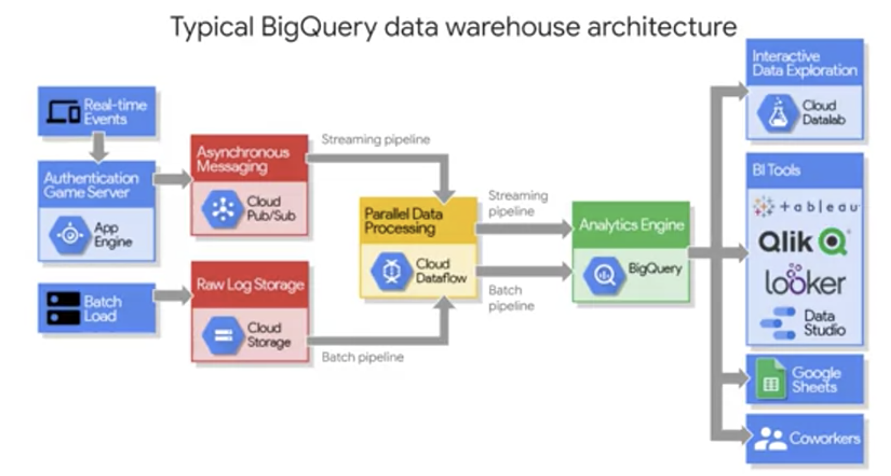

緑色の枠を見てください。BigQuery はデータパイプラインの終端にある分析エンジンです。  
左側から届くデータを保存し 分析とモデル設計を可能にします。 右端にはデータソースとしての BigQuery 経由で接続可能な分析ツールが並んでいます。  
ML 設計者は BigQuery 内のデータをクラウドの IPython ML ノートブックから簡単に呼び出せます。 ビジネスインテリジェンスアナリストはデータポータル、Tableau などの 可視化ツールに接続できます。  
また スプレッドシートを好む アナリストがいる場合は BigQueryのデータセットを直接 Googleスプレッドシートからクエリして データ全体にピボットテーブルなどの操作を実行できます。シートの行数に制限はありません。BigQueryはデータ分析ワークロードのデータ置き場だと覚えておいてください。ここにデータがあれば アナリストやデベロッパー、エンジニアが データにアクセスして分析を開始できます。

## 20 億行の GitHub コードを 30 秒未満でクエリする

BigQueryで大規模なクエリを実行してみます。すべてのGitHubリポジトリコードを含む既存の大規模な公開データセットを使います。ウェブUIで独自のデータを アップロードする方法も紹介します。 このデモは コマンドラインまたは BigQuery APIでも実行できます。が ウェブUIの素晴らしい最新機能に 注目してください。

25億行のGitHubコードに BigQueryからクエリを実行して 開発者は タブとスペースのどちらを好むのか という議論の答えを出します。 1,100万ファイルの各行に 解析と処理を行います。 最終的なレポートを Javaなどの 言語ごとに分類し 分析情報を解釈します。 早速 試しましょう GCPコンソールに戻ります。[ビッグデータ]から [BigQuery]をクリックします。 BigQuery全般の演習は 専用モジュールで提供されています。が 今回は大量データの処理を 簡単にお見せします。きっと使いたくなると思います。コードエディタがコンソール画面の大半を占めています。ここにスクリプトを記述します。今回は既存のものを貼り付けてデータを大規模に分析します。データセットがなければ 作成できます。

空のバケットとしてデータセットを作成したらその中にテーブルを作成可能です。データは Cloud Storage からファイルか ドライブリンクでアップロードできます。結果用の空テーブルを作成しておくことも可能です。読み込みはこの後のデモでも扱います。デモでは 既存のGitHubデータセットを使用します。データは[一般公開データセットを調べる] で確認できます。 「GitHub」と入力すると 多数表示されます。 これはGitHubのアクティビティデータです。 膨大な数のファイルが公開されています。 デモでは このデータセットを 実際に取り込んで分析します。これが デモで実行するスクリプトです。

コードの各部分を分割して記述しているのは タブとスペースのどちらが人気かを 確認するためです。 ウェブUIの優れた機能を一つご紹介します。 このプロジェクト用データのような 特定のテーブルがあるとします。 データの集合体です。 コマンドキーを押しながら このテーブル名をクリックすると テーブルに関する有益な情報を表示できます。 スキーマや存在する列 テーブルサイズなどの詳細を確認可能です。 その一部を見てみると データセット全体の行数が1,300万あり 処理サイズが133GBであることがわかります。 またSQLを実行せずに データを表示できるのも便利です。 [プレビュー]から 各コードファイルを表示できます。 画面を少し広げると [content]欄のセルに 実際のコードが表示されます。 コードの言語を取得するパスなど 多くの元データ情報を確認できます。 このデータの処理と分析を行う優れた言語が ここに書かれたSQLなのです。 ご想像どおり このコード全体で まず問題を分割する必要があります。 コードは １つのセル内にあるため 各行（line）をSPLIT関数で分割します。 これにより 巨大な１つのコードブロックが 配列に細分化されます。 実行してみます。

選択した部分のみを実行するには [実行]から [選択項目を実行]をクリックします。 巨大なコードブロックの各行（line）が １つの行（row）内で分割されました 後で詳しく見ます。が これは BigQueryの興味深い機能の一つです。 分割されても実際には１行として扱われます。 これは BigQueryが配列に ネイティブ対応しているためです。 これは１行です。 そこに新しいフィールド「line」を作成し プログラミングの配列として保存します。 これがSPLIT関数の機能です。 コードブロックの内容を改行して 個別の行（line）に分割します。 いよいよアクセスです。 ご想像どおり 先頭の文字がタブかスペースかを 確認して 議論の答えを出します。

UNNEST関数で 配列を展開して 情報を取得します。 関数で最初の文字を解析します。 各行の先頭の文字を確認します。 すべての行で先頭の１文字を確認して 比較します。 比較は 次のSQLで行います。 REGEXPで 先頭の文字が タブかスペースかを解析します。 解析が完了したら その結果をすべて集計し タブとスペースのどちらが人気かを比較します。 SQLの優れた集計関数も使われています。 行数を数えて タブとスペースの インスタンス数を合計し IF演算子で２つを比較します。 SQLの基本的な機能です。 次に ファイル名の最後に .JSが付くファイルパスを 抽出します。 その後 集計をフィルタします。 確定されたGitHubコードファイルのうち タブまたはスペースが 10未満のファイルを除外します。 これにより 重要なプログラムのみに 絞り込むことができます。 その後 合計から割合を計算したり 形式を整えたりといった作業をします。 不要な行はコメントアウトします。 これらをすべて実行して 何百万行ものコードを処理します。

今回は少し前にこのデモを実行済みなので すぐに結果が返ります。 BigQueryにクエリが キャッシュされているためです。 キャッシュしない場合の速度も確認できます。 本当の速さを 知りたいです。よね キャッシュの使用なしでも実行可能です。 通常は キャッシュを使用します。 誰かがすでに実行していれば 再実行する人が キャッシュ済みクエリを 活用しない手はありません ご覧のように13秒で 133GBの 一般公開データセットを処理しました では 行を拡張して 分析を進めましょう 人気の言語を 行数ではなく ファイル数で確認できます。 行数だと Cが人気で ファイル数だと Javaが人気のようです。 ファイル数以外でも ソートでき SQLのORDER BYやTableau Looker、 データポータルのダッシュボードなどを使えます。 タブとスペースの比率に注目しましょう ざっと見るとC言語以外は スペースが圧倒的に優勢だとわかります。 C言語ではタブの方がやや多くなっています。 その他の方法、特に手動では得られない 分析結果も見てとれます。 Go言語の結果は他と逆です。 タブが非常に人気なのは Goのみです。 Goについて検索してみると コンパイラが原因のようです。 コンパイラによって 自動挿入される仕組みになっているだけで 意図的にスペースよりもタブを 多く使用しているわけではなさそうです。 このように BigQuery では インフラなしで大量のデータを高速処理できます。 ワークロードに対応するためのクラスタの起動や 複数クエリによる負荷などの心配は不要です。 その他にも 多くの機能があります。 最後に ご興味のある方向けに 統計の機能を紹介します。 新しいウェブUIの[実行の詳細]では 興味深い統計を表示できます。 [消費したスロット時間]とは？ 処理には13秒かかりましたが 49分とは？ この説明から 演算能力の単位だとわかります。 つまり BigQueryがすべてのワーカーで 50分間分の作業を大規模に並列処理しました その後 クエリの結果を 13秒で返したのです。 特に便利なのは ワーカーの起動やデータの移動 集計時のデータ共有などが不要な点です。 必要なのはSQLを記述して分析し クエリを実行することのみです。 抽象化され ユーザーは意識しませんが 並列の分散処理が行われます。 高レベルのBigQueryデモでした コースでは この後 SQLを書いて機械学習を行います。 ラボで 一般公開データセットを利用して MLモデルを構築します。

## 大規模なデータセットを SQL で探索、分析する
### BigQueryー高速な SQL エンジン

技術解説に進みます。実際の動作の仕組みです。BigQueryは 2 つのサービスから構成されています。高速SQLクエリエンジンと データ用のフルマネージド ストレージレイヤです。重要なのはサーバーレスで フルマネージドという点です。どの部分がGoogle Cloudで 管理されているのでしょうか ２つのサービスはGoogleの 内部ネットワークで接続されています。 この高速接続によって 計算とストレージが独立しています。 これらのサービスはフルマネージドであるため データの保存やマシンのスケーリングについて ユーザーが気にする必要はありません 各サービスをよりよく理解するために 仕組みを詳しく見ていきましょう 最初に ストレージサービスです。 ストレージサービスは 取り込んだデータを自動管理します。プロジェクト内のデータは データセットと呼ばれ それぞれにテーブルやビューがあります。 テーブルの各列は高圧縮されます。 またColossusファイルシステムが 耐久性と可用性を提供します。 このデータバックエンドは GoogleフォトやGmailでも使われています。 データへのアクセスは アクセスポリシーで関係者のみに制限されます。 詳しくは後で説明します。このサービスはバルクデータと ストリーミングデータを取り込み 大量のデータを即時に処理可能です。クエリサービスは インタラクティブクエリや バッチクエリを実行します。コンソール、ウェブUI、コマンドラインツール REST APIなどから送信されたものです。多くの言語が REST APIに対応しています。Cloud DataprocやDataflowなどへの BigQueryコネクタが 他のGCPデータ処理サービスとの間で 複雑なワークフローの作成を簡素化します。クエリサービスは インタラクティブクエリや バッチクエリを実行します。 コンソール、ウェブUI、コマンドラインツール REST APIなどから送信されたものです。多くの言語が REST APIに対応しています。

BigQueryコネクタは Cloud DataprocやDataflowなどに接続し 他のデータ処理サービスとの間で 複雑なワークフローの作成を簡素化します。GCPではあらゆるものを相互運用できるのです。他の場所にあるデータへの クエリも実行できます。 対象テーブルのCSVファイルが Cloud Storageにあっても大丈夫です。 ただしBigQuery以外の場所でも 実行できるとはいえ ネイティブBigQueryストレージの データを扱うのが一番効率的です。 ストレージとクエリの両サービスは内部連携して 大規模なクエリを効率よく実行します。 クエリの実行を開始した後に SQLの構文を最適化することもあります。 クエリのリソースとコストの管理で重要なのは 処理データの量を制御することです。 基本的に 出力結果を得るために必要な 列のみを選択するようにします。 最初は広い範囲のデータセットから始めて 徐々に重要な列や行に絞り込むとよいでしょう この動画の作成時点で BigQueryでは 毎月無料で１TBのクエリ処理データと 10GBのストレージを使用できます。

### データ品質
通常 データセット内の データの品質は事前にわかりません。そこでSQLで 異常がないか調べてフィルタします。たとえば、誕生日のない顧客レコードを除外するために member_birth_yearを `IS NOT NULL` でフィルタするなどです。UIを使ってデータ品質を調べるなら Cloud Dataprepをご検討ください。Trifactaが提供するGCPプロダクトです。 Dataprepではデータセットを ビューに読み込んで調査できます。 このような 列のヒストグラムチャートを利用できます。 これは 世界中の気象観測所の場所を示しており 特定のデータセットに基づいています。 右端の「state」列では ３つほどの値に偏っていることが 強調表示されています。 このことから 一部の州に 観測所が多くあると推測できます。 カリフォルニアなどの大きな州かもしれません 縦棒にカーソルを置くと 値が表示されます。 この横棒グラフは データの列にある値が 期待されるデータ型に どの程度マッピングされているかを示しています。 Dataprepは アメリカの州の 許容値または列挙値を把握しており 「state」に対する 19,940の 欠損値（null値）の存在を示しています。 原因は何でしょうか？ 観測所の情報は世界中から収集されており 「state」列が任意項目だからかもしれません Dataprepで フィルタパイプラインを作成して 全件のうち「country」列が「US」の 観測所評価レコードのみを受信したい場合はレシピと呼ばれる。こうした変換ステップをセットアップできます。その後 Cloud Dataprepジョブを実行するとジョブは Cloud Dataflowに委任されそこで大規模なデータパイプラインの処理が行われます。Cloud Dataprepを使うメリットが大きいのは UIでデータを調査し パイプラインの構築に かける時間を最小化したい場合です。 最後に Dataprepなら パイプラインを 事前設定した間隔で定期的に実行できます。 SQLと調査を BigQueryで行いたい場合は SQLでクエリをスケジュールできます。 使うのは @run_timeパラメータ、または クエリスケジューラとBigQuery UIです。 スケジュール方法に関するリンクを コースリソースで提供します。 データから得られる価値ある分析情報を紹介しました。次はデータセキュリティです。 分析情報は データへのアクセス権を持つ人とのみ 共有する必要があります。BigQueryは ユーザーとチームがCloud IAMで設定した データセキュリティの役割を継承します。 

Cloud IAMのプロジェクト閲覧者は BigQueryのジョブを開始できます。が データセットは作成できません 編集者はデータセットを作成でき オーナーなら その削除も可能です。 デフォルトのアクセスデータセットは データセットごとに上書きできます。 Cloud IAMの範囲を超え BigQueryでは列と行に詳細な制御も設定できます。これには 新しいデータカタログサービスと 承認済みビューなどの高度な機能を使用します。 データセキュリティを実現するには 適切な権限を適用して データセットを作成するだけでなく データアクセスポリシーを文書化して 配布する必要があります。 ポリシーには データ共有の方法、状況、理由、対象者を明記します。 健全なデータアクセス制御のためにはまず GCPプロジェクトに関連付けられた ユーザーとグループを 各データセットで定期的に監査します。 本当に オーナーや管理者である必要があるか 職務上 限定的な役割でも十分かを検討します。 データセットのテストや編集を本番環境のみで行うのは失敗の元です。コードと同じです。完全に分離されたGCPプロジェクトか各種環境のテスト用データセットを持つのが賢明です。これにより意図しないデータ損失やエラーを防ぎます。

### BigQuery マネージドストレージ

クエリを高速で実行するだけでなく BigQuery はデータセットのストレージとメタデータも管理します。前述したように BigQuery はさまざまな形式のデータセットを取り込めます。ネイティブストレージののデータは BigQuery チームが管理します。 自動複製やバックアップを行い クエリに応じて自動スケールを設定します。 ユーザーは一定期間最近削除されたテーブルを復元可能です。 また 外部データソースに直接クエリできます。 この場合 BigQueryの 管理ストレージは使用されません たとえば Google Cloud Storageにある 生のCSVファイルに対してクエリを書けます。 BigQueryに データを取り込む必要はありません 一般的なユースケースの外部データソースは 小規模です。が常に変化しています。 たとえば 別のチームが商品の価格表を管理し 常に更新している場合です。 です。が そうした利用は避けるべきです。 まず 取り込まれた外部または 連携データソースは一貫性が保証されません 外部データが移動中に変更された場合 BigQueryは そうした更新の把握を保証しません その場合 Cloud Dataflowで BigQueryにストリーミングデータパイプラインを 構築しましょう これは 次のモジュールで解説します。 データセットを CSVなどで バッチとして取り込むだけでなく API経由で レコードを ストリーミングすることもできます。 ただし コードの制約がいくつかあります。 ストリーミングで挿入する 行の最大値は１MBです。 最大スループットは プロジェクトごとに毎秒10万レコードです。 より高速な 毎秒数百万件の スループットが必要だとします。 たとえばアプリケーションロギングや イベント追跡などです。 その場合 Cloud Bigtableによる データ同期がおすすめです。 膨大な件数を BigQueryと APIにストリーミングする場合 その他の解決策も検討しましょう データの変換、テーブルと行への集計、 他のデータソースとの結合や ストリーミング途中の副入力、あるいは データウィンドウが必要な場合は Cloud Dataflowの データパイプラインがおすすめです。 この解決策については 次のモジュールで説明します。 最後に データベース設計に詳しい方は 正規化をご存じでしょう 巨大なマスターテーブルを 複数の子テーブルに分割することです。 １つの事実を１つの場所に保存し レコードの重複をなくします。 たとえば このタクシー会社のデータからは 支払い、イベントの日時、経緯度の地理情報、 乗車降車などを追跡できます。 データは個別のテーブルに登録されています。 このデータソースで レポートを作成するにはどうします。か？

 「SQL JOINを大規模に実行する」は 確かに正解です。 テーブルを サイロに分割するのが リレーショナルデータベースでは一般的です。 MySQLなどが その例です。 しかし データウェアハウスで レポートテーブルを構成する 新しい方法をご紹介します。 
 
 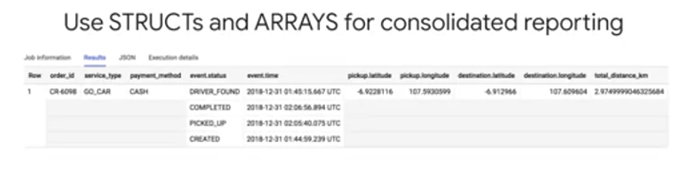

 テーブルの上部を見てください 初めて見るようなものがありませんか？ まず 行が１つあります。 しかし 4 行に見えるのはなぜか？ 「event.time」列 この列のデータ型は配列です。 複数のデータ値を持つことができ ここでは１つのタクシー予約に対する 複数の時刻を示しています。 同様に 時刻に対応する ステータス値の配列が表示されています。 テーブルは１つでも 高度な結果を得られます。 予約数の他に 完了済み予約数も合計できるのです。 複雑な結合を実行する必要はありません
 
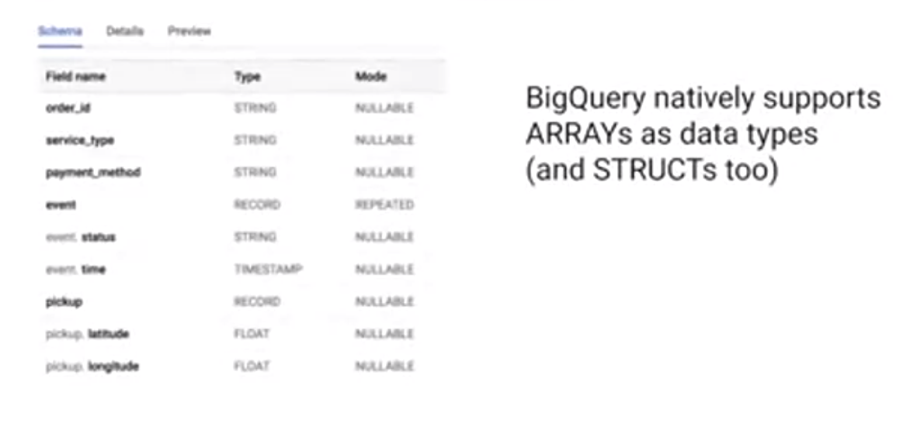

2 つ目は 一見わかりにくい特徴です。 列の名前です。 家系の名前のように見えます。 event.statusや event.time destination.latitudeなどがあります。 これらのグループ化された列は SQLのデータ型で 構造体と呼ばれます。 このテーブルのスキーマを調べると イベント列のデータ型レコードが 構造体のデータ型を示していることがわかります。 構造体は その他の列の集合体 つまりテーブルのようなものといえます。 レポートの観点では ネストされた多数の構造体が １つのテーブル内にあります。 事前結合された多数のテーブルが １つの大きなテーブルになっているイメージです。 これなら大規模なデータセットに 高速にクエリを実行できます。 複雑なテーブル結合も不要です。 大きな利点としては １つのテーブルに すべての列があるので １か所にまとめて分析できます。 結合キーや テーブルの粒度の差を 気にしなくても済みます。

## BigQuery GIS を使用して地理データを分析する
### 地理データから得られる分析情報

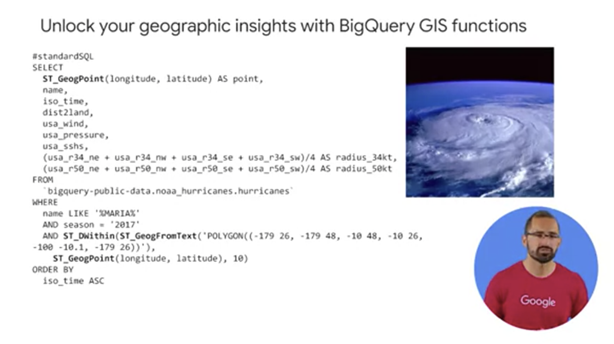

BigQueryは地理情報システム（GIS）をネイティブサポートしているので経緯度などの地理的データポイントから 分析情報を得られます。その方法を見ていきましょう。この画面のSQLクエリでは SQLとGISを使用して ハリケーンの進路をプロットします。 まず 緯度と経度に基づく 地理的ポイントを作成します。 風速、上陸までの距離、半径などの 有用なデータも取り込みます。 これらは NOAAから取得した 一般公開データセットにあります。 特定のハリケーンをフィルタします。 WHERE句に「ハリケーンマリア」とあります。 2017年のものです。ね さらに 必要なポイントを GIS WITHIN関数で地理的に結び付けて 地図の対象領域に一致させます。 これで ポイントを可視化できます。 最後に Geo Vizでポイントを調べます。 Geo Vizは BigQueryの 地理空間データの可視化ツールで Google Maps APIを使用します。 このように ハリケーンが アメリカに上陸する進路がわかります。 データ分析のコツは さまざまなデータセットで練習することです。 一般公開データセットプログラムのパートナーが BigQueryで データをホストしています。 これらは 一般の人が分析に利用できます。 現在 100種類以上のデータがあり BigQueryウェブUIの[データを探索]で 検索できます。 自分のデータのすぐ上にあります。 簡単な演習を行いましょう 興味のあるデータセットを検索してください その後 次の項目を確認します。 データセットの名前は？ テーブルに含まれるレコード数は？ プレビューしてみて品質に懸念はないか？ スキーマの分析後 どのような有益な情報を得られそうか？ 結合することで追加の分析情報を 得られそうなデータセットはあるか？ じっくりとデータセットを探索しましょう。

## BigQuery ML で SQL を使用して機械学習を適用する
### 構造化データ用の ML モデルタイプの選択

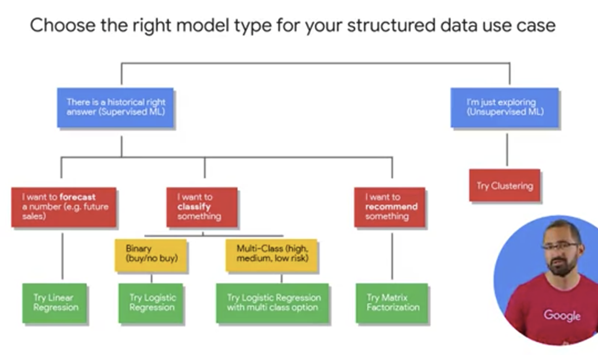

まず どのような活動に 取り組もうとしています。か？ 正しい答え、事実に基づく答えを 過去のデータから取得できそうです。か？ それが可能なら 教師あり学習が望ましいでしょう または データを吟味しながら 未知の関係を探りたいなら クラスタリングモデルを使用する 教師なし学習を試しましょう 教師なし学習は このコースの対象外です。が BigQuery MLによるクラスタリングモデル についてのリソースを 後でご紹介します。 ここで取り組む問題の大半は ３つの項目に分かれます。 １つ目は予測です。 たとえば 来月の売上高や 製品需要の予測などです。 ２つ目は分類です。 たとえば リスクの大小、 購入の要不要による分類です。 ３つ目は推奨です。 特定ユーザーに商品をすすめる場合などです。 予測か分類かを 簡単に見分けるには 対象のデータで ラベル列という特別な列の種類に注目します。 ラベル列については後述します。 それが 販売数や収益などの数値データ型なら 多くの場合 予測に相当します。 文字列値なら 分類に相当します。 この行はどのクラスに分類されるか というタイプの問題です。 複数のクラスやバケットがあり 高い、低い、中程度などに分類する場合は マルチクラス分類と呼びます。 問題の概要を捉えたら 目的の達成に役立つモデルの採用に進みます。 多くのタイプから 問題に合うモデルを選択できます。 おすすめは 単純であっても正確な ベンチマークの達成を判断しやすいモデルです。 MLベンチマークとは モデルのパフォーマンスを許容する最低基準です。 本番データで使用できるかどうかも考慮します。 これは モデルのトレーニング前に 設定することが重要です。 どのモデルを採用するかを 客観的に判断するためです。 

ではモデルのタイプに進みます。 予測の場合 線形回帰をおすすめします。 分類であれば ロジスティック回帰です。 分類先のクラスまたはバケットが ２つのみの場合 ２項ロジスティック回帰と呼ばれます。 複数の場合はマルチクラスと呼ばれます。 推奨には 行列分解を選択しましょう これは一般に ユーザーとアイテムの行列が 必要な問題のアルゴリズムに使用されます。 住宅の賃貸などです。 全体図に戻ります。 BigQuery MLで使用する 線形回帰などの モデルタイプを特定できたら 後の操作は BigQueryに任せられます。 聞いたことがあるのに ここにないモデルタイプはあります。か？ この図にないモデルタイプも 数多くあります。 より高度なディープニューラルネットワーク、 デシジョンツリー、 ランダムフォレストもモデルに使用できます。 ニューラルアーキテクチャ検索を行う モデルによって ディープニューラルネットワークの 構築も可能です。 Auto MLなら コード記述なしでそれが可能です。 今回ご紹介したシンプルなモデルは 高度なモデルの構築を行える人にもおすすめです。 トレーニングに時間がかからず MLによって 問題を実際に解決できるかどうかの 判断も容易だからです。

### 顧客のライフタイム バリューの予測

モデルの種類を把握したら 高品質のトレーニングデータをモデルに与えて 学ばせる必要があります。 それが機械学習の「学習」です。 「機械」は 線形回帰などの アルゴリズムに相当します。 「学習」とは モデルが既知データと 未知データの関係について行う分析です。 だから モデリングと呼ぶのです。 人は知識をもとに 現実を予測しようとします。よね 構造化データセットにおける機械学習の 主な概念を理解するには 次の例が最適です。 このシナリオでは モデルによって顧客生涯価値を予測します。 生涯価値（LTV）は 一般的なマーケティング指標です。 これを使って 顧客から得られる収益や利益を予測します。 その際 顧客の履歴や よく似た顧客を考慮します。 使うのはGoogleアナリティクスの eコマースデータセットです。 Googleのオンラインストアで得られたものです。 ストアではTシャツなどを販売しています。 目標は 価値の高い顧客に絞って 特別プロモーションや特典を提供することです。 データを調べたところ モデルに 活用できそうな列がいくつかありました ある顧客の価値が高いかどうかを ウェブサイトでの行動から判断できそうです。 これらのフィールドには 全期間のページビュー、合計訪問回数、 平均滞在時間のほか 各訪問者からの総収益や 以前の取引数などの値があります。 この７件のレコード以外にも 多くのデータが必要です。 何万ものデータを集めて モデルに与える必要があります。 その前に データサイエンティストや ML技術者が使用する言語で 列のデータを定義します。 先ほどのeコマースの例で説明します。 レコード つまり行は インスタンスまたは観測情報を表します。 この表には８つのインスタンスがあります。 「ラベル」は 過去の正しい答えを示します。 特定の顧客の購買額などです。 この列の将来のデータは不明なので モデルのトレーニングと予測が必要です。 たとえば 過去に取引のあった顧客が ウェブサイトに長時間滞在したとします。 多くの場合 その顧客のLTVは 高くなります。 こうした予測を 同じ行動をとる新しい顧客にも応用できます。 これで 数値を予測できます。 では 採用すべきモデルタイプは？ 「まずは線形回帰」と答えた皆さん 正解です。 ところで 私は 次のようには説明しませんでしたね 「この行の取引が10を超えた場合 1,000を超える収益を期待できる」 前述のように 機械学習では モデルに列のデータを与え その関係性をもとに ラベルの値を正確に予測させます。 一部の列は結果の予測に まるで役立たない場合もあります。 後で説明します。が このことを把握するには モデルが学習した内容を検査します。 ラベルは 価値が高い、高くないなど バイナリ値の場合もあります。 クラス、数値など 予測対象が何かによって モデルの選択が大きく左右されます。 この図のラベルは 顧客の価値が高いかどうかを示しています。 他のデータ列は何と呼ばれるでしょう？ こうした列は「特徴」と呼ばれます。 または 特徴を持つ可能性がある列です。 これらがモデルに入力されます。 各列は キッチンの棚から取り出せる 食材のような役割を果たします。 私の娘がよく言うように 食材を全部使うと夕食が台無しになります。 特徴量エンジニアリングのプロセスで すべてのデータをふるいにかけます。 データアナリストやデータサイエンティストが 最も時間をかける作業です。 科学でありながら芸術の域です。 各列の品質を把握し 他のチームと協力しながら さらに多くの特徴や履歴を収集します。 多くの場合 MLプロジェクトで 最も大変な作業です。 特徴は「特徴量エンジニアリング」で 結合や変換も行えます。 難しそうに聞こえます。が 列の計算や結合をSQLで書いたことがあれば 特徴量エンジニアリングの基本をご存知です。 それに 手間のかかる作業は BigQuery MLに任せられます。 カテゴリ変数の ワンホットエンコーディングを行ったり トレーニングや評価用に 自動分割したりする操作です。 将来のデータを予測する方法を 見ていきましょう ラベルを用意していない 新しいデータが 入力されたとします。 この顧客のLTVが 高いかどうかはわかりません しかし 過去のラベル付きデータが大量にあり モデルのトレーニングに使用できます。 上の既知データで モデルをトレーニングして そのパフォーマンスに満足したら 下の未知データで その予測能力を活用できます。

### BigQuery ML: SQL でモデルを作成する

BigQueryで SQLを使用して 前述のモデルを作成する方法を説明します。 その間にたどる プロジェクトフェーズも確認します。 MLモデルの構築経験があれば モデルの作成とトレーニングに 非常に時間がかかることをご存じでしょう まずは 少量のデータを データストアからエクスポートして IPython Notebookやpandasなどの データ処理フレームワークに 取り込む必要があります。 カスタムモデルなら データの変換と前処理に加え 特徴量エンジニアリングを行います。 その後 モデルにデータを与えます。 TensorFlowなどの ライブラリでモデルを構築できたら ローカルやVMで トレーニングを行います。 小規模なモデルでは データの特徴を新しく作成したり パフォーマンスを向上させたりを 何度も繰り返します。 大変すぎて数回で挫折しそうです。 以前は IPython Notebookのような 技術に詳しくなければ 機械学習は データサイエンティストに 任せるしかありませんでした しかし 今では BigQuery内の 構造化データセットでMLを操作可能です。 SQLにより 数分で完了します。 次のようにわずかな手順で BigQueryでMLを実行できます。 

- ステップ１ SQL文でモデルを作成します。 ここでは 自転車シェアのデータセットを使います。

    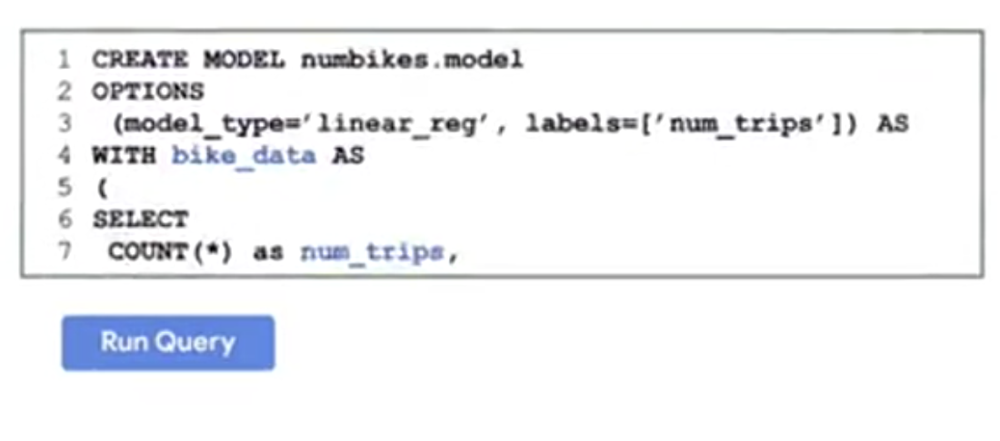

- ステップ２ SQLで予測クエリを書き ML.PREDICTを呼び出します。

    

- ステップ３ 結果を得られます。

これだけの手順で モデルを確立して結果を確認できます。 実際には３つ以上のステップがあります。 モデルの評価が必要だからです。 しかし重要なのは SQLの基本知識があれば 機械学習を操作できることです。 BigQuery MLでは シンプルさが重視されています。 高度なMLハイパーパラメータを 定義する必要はありません トレーニング開始前に 学習率などの モデルの微調整を行う必要がないのです。 トレーニングとテストのデータの 分割も不要です。 BigQuery MLは デフォルト値で それらを自動実行します。

さらに モデルオプションでは 正則化や戦略を自分で設定して データの分割とテストを行えます。 また学習率やパラメータ ハイパーパラメータを手動設定できます。 では すぐ使える機能は何でしょう？ BigQuery MLは 標準SQLで実行され BigQuery内で動作するため ユーザー定義の関数やサブクエリなど 通常のSQL構文を使用して 異なるテーブルを結合できます。 そうして トレーニング用のデータセットを作成します。 モデルタイプでは 予測向けの線形回帰 または ２項と多項のロジスティック回帰の いずれも選択できます。 これ以外にも多数のモデルを追加中です。

モデル評価の一環として ROC曲線、精度、適合率-再現率曲線なども 分類モデル向けに利用できます。 モデルのトレーニング後に SQL文を書いた場所から選択できます。 コードを避け トレーニングしたモデルを クリックすることもできます。 これはデータセット内の オブジェクトになっており 評価を表示するタブがあります。 私のお気に入りは モデルの重みを検査して 特徴分布を分析できる機能です。

### ML モデルのライフサイクルの段階

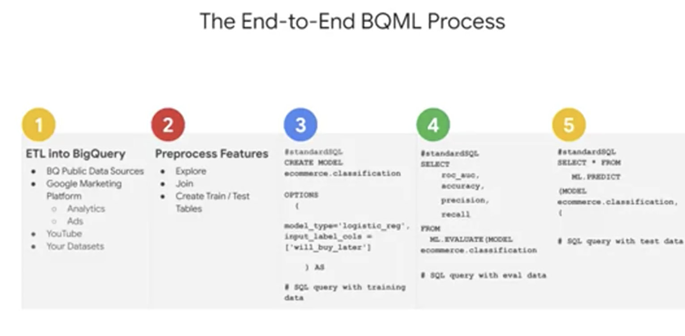

BigQuery MLプロジェクトの 主なフェーズを確認します。 コード記述とモデル作成は 楽な部分だとわかるでしょう 適切なデータをモデルに取り込む作業は 常に困難を伴います。 全体のプロセスは このようになります。 

まず BigQueryにデータがない場合は データを取り込みます。 SQLで他のデータソースを結合すれば 既存のデータを充実させることができます。 AdWordsやYouTubeなどの データ製品をすでに使用していれば そのデータを コネクタで簡単に取り込めます。 独自のパイプラインは不要です。

次は 特徴の選択と前処理のステップです。 このコースで これまで見てきた内容に似ています。 ここでは SQLのスキルを駆使して モデルの学習に効果的な トレーニングセットを作成します。 BigQuery MLはワンホットエンコーディング のような前処理を自動実行できます。 これにより カテゴリ変数を モデルに必要な数値に変換可能です。

その後 実際の構文に移り BigQueryにモデルを作成します。 この小さなスペースに納まるほど短い構文です。 CREATE MODELで名前を設定し モデルタイプなど必須のオプションを指定して トレーニングデータセットとともに SQLクエリに渡します。 [クエリを実行]をクリックして モデルの動作を確認します。 

モデルのトレーニング終了後 新しいデータセットオブジェクトができます。 クリックするとメタデータが表示されます。 モデルに対するクエリを書いて 評価を確認する場合 ML.EVALUATEを使用して 評価データセットでの モデルのパフォーマンスを評価します。 ここでは 損失指標を分析できます。 予測モデルであれば 二乗平均平方根誤差、平均二乗誤差などです。 分類モデルであれば 曲線下の領域、精度、 適合率-再現率などを分析できます。 

モデルのパフォーマンスに満足できたら 予測に使用できます。 クエリはさらに単純です。 ML.PREDICTコマンドを トレーニングしたモデルに対して呼び出すと 予測とともに これらの予測におけるモデルの信頼度が返ります。 このクエリを実行すると 結果に新しいフィールドがあります。 ラベルフィールドの名前に 「predicted」が追加されています。 それが そのラベルに対するモデルの予測です。

### BigQuery ML: 主な機能のチュートリアル

MLプロジェクトの主なフェーズを 学んだ皆さんに 私が気に入っている BigQuery MLの高度な機能を紹介します。 

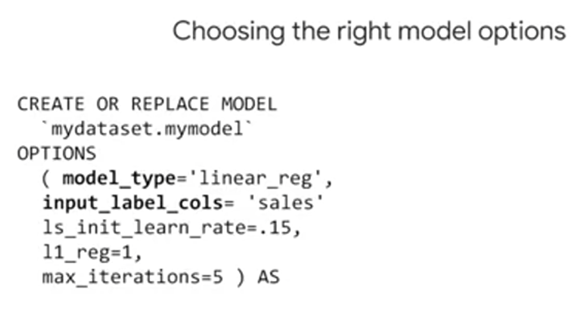

モデルは CREATE MODELで 簡単に作成できます。 既存のモデルを上書きするには CREATE OR REPLACE MODELを使います。 モデルにはオプションがあり 必要に応じて指定できます。 最も重要で 唯一必須のオプションは model_typeです。 予測なら線形回帰 分類ならロジスティック回帰です。 今後さらに選択肢が増えます。 学習率を設定して学習期間を短縮したり ハイパーパラメータで正則化を行い 過学習を防いだりすることも可能です。 

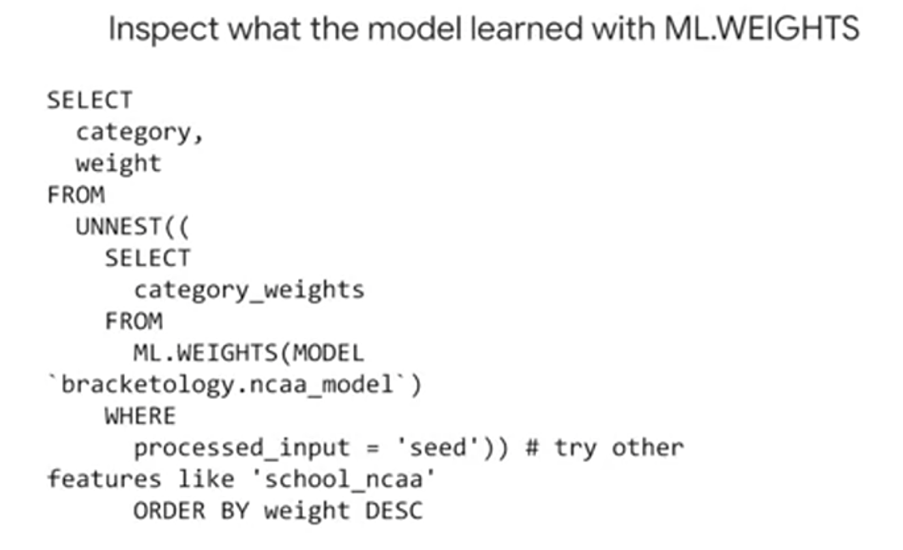

モデルが学習した重みを確認することで モデルが各特徴に対して設定した 重要度がわかります。 これを行うには 該当の入力列で ML.WEIGHTSを使用してフィルタします。 各特徴の列に -１から１の重みが出力されます。 数値が -１または１に近いほど フィールドが そのモデルサイズで 該当ラベルの値の予測に役立つことを意味します。 これは 本当に気に入っている機能です。 モデルのパフォーマンスを評価するには トレーニング済みのモデルに `ML.EVALUATE` を実行します。 モデルタイプに応じて 異なるパフォーマンス指標を得られます。 UIで確認するには モデルオブジェクト またはデータセットをクリックすると メタデータが表示されます。 私はものぐさなので これをよく使います。 予測は簡単です。 トレーニング済みのモデルに対して `ML.PREDICT` を呼び出し 予測対象のデータを渡します。 

では クイックリファレンスを使って 最後の重要な確認をしましょう このページは 印刷にも便利です。 

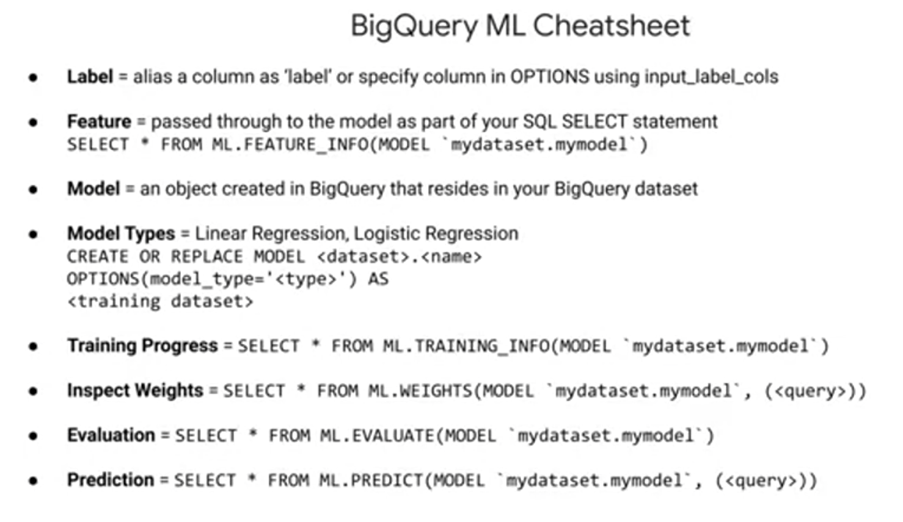

まず BigQuery MLでは トレーニングデータセットに「label」という 名前のフィールドが必要です。 または モデルオプションのinput_label_colsで ラベルフィールドを指定します。 特徴は CREATE MODEL文の後のSELECT文で データ列としてモデルに渡されます。 モデルのトレーニングが終わったら `ML.FEATURE_INFO` で その列の統計と指標を 取得して 分析をさらに進められます。 

次は モデルオブジェクトそのものです。 トレーニング対象のモデルは すべてBigQueryデータセット内のオブジェクトに 基づいており テーブルによく似ています。 モデルオブジェクトをクリックすると 最終更新日や 完了したトレーニング数を 表示できます。 新しいモデルは CREATE MODELで 簡単に作成できます。 モデルタイプを選択して トレーニングデータセットを渡します。 予測対象が 翌年の売上など 数値フィールドの場合 線形回帰（予測）がおすすめです。 高、中、低や スパムかどうかなど 別個のクラスの場合は ロジスティック回帰（分類）を検討します。 モデルの実行中 または完了後でも `ML.TRAINING_INFO` で トレーニングの進捗を確認できます。 前述したように 予測対象のラベルに関連して モデルに学習させた 各特徴の重要度を確認できます。 素晴らしい機能です。 モデルの重み付けと呼ばれます。 評価データセットに対するモデルの性能は `ML.EVALUATE` で確認できます。 最後に `ML.PREDICT` は トレーニング済みのモデルと 予測データセットを参照して 予測を返します。 `ML.PREDICT` で重要な点を挙げます。 最初はトレーニングの対象外だった列を追加し その列が 未知のラベルとなった 新しいデータセットを渡したとすると モデルは予測中に 自然には再トレーニングされません また 予測データセットの列を削除したり 列の名前を変更したりすると モデルがトレーニング中にそれを参照した際に エラーが返ります。 

これが４つの主なステップです。 

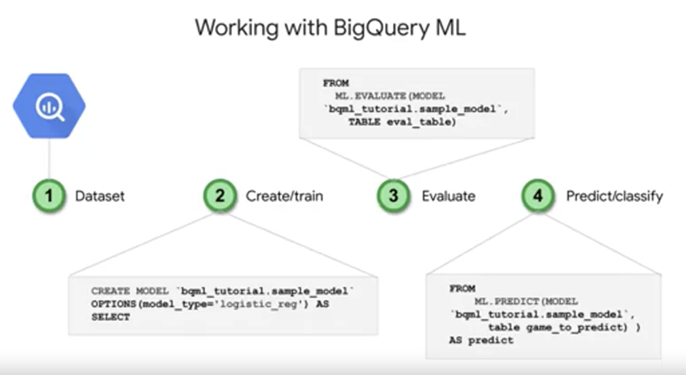

1. SQLクエリを作成しトレーニングデータを BigQueryから取得
1. タイプを指定してモデルを作成
1. モデルを評価し 要件を満たしていることを確認
1. BigQueryから取得したデータを モデルで使用して予測

BigQuery MLを全体的に説明する場合 私はよく これらの要点を挙げます。

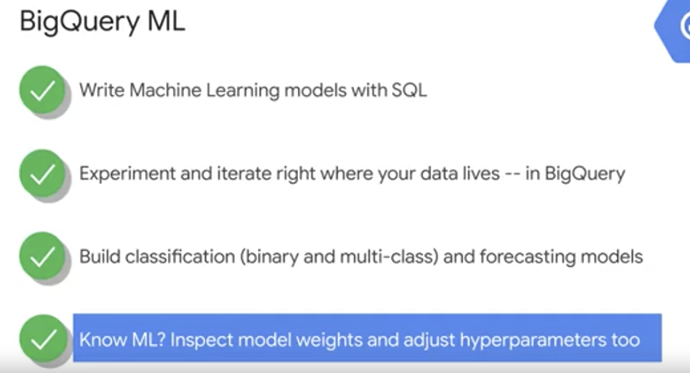

BigQuery MLでは SQLでMLモデルを作成し データが存在する場所 つまりBigQueryで 実験とイテレーションを行えます。 現在 ２項と他項による分類と 予測のモデルを構築できます。 モデルタイプは追加予定です。 MLに詳しい方は モデルオプションと 重みの詳細をご確認ください BigQuery MLでは デフォルト以外の一般的な調整機能として 学習率の指定、正則化、 トレーニング評価用データセットの分割や クラスの重みの事前定義を行えます。 他にも多数の機能があります。 BigQuery MLのドキュメントリンクを ご確認ください 新しい機能が常に追加されています。

## BigQuery ML で訪問者の購入を予測する

次のラボでは、実際の Google Ecommerce サイトの e コマースデータを使用します。https://shop.googlemerchandisestore.com/
サイトの訪問者と注文のデータがあらかじめ BigQuery に読み込まれています。あなたは機械学習モデルを構築して、訪問者が再びサイトを訪れて商品を購入するかどうかを予測します。

### 概要
BigQuery の新機能である BigQuery ML（BQML、ベータ版）を使用すれば、最小限のコーディングで機械学習モデルを作成、トレーニング、評価し、予測を行うことができます。

Google Merchandise Store に関する多数の Google アナリティクス レコードが格納された e コマース データセットが新たに BigQuery に読み込まれ、利用可能になっています。このラボでは、このデータを使用して一般的なクエリを実行し、企業が知りたいと考えている顧客の購買習慣に関する情報を取得します。

### 目標
このラボでは、次のタスクの実行方法について学びます。

- BigQuery を使用して一般公開データセットを見つける
- e コマース データセットをクエリして調べる
- バッチ予測に使用するトレーニングと評価のデータセットを作成する
- 分類（ロジスティック回帰）モデルを BQML に作成する
- 機械学習モデルの性能を評価する
- 訪問者が購入する見込みを予測し、ランクを付ける

### ハンズオン

- BigQuery コンソールを開く
    - Google Cloud Console で、ナビゲーション メニュー > [BigQuery] を選択
- [Cloud Console の BigQuery へようこそ] メッセージ ボックスが開きます。このメッセージ ボックスにはクイックスタート ガイドへのリンクと、UI の更新情報が表示されます。
- [完了] をクリック

#### コース用データセットにアクセスする

BigQuery を開いたら、新しいブラウザタブで次の直接リンクを開いて、一般公開の data-to-insights プロジェクトを BigQuery プロジェクト パネルに取り込みます。

https://console.cloud.google.com/bigquery?p=data-to-insights&d=ecommerce&t=web_analytics&page=table

data-to-insights e コマース データセットのフィールド定義については、[こちら](https://support.google.com/analytics/answer/3437719?hl=ja) をご覧ください。このリンク先のページは、参照用に新しいタブで開いたままにしておきます。

### e コマースデータを探索する
シナリオ: データ アナリスト チームが、e コマース ウェブサイトに関する Google アナリティクスのログを BigQuery にエクスポートし、e コマース訪問者のセッションの生データをすべて含むテーブルを作成して、データを探索できるようにしました。このデータを使用して、いくつかの質問に対する答えを見つけていきましょう。

質問: ウェブサイト訪問者の何パーセントが実際に購入したか。

[エディタを表示] をクリックして、以下を [クエリエディタ] フィールドに追加します。

```sql
#standardSQL
WITH visitors AS(
SELECT
COUNT(DISTINCT fullVisitorId) AS total_visitors
FROM `data-to-insights.ecommerce.web_analytics`
),

purchasers AS(
SELECT
COUNT(DISTINCT fullVisitorId) AS total_purchasers
FROM `data-to-insights.ecommerce.web_analytics`
WHERE totals.transactions IS NOT NULL
)

SELECT
  total_visitors,
  total_purchasers,
  total_purchasers / total_visitors AS conversion_rate
FROM visitors, purchasers
```

[実行] をクリックします。

結果: 2.69%

質問: 売上の上位 5 つの商品は何か。

クエリエディタに以下のクエリを追加して、[実行] をクリックします。

```sql
SELECT
  p.v2ProductName,
  p.v2ProductCategory,
  SUM(p.productQuantity) AS units_sold,
  ROUND(SUM(p.localProductRevenue/1000000),2) AS revenue
FROM `data-to-insights.ecommerce.web_analytics`,
UNNEST(hits) AS h,
UNNEST(h.product) AS p
GROUP BY 1, 2
ORDER BY revenue DESC
LIMIT 5;
```

結果:

|Row|v2ProductName|v2ProductCategory|units_sold|revenue|
|--|--|--|--|--|
|1|Nest® Learning|Thermostat 3rd Gen-USA - Stainless Steel|Nest-USA|17651|870976.95|
|2|Nest® Cam Outdoor Security Camera - USA|Nest-USA|16930|684034.55|
|3|Nest® Cam Indoor Security Camera - USA|Nest-USA|14155|548104.47|
|4|Nest® Protect Smoke + CO White Wired Alarm-USA|Nest-USA|6394|178937.6|
|5|Nest® Protect Smoke + CO White Battery Alarm-USA|Nest-USA|6340|178572.4|

質問: ウェブサイトを再訪問して購入した人は何人か。

次のクエリを実行して調べます。

```sql
# 再訪問時に購入した人（最初の訪問時に購入した人も含む）
WITH all_visitor_stats AS (
SELECT
  fullvisitorid, # 741,721 unique visitors
  IF(COUNTIF(totals.transactions > 0 AND totals.newVisits IS NULL) > 0, 1, 0) AS will_buy_on_return_visit
  FROM `data-to-insights.ecommerce.web_analytics`
  GROUP BY fullvisitorid
)

SELECT
  COUNT(DISTINCT fullvisitorid) AS total_visitors,
  will_buy_on_return_visit
FROM all_visitor_stats
GROUP BY will_buy_on_return_visit
```

結果:

|Row|total_visitors|will_buy_on_return_visit|
|--|--|--|
|1|729848|0|
|2|11873|1|

結果を分析すると、総訪問者の 1.6%（11,873÷729,848）がウェブサイトに戻ってきて、購入していることがわかります。この人数には、最初のセッションで購入し、再度訪問してもう一度購入した人も含まれます。

What are some of the reasons a typical ecommerce customer will browse but not buy until a later visit? Choose all that could apply.

- ✅ The customer wants to comparison shop on other sites before making a purchase decision.
- ✅ The customer is waiting for products to go on sale or other promotion
- ✅ The customer is doing additional research

このような行動は、訪問者が購入を決定する前に入念な事前調査と比較が必要になる高額な商品（自動車など）の場合に顕著に見られます。が、このサイトにあるようなそれほど高額ではない商品（T シャツやアクセサリーなど）にも当てはまります。

オンラインマーケティング業界では今後、初回訪問で観察された特徴に基づいて将来購入に至るユーザーを識別してマーケティング活動を行うことが、コンバージョン率を上げ、競合他社のサイトへのユーザーの流出を抑える鍵となるでしょう。

### 対象を特定する
ここからは、BigQuery で機械学習モデルを作成し、新しいユーザーが将来的に購入を行うかどうかを予測します。こうした高い価値を持つユーザーを識別することで、マーケティング チームがそれらのユーザーにターゲットを絞って特別プロモーションや広告キャンペーンを実施することが可能になり、それらのユーザーが自社の e コマースサイトを再度訪問するまでの間に他のサイトと比較していたとしても、コンバージョンにつなげやすくなります。

#### 特徴を選択し、トレーニング データセットを作成する
Google アナリティクスでは、さまざまなディメンションを捉えてこの e コマース ウェブサイトへのユーザーの訪問が計測されます。フィールドの一覧をこちらで確認してからデモ データセットをプレビューし、ユーザーによるウェブサイト初回訪問のデータと、そのユーザーが戻ってきて購入するかどうかの関係を、機械学習モデルが理解するのに役立つ特徴を見つけます。

次の 2 つのフィールドが分類モデルに適した入力であるかどうかをテストしましょう。

totals.bounces（訪問者がウェブサイトをすぐに離れたかどうか）
totals.timeOnSite（訪問者がウェブサイトに留まった時間）

What are the risks of only using the above two fields?

- Whether a user bounces is highly correlated with their time on site (e.g. 0 seconds)
- Only using time spent on the site ignores other potential useful columns (features)
- ✅Both of the above

機械学習の精度は提供されるトレーニング データで決まります。入力した特徴とラベル（ここでは、訪問者が将来購入するかどうか）の関係をモデルに判断、学習させるための十分な情報が揃って初めて、精度の高いモデルを確立できます。これら 2 つのフィールドでモデルをトレーニングすることは出発点にはなります。が、精度の高いモデルを生成するために 2 つのフィールドだけで十分かどうかを見極める必要があります。

クエリエディタに以下のクエリを追加します。

```sql
SELECT
  * EXCEPT(fullVisitorId)
FROM

  # 特徴
  (SELECT
    fullVisitorId,
    IFNULL(totals.bounces, 0) AS bounces,
    IFNULL(totals.timeOnSite, 0) AS time_on_site
  FROM
    `data-to-insights.ecommerce.web_analytics`
  WHERE
    totals.newVisits = 1)
  JOIN
  (SELECT
    fullvisitorid,
    IF(COUNTIF(totals.transactions > 0 AND totals.newVisits IS NULL) > 0, 1, 0) AS will_buy_on_return_visit
  FROM
      `data-to-insights.ecommerce.web_analytics`
  GROUP BY fullvisitorid)
  USING (fullVisitorId)
ORDER BY time_on_site DESC
LIMIT 10;
```

[実行] をクリックします。

結果:

```
Row	bounces	time_on_site	will_buy_on_return_visit
1	0	15047	0
2	0	12136	0
3	0	11201	0
4	0	10046	0
5	0	9974	0
6	0	9564	0
7	0	9520	0
8	0	9275	1
9	0	9138	0
10	0	8872	0
```

ディスカッション: will_buy_on_return_visit は最初の訪問後にはわかりません。繰り返しになります。が、ここでは、ウェブサイトに戻ってきて購入するユーザーのサブセットを予測します。予測時に将来のことはわからないため、新しい訪問者が後から戻ってきて購入するかどうかについて確かなことはいえません。ML モデルを構築する価値は、最初のセッションについて収集されたデータに基づいて、将来の購入の確率を予測できる点にあります。

質問: 最初のデータ結果に注目すると、time_on_site と bounces は、ユーザーが戻ってきて購入するかどうかを示す良い指標であるといえるか。

回答: モデルのトレーニングと評価を行う前に結論を出すのは早すぎるかもしれません。が、time_on_site の上位 10 項目を見ると、戻ってきて購入したユーザーは 1 人だけでした。あまり確率は高くなさそうです。モデルの機能を検証してみましょう。

#### モデルを格納する BigQuery データセットを作成する
次に、新しい BigQuery データセットを作成します。このデータセットに ML モデルも格納します。

左側のパネルで対象のプロジェクト名をクリックし、[データセットを作成] をクリックします。
BQ_CreateDataset.png

[データセットを作成] ダイアログで、次の操作を行います。

[データセット ID] に「ecommerce」と入力します。

その他の値はデフォルトのままにします。

[データセットを作成] をクリックします。
BQML モデルタイプを選択し、オプションを指定する
最初に使用する特徴を選択したので、ML モデルを BigQuery に作成する準備ができました。

モデルタイプは次の 2 つから選択します。

|モデル|モデルタイプ|ラベルのデータ型|例|
|--|--|--|--|
|予測|linear_reg|数値（通常は整数または浮動小数点数）|過去の売上データから翌年の売上を予測。|
|分類|logistic_reg|0 または 1 のバイナリ分類|コンテキストに応じて、メールを迷惑メールまたは迷惑メール以外に分類。|

注: 機械学習で使用されているモデルタイプは他にも多数あります。（ニューラル ネットワークやディシジョン ツリーなど）。これらは TensorFlow などのライブラリで利用可能です。執筆時点で、BQML は上記の 2 つをサポートしています。

次のクエリを入力して、モデルを作成し、モデル オプションを指定します。

```sql
CREATE OR REPLACE MODEL `ecommerce.classification_model`
OPTIONS
(
model_type='logistic_reg',
labels = ['will_buy_on_return_visit']
)
AS

#standardSQL
SELECT
  * EXCEPT(fullVisitorId)
FROM

  # 特徴
  (SELECT
    fullVisitorId,
    IFNULL(totals.bounces, 0) AS bounces,
    IFNULL(totals.timeOnSite, 0) AS time_on_site
  FROM
    `data-to-insights.ecommerce.web_analytics`
  WHERE
    totals.newVisits = 1
    AND date BETWEEN '20160801' AND '20170430') # 最初の 9 か月分でトレーニング
  JOIN
  (SELECT
    fullvisitorid,
    IF(COUNTIF(totals.transactions > 0 AND totals.newVisits IS NULL) > 0, 1, 0) AS will_buy_on_return_visit
  FROM
      `data-to-insights.ecommerce.web_analytics`
  GROUP BY fullvisitorid)
  USING (fullVisitorId)
;
```

次に、[実行] をクリックしてモデルのトレーニングを行います。

モデルのトレーニングが終わるのを待ちます。（5～10 分）。

注: 利用可能なデータすべてをモデルのトレーニングに使用することはできません。これは、モデルの評価とテストのために、モデルにとって未知のデータポイントを残しておく必要があるためです。これを行うために WHERE 句を追加します。ここでの条件は、12 か月分のデータセットを最初の 9 か月分のセッション データに絞り込んでトレーニングに使用することです。

モデルのトレーニングが終わると、「このステートメントで新しいモデル qwiklabs-gcp-xxxxxxxxx:ecommerce.classification_model が作成されました。」というメッセージが表示されます。

[モデルに移動] をクリックします。

e コマース データセットの内容を確認し、classification_model が表示されていることを確かめます。

次に、未知の評価データに対するモデルの性能を評価します。

### 分類モデルの性能を評価する
#### 性能の基準を選択する
ML での分類では、偽陽性率（ユーザーが戻ってきて購入すると予測したが、実際には購入しない）を最小限に抑え、真陽性率（ユーザーが戻ってきて購入すると予測し、実際に購入する）を最大限にすることを目指します。

この関係は次に示すような ROC（受信者操作特性）曲線で視覚化できます。ここでは、曲線の下の面積（AUC）を最大限にすることが目標です。

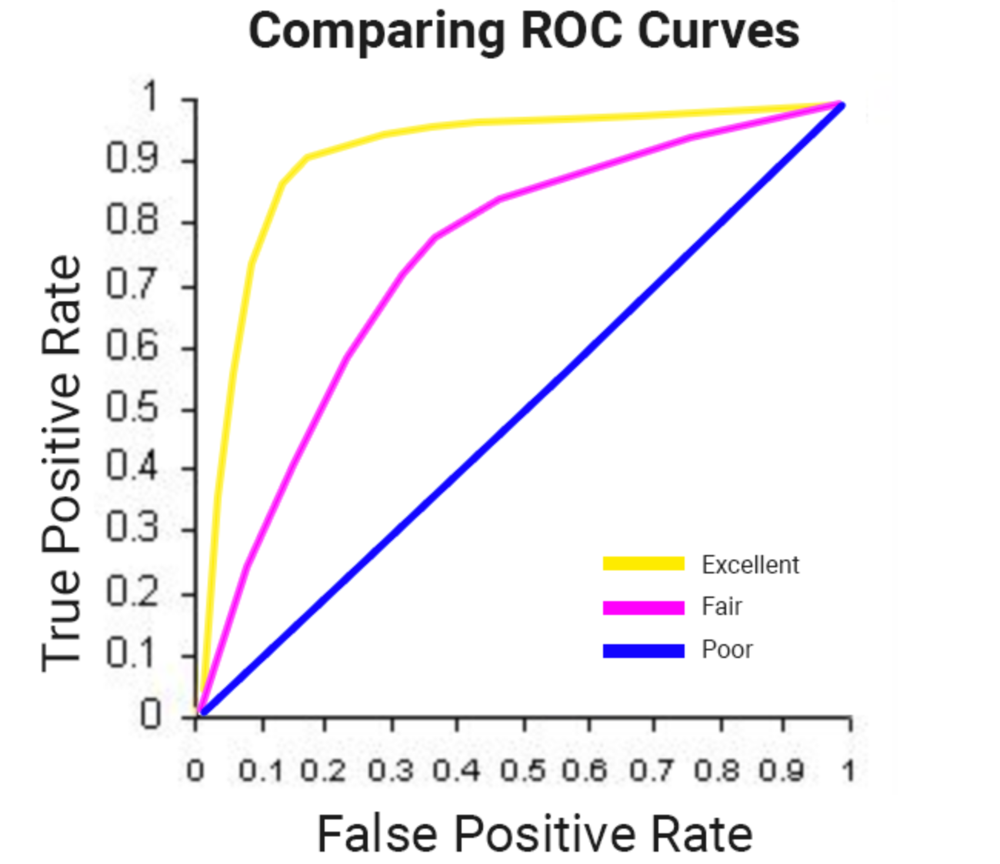


BQML の roc_auc は、トレーニングを行った ML モデルを評価する際にクエリ可能なフィールドです。

トレーニングが完了したので、ML.EVALUATE を使用してこのクエリに対するモデルの性能を評価します。

```sql
SELECT
  roc_auc,
  CASE
    WHEN roc_auc > .9 THEN 'good'
    WHEN roc_auc > .8 THEN 'fair'
    WHEN roc_auc > .7 THEN 'not great'
  ELSE 'poor' END AS model_quality
FROM
  ML.EVALUATE(MODEL ecommerce.classification_model,  (

SELECT
  * EXCEPT(fullVisitorId)
FROM

  # 特徴
  (SELECT
    fullVisitorId,
    IFNULL(totals.bounces, 0) AS bounces,
    IFNULL(totals.timeOnSite, 0) AS time_on_site
  FROM
    `data-to-insights.ecommerce.web_analytics`
  WHERE
    totals.newVisits = 1
    AND date BETWEEN '20170501' AND '20170630') # 2 か月分で評価
  JOIN
  (SELECT
    fullvisitorid,
    IF(COUNTIF(totals.transactions > 0 AND totals.newVisits IS NULL) > 0, 1, 0) AS will_buy_on_return_visit
  FROM
      `data-to-insights.ecommerce.web_analytics`
  GROUP BY fullvisitorid)
  USING (fullVisitorId)

));
```

次のような結果が表示されます。

|Row|roc_auc|model_quality|
|--|--|--|
|1|0.724588|not great|


モデルを評価すると、roc_auc は 0.72 になります。これは、モデルの予測能力が良くないことを示しています。目標は、曲線の下の領域を可能な限り 1.0 に近づけることであるため、改善の余地はまだ残されています。

### 特徴量エンジニアリングでモデル性能を強化する
先にも少し触れましたが、訪問者の最初のセッションと再度訪問して購入する可能性の関係をモデルに理解させるうえで、役に立つデータセットの特徴は他にもたくさん存在します。

新しい特徴をいくつか追加し、classification_model_2 という名前の 2 番目の機械学習モデルを作成します。

初回訪問時に訪問者は購入手続きをどこまで進めていたか
訪問者はどこからアクセスしたか（トラフィック ソースがオーガニック検索、参照元サイトなど）
デバイスのカテゴリ（モバイル、タブレット、パソコン）
地理情報（国）
次のクエリを実行して、この 2 番目のモデルを作成します。

```sql
CREATE OR REPLACE MODEL `ecommerce.classification_model_2`
OPTIONS
  (model_type='logistic_reg', labels = ['will_buy_on_return_visit']) AS

WITH all_visitor_stats AS (
SELECT
  fullvisitorid,
  IF(COUNTIF(totals.transactions > 0 AND totals.newVisits IS NULL) > 0, 1, 0) AS will_buy_on_return_visit
  FROM `data-to-insights.ecommerce.web_analytics`
  GROUP BY fullvisitorid
)

# 新しい特徴を追加
SELECT * EXCEPT(unique_session_id) FROM (

  SELECT
      CONCAT(fullvisitorid, CAST(visitId AS STRING)) AS unique_session_id,

      # ラベル
      will_buy_on_return_visit,

      MAX(CAST(h.eCommerceAction.action_type AS INT64)) AS latest_ecommerce_progress,

      # サイトでの行動
      IFNULL(totals.bounces, 0) AS bounces,
      IFNULL(totals.timeOnSite, 0) AS time_on_site,
      totals.pageviews,

      # 訪問経路
      trafficSource.source,
      trafficSource.medium,
      channelGrouping,

      # モバイルまたはパソコン
      device.deviceCategory,

      # 地域
      IFNULL(geoNetwork.country, "") AS country

  FROM `data-to-insights.ecommerce.web_analytics`,
     UNNEST(hits) AS h

    JOIN all_visitor_stats USING(fullvisitorid)

  WHERE 1=1
    # 初回訪問のみ予測
    AND totals.newVisits = 1
    AND date BETWEEN '20160801' AND '20170430' # 9 か月分でトレーニング

  GROUP BY
  unique_session_id,
  will_buy_on_return_visit,
  bounces,
  time_on_site,
  totals.pageviews,
  trafficSource.source,
  trafficSource.medium,
  channelGrouping,
  device.deviceCategory,
  country
);
```

注: これは新しいモデルです。が、ここでも同じように最初の 9 か月のデータを使ってトレーニングします。優れた出力の要因が優れた入力特徴であることを確認できるように、新しいトレーニング データや異なるトレーニング データではなく、同じトレーニング データセットを使用することが重要です。
トレーニング データセットのクエリに追加された重要な特徴のひとつは、各訪問者がセッションで到達した購入手続きの段階です。これは、フィールド hits.eCommerceAction.action_type に記録されます。フィールド定義でそのフィールドを検索すると、「6 = Completed Purchase」のフィールド マッピングが表示されます。

余談です。が、ウェブ解析データセットには ARRAYS のようなネストされ繰り返されたフィールドがあり、データセットではこれらを別個の行に分ける必要があります。これは、UNNEST() 関数を使用して行います。（上記のクエリで確認できます。）。

新しいモデルのトレーニングが終わるのを待ちます。（5～10 分）。

この新しいモデルを評価し、より優れた予測力が備わっているかどうかを確認します。

```sql
#standardSQL
SELECT
  roc_auc,
  CASE
    WHEN roc_auc > .9 THEN 'good'
    WHEN roc_auc > .8 THEN 'fair'
    WHEN roc_auc > .7 THEN 'not great'
  ELSE 'poor' END AS model_quality
FROM
  ML.EVALUATE(MODEL ecommerce.classification_model_2,  (

WITH all_visitor_stats AS (
SELECT
  fullvisitorid,
  IF(COUNTIF(totals.transactions > 0 AND totals.newVisits IS NULL) > 0, 1, 0) AS will_buy_on_return_visit
  FROM `data-to-insights.ecommerce.web_analytics`
  GROUP BY fullvisitorid
)

# 新しい特徴を追加
SELECT * EXCEPT(unique_session_id) FROM (

  SELECT
      CONCAT(fullvisitorid, CAST(visitId AS STRING)) AS unique_session_id,

      # ラベル
      will_buy_on_return_visit,

      MAX(CAST(h.eCommerceAction.action_type AS INT64)) AS latest_ecommerce_progress,

      # サイトでの行動
      IFNULL(totals.bounces, 0) AS bounces,
      IFNULL(totals.timeOnSite, 0) AS time_on_site,
      totals.pageviews,

      # 訪問経路
      trafficSource.source,
      trafficSource.medium,
      channelGrouping,

      # モバイルまたはパソコン
      device.deviceCategory,

      # 地域
      IFNULL(geoNetwork.country, "") AS country

  FROM `data-to-insights.ecommerce.web_analytics`,
     UNNEST(hits) AS h

    JOIN all_visitor_stats USING(fullvisitorid)

  WHERE 1=1
    # 初回訪問のみ予測
    AND totals.newVisits = 1
    AND date BETWEEN '20170501' AND '20170630' # 2 か月分で評価

  GROUP BY
  unique_session_id,
  will_buy_on_return_visit,
  bounces,
  time_on_site,
  totals.pageviews,
  trafficSource.source,
  trafficSource.medium,
  channelGrouping,
  device.deviceCategory,
  country
)
));
```

（出力）

|Row|roc_auc|model_quality|
|--|--|--|
|1|0.910382|good|

この新しいモデルでは、roc_auc で 0.91 を実現しました。これは、最初のモデルよりも著しく向上しています。

モデルをトレーニングしたので、今度は予測を行います。

どの新しい訪問者が戻ってきて購入するかを予測する
次に、新しい訪問者がどのくらい戻ってきて購入するかを予測するためのクエリを作成します。

以下の予測クエリでは、強化済みの分類モデルを使用して、Google Merchandise Store への初めての訪問者が後の訪問で購入する確率を予測します。

```sql
SELECT
*
FROM
  ml.PREDICT(MODEL `ecommerce.classification_model_2`,
   (

WITH all_visitor_stats AS (
SELECT
  fullvisitorid,
  IF(COUNTIF(totals.transactions > 0 AND totals.newVisits IS NULL) > 0, 1, 0) AS will_buy_on_return_visit
  FROM `data-to-insights.ecommerce.web_analytics`
  GROUP BY fullvisitorid
)

  SELECT
      CONCAT(fullvisitorid, '-',CAST(visitId AS STRING)) AS unique_session_id,

      # ラベル
      will_buy_on_return_visit,

      MAX(CAST(h.eCommerceAction.action_type AS INT64)) AS latest_ecommerce_progress,

      # サイトでの行動
      IFNULL(totals.bounces, 0) AS bounces,
      IFNULL(totals.timeOnSite, 0) AS time_on_site,
      totals.pageviews,

      # 訪問経路
      trafficSource.source,
      trafficSource.medium,
      channelGrouping,

      # モバイルまたはパソコン
      device.deviceCategory,

      # 地域
      IFNULL(geoNetwork.country, "") AS country

  FROM `data-to-insights.ecommerce.web_analytics`,
     UNNEST(hits) AS h

    JOIN all_visitor_stats USING(fullvisitorid)

  WHERE
    # 初回訪問のみ予測
    totals.newVisits = 1
    AND date BETWEEN '20170701' AND '20170801' # 1 か月分でテスト

  GROUP BY
  unique_session_id,
  will_buy_on_return_visit,
  bounces,
  time_on_site,
  totals.pageviews,
  trafficSource.source,
  trafficSource.medium,
  channelGrouping,
  device.deviceCategory,
  country
)

)

ORDER BY
  predicted_will_buy_on_return_visit DESC;
```

予測は、最後の 1 か月（12 か月中）のデータセットで行われます。

モデルは、2017 年 7 月の e コマース セッションに対する予測を出力します。ここでは、新しく追加された 3 つのフィールドを確認できます。

- predicted_will_buy_on_return_visit: 訪問者が後で購入することを、モデルが予測しているかどうか（1 = yes）
- predicted_will_buy_on_return_visit_probs.label: yes / no のバイナリ分類子
- predicted_will_buy_on_return_visit.prob: 予測に対するモデルの信頼度（1 = 100%）

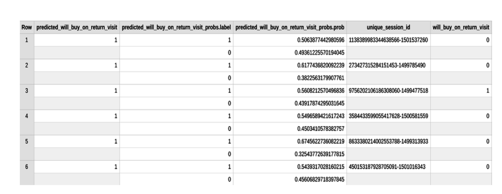

#### 結果
上位 6% の初回訪問者（予測された確率によって降順で並べ替え済み）のうちの 6% 以上が後の訪問で購入を行いました。

これらのユーザーは、後の訪問で購入に至った初回訪問者全体のほぼ 50% に相当します。

全体として、初回訪問者の 0.7% しか後の訪問で購入しませんでした。

初回訪問者の上位 6% にターゲットを絞ると、マーケティング ROI は、全員をターゲットにした場合に比べ 9 倍も向上します。

#### 詳細情報
roc_auc は、モデル評価で使用できるパフォーマンス指標のひとつにすぎません。他にも accuracy、precision、recall を使用できます。信頼できるパフォーマンス指標は、全体の目標によって大きく変わってきます。

お疲れさまでした
ここでは、SQL のみを使用して機械学習モデルを作成しました。

### リソース

<div><p><a href="https://cloud.google.com/pubsub/?hl=ja" target="_blank" rel="noopener nofollow"><u>Cloud Pub/Sub のドキュメント</u></a><u> + </u><a href="https://cloud.google.com/pubsub/docs/release-notes?hl=ja" target="_blank" rel="noopener nofollow"><u>リリースブログ</u></a></p><p><a href="https://cloud.google.com/dataflow/?hl=ja" target="_blank" rel="noopener nofollow"><u>Cloud Dataflow のドキュメント</u></a><u> + </u><a href="https://cloud.google.com/blog/products/data-analytics/" target="_blank" rel="noopener nofollow"><u>リリースブログ</u></a><u> + </u><a href="https://cloud.google.com/dataflow/docs/guides/templates/provided-templates?hl=ja" target="_blank" rel="noopener nofollow"><u>テンプレート</u></a></p><p><a href="https://developers.google.com/datastudio/?hl=ja" target="_blank" rel="noopener nofollow"><u>データポータルのドキュメント</u></a></p><p><a href="https://cloud.google.com/blog/products/g-suite/connecting-bigquery-and-google-sheets-to-help-with-hefty-data-analysis" target="_blank" rel="noopener nofollow"><u>ブログ: BigQuery での Google スプレッドシートの使用</u></a></p><p></p><p></p></div>