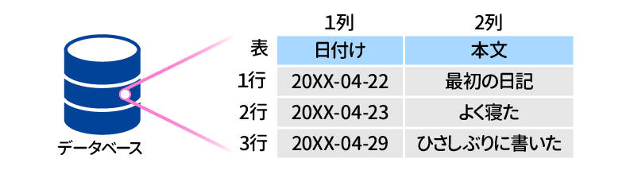
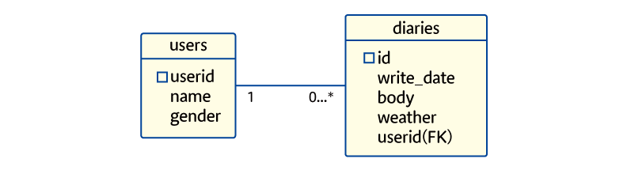
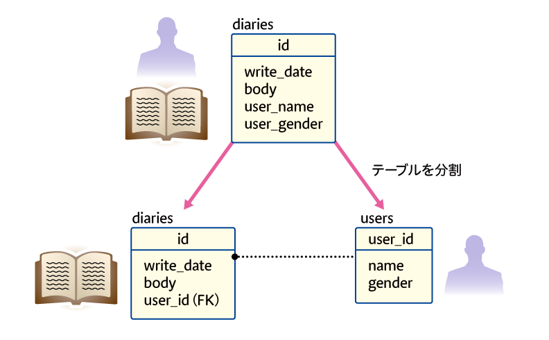
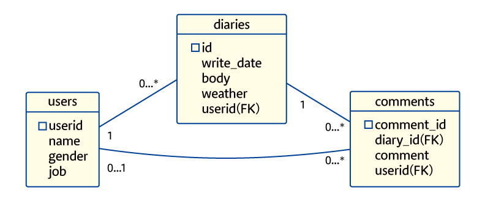
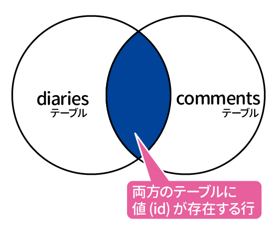
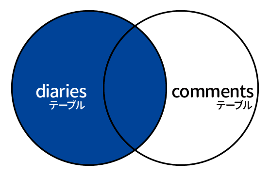

# 実践サーバーサイドプログラミング（2）
[Source](https://www.nnn.ed.nico/courses/497/chapters/6891)

## § 10. RDBMS と SQL
ここからは **データベース** について学んでいく。  
[intro-to-serverside-programing-2.md](./intro-to-serverside-programing-2.md) も参考のこと。

### PostgreSQL を使ってみよう
今回使用するのは **PostgreSQL**（ポストグレスキューエル）とする。

#### PostgreSQL のフロントエンドを起動する
以下のコマンドを入力して PostgreSQL のターミナル型フロントエンドを起動する。

```bash
sudo su - postgres
psql
```

まず `postgres` という Linux ユーザーでログインした後、`psql` でターミナル型フロントエンドを起動している。

起動したら、その画面へ SQL のコマンドを入力することで直接 DB を操作できる。

#### データベースの作成と接続

まずは今回使用するデータベースを作成する。

```sql
CREATE DATABASE diary_1;
```

これでデータベース `diary_1` が作成される。  
シェルコマンドと違い、最後に `;` をつけないといけないので注意すること。

```sql
CREATE DATABASE
```

と表示されたら作成できている。  
次に `diary_1` というデータベースに接続する。

```sql
\c diary_1
```

結果として、`You are now connected to database "diary_1" as user "postgres".` と表示されたら成功。

#### SQL の動詞 `CREATE`
RDB では、データベースの中に直接保存したいデータを入れるのではなく、テーブルというものを入れる。テーブルとは「表」のことで、行と列の要素で構成される。



実際にテーブルを作成するためには SQL の **CREATE** という動詞を使う。

```sql
CREATE TABLE pages (write_date DATE PRIMARY KEY, body TEXT);
```

`CREATE TABLE pages` の部分で、pages という名前のテーブルを作成することを書いている。

`(` から `)` の間は、このテーブルの列の構成を指定している。それぞれの列の名前と型（データ型）を指定している。

また、`PRIMARY KEY` という部分は、その列を主キーとして設定する記述である。

```sql
CREATE TABLE
```

と表示されたらテーブルの作成は成功。

念のため、テーブルが正しく作成できているか確認してみよう。現在接続しているデータベースに存在するテーブルの一覧を次のコマンドで確認できる。

```
\dt
```

なお、これは PostgreSQL の機能であり、SQL の文ではない。

```
         List of relations
 Schema | Name  | Type  |  Owner   
--------+-------+-------+----------
 public | pages | table | postgres
(1 row)
```
この結果に`pages` が表示されていれば問題ない。

#### **SQL の動詞 `INSERT` **
まだテーブルの中身は空っぽなので、テーブルへ実際にデータ（行、レコード）を追加していこう。

```sql
INSERT INTO pages (write_date, body) VALUES ('2020-05-06', '最初の日記');
```

文法は見ての通り。カッコの中に書いている値は、その順番が大事で、この順番によって列の名前と値の対応をつけている。

結果は以下のように表示されるはずである。

```sql
INSERT 0 1
```

#### SQL の動詞 `SELECT`
テーブルに保存されているデータを取得する SQL の動詞は `SELECT`。

```sql
SELECT body FROM pages;
```

複数の列を選択したいときは `,` を使う（今回の例だと `SELECT * FROM pages;` でも同じ）。

```sql
SELECT write_date, body FROM pages;
```

#### 主キーの制約
主キー（`PRIMARY KEY`）となった列は、データの重複が許されない（同じテーブル内に、同じ値の主キーが 2 つ以上存在してはいけない。今回の diary テーブルの例だと、同じ日付のレコードが 2 つ以上あってはいけない）。さらに、データが空っぽということも許されない（つまり主キー無しのレコードは不可）。

#### SQL の動詞 DELETE
今度はデータの削除方法を学ぶ。

```sql
DELETE FROM pages WHERE write_date='2020-05-06';
SELECT * FROM pages;
```

WHERE を書かなかった場合、テーブルの全ての行が消える。

#### WHERE 句
WHERE 句の役割は、条件を指定して行の絞り込みを行うこと。DELETE 文だけでなく SELECT 文からも利用ができる。

```sql
SELECT * FROM pages WHERE body LIKE '%ラーメン%'
```

条件は `WHERE` の後ろに続く部分 `body LIKE '%ラーメン%'` である。これは body 列に「ラーメン」という文字列が含まれる場合に真となる。実行すると、日記の本文に「ラーメン」が入っている行だけが取得できる。

> **NOTE: 「文」と「句」**  
> 「句」とは SQL 上で意味を持つひとかたまりのこと。`WHERE` をはじめ `SELECT`、`FROM`、`VALUES` なども句のひとつ。  
> それに対して、複数の句を組み合わせ、完成した全体を「文」と呼ぶ。

#### SQL の動詞 `UPDATE`

```sql
UPDATE テーブル名 SET 列の名前=新しい値 WHERE 条件;
```

たとえば、以下のようにコマンドを打つと

```sql
UPDATE pages SET body='五月になった' WHERE write_date='2020-05-01';
```

結果として `UPDATE 1` と表示され、`2020-05-01` の本文（body）が「五月になった」に書き換わる。
なお、UPDATE 文も DELETE 文と同様に、WHERE 句を忘れた場合、すべての行を対象にデータを更新してしまうので注意のこと。

#### SQL の動詞 `DROP`
```sql
DROP TABLE テーブル名;
```

上記によりテーブル自体を削除できる。

#### PostgreSQL フロントエンドの終了

```
\q
```

と入力することで、PostgreSQL のフロントエンドが終了し、Linux コマンドが入力できる画面に戻る。ただし、

```bash
postgres@2922560e1c72:~$  
```

のように `postgres@`　というプロンプト表示になっている。今回、作業を開始するときに `su` コマンドを使ったため、まだ `postgres` ユーザーに変身している状態なのである。

普段の Linux ユーザー（root）に戻すためには、`exit` とコマンドを入力する。それによって `postgres` ユーザーからログアウトできる。

### データベース言語としての SQL
ここまでに扱った SQL の動詞をまとめる。

- CREATE: テーブルを作成する
- DROP: テーブルを削除する
- ALTER: テーブルの更新（ここまででは登場していないが）

（※ 以上は、テーブルだけでなくデータベース自体も操作できる。例えば、CREATE TABLE　でなく CREATE DATABASE と書けばデータベースへの操作になる。


これらは、テーブルという RDB におけるデータの定義を扱う動詞。このような役割を持った言語を **DDL** (Data Define Language) と呼ぶ。

- SELECT: テーブルからデータを取得する
- INSERT: テーブルへデータを追加する
- DELETE: テーブルからデータを削除する
- UPDATE: テーブルのデータを更新する

これらの動詞は定義されたテーブルの中で、データ自体を扱う動詞。**DML** (Data Manipulation Language) と呼ばれる。

他にも **DCL** (Data Control Language) という、データベースをコントロールするための動詞も存在する。

## § 11. データモデリング
### データベース設計の重要性
RDB はテーブルという形でデータを保持する。そして、具体的なデータの実態はテーブルの中に格納するのだった。

さらに、テーブルは複数作ることもできるので、保存したい内容に応じてテーブルを用意することができる。

自由度が高い仕組みだが、そのぶん、便利に利用していくためには知識が必要。  

設計が悪いと、整合性のあるデータの管理が大変になってしまったり、アプリケーション側の機能を拡張しようとしたとき、データベース側を対応させるのが難しくなってしまったりする。

このようなことを防ぐため、管理したいデータの内容や形式についてよく考えておくことが重要。  
この作業や手法のことを **データモデリング** という。

### RDB におけるデータモデリング
RDB におけるデータモデリングは次のように進める。

1. データベース管理を行いたい対象（エンティティ）を決める
1. それらの関わりを考える
1. データとして持つ項目をまとめる

この方法は **データ中心アプローチ（DAta Oriented Approach; DOA）** と呼ばれる方法である。これらを順番に説明していく。

### 1. エンティティを決める
まず、DB を使って管理したいものが何なのかを決める。このような対象を **エンティティ** という。前回の日記帳の例で言えば「日記のページ」がエンティティだった。

「書いた日」や「日記の内容」も保存していたが、これは「日記のページ」に含まれるデータであり、つまりは「エンティティに付属する情報」なので、これらはエンティティとは呼ばない。  
*単体で管理する必要があり、それを親として別のデータが付属するようなものがエンティティ*である。

このルールにしたがって、作りたい DB で管理する必要があるエンティティを洗い出す。

たとえば、日記の例で、書いた人が誰で、その人がどんな人なのか（名前や性別など）を管理したいとする。この場合、「人」もエンティティとなる。一方、名前や性別は人に付属する情報なのでエンティティではない。

### 2. エンティティの関連を考える
エンティティが決まったら、次はそれらの関わりを考える。この関わりのことを英語で **リレーションシップ（Relationship）**という。なお、Relationship と Relation は英単語としてとても似ているが *RDB においては全く異なるもの* なので気を付けること。

「人」と「日記のページ」については、「人が日記のページを書く」という関わりがある。この例ではエンティティが 2 つしかないので簡単だが、エンティティがたくさんある場合のデータモデリングでは、リレーションシップも複雑になってくる。

#### 🧐カーディナリティ
リレーションシップを捉えたら、さらに関係を分析していく。そのひとつが、リレーションシップを持つ両者の数の対応がどうなっているかを確認する。これを **カーディナリティ** という。

たとえば「生徒はクラスに属している」からは、「クラス 1 つに対して生徒はたくさんいる」という関係が見抜ける。つまり「**1 対 多**」の関係。

それに対して、「クラスにはクラスの教室がある」、では「1 クラスに対して教室は 1 つ」なので「**1 対 1**」の関係という。

#### 🧐 オプショナリティ
カーディナリティの次は、その関連の **任意性（オプショナリティ）**の分析。  
必ず関係が成り立つのか、成り立たない場合もあるのかを見る。

「クラスには担任の先生がつく」は必ず成り立つが、一方で「先生は授業を担当する」は成り立たない場合もある。保健室の先生や校長先生など、授業を担当しない先生もいるからである。

#### 🧐 エンティティの従属性
さらに、リレーションシップでつながれるエンティティで、片方が存在していないと、もう片方も存在できないかどうか、を確認する。

例えば「生徒はクラスに所属している」で、もしクラスというエンティティがなかった場合、生徒エンティティは存在できないだろうか、などと分析する。

他のいずれかのエンティティに依存していて、それがなくなると存在できないようなエンティティを **従属エンティティ** という。  
そうでなく、単体で存在できるエンティティは **独立エンティティ** という。

### 3. データとして持つ項目をまとめる
最後に、各エンティティに幅亜mれるデータとなる項目をまとめる。そのような項目のことを **属性** と呼ぶことがある。

「日記ページ」に対してはその日付や内容、「人」に対してはその人の名前・性別などがエンティティに対する属性になる。

これで分析は完了だが、現実には全体像がわかりやすいよう、結果を **ER 図**（Entity-Relationship Diagram） にまとめることが多い。

「日記ページ」「人」がエンティティとなる日記データベースの ER 図は次のようになる。



以上がデータ中心アプローチによるデータモデリングの流れである。ここからは実際に PostgreSQL　を使い、DB 設計を生かしたテーブルを作成してみよう。

### データベースのインポート
まず、DB 設計を行わずに進めた場合のサンプルを見てみる。まずは以下のコマンドを実行する。

```bash
curl https://progedu.github.io/rdb-study/setup_diary2.sh | sh
```

ここでは、用意されたシェルスクリプトを実行して `diary2` というデータベースのインポートを行っている（自分の Ubuntu @Docker 環境では、`su postgres` してユーザーを切り替えた後に上記のコマンドを叩いたらうまくいった）。

<details close>
<summary>シェルスクリプトの中身</summary>

```sh
#!/bin/sh
PG_USER='postgres'
DB_NAME='diary2'
GH_PAGES="https://progedu.github.io/rdb-study/"
SQL_DUMP="dump_${DB_NAME}.sql"

if [ $USER = $PG_USER ]
then
  SUDO=""
else
  SUDO="sudo -u $PG_USER"
fi

$SUDO dropdb --if-exists "$DB_NAME"
$SUDO createdb -T template0 "$DB_NAME"

curl -o- "${GH_PAGES}${SQL_DUMP}" | $SUDO psql "$DB_NAME"
```

前半部分では、変数の設定を行っている。  
後半にある、

```sh
$SUDO dropdb --if-exists "$DB_NAME"
$SUDO createdb -T template0 "$DB_NAME"
```

この部分で DB を作成している。`dropdb` コマンドでデータベースを削除してから `createdb` コマンドでデータベースを作成している。  
（一度削除するのは `diary2` データベースが存在している場合にも初期化するため）

```bash
curl -o- "${GH_PAGES}${SQL_DUMP}" | $SUDO psql "$DB_NAME"
```

この部分が、作成した DB に中身を入れる処理。`curl` コマンドでダウンロードしてきた SQL をパイプで `psql` に渡している。

これにより、テーブルが作成されたり、テーブルに行が追加されたりして、データベースのインポートが完了する。
</details>

### インポートしたテーブルを見てみる
PostgreSQL の対話型フロントエンドを起動して、インポートしたテーブルを見てみる。

```bash
sudo su - postgres
psql diary2
```

以上のコマンドで PostgreSQL フロントエンドが開き、即座に `diary2` に接続される。

`\dt` と入力することで、接続しているデータベース（`diary2`）に格納されているテーブルを一覧できる。

```
         List of relations
 Schema | Name  | Type  |  Owner   
--------+-------+-------+----------
 public | pages | table | postgres
(1 row)
```

テーブルの名前が `pages` とわかったので、このテーブルに入ってるデータを取得して表示してみる。

```sql
SELECT * FROM pages;
```

その結果、以下のように全部で 10 行が表示される。

```
 id | write_date |       body       | user_name  | user_gender
----+------------+------------------+------------+-------------
  1 | 2019-02-25 | よく寝た         | 山田寝太郎 | 男
  2 | 2019-02-26 | 昼寝した         | 山田寝太郎 | 男
  3 | 2019-02-26 | 今日は晴れでした | 鈴木ひより | 女
  4 | 2019-02-26 | 成長を感じる     | 石垣高雄   | 男
  5 | 2019-02-27 | 今日も成長した   | 石垣高雄   | 男
  6 | 2019-02-27 | 雨が降りました   | 鈴木ひより | 女
  7 | 2019-02-28 | 寝すぎた         | 山田寝太郎 | 男
  8 | 2019-02-28 | くもりでした     | 鈴木ひより | 女
  9 | 2019-02-28 | 飛躍の一日だった | 石垣高雄   | 男
 10 | 2019-02-28 | 2月は寝てた      | 山田寝太郎 | 男
(10 rows)
```

中身は前回作った日記ページテーブルと似ている。  
しかし、よく見ると `user_name` と `user_gender` という列がある。

`user_name` はその日記を書いた人の名前で、 `user_gender` はその人の性別である。
つまり、日記を書いた人の情報もデータベースで管理できるように、テーブルが拡張されているのである。

こうなると、もうこのテーブルは「一冊の日記帳」のようなイメージではとらえられない。
「行と列を使ってデータをまとめ、表現した形」としか説明しようがない。  
この形に専門用語で名前がついていて、 **関係（Relation）** と言う。

つまり、テーブルとして保存されているデータ全体もリレーションであるし、 そこから SQL を使って一部を抽出した結果もリレーションである。

### 非正規形の問題点
現在のこのテーブルでは、`user_name` の列に、人の名前が直接入っている。  
このこうぞうだと、人の名前が変わった場合に、テーb流全体を再調査してデータを更新しないといけない。

たとえば「鈴木ひより」さんを漢字表記「鈴木陽夜里」にしようと思ったら、 「鈴木ひより」と書かれている 3 行をすべて更新する必要がある。

日記データの数が増えていき、全部で何万行もあるテーブルになったとしたら、 「鈴木ひより」を探して更新する処理はどんどん大変になる。

また、管理を間違えたり、プログラムに不具合があったりすると、データに不整合が起こる。  
一部の行だけ「鈴木陽夜里」に変わったが、まだ「鈴木ひより」も残っている、というような状況である。
  
データの実体が散らばってしまっている形は、設計としてよくない。このような形のことを **非正規形** と呼びます。

### データモデリングをテーブル設計に生かす
これからデータモデリングの成果を実際の RDB のテーブルの形にしていく。

まずエンティティそれぞれをテーブルにする。  
この日記の例では「日記ページ」と「人」がエンティティだったため、「日記ページ」テーブルの他に「人」テーブルもあるとよい。

さらに、テーブルの列をどうすればよいかも、これまでの分析が教えてくれる。

まずエンティティの属性が、テーブルに用意するべきデータを入れる列になる。  
「日記ページ」の属性は日付と本文なので、これらを列として用意する。  
「人」の属性は名前と性別であるため、同様にデータ用の列を用意します。

最後にリレーションシップだが、これはテーブルとテーブルをつなぐための列となる。  
詳しくは、これから実際に作業をしながら見ていきます。



### 人のテーブルを作ろう
まずは「人」にあたるテーブルを作る。  
データとして入れたいのは名前と性別の 2 つだけだが、ここでもう一点。

テーブルを作るときは、**必ず主キーを設定する** ことが必要！

名前の列を主キーとしたのでは、同姓同名の人がいたときに困ってしまう。  
この問題を解決するため、ID というものがよく使われる。

PostgreSQL では SERIAL 型を指定することでこのような ID を作ることができる。

```sql
CERATE TABLE users (userid SERIAL PRIMARY KEY, name VARCHAR(16), gender CHAR(1));
```

はじめの列の指定は `userid SERIAL PRIMARY KEY` である。SERIAL 型で連番になる `userid` という名前の列を用意し、主キーにしている。

次は名前の列で、`name VARCHAR(16)` と指定している。  
`VARCHAR` は可変長文字列に使うデータ型である。TEXT 型と違い、あまり長くない文字列に使う。  
`(16)` という指定は最大の長さである。つまり、この `name` は最大 16 文字ということ。

最後は性別の列で、`gender CHAR(1)` と指定している。CHAR は VARCHAR と似ているが、こちらは長さが固定であるという点が異なる。つまり、`CHAR(1)` で、必ず 1 文字の文字列という意味である。

ちなみに固定長の文字列を用意し、実際に格納した文字列の長さが足りなかった場合は、残りの文字列は空白文字（スペース）で埋められる。`CHAR(5)` に `a` を入れたら、`a____` のようになる。

上記のコマンドの結果、`CREATE TABLE` と表示されたらテーブル作成に成功しているため、次に進もう。

### 人のテーブルにデータを入れよう
今度は、人のデータを登録してみよう。

```sql
INSERT INTO users (name, gender) VALUES ('山田寝太郎', '男');
INSERT INTO users (name, gender) VALUES ('鈴木ひより', '女');
INSERT INTO users (name, gender) VALUES ('石垣高雄', '男');
```

`userid` は自動で番号が振られるように設定済みであるため、`name` と `gender` の値だけを指定している。  
成功したら、以下のようなテーブルができる。

```
 userid |    name    | gender
--------+------------+--------
      1 | 山田寝太郎 | 男
      2 | 鈴木ひより | 女
      3 | 石垣高雄   | 男
(3 rows)
```

### 日記のテーブルを作る
日記のほうも作成する。日記として保存したいデータは日付と本文。

そして主キーのことを考える。前回作ったテーブルでは日記が主キーだったが、今回は主キーにできない。  
複数の人が同じ日に日記を書いた場合、同じ日付の行が複数存在することになり、日付のr越は一意にならないからである。

したがって、こちらにも ID を入れる列を用意することにする。

さらに日記の列に「誰が書いたのか」という、テーブルをつなぐための情報を持たせる。リレーションシップとして分析した内容が、ここで役に立つ。

「誰が書いたのか」を表すためには「人」テーブルの主キー `userid` が使える。  
「この日記は ID が 2 番の人によって書かれた」のような情報を保存する。

実際にテーブルを作るには以下のようにする。

```sql
CREATE TABLE diaries (id SERIAL PRIMARY KEY, write_date DATE, body TEXT, userid INTEGER);
```

`pages` というテーブルはすでに存在するので、`diaries` という名前にした。

ここで、`userid INTEGER` が人のテーブルを参照する ID であり、型は整数を表す INTEGER 型である。

では、このテーブルに一行だけデータを入れてみよう。  
「山田寝太郎」さんが「2019 年 2 月 25 日」に「よく寝た」と書いた、という行を追加する。

```sql
INSERT INTO diaries (write_date, body, userid) VALUES ('2019-02-25', 'よく寝た', 1);
```

`userid` は `1` と指定している。なぜかというと、「山田寝太郎」さんの ID は 1 だからである。

このような、別のテーブルの主キーを格納する列のことを **外部キー** と呼ぶ。  
今回の例で言うと、`diaries` テーブルの `userid` は外部キーである。

### 2 つのテーブルを確認しよう
以上で 2 つのテーブルの作成が終わった。どのような形になったのか確認してみよう。

```sql
SELECT * FROM users;
SELECT * FROM diaries;
```

それぞれ実行すると、

```
 userid |    name    | gender
--------+------------+--------
      1 | 山田寝太郎 | 男
      2 | 鈴木ひより | 女
      3 | 石垣高雄   | 男
(3 rows)

 id | write_date |       body       | userid
----+------------+------------------+--------
  1 | 2019-02-25 | よく寝た         |      1
(1 row)
```
このようになる。  
もともと 1 つだったテーブルが、「人」「日記」というエンティティで分割された。  
これにより、データの重複がなくなり、管理がしやすい構造になったといえる。

このように、データがどこか一箇所にしか現れないように整理した形を、正規形という。  
また、正規形になるようにテーb流を設計することを **正規化** という。

一方、正規化によって、このままではデータの抽出が難しくなってしまった。

例えば「男性が書いた日記だけを取得したい」という状況があったとする。  
日記のテーブルには `userid` しか保存していないため、日記テーブルを見ても、その日記が男性のものなのか判断がつかない。

しかし、テーブルの結合という方法でこの問題もあっさりと解決できる。次のセクションで学んでいく。

#### 💪データモデリングの練習
ここまでで作成した日記データベースのテーブルに「天気」と「職業」という項目を追加しよう。  
テーブルへの列の追加は、次の SQL で可能。

```sql
ALTER TABLE テーブル名 ADD 追加する列の名前 データ型
```

「職業」は人に関する情報なので「人」エンティティの属性。一方で、「天気」は毎日代わり、日記を各人の住んでいる場所によっても変わる。日記に付属する情報だと考え「日記」エンティティの属性とする。

以上から

```sql
ALTER TABLE users ADD job VARCHAR(20);
ALTER TABLE diaries ADD weather VARCHAR(10);
```

のようにすればよい。VARCHAR の中の数字（最大文字数）は一例なのでなんでもよい。

## § 12. テーブルの結合
### 絵結合とは
結合とは、列の値をたよりにして複数のテーブルをつなぎ、ひとつの SELECT 文で複数のテーブルにまたがるデータを取得する方法である。

この結合を使うことで、テーブルが分かれていても便利にデータ取得が行える。  
ただし、テーブルをつなぐための列が必要になるので、テーブル設計が正しく行われているkとが前提になる。

### 結合を試してみる
コンソールを起動して、以下のコマンドを実行する。

```bash
curl https://progedu.github.io/rdb-study/setup_diary3.sh | sh
```

用意されたシェルスクリプトを実行して `diary3` というデータベースのインポートを行う（手元の Ubuntu @Docker 環境においては、`su - postgres` を実行してユーザーを切り替えた状態で上記コマンドを打つとうまくいった）。

インポートができたら `diary3` データベースに接続する。

`psql diary3` を実行して、`diary3=#` という表示になれば、接続は成功。　　
存在しているテーブルの一覧を見てみよう。

`\dt` を実行すると、以下のように表示される。

```
          List of relations
 Schema |   Name   | Type  |  Owner   
--------+----------+-------+----------
 public | comments | table | postgres
 public | diaries  | table | postgres
 public | users    | table | postgres
 (3 rows)
```

comments という見慣れないテーブルが増えているが、前回作成した `diaries`、`users` テーブルもある。これらの中身を表示してみるとそれぞれ以下の内容となっている。

```
 id | write_date |       body       | userid | weather
----+------------+------------------+--------+---------
  1 | 2019-02-25 | よく寝た         |      1 | くもり
  2 | 2019-02-26 | 昼寝した         |      1 | 晴れ
  3 | 2019-02-26 | 今日は晴れでした |      2 | 晴れ
  4 | 2019-02-26 | 成長を感じる     |      3 | 晴れ
  5 | 2019-02-27 | 今日も成長した   |      3 | 雨
  6 | 2019-02-27 | 雨が降りました   |      2 | 雨
  7 | 2019-02-28 | 寝すぎた         |      1 | くもり
  8 | 2019-02-28 | くもりでした     |      2 | くもり
  9 | 2019-02-28 | 飛躍の一日だった |      3 | くもり
 10 | 2019-02-28 | 2月は寝てた      |      1 | 晴れ
(10 rows)
```

```
 userid |    name    | gender |  job
--------+------------+--------+--------
      1 | 山田寝太郎 | 男     | 学生
      2 | 鈴木ひより | 女     | 学生
      3 | 石垣高雄   | 男     | 会社員
(3 rows)
```

これら 2 つのテーブルを使って「男性が書いた日記について、本文と書いた人の名前を取得する」SQL を書いてみよう。

必要なデータのありかをまとめてみると次のようになる。

|データ名|テーブル名|列名|
|--|--|--|
|性別|users|gender|
|名前|users|name|
|日記|diaries|body|

`users` と `diaries` という別々のテーブルに、データが分けて保存されていることがわかる。このような場合に、テーブルの結合が利用できる。

結合をするための SQL の句は `JOIN` である。  
結合のイメージをつかむため、まず次の SQL 文を実行してみよう。

```sql
SELECT * FROM diaries JOIN users ON diaries.userid = user.userid;
```

`diaries` と `users` というテーブルを `JOIN` で結合している。  
`ON diaries.userid = users.userid` の部分では、結合をする条件を指定している。

結果は次のようになる。

```
 id | write_date |       body       | userid | weather | userid |    name    | gender |  job
----+------------+------------------+--------+---------+--------+------------+--------+--------
  1 | 2019-02-25 | よく寝た         |      1 | くもり  |      1 | 山田寝太郎 | 男     | 学生
  2 | 2019-02-26 | 昼寝した         |      1 | 晴れ    |      1 | 山田寝太郎 | 男     | 学生
  3 | 2019-02-26 | 今日は晴れでした |      2 | 晴れ    |      2 | 鈴木ひより | 女     | 学生
  4 | 2019-02-26 | 成長を感じる     |      3 | 晴れ    |      3 | 石垣高雄   | 男     | 会社員
  5 | 2019-02-27 | 今日も成長した   |      3 | 雨      |      3 | 石垣高雄   | 男     | 会社員
  6 | 2019-02-27 | 雨が降りました   |      2 | 雨      |      2 | 鈴木ひより | 女     | 学生
  7 | 2019-02-28 | 寝すぎた         |      1 | くもり  |      1 | 山田寝太郎 | 男     | 学生
  8 | 2019-02-28 | くもりでした     |      2 | くもり  |      2 | 鈴木ひより | 女     | 学生
  9 | 2019-02-28 | 飛躍の一日だった |      3 | くもり  |      3 | 石垣高雄   | 男     | 会社員
 10 | 2019-02-28 | 2月は寝てた      |      1 | 晴れ    |      1 | 山田寝太郎 | 男     | 学生
(10 rows)
```

左の方には `diaries` の列が、右の方には `users` の列が並んでいる。  
結合をすると、複数のテーブルから一時的に大きなテーブルが作れる、というイメージだ。

ところで、実現したいのは「男性が書いた日記について、本文と書いた人の名前を取得する」だった。

これは、先ほどの SQL に少し変更を加えることで可能dえある。

```sql
SELECT name, body FROM diaries JOIN users ON diaries.userid = users.userid WHERE gender = '男';
```

ところで、これくらい長い SQL を一行で書くと、意味を読み取るのが難しくなってくる。SQL の文は `;` によって認識されているため、改行やインデントにより見やすく整形することができる。整形すると次のようになる。

```sql
SELECT
    name,
    body
FROM
    diaries
    JOIN
        users
    ON  diaries.userid = users.userid
WHERE
    gender = '男';
```

これにより、以下のように 2 つのテーb流にまたがるデータが一度に取得できる。

```
    name    |       body
------------+------------------
 山田寝太郎 | よく寝た
 山田寝太郎 | 昼寝した
 石垣高雄   | 成長を感じる
 石垣高雄   | 今日も成長した
 山田寝太郎 | 寝すぎた
 石垣高雄   | 飛躍の一日だった
 山田寝太郎 | 2月は寝てた
(7 rows)
```
### 結合の種類
テーブルの結合方法にはいくつかsh類がある。
上記で試した結合は **内部結合** と呼ばれる種類の結合。

内部結合は、結合に使う列の値がどちらのテーブルにも揃って存在したときのみ、結果にその行を含める。

他には **外部結合** と呼ばれる種類の結合がある。  
外部結合はさらに細かい種類に分けられ、左外部結合、右外部結合、完全外部結合がある。

これがどのように役立つのか、実例で見ていこう。

### 内部結合の動作
説明のために、まず今回新たに追加された `comment` テーブルを見てみると以下のような中身である。

```
 comment_id | diary_id |       comment        | user_id
------------+----------+----------------------+---------
          1 |        2 | 寝すぎでは           |       3
          2 |       10 | 3月も寝よう          |
          3 |        3 | 明日は天気悪いらしい |       1
          4 |        6 | 雨の日は読書に限るぞ |       3
          6 |        8 | 寒かったね           |
          7 |        2 | 昼寝なので問題ない   |       1
          5 |        7 | 大丈夫ですか・・・   |
(7 rows)
```

これは、日記に対してのコメントを保存するテーブルである。  
見てわかるように、comments テーブルは diary_id や user_id を参照していて、つまり「日記」エンティティと「人」エンティティ両方と関わりがあり、データベースの ER 図は次のようになる。



この comments テーブルを使って、「日記とその日記についたコメントを取得する」SQL 文を書いてみよう。  
`comments.diary_id` がコメント先となる日記の ID なので、これを使って結合すればよさそうである。

ここまでは `JOIN` とだけ書いて、デフォルトの動作である内部結合を行ったが、今回は `INNER JOIN` と書いてみる。  
動作は変わらないが、内部を意味する INNER という単語が SQL 文に現れることで、結合の方法が内部結合であることを読み取りやすくできる。

```sql
SELECT
    id,
    body,
    comment
FROM
    diaries
    INNER JOIN
        comments
    ON  diaries.id = comments.diary_id;
```

`ON diaries.id = comments.diary_id` の部分で、日記 ID を使って結合するように指定している。  
結果は以下のようになる。

```
 id |       body       |       comment
----+------------------+----------------------
  2 | 昼寝した         | 寝すぎでは
 10 | 2月は寝てた      | 3月も寝よう
  3 | 今日は晴れでした | 明日は天気悪いらしい
  6 | 雨が降りました   | 雨の日は読書に限るぞ
  8 | くもりでした     | 寒かったね
  2 | 昼寝した         | 昼寝なので問題ない
  7 | 寝すぎた         | 大丈夫ですか・・・
(7 rows)
```

一見うまくいっているように見えるが、実は一部の日記が取得できていない。`diaries` テーブルは全部で 10 行あったので、明らかに数が足りない。

なぜこうなるかというと、内部結合を使ったためである。  
内部結合では、*結合に使う列の値が両方のテーブルに含まれていないと、結果からも消えてしまう* のだった。

実はここでは、コメントがついていない日記が表示されなくなっている。  
コメントがついていない日記の ID は `comments.diary_id` に含まれないので、日記自体も結果に含まれなくなるわけである。

**内部結合を実行した場合の結果**


### 外部結合を使ってみよう
外部結合を使えばこの問題が解決できる。  
外部結合では、結合をする際、指定テーブルの行をすべて残しつつ、結合をすることができる。

- 左外部結合（LEFT JOIN）
    - JOIN 句の左側に書いたテーブルの行を残す
- 右外部結合（RIGHT JOIN）
    - JOIN 句の右側に書いたテーブルの行を残す
- 完全外部結合（FULL JOIN）
    - どちらのテーブルの行も残す

以上の 3 種類は、「どのテーブルを残すのか」の違いがあるだけである。

先ほどの例、

```sql
SELECT
    id,
    body,
    comment
FROM
    diaries
    INNER JOIN
        comments
    ON  diaries.id = comments.diary_id;
```

では、`diaries INNER JOIN comments` となっていた。  
左側に書かれている `diaries` 側の行を残したいので、ここでは左外部結合を使えばよい。

実際に `INNER JOIN` の部分を `LEFT JOIN` に変えて、試してみよう。

```sql
SELECT
    id,
    body,
    comment
FROM
    diaries
    LEFT JOIN
        comments
    ON  diaries.id = comments.diary_id;
```

そうすると、結果は以下のようになる。comment が空になっている行が、コメントが存在しなかった日記ということになる。

```
 id |       body       |       comment
----+------------------+----------------------
  2 | 昼寝した         | 寝すぎでは
 10 | 2月は寝てた      | 3月も寝よう
  3 | 今日は晴れでした | 明日は天気悪いらしい
  6 | 雨が降りました   | 雨の日は読書に限るぞ
  8 | くもりでした     | 寒かったね
  2 | 昼寝した         | 昼寝なので問題ない
  7 | 寝すぎた         | 大丈夫ですか・・・
  5 | 今日も成長した   |
  4 | 成長を感じる     |
  1 | よく寝た         |
  9 | 飛躍の一日だった |
(11 rows)
```

**左外部結合（LEFT JOIN）を実行した場合の結果**


### ORDER BY による並び替え
結果が 11 行になっているのは「昼寝した」という日記にはコメントが 2 個ついているためである。  
わかりやすいよう、取得した結果を並び替えてみよう。

SELECT 文で取得した結果の並び替えを行うには ORDER BY 句を使う。  
先ほどの SQL の末尾に `ORDER BY id` と付け加える。

```sql
SELECT
    id,
    body,
    comment
FROM
    diaries
    LEFT JOIN
        comments
    ON  diaries.id = comments.diary_id
ORDER BY
    id;
```

```
 id |       body       |       comment
----+------------------+----------------------
  1 | よく寝た         |
  2 | 昼寝した         | 寝すぎでは
  2 | 昼寝した         | 昼寝なので問題ない
  3 | 今日は晴れでした | 明日は天気悪いらしい
  4 | 成長を感じる     |
  5 | 今日も成長した   |
  6 | 雨が降りました   | 雨の日は読書に限るぞ
  7 | 寝すぎた         | 大丈夫ですか・・・
  8 | くもりでした     | 寒かったね
  9 | 飛躍の一日だった |
 10 | 2月は寝てた      | 3月も寝よう
(11 rows)
```

これで日記の ID 順に結果が並び、見やすくなった。