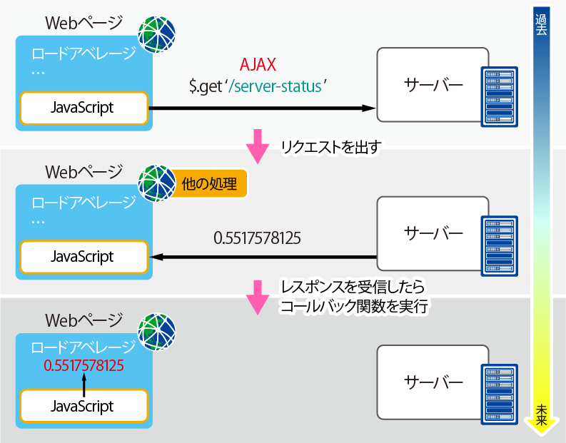
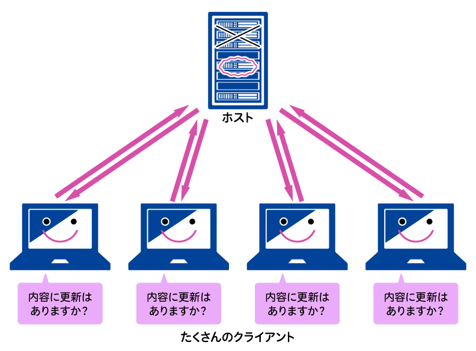
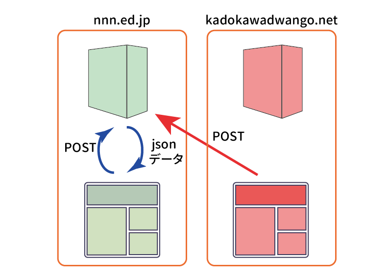
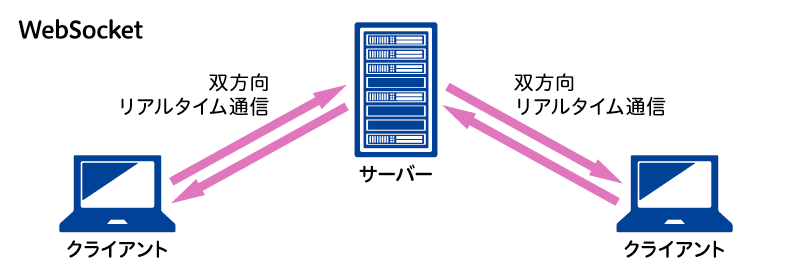
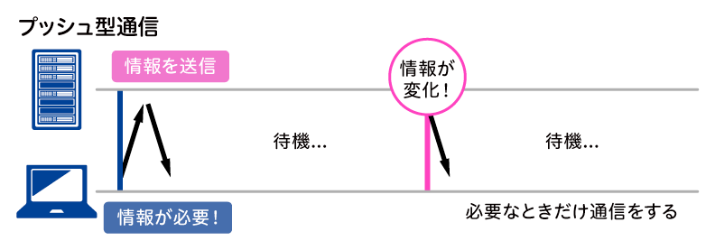

# 実践サーバーサイドプログラミング
[Source](https://www.nnn.ed.nico/courses/497/chapters/6891)

## §01. Web フレームワーク
### Web フレームワークとは
Web フレームワークは、正確には Web Application Framework（WAF）と呼ばれる。動的な Web サイトや　Web API を提供するたえのフレームワークで、Web 開発でよく行われる作業や実装を効率化するための様々な仕組みを備えている。

例えば、以下のような機能がある。

- ルーティング機能
- プロジェクトの雛形の作成機能
- セキュリティ対策機能
- ログ出力を補助する機能
- 認証認可機能
- フレームワーク自体を拡張する機能
- テンプレートエンジン

Node.js には数多くの Web フレームワークがあるが、ここでは Express という Web フレームワークを使っていく。

### Express
Express とは OpenJS 財団により保守されている MIT ライセンスの Web フレームワークである。Ruby の Web フレームワークである Sinatra に影響を受けて作られている。

この Express は特徴として

- 堅牢生の高いルーティング
- 高いパフォーマンス

に重点が置かれている。そのため、安全で高速な Web サービスを作るのが得意である。半面、機能はシンプルで、高機能で複雑なアプリケーションを作るためには工夫を要する。

主な機能として

- ルーティング機能
- プロジェクトの雛形の作成機能
- ログ出力を補助する機能
- フレームワーク自体を拡張する機能
- テンプレートエンジン

これらの機能が標準で用意されている。なお、この Express は、セキュリティに関して、[Security Policies and Procedures](https://github.com/expressjs/express/blob/master/Security.md) という文章を公開している。ここには、「セキュリティに関するバグがあったときにはメールを送ってほしいこと」「しかるべきプロセスで修正情報が公開されるということ」が書かれている。

### Express を利用して Web アプリケーションを作る
それでは、この Express を利用して Web アプリケーションを作ってみよう。

コンソールを起動したら、Express application generator をインストールして、アプリケーションを作成する。これはジェネレーターといい、プロジェクトの雛形を作るツールである。

```bash
yarn global add express-generator@4.16.0
cd ~/workspace
express --view=pug express-study
```

以上のコマンドでインストールと作成を実行すると

```
   create : express-study/
   create : express-study/public/
   create : express-study/public/javascripts/

    ... 略

   run the app:
     $ DEBUG=express-study:* npm start
```

上記のように表示され、Express を使ったアプリケーションに必要なファイルが一通り左k酢英される。
なお、`express --view=pug express-study` のコマンドの部分は `express-study` という名前のプロジェクトを作成し、テンプレートエンジンに `pug` を使用するコマンドである。

次に、プロジェクトディレクトリに移動し、必要な npm モジュールをインストールして起動してみる。

```bash
cd express-study
yarn install
```

下記のコマンドで起動することができる。

```bash
DEBUG=experess-study:* PORT=8000 yarn start
```

このコマンドは、`DEBUG` という環境変数には `express-study:*` という値を設定し、`PORT` という環境変数には `8000` という値を設定した状態で `yarn start` コマンドを実行するという意味になる。

なお、`DEBUG=express-study:*` は「アプリケーション固有のデバッグログを表示させる」ために設定している。  
`DEBUG=express-study:*` という書き方で、「`express-study:` で始まる文字列が設定されたログをすべて出力する」設定になる。この `*` はワイルドカードである。

`PORT=8000` は、「このサーバーを 8000 番ポートで起動する」目的で設定している。

yarn +（スクリプト名）というコマンドで package.json であらかじめ設定されたコマンドが実行されるため、yarn start はその仕組みを使って、Express フレームワークで作られた Node.js サーバーを起動させる。

実行後、

```bash
yarn run v1.13.0
$ node ./bin/www
  express-study:server Listening on port 8000 +0ms
```

以上のように表示されれば起動は成功。  
`http://localhost:8000/` にアクセスしてみると、Express のジェネレーターで作られた雛形のページが表示される。


この時に作られるファイル構成は以下のようになっている。

```
.
├── app.js
├── bin
│   └── www
├── package.json
├── public
│   ├── images
│   ├── javascripts
│   └── stylesheets
│       └── style.css
├── routes
│   ├── index.js
│   └── users.js
└── views
    ├── error.pug
    ├── index.pug
    └── layout.pug
```

これらは　Express のジェネレータによって生成されるファイルである。

**説明**
- `app.js`: Web アプリケーション自体を表すモジュールが記述された JavaScript のファイル。アプリケーションの動きを変更する際の実装は、ここを起点に実装されている。
- `bin/www`: 起動を行うための Node.js のスクリプト。このスクリプトにおいて `app` モジュールが読み込まれる。
- `package.json`: おなじみ、npm パッケージの様々な設定が書いてある JSON ファイル。
- `public` ディレクトリ: 画像や、クライアント側で用いる JavaScript、CSS などの静的ファイルが格納される。デフォルトでは `style.css` のみが格納されている。
- `routes` ディレクトリ: この Express でルーティングを担うオブジェクトである Router オブジェクトの実装がされたモジュールのファイルが置かれるディレクトリ。
- `views` ディレクトリ: pug（テンプレートエンジン）のテンプレートファイルが置かれている。

次に、`package.json` の中身を確認してみよう。

```json
{
  "name": "express-study",
  "version": "0.0.0",
  "private": true,
  "scripts": {
    "start": "node ./bin/www"
  },
  "dependencies": {
    "cookie-parser": "~1.4.3",
    "debug": "~2.6.9",
    "express": "~4.16.0",
    "http-errors": "~1.6.2",
    "morgan": "~1.9.0",
    "pug": "2.0.0-beta11"
  }
}
```

以上のように書かれていて、Express がどのようなモジュールに依存しているのかがわかる。

- cookie-parser: Cookie を解釈するモジュール
- debug: デバッグ用のログを表示するモジュール
- express: Express の本体
- http-errors: HTTP のエラーを作成するモジュール
- morgan: コンソールにログを整形して出力するモジュール
- pug: テンプレートエンジン

のようになっている。

試しに、debug というモジュールの機能を使ってみよう。このモジュールは、基本的なログを出力する機能を持つモジュールではあるのだが、`*` で表されるワイルドカードを利用して、出力させたいログを起動時に設定することができる。

では今、下記の差分のように `app.js` の最初の部分を編集してみよう。

<details close>
<summary>app.js</summary>

```diff
+'use strict';
+
+const debug = require('debug');
+const debugInfo = debug('module:info');
+setInterval(() => {
+  debugInfo('some information.');
+}, 1000);
+const debugError = debug('module:error');
+setInterval(() => {
+  debugError('some error.');
+}, 1000);
+
 var createError = require('http-errors');
 var express = require('express');
 var path = require('path');
```

**解説**

```js
const debugInfo = debug('module:info');
setInterval(() => {
  debugInfo('some information.');
}, 1000);
```

これは、`module:info` という設定のロガーを `debugInfo` という変数に用意し、`setInterval` 関数で 1000 ミリ秒（すなわち 1 秒）ごとに `some information.` という文字列をログに出力している。

`const debugError = debug('module:error')` の部分も、`module:error` という設定情報が異なるだけで他は同様。

</details>

ここまで出来たら、実行してみよう。

```
DEBUG=express-study:*,module:* PORT=8000 yarn start
```

以上のコマンドで実行される。`express-study:*` と `module:*` を設定してログを出力させている。このように、複数のログの出力の設定をするときには `,` で続けて書くことができる。

実行すると、1 秒ごとに 2 行ずつカラフルなログが出力され続ける。  
また、すべてのログには、前のログからどれだけの時間が経過したかが `+1s` や `+1ms` という形式で表示される。

このデバッグログを活用することで、処理にどれだけの時間がかかっているかをプロファイルすることもでき、パフォーマンスの問題に対処する際のデバッグが可能。

Express では、以上の debug モジュールを使って見やすいログ出力が行われるように作られている。
このように、フレームワークから様々な便利機能が用意されており、それらを組み合わせ、効率的に開発ができる仕組みが準備されている。

## §2. Express の API
ここまでで Web フレームワークが Web サービスを開発・運営していくために便利な機能を提供してくれることを学んだ。この§では、Express の使い方の中でも以下のことを学んでいく。

- セキュリティに関する設定
- API の使い方

### Express のセキュリティに関する設定
まず最初に、セキュリティに関する設定について。Express を利用したセキュリティに関するベストプラクティスは [Production Best Practices](http://expressjs.com/en/advanced/best-practice-security.html) にまとまっている。

ここでは、

- 脆弱性のあるバージョンを使わない
- HTTPS で TLS（Transport Layer Security: SSL の暗号化通信をより標準化したもの）という暗号化通信を使う
- helmet というモジュール（Express の機能を拡張し、HTTP において脆弱性となるヘッダを取り除くなどし、安全に使えるようにしてくれる）を利用する
- Cookie を安全に使う（デフォルトのキー名を使わない等）
- 依存ライブラリの安全性を確かめる
- 既知の脆弱性に気を付ける

ということが紹介されている。

今回は、実際に helmet の組み込みを行って効果を確認してみよう。

```bash
cd ~/workspace
express --view=pug express-api
cd express-api
yarn install
DEBUG=express-api:* PORT=8000 yarn start
```

以上でサーバーを起動して Chrome で `http://localhost:8000/` にアクセスしよう。その後、デベロッパーツールを開く。

Network タブを開き、再読み込みすると、localhost へのアクセスが表示されるので、表示されたリストから localhost と書かれた行を選択する。

詳細が表示されたら、そこから Headers タブを表示しよう。
すると Express が返したレスポンスヘッダの値が表示される。その中に、`X-Powered-By:Express` と書かれたヘッダがある。


`X-Powered-By` ヘッダは、この Web サービスがどのようなフレームワークやアプリケーションにより作られているかを表示するヘッダ。ここでは値が `Express` となっているため、Express によって開発されていることがわかる。

このヘッダによって、アクセスしたサイトがどのようなフレームワークによって作られているかを知ることができるが、これは危険なことでもある。たとえば、Express に脆弱性があることがわかったときに攻撃対象にされる危険性がある。

このような問題を回避するためにも、`X-Powered-By` というヘッダは送信しないほうが安全なのである。

先ほど説明した helmet というモジュールは、このような Express フレームワークのデフォルトでは危険な挙動を、セキュリティ上問題ないものに変更してくれる。

では helmet をインストールしてみよう。

```bash
yarn add helmet@1.1.0
```

さらに `app.js` を以下の変更差分のように変更する。

<details close>
<summary>app.js</summary>

```diff
 var express = require('express');
 var path = require('path');
 var cookieParser = require('cookie-parser');
 var logger = require('morgan');
+var helmet = require('helmet');

 ...
 var app = express();
+app.use(helmet());
```

`helmet` モジュールを読み込み、`app` というオブジェクト（express のインスタンス）の `use` 関数を使って `helmet` を使うように登録している。

</details>

以上の編集ができたら、再度、サーバーを起動してみる。

```bash
DEBUG=express-api:* PORT=8000 yarn start
```

以上のコマンドで起動させ、先ほど同様に localhost へのアクセスのリクエストヘッダを確認、レスポンスヘッダの中に `X-Powered-By:Express` がなければ対応は成功（残っている場合はスーパーリロード）。

この helmet というモジュールは他にも

- XSS 脆弱性に対処するための Content Security Policy の設定機能
- クリックジャッキングに対処するための frameguard 機能

など、さまざまな脆弱性に対する機能を備えている。

### Express の API

実際にコードを見ながら進めていく。

**app.js**

<details close>
<summary>コード</summary>

```js
var indexRouter = require('./routes/index');
var usersRouter = require('./routes/users');
```
</details>

これは、routes ディレクトリの中にある Router オブジェクトのモジュールをそれぞれ読み込んでいる。では、それらの中身を見ていこう。

**routes/index.js**
<details close>
<summary>コード</summary>

```js
var express = require('express');
var router = express.Router();

/* GET home page. */
router.get('/', function(req, res, next) {
  res.render('index', { title: 'Express' });
});

module.exports = router;
```

</details>

これが、Express における [Router オブジェクト](http://expressjs.com/en/4x/api.html#router) の基本的な使い方になる。
流れとしては、Router を設定して、あとで登場する Application オブジェクトにセットすることによって、特定の path への HTTP へのアクセスを処理することができる。

上記コードでは、GET メソッドで `/` というルートのパスにアクセスがあったときに、`views/index.pug` のテンプレートを利用して、[render 関数](http://expressjs.com/en/4x/api.html#res.render) を呼び、HTML 形式の文字列を作って、レスポンスとして返す、という処理になっている。 

似たような処理を以前、フレームワークを使わずに書いたが、それに比べると、switch 文でメソッドやパスを分岐させたりしなくてよく、シンプルな書き方が可能になっている。

**routes/users.js**

<details close>
<summary>コード</summary>

```js
var express = require('express');
var router = express.Router();

/* GET users listing. */
router.get('/', function(req, res, next) {
  res.send('respond with a resource');
});

module.exports = router;
```

</details>

ほぼ `routes/index.js` と同じ内容だが、`res` というオブジェクトを使うところで render 関数ではなく [send 関数](http://expressjs.com/en/4x/api.html#res.send)が呼ばれている。

`send` 関数は、文字列が渡されると、自動的にその内容をレスポンスのボディの値としてくれる。

それでは、`app.js` に戻ろう。

**app.js**

<details close>
<summary>コード</summary>

```js
var app = express();
app.use(helmet());

// view engine setup
app.set('views', path.join(__dirname, 'views'));
app.set('view engine', 'pug');
```

</details>

ここで、[Application オブジェクト](http://expressjs.com/en/4x/api.html#app) を express のモジュールを利用して作成し、`app` という変数に格納している。

Application オブジェクトには、use 関数という、Middleware や Router オブジェクトを登録するための関数がある。  
Middleware とは、helmet のような、Express の機能を拡張するモジュールのことである。

`use` 関数を使ったあとは、Application オブジェクトの [set 関数](http://expressjs.com/en/4x/api.html#app.set)を利用して Application の瀬亭を行っている。ここでは、テンプレートのファイルが `views` ディレクトリにあることと、テンプレートエンジンが `pug` であることを設定している。

**app.js 続き**

<details close>
<summary>コード</summary>

```js
app.use(logger('dev'));
app.use(express.json());
app.use(express.urlencoded({ extended: false }));
app.use(cookieParser());
app.use(express.static(path.join(__dirname, 'public')));
```

</details>

以上のコードはそれぞれ

- ログを出すための `logger` を使う設定
- JSON 形式を解釈したり作成するための `json` を使う設定
- URL をエンコードしたりデコードするための `urlencoded` を使う設定
- Cookie を解釈したり作成するための `cookieParser` を使う設定
- 静的なファイルを `public` というディレクトリにするという設定

であり、それぞれ `use` 関数を使って行われている。

<details close>
<summary>コード</summary>

```js
app.use('/', indexRouter);
app.use('/users', usersRouter);
```

</details>

ここでは、`/` というパスにアクセスされたときは `routes/index.js` で記述している Router オブジェクトを、`/users` というパスにアクセスされたときは `routes/users.js` で記述した Router オブジェクトを利用するように記述している。

なお、Express は、このように該当するパスや条件に関して、*Router オブジェクトのような処理を実行するオブジェクトを複数登録して、逐次処理していく仕組み* で作られている。

このときに逐次処理を行っていく関数のことを **ハンドラ** という。

ハンドラには、リクエストとレスポンス、そして `next` という名前の関数が引数として渡される。そして、`next` を実行すると次のハンドラが実行されるようになっている。

<details close>
<summary>コード</summary>

```js
// catch 404 and forward to error handler
app.use(function (req, res, next) {
  next(createError(404));
});
```

</details>

以上のコードは、存在しないパスへのアクセスがあったときの処理が記述されている。エラーを発生させて、そのエラーのプロパティの `status` に 404 というステータスコードを設定し、next 関数を呼び出している。  
この next 関数の呼び出しにより、もし次のリクエストのハンドラが登録されていればそのハンドラが引き続き呼び出される。

<details close>
<summary>コード</summary>

```js
// error handler
app.use(function (err, req, res, next) {
  // set locals, only providing error in development
  res.locals.message = err.message;
  res.locals.error = req.app.get('env') === 'development' ? err : {};

  // render the error page
  res.status(err.status || 500);
  res.render('error');
});
```

</details>

以上のコードは、エラー処理である。`views/error.pug` というテンプレートを使ってエラーを表示させるという記述。
Application オブジェクトに登録された `env` という値が `development` である場合つまり開発環境の場合は、エラーのオブジェクトをテンプレートに渡し、そうでない本番環境におけるエラーのときは、スタックトレースを表示させるエラーオブジェクトはテンプレートに渡さない実装になっている。

では今度は、自分で新たな Router オブジェクトを登録してみよう。  
`router/photos.js` ファイルを作成し、以下のように記述する。

<details close>
<summary>コード</summary>

```js
'use strict';
const express = require('express');
const router = express.Router();

router.get('/', (req, res, next) => {
  res.send('Some photos');
});

router.get('/:title', (req, res, next) => {
    res.send(req.params.title);
})

module.exports = router;
```

</details>

`router.get` 関数の第一引数は、`app.use`　関数で登録される際のパス（下記参照）以下のパスを記述すればよく、ここでは（`/photos/` などとするのでなく）`/` で問題ない。

また、`router.get('/:title', (req, res, next) => {...});` の部分は、Router オブジェクトに渡す path を "/:hoge" と指定することで、パスのパラメーターの hoge という項目を `req.params.hoge` で受け取ることができるという機能を利用しているもの。これにより、動的なルーティングが可能になる。

なお、このままこの動的ルートの機能を使うと XSS 脆弱性がある（path にスクリプトを埋め込めるため）ので、実用の際には、パスで指定されたパラメータが実際に存在するものかどうか確認して意図しない挙動を防ぐ必要がある。

さて、次に、app.js でこの Router オブジェクトを登録する。以下の変更差分のように修正を行おう。

<details close>
<summary>差分</summary>

```diff
 var indexRouter = require('./routes/index');
 var usersRouter = require('./routes/users');
+var photosRouter = require('./routes/photos');
```

```diff
 app.use('/', indexRouter);
 app.use('/users', usersRouter);
+app.use('/photos', photosRouter);
```
</details>

以上完了したら、`DEBUG=express-api:* PORT=8000 yarn start` で再起動を行って、`http://localhost:8000/photos` にアクセスすると「Some photos」という文字列が表示される。  
また、たとえば `http://localhost:8000/photos/vacation `にアクセスすると「vacation」という文字列が表示される。

## §3. GitHub を使った外部認証
この回では、フレームワークを使うと便利な、外部サービスを利用したユーザーの外部認証機構を実装してみよう。この回を終えると、Express を利用して GitHub のアカウントでログインできるサイトを作ることができるようになる。

今回、この GitHub のアカウントを利用した外部認証を実装するために **OAuth 2.0** という仕組みを利用する。

### OAuth 2.0
**OAuth 2.0** とは、アプリケーションの利用者が、第三者のアプリケーションに権限を与えることで、そのアプリケーションの機能や認証を第三者のアプリケーションでも利用できるようにする仕組みである。

ここでは、GitHub 上のログインの認証機能を、自分が開発するアプリケーションにおいて利用できるようにしていく。

大まかには以下の流れで認証機能を利用できる。

1. GitHub 上で、自分が開発しているアプリケーションを登録する
1. GitHub への登録時に作ったトークンをアプリケーションに設定する
1. 利用者は、ログインしようとすると、アプリケーションが GitHub のユーザー認証情報を利用してログインしてよいか認可が求められるようになる
1. 利用者が許可すると、アプリケーションは GitHub からその利用者のユーザー情報を受け取れる
1. GitHub から受け取った情報を使って利用者を認証する


仕組みとしては HTTP の Authorization ヘッダを利用するが、認証寺には暗号化されている HTTPS 通信を利用するようにしよう。

----
では以下で実装していく。

まずは今回必要になる npm モジュールをインストールしておく。

```bash
yarn add passport@0.3.2
yarn add passport-github2@0.1.9
yarn add express-session@1.15.6
```

今回利用するモジュールは [passport](http://www.passportjs.org/) というモジュール。このモジュールは、様々な Web サービスとの外部認証を組み込むためのプラットフォームとなるライブラリ。

[passport-github2](https://github.com/cfsghost/passport-github) は、passport が GitHub の OAuth 2.0 認証を利用するためのモジュール。このようなモジュールを Strategy モジュールと呼ぶ。

最後の [express-session](https://github.com/expressjs/session) は、Express でセッションを利用できるようにするためのモジュール。認証した結果をセッション情報として維持するためにこのモジュールが必要になる。

モジュールのインストールが完了したら、今度は、GitHub 上でこれから自分が開発するアプリケーションの登録を行う。

https://github.com/settings/applications/new

以上の URL にアクセスする。このページでは、OAuth 2.0 で連携するためのアプリケーションを登録することができる。


- Application name は、 OAuth test
- Homepage URL は、 http://localhost:8000/
- Application description は、 Test application for GitHub OAuth
- Authorization callback URL は、 http://localhost:8000/auth/github/callback

以上を入力後、「Register application」ボタンをクリックする。これでアプリケーションの登録完了した画面が表示される。


この画面に表示されている Client ID と Client Secret をメモしておく。

次に `app.js` を以下のように実装していく。

<details close>
<summary>コード</summary>

```diff
 var cookieParser = require('cookie-parser');
 var logger = require('morgan');
 var helmet = require('helmet');
+var session = require('express-session');
+var passport = require('passport');
+var GitHubStrategy = require('passport-github2').Strategy;
+
+var GITHUB_CLIENT_ID = 'f756acb8748f85e2014b';
+var GITHUB_CLIENT_SECRET = '0fc57f6660bd5da78873eeacda8c131859b64f30';
+
+passport.serializeUser(function (user, done) {
+  done(null, user);
+});
+
+passport.deserializeUser(function (obj, done) {
+  done(null, obj);
+});
+
+passport.use(new GitHubStrategy({
+  clientID: GITHUB_CLIENT_ID,
+  clientSecret: GITHUB_CLIENT_SECRET,
+  callbackURL: 'http://localhost:8000/auth/github/callback'
+},
+  function (accessToken, refreshToken, profile, done) {
+    process.nextTick(function () {
+      return done(null, profile);
+    });
+  }
+));

 var indexRouter = require('./routes/index');
 var usersRouter = require('./routes/users');
```

**解説**

```js
var session = require('express-session');
var passport = require('passport');
var GitHubStrategy = require('passport-github2').Strategy;

var GITHUB_CLIENT_ID = 'f756aXXXXXXXXXX2014b';
var GITHUB_CLIENT_SECRET = '0fc57f666XXXXXXXXXXXXXXXX8c131859b64f30';
```

上記は必要モジュールの読み込みと、先ほどメモした Client ID と Client Secret を設定している。  
実際に公開するアプリケーションで運用する場合にはこれらのトークンは秘匿する必要があるため、環境変数から読み出したり、.gitignore に設定されたバージョン管理しないファイルから読み込んだりすること。

`passport-github2` モジュールからは、Strategy オブジェクトを取得している。

```js
passport.serializeUser(function (user, done) {
  done(null, user);
});

passport.deserializeUser(function (obj, done) {
  done(null, obj);
});
```

上記のコードは、認証されたユーザー情報をどのようにセッションに保存し、どのようにセッションから読み出すかという処理を記述している。
**serializeUser** には、ユーザーの情報をデータとして保存する処理を記述する。**deserializeUser** は、保存されたデータをユーザーの情報として読み出す際の処理を設定する。

シリアライズ、デシリアライズとは、メモリ上に参照として飛び散ったデータを 0 と 1 で表せるバイナリのデータとして保存できる形式に変換したり、元に戻したりすることをいう。

上記の実装は、ユーザー情報のすべてをそのままオブジェクトとしてセッションに保存し、そのまますべてを読み出す記述となっている。

また、ここに出てくる done 関数は、第一引数にはエラーを、第二引数には結果をそれぞれ含めて実行する必要がある。

```js
passport.use(new GitHubStrategy({
  clientID: GITHUB_CLIENT_ID,
  clientSecret: GITHUB_CLIENT_SECRET,
  callbackURL: 'http://localhost:8000/auth/github/callback'
},
  function (accessToken, refreshToken, profile, done) {
    process.nextTick(function () {
      return done(null, profile);
    });
  }
));
```

以上のコードは、`passport` モジュールに、GitHub を利用した認証の戦略オブジェクト（`GitHubStrategy(...)`）を設定している。また、認証後に実行する処理を、`process.nextTick` 関数を利用して設定している。

ここも先ほどのシリアライズ処理と同様で、処理が完了した後、done 関数を呼び出す必要がある。

なお、`process.nextTick` 関数を利用せずにここに処理を書いた場合
外部認証を使ったログインが多発した際に、すべての通常の Web サービスが全く動かなくなってしまうという問題が発生してしまう。

いったいなぜか？  
`process.nextTick` 関数は、シングルスレッドで動く Node.js のイベントループを処理する仕組みの中で非常に重要な関数の一つである。  
この関数に、処理したい関数をコールバック関数として渡して実行することで、すぐには実行を行わず、現在の処理が終わった後のタイミングでコールバック関数を実行することができる。

</details>

### Node.js のイベントループの仕組み
これを理解するために、簡単に Node.js のイベントループの仕組みを説明する。

Node.js では非同期 IO を利用している間に別の処理を行ったり、非常に時間がかかる処理のせいで他の処理が滞ってしまわないようにするために、多くの処理がイベントループを利用して記述される。

イベントループは簡略化すると以下のようになっている。

1. setTimeout 関数に登録されたコールバック関数の実行
1. process.nextTick 関数に登録されているコールバック関数の実行（メインモジュールの実行）
1. IO イベントの発生
1. IO イベントのコールバック関数の実行
1. process.nextTick 関数に登録されているコールバック関数の実行


このように非同期の IO イベントがいつやってくるかわからないので、IO イベントのコールバック関数が、process.nextTick に登録された関数の呼び出しに挟まる形でイベントループが設計されているのである。

このイベントループに合わせて、nextTick 関数のコールバック関数で処理を細切れにすることによって、他の時間のかかる処理が IO イベントから発生するイベントの処理を待たせる要因にならないようにしている。

なお今回の passport の実装の例における `process.nextTick` で登録する関数の処理には、処理に時間のかかるデータベースへの保存を行う処理が記述される。

では、実装を終えたところで `PORT=8000 yarn start` によりサーバを起動して http://localhost:8000/ にアクセスしてみよう。  
エラーが起きず、"Welcome to Express" と書かれたページが表示されれば問題ない。

なおここでは、ただ設定を行っただけとなる。  
次に、実際に GitHub を利用した認証を行うための処理を記述する。

`app.js` を以下のように記述しよう。

<details close>
<summary>コード</summary>

```diff
+app.use(session({ secret: '417cce55dcfcfaeb', resave: false, saveUninitialized: false }));
+app.use(passport.initialize());
+app.use(passport.session());
+
app.use('/', indexRouter);
app.use('/users', usersRouter);
app.use('/photos', photosRouter);

+app.get('/auth/github',
+  passport.authenticate('github', { scope: ['user:email'] }),
+  function (req, res) {
+});
+
+app.get('/auth/github/callback',
+  passport.authenticate('github', { failureRedirect: '/login' }),
+  function (req, res) {
+    res.redirect('/');
+});
+
 // catch 404 and forward to error handler
 app.use(function (req, res, next) {
   next(createError(404));
 });
```

**解説**

```js
app.use(session({ secret: '417cce55dcfcfaeb', resave: false, saveUninitialized: false }));
app.use(passport.initialize());
app.use(passport.session());
```

以上は、`express-session`（＝`express-session` のインスタンスは `session` 変数に格納されている） と `passport` でセッションを利用するという設定。

`express-session` には、セッション ID が作成されるときに利用される秘密鍵の文字列と、セッションを必ずストアに保存しない設定、セッションが初期化されていなくてもストアに保存しないという設定をそれぞれ付してある。これはどちらも、セキュリティ強化のための設定。

なお、秘密鍵、シークレットは

```bash
node -e "console.log(require('crypto').randomBytes(8).toString('hex'));"
```

以上のコマンドで出力できるランダムな文字列を自分用に設定しておくと安全。

次は、パスに対する HTTP リクエストのハンドラの登録。

```js
app.get('/auth/github',
 passport.authenticate('github', { scope: ['user:email'] }),
 function (req, res) {
});
```

これは、GitHub への認証を行うための処理を、GET で `/auth/github` にアクセスした際に行うというものである。  
またリクエストが行われた際の処理も何もしない関数として登録してある。認証実行時にログを出力する必要がある場合にはこの関数に記述すればよい。
上記の `passport.authenticate('github', { scope: ['user:email']})` は GitHub に対して、スコープを `user:email` として、認証を行うように設定している。スコープというのは、GitHub の OAuth 2.0 で認可される範囲のことを指す。

[GitHub の OAuth 2.0 のスコープ](https://developer.github.com/v3/oauth/#scopes) には、リポジトリのアクセスやユーザー同士のフォローに関してなど、様々なスコープが存在している。

```js
app.get('/auth/github/callback',
 passport.authenticate('github', { failureRedirect: '/login' }),
 function (req, res) {
  res.redirect('/');
});
```

ここでは OAuth 2.0 の仕組みの中で用いられる、GitHub が利用者の許可に対する問い合わせの結果を送るパスの `/auth/github/callback` のハンドラを登録している。

`passport.authentiate('github', { failureRedirect: '/login' })` で、認証が失敗した際には、再度ログインを促す `/login` にリダイレクトする。

`/login` のルーティングはまだ実装していないため、これからまた実装する。なお、認証に成功していた場合は、`/` というドキュメントルートにリダイレクトするように実装している。
</details>

ここまで実装できたところで、サーバを再起動して、`http://localhost:8000/auth/github` にアクセスしてみよう。GitHub にリダイレクトされて、"Authorize application" のページが表示されれば成功。  
ここで Authorize application ボタンをクリックして、このアプリケーションにアクセスする認可を与え、その後、`http://localhost:8000/` が表示されれば、外部認証の実装ができたことになる。

ただしこのままだとログアウトできなかったりログインしていることがわからないため、ここからさらに実装を加えていく。

次に、`app.js` に以下のように追記する。

<details close>
<summary> コード </summary>

```diff
   res.redirect('/');
 });

+app.get('/login', function (req, res) {
+  res.render('login');
+});
+
+app.get('/logout', function (req, res) {
+  req.logout();
+  res.redirect('/');
+});
+
 // catch 404 and forward to error handler
 app.use(function (req, res, next) {
   next(createError(404));
 });
```

**解説**

```js
app.get('/login', function (req, res) {
 res.render('login');
});
```

以上は、`/login` に GET でアクセスがあったときに、`login.pug` というテンプレートがあることを前提にログインページを描画するコード。

```js
app.get('/logout', function (req, res) {
 req.logout();
 res.redirect('/');
});
```

以上のコードは、`/logout` に GET でアクセスがあったときにログアウトを行い、`/` のドキュメントルートにリダイレクトさせるもの。

</details>

次に、`views/login.pug` を実装する。views フォルダの中に `login.pug` ファイルを作成し、以下のように実装する。

<details close>
<summary>コード</summary>

```pug
extends layout

block content
  a(href="/auth/github") Login with GitHub
```

pug のテンプレートは **継承** が可能である。継承をすることで、`views/layout.pug` というテンプレートの `content` というブロックだけを書き換えることができる。

なお、`views/layout.pug` は以下のようになっている。

```pug
doctype html
html
  head
    title= title
    link(rel='stylesheet', href='/stylesheets/style.css')
  body
    block content
```

ここの例では、`block content` と記述された部分が、`views/login.pug` において、

```pug
a(href="/auth/github") Login with GitHub
```

と入れ替わる。この仕組みによって、テンプレートを使い回すことができる。
</details>

これで `/login` と `/logout` を実装できたが、くわえて、ルート `/` にアクセスした際に、ログインしていることをわかりやすくしてみよう。

`index.pug` を以下のように実装する。

```pug
 extends layout
 block content
   h1= title
   p Welcome to #{title}
+  if user
+    p Hello, #{user.username}
+    a(href="/logout") Logout
+  else
+    a(href="/login") Login
```

ここでは、テンプレートに `user` というオブジェクトが渡されることを前提に実装し、`user` オブジェクトがある際には `Hello, #{user.username}` と表示し、ログアウトのリンクを表示する。

`user` が存在しない際には、`/login` へのリンクを表示する。

また、テンプレートに合わせて `routes/index.js` を以下のように編集する。

```diff
 /* GET home page. */
 router.get('/', function(req, res, next) {
-  res.render('index', { title: 'Express' });
+  res.render('index', { title: 'Express', user: req.user });
 });
```

`req.user` オブジェクトにユーザ情報が含まれているので、それをそのままテンプレートの `user` というプロパティに含めるように変更することで、テンプレートにオブジェクトを渡せる。

ここまで終わったらサーバを再起動して http://localhost:8000/ にアクセスしてみよう。

うまくいっていれば、Login のリンクが表示され、それをクリックすると Login with GitHub のリンクが表示され、さらにそれをクリックするとログインできて、「Hello （ユーザー名）」という文言とログアウトのリンクが表示されるはず。

この外部認証を利用することで、Web サービスは、ユーザーのパスワードやパスワードのハッシュ値などの情報を管理しなくて済む。

これは予想外の攻撃から Web サービスを守るためにも非常に有益。

なお、ここまで実装したら、`/users` は認証が完了していないと見られないようにしたほうがよいだろう。認証されていない場合には `/login` にリダイレクトするようにする。

そのためには、`app.js` を以下のように書き換えるとよい。

<details close>
<summary>app.js</summary>

```diff
 app.use(passport.session());

 app.use('/', index);
-app.use('/users', users);
+app.use('/users', ensureAuthenticated, usersRouter);
 app.use('/photos', photos);

(中略)

 res.redirect('/');
 });

+function ensureAuthenticated(req, res, next) {
+  if (req.isAuthenticated()) { return next(); }
+  res.redirect('/login');
+}
+
 // catch 404 and forward to error handler
 app.use(function(req, res, next) {
 var err = new Error('Not Found');
```

Router オブジェクトを登録する `app.use` 関数の第一引数にはパス、第二引数に `ensureAuthenticated` 関数、第三引数に Router オブジェクトを渡して呼び出すことで、そのパスへのアクセスに認証が必要となる。

`http://localhost:8000/users` にはログインしないとアクセスできないことを確かめられれば成功。
</details>

## § 4. テスティングフレームワーク
### テスティングフレームワークとは
テストといえばここまでは、Node.js の assert モジュールを利用したテストを行ってきた。しかし、この assert モジュールだけでは、テストをする際に不便な点がいくつかあった。

必要な機能で言えば、以下がある。

- テストを細かく分割する機能
- テストの一つ一つ新見をつけて、実行結果の集計結果を表示する機能
- テスト失敗の際に、どのような値が正解で実際はどのような値だったかを表示する機能
- 細かく分割されたテストの最初と最後に、必ず実行する処理を集約する機能

これらは、assert モジュールには存在せず、自分で実装しなくてはいけなかったが、**テスティングフレームワーク** にはこういった便利な機能があらかじめ取り揃えられている。

### テストを行う理由
そもそもなぜテストを行うのか。たとえば、サービスの根幹に関わるような複雑なルールが正しく動くというのは非常に重要なことである。具体例を挙げると

- 金融システムにおける手数料の計算
- ゲームにおけるダメージの計算
- 有料サービスで、とある機能を利用できるかどうかの判定

これらは複雑な条件が絡み合って結果がもとまるので、不具合が発生しやすく、しかも不具合があった場合には悪用されるおそれがある。最悪の場合、サービスの根幹を揺るがす問題に発展しかねない。

したがって、このようなルールは絶対にテストを行って *動作を保証* すべき。


また、このような重要なルールでは、例外処理のテストにも気をつけなくてはいけない。

「利用したい金融データにアクセスできないときに、ここまでやった処理を巻き戻す必要がある」という例で考えてみる。これは正常にシステムが動いている間には必要ない処理だが、この処理に失敗した場合にはサービスに大きなダメージを与えるおそれがある。

つまり、発生しにくい、例外的な処理であっても、それが確実性を求められる処理である場合にはしっかりとテストを行わなければならない。

> Note: アジャイルにおけるプラクティスの中に *夜安心して眠るために危なっかしいところを徹底的にテストする* という言葉がある。

### ソフトウェアテストの種類

- モジュール単体をテストする **ユニットテスト**
- 複数のモジュールを結合して機能をテストする **結合テスト**
- システム全体が正しく動くことをテストする **システムテスト**

今回実践するのはユニットテストである。

モジュールとは、外部に対するインターフェースを制限することで、行修正が高く交換可能な部品であると説明した。このユニットテストでは、その外部に対して提供しているインターフェースの機能のみをテストしていく。

このように、モジュール内部の仕組みを意識することなく、外部のインターフェースからのみテストする手法を **ブラックボックステスト** という。

### mocha を使ってテストを書いてみる

```bash
yarn add mocha@4.0.1 --dev
```

> `--dev` オプションは、開発時にのみ利用するライブラリを `package.json` に記述しつつインストールする際に記述する。

mocha が正しく動作するか確認してみよう。

```bash
node_modules/mocha/bin/mocha -h
```

以上のコマンドを実行して、ヘルプが表示されれば問題なくインストールされている。

### モジュールのテストを行う
`damage-calc` という、ゲームにおけるダメージ計算を行うモジュールのテストを行うという想定で書いていく。

まずは、[こちら](https://github.com/progedu/damage-calc-4004) の README.md から、モジュールの説明を読んでみる。

実際にこのモジュールを動かしてみよう（もちろん手元にコードを clone してきてから）。`node` コマンドにより REPL を起動し、以下を実行する。

```js
var dc = require('.');
console.log(dc.effectiveDamage(100, 50, 30));
```

すると、`83` という結果が表示され、とりあえず正常に動いているように思える。

### ダメージ計算が正しく行えるかのテストを書いてみよう
mocha では、`test/test.js` というファイルがあると自動的に実行してくれる。試しに、mocha のフォーマットに合わせてテストを記述していこう。

<details close>
<summary>test/test.js</summary>

```js
'use strict';
const assert = require('assert');
const dc = require('../');

describe('#effectiveDamage()', () => {

  it('正常なダメージ計算ができる', () => {
    assert.equal(dc.effectiveDamage(100, 50, 30), 83);
  });

});
```

</details>

mocha のテストでは、`describe` という関数で、テストの処理を無名関数として第二引数に渡す。第一引数にはテストを行う対象を文字列で記述し、ここでは `effectiveDamage` 関数を記述してある。

そして、`describe` 関数に渡した無名関数の中では、さらに `it` 関数を利用して、どのような要件をテストしているのかを記述する。

`it` 関数も第一引数に文字列でテストを行う要件、「正常なダメージ計算ができる」を記述し、第二引数には、テスト自体の処理を無名関数として記述する。

実際のテストの処理として書かれている `assert.equal` 関数の使い方は、すでに説明したとおり、`dc.effectiveDamage(100, 50, 30)` と `83` が同じ値になることを検証している。

では、テストを実行してみよう。

```bash
node_modules/mocha/bin/mocha
```

以上のコマンドを叩くことで自動的に `test/test.js` が実行される。

### テストコマンドを短くする
yarn のスクリプトに登録することでテストコマンドを短くできる。  
`package.json` に以下のように追記する。

```diff
+  "scripts": {
+    "test": "node_modules/mocha/bin/mocha"
+  },
```

----
では次に、

**負の入力値があった場合には 0 として扱い、2000 以上の入力値は 2000 として扱う**

以上の要件がちゃんと実装されているかをテストしてみよう。

### 負の入力値があった場合には 0 として扱うテスト

`test/test.js` に以下を追記して、攻撃力、防御力、防御力貫通のそれぞれに -1 を入力しても　0 として扱われることをテストできるようにしよう。

<details close>
<summary>test/test.js</summary>

```diff
     assert.equal(dc.effectiveDamage(100, 50, 30), 83);
   });

+  it('負の異常値におけるダメージ計算ができる', () => {
+    assert.equal(dc.effectiveDamage(-1, 0, 0), 0);
+    assert.equal(dc.effectiveDamage(0, -1, 0), 0);
+    assert.equal(dc.effectiveDamage(0, 0, -1), 0);
+  });
+
 });
```

</details>

記述ができたら `yarn test` でテストを実行してみる。-> 負の値に対しては問題ないようだとわかる。

### 2000 以上の入力値は 2000 として扱うテスト

次に、以下のように `test/test.js` を編集して、2000 以上の値が 2000 として扱われるかをテストしよう。

<details close>
<summary>test/test.js</summary>

```diff
     assert.equal(dc.effectiveDamage(0, 0, -1), 0);
   });

+  it('2000より大きい異常値におけるダメージ計算ができる', () => {
+    assert.equal(dc.effectiveDamage(2001, 0, 0), 2000);
+    assert.equal(dc.effectiveDamage(300, 2150, 0), 14);
+    assert.equal(dc.effectiveDamage(300, 2000, 2001), 300);
+  });
+
 });
```
以上のテストでは

- 2001 の攻撃力の時に 2000 の攻撃力になること
- 300 の攻撃力で 2150 の 防御力の時に 2000 の防御力として扱われ、 ダメージが 14 となること
- 300 の攻撃力で 2000 の 防御力の時に、 防御力貫通が 2001 だと実効防御力は 0 として扱われ、 ダメージが 300 となること

これらの数値を、それぞれ実際にテストしている。
</details>

テストを書いたら、`yarn test` でテストを実行する。

そうすると、赤い `failing` という文字が表示される。これがテストの失敗である。`test/test.js:18:12` と書かれているのは、`test/test.js` の 18 行目、12 列で失敗したことを示している。

→ このテスト結果をもとに、`index.js` の中の、入力値を正常値化する関数である `normalize` 関数を直す。

<details close>
<summary>コード</summary>

```diff
 function normalize(n) {
   if (n < 0) {
     return 0;
+  } else if (n >= 2000) {
+    return 2000;
   } else {
     return n;
   }
```

</details>

今度は、次の要件、**実効防御力は、防御力 - 防御力貫通 で定義され、この実効防御力は、0 未満にはならない。** を検証する。

以下のテストを `test/test.js` に追記する。

<details close>
<summary>コード</summary>

```diff
     assert.equal(dc.effectiveDamage(300, 2000, 2001), 300);
   });

+  it('実効防御力は0未満にならない', () => {
+    assert.equal(dc.effectiveDamage(500, 100, 800), 500);
+  });
+
 });
```
</details>

これは、攻撃力が 500 で防御力が 100 、防御力貫通が 800 の時は、 実効防御力が 0 としてみなされ、ダメージが 500 となるというテストである。

`yarn test` でテスト実行すると、テストが失敗し、この要件も正しく実装されていないことがわかる。

`index.js` を以下のように修正する。

<details close>
<summary>コード</summary>

```diff
 function effectiveDamage(power, armor, armorPenetration) {
   let effectiveArmor = normalize(armor) - normalize(armorPenetration);
   // 以下は教材どおりの実装だが、const effectiveArmor = Math.max(0, normalize(armor) - normalize(armorPenetration)) で OK
+  effectiveArmor = effectiveArmor <= 0 ? 0 : effectiveArmor;
   const damageDecrease = effectiveArmor / (100 + effectiveArmor);
   return Math.floor(normalize(power) * (1 - damageDecrease));
 }
```
</details>

そうしたら `yarn test` を実行して、すべてのテストが成功することを確認する。

## 継続的インテグレーション
### 継続的インテグレーションとは
継続的インテグレーション（CI; Continuous Integration）とは、ソフトウェア開発において、継続的にソフトウェアのコードの品質の低下や機能の問題を早期に検出し、開発の効率化を図る週間のこと。

継続的インテグレーションの実践として、CI ツールと呼ばれるツールを用いて、

- ソースコード自体の品質の解析（静的解析）
- 依存ライブラリの解決やコンパイルなどを行うビルド
- ソフトウェアのテスト
- 配布のためのドキュメントやパッケージの作成
- ソフトウェアの環境へのデプロイ

を、ソースコードの変更があるたびに行う、ということが一般的に行われ値流。

今回はその中でも、ビルドとテストの 2 つを CI ツールを用いて自動化してみる。

今回は CI ツールとして　CircleCI を用いる。

### CircleCI 入門

**今回使うソースコードは [こちら](https://github.com/progedu/damage-calc-4005-v2-yarn)**

GitHub と連携してログインするところまでは省略。

CircleCI にログインすると、Welcome to CircleCI! と書かれたページが表示されるので、ここで画面左側に表示されている Add Projects をクリックする。

次に、CI ツールで利用するプロジェクトを選択する（画面には、連携した GitHub の repo が表示されている）。今回は、並んでいる項目から `damage-calc` を見つけ、その右側にある Set Up Project ボタンをクリックする。

次に、設定画面が表示されるので、Operating System は Linux、Language は Node が選択されていることを確認し、ページ下部にある Start building ボタンをクリックする。


すると `https://circleci.com/gh/自分のGitHubアカウント/workflows/damage-calc` のような URL にジャンプし、ジョブとテストが実行されていく様子が次々に画面に表示される。画面上部に QUEUED と表示されている間は実行開始を待っている状態で RUNNING と表示されている間はビルドとテストが実行されている状態。いずれの場合も、完了するまでしばらく待つ。


しばらく待つと、RUNNING の表示が FAILED に切り替わる。


FAILED と書かれた部分をクリックすると、具体的になんのジョブが失敗したのかが表示される。

ここでは、ビルドジョブが失敗したようだとわかる。失敗したジョブをクリックすれば詳細を確認できる。  
詳細をスクロールして見ていくと、`yarn test` というテストが失敗したようだということまでわかる。

----
ここで、ソースコード（今回使っているソースコードは `https://github.com/progedu/damage-calc-4005-v2-yarn`）を確認すると、`effectiveDamage` 関数の宣言のところで、`function` を `functino` と typo していたことがジョブ失敗の原因とわかる。

その部分を修正したら commit して GitHub にプッシュする。
すると、CircleCI で自動的にビルドとテストが行われる（今回はテストも無事に通って success となる）。

このように、GitHub にソースコードの変更がプッシュされたと同時に、つねに新しくビルドとテストを行って、ソースコードが問題ないかチェックしてくれる。  
これが CI ツールがやってくれることである。

なお、てすと　の前のジョブでは、`yarn install` が行われており問題なく依存モジュールがインストールできることもチェックされている。

CircleCI では、ジョブ・テストの結果をメールで通知してくれるうえ、別途設定をすれば、CircleCI からの通知を自動的に Slack の特定のチャンネルに流し、チームメンバーに周知することもできる。

CircleCI では、ジョブとテストの他にも、ソースコード自体の品質を静的に解析したり、Heroku などのクラウドサービスへのデプロイを行うための機能も備わっている。

ジョブのページに戻り、よく見てみると、ジョブ結果のページ上部の Test Summary というタブに以下のような表示がされている。


"Set Up Test Summary" というボタンは、[テスト結果の出力に関するページ](https://circleci.com/docs/2.0/configuration-reference/#store_test_results) へのリンクである。

このページでは、設定ファイルを編集することでテストの結果を JUnit テスティングフレームワークの形式などでshつ力することが可能であると書かれている。

結果を出力することによって、

- テストのジョブ詳細情報の把握
- テストを並列処理する際の調整と高速化

が可能。これを試してみよう。

まずは、mocha の JUnit 形式でのレポーター、mocha-junit-reporter のインストールを行う。

```bash
yarn add mocha-junit-reporter@1.13.0 --dev
```

以上をじっこう　してインストールする。続いて、`.circleci` ディレクトリ内にある `config.yml` ファイルを開く。

[JUnit 形式での出力を行う設定](https://circleci.com/docs/2.0/collect-test-data/) を参考に、`config.yml` の内容を以下のように編集する。

なお、`yaml` 形式（`.yml`）のファイルは、`pug` ファイルのように、インデントを含めて内容を認識するため、間違えないように気を付けること。


*.circleci/config.yml*

```yml
version: 2
jobs:
  build:
    docker:
      - image: circleci/node:8.9.4

    working_directory: ~/repo

    steps:
      - checkout

      - restore_cache:
          keys:
          - v1-dependencies-{{ checksum "package.json" }}
          - v1-dependencies-

      - run: yarn install

      - save_cache:
          paths:
            - node_modules
          key: v1-dependencies-{{ checksum "package.json" }}

      - run: mkdir junit
      - run:
          command: node_modules/.bin/mocha test --reporter mocha-junit-reporter
          environment:
            MOCHA_FILE: ./junit/test-results.xml
          when: always
      - store_test_results:
          path: ./junit
      - store_artifacts:
          path: ./junit
```

この記述では、テスト時に実行するコマンドを上書きして、`yarn test` とは異なるコマンドに変えている。

```yml
- run: mkdir junit
```

まずここで、JUnit 形式でのデータ出力先として `junit` というディレクトリを作成している。

次に、

```yml
- run:
    command: node_modules/.bin/mocha test --reporter mocha-junit-reporter
    environment:
      MOCHA_FILE: ./junit/test-results.xml
    when: always
```

このコマンドは、mocha-junit-reporter のコマンドオプションを利用して、先ほど作成した `junit` ディレクトリに、`test-results.xml` というファイル名で JUnit 形式のテストの結果を出力するという設定でテストを実行させている。

最後に、

```yml
- store_test_results:
    path: ./junit
- store_artifacts:
    path: ./junit
```

この部分で先ほど出力した結果の場所（`junit` ディレクトリ）を示し、Circle CI に読み込ませている。

以上の変更ができたところで、コミットをして GitHub にプッシュする。

プッシュを行ったら、CircleCI のダッシュボードから、新しいジョブが走っていることを確認して、一番上のジョブのバーをクリックする。  
完了するとステータスが RUNNING から SUCCESS になる。

そして、先ほどと違い Test Summary というタブに、


以上のようにテストの結果の概要と、最も処理に時間がかかったテストが表示されるようになる。

### Circle CI のバッジ
CircleCI の Jobs のページ（`https://circleci.com/dashboard`）を開き、左側に表示されているプロジェクトの一覧で、プロジェクト名の右に表示されている歯車アイコンをクリックする。

設定画面が開いたら、左側のメニューから Status Badges という項目を選択すると、Markdown 形式に埋め込むことができるコードが表示される。


これをたとえば README に埋め込むことで、自分の GitHub のプロジェクトの URL に、CircleCI のジョブのバッジが表示されるようになる。


## クライアントのフレームワーク
今回は、クライアントサイドのフレームワークを学ぶ。過去、HTML や HTML に組み込む JavaScript を学んだが、そのようなクライアントサイドの JavaScript に関してもフレームワークが存在する。

今回はクライアントサイドのフレームワークを使って、

- 複数のファイルにまたがる JavaScript をひとつにまとめられるようになる
- HTML で動く JavaScript でも Node.js のモジュールを利用できる

以上のことができるようになる。

さっそく複数のファイルにまたがる JavaScript をひとつにめとめるためのフレームワークについて学ぼう。ここでは [webpack](https://webpack.github.io/) というフレームワークを使う。

### webpack
**webpack** は、依存関係を持つ JavaScript などの HTML に組み込むファイルを、依存関係を解決し、ひとつのファイルにまとめてくれるフレームワーク。

さらに webpack は、Node.js のモジュールを、クライアントの HTML で利用可能な JavaScript に変換するという機能を内包している。

### JavaScript のファイルをひとつにまとめるということ
そもそもなぜ、JavaScript のファイルを適切にひとつにまとめる必要があるのか？

ブラウザの仕組みと TCP 通信の仕組みの特製にその理由がある。

ブラウザは一度でも利用したことのある画像や CSS、JS などの静的なファイルに関しては、二度目以降に必要になったときに再度アクセスはせず、すでにダウンロードしたものを用いようとする。このすでにダウンロード済みの静的なファイルのことを**キャッシュ**という。

キャッシュを利用しようとするこのブラウザの挙動を利用するため、共通して使われるファイルをできるだけひとつのファイルとしてまとめておきたいのである。  
そうすることでキャッシュの利用効率が上がり、サーバーの負荷や通信量を減らし、ユーザーが快適に利用できるだけでなく、サービスの提供者のリソースを効率よく使うことができる。

そして、もう一つメリットがある。HTTP が利用している通信のプロトコルである TCP は、接続の確立にコストがかかる通信方式であるといえる。  
そのため静的なファイル群ができるだけ少ない数のファイルにまとめられていればいるほど、サーバーとの接続回数を少なくすることができる。これによってクライアントもサーバーも負荷が少なく Web サービスを利用することができるのである。

以上のような理由から、webpack のようなクライアント JavaScript をまとめるフレームワークがよく利用されている。

----

では実際に実装しながら学んでいく。Express の学習で使った express-study プロジェクト（ディレクトリ）でやっていく。

まずは必要なモジュールをインストールする。

```bash
yarn add webpack@4.26.1 webpack-cli@3.1.2 @babel/core@7.1.6 @babel/preset-env@7.1.6 babel-loader@8.0.4 --dev
yarn add ../damage-calc
# damage-calc はローカルの別ディレクトリからインストール。オリジナルの教材では以下のように git からインストールしている
# yarn add https://github.com/progedu/damage-calc-4006.git
```

`webpack` は上述のとおり JS などの静的なファイルをまとめてくれるモジュールであり、このモジュールをインストールすることで、Node.js のモジュールを HTML でも利用することができる機能を提供する browserify というモジュールも一緒にインストールされる。

babel-loader は、最新の JS で書かれたコードをブラウザが実行できるバージョンにコンパイルするモジュール。

もうひとつインストールした `damage-calc` は、前回までに開発したダメージ計算を行うモジュールである。

無事インストールが完了したところで、次は必要なファイルやディレクトリを作っていく。

```bash
touch webpack.config.js
mkdir app
touch app/entry.js
# public/javascripts はすでにあるはずだが、ない場合は ↓
# mkdir public/javascripts
```

`webpack.config.js` は webpack の設定ファイル、`app/entry.js` は HTML に組み込む JavaScript ファイル、`public/javascripts` はまとめられた JavaScript ファイルが出力されるディレクトリとなる。

次に、`webpack.config.js` を以下のように編集する。

<details close>
<summary>webpack.config.js</summary>

```js
module.exports = {
  context: __dirname + '/app',
  entry: './entry',
  output: {
    path: __dirname + '/public/javascripts',
    filename: 'bundle.js'
  },
  mode: 'none',
  module: {
    rules: [{
      test: /\.js$/,
      exclude: /node_modules/,
      use: {
        loader: 'babel-loader',
        options: {
          presets: ['@babel/preset-env']
        }
      }
    }]
  }
};
```

</details>

```js
context: __dirname + '/app',
entry: './entry',
```

これはクライアントの JavaScript が含まれるディレクトリと、依存関係を読み解く最初の入り口となる JavaScript ファイル名 `./entry` を設定している。実際は `entry.js` というファイル名だが、拡張子 `.js` は省略して書かれている。

```js
  output: {
    path: __dirname + '/public/javascripts',
    filename: 'bundle.js'
  }
```

これらは、まとめられた JavaScript の出力ディレクトリと、出力される JavaScript 名 `bundle.js` の設定。

では次は、試しに変換を行う（=クライアントで使えるようにする）JavaScript を `app/entry.js` に記述してみよう。

<details close>
<summary>app/entry.js</summary>

```js
'use strict';
import dc from 'damage-calc';
const root = document.getElementById('root');
root.innerHTML = '<p>攻撃力 100, 防御 50, 防御貫通 30 のダメージは、'
  + dc.effectiveDamage(100, 50, 30) + '</p>';
```

</details>

以上は、ダメージ計算のモジュールを利用して HTML の body 内に計算結果を出力するコードである。

```js
import dc from 'damage-calc'
```

このコードによってモジュールを読み込んでいる。この import 文は、ES modules という機能で、Node.js の require メソッドと同様に JavaScript のモジュールを読み込むことができる構文である。現在、フロントエンドに関しては ES Modules で書くことが一般的になっているので、ここでもクライアントでは import 文を使うものとする。また、Node.js でも近いうちに import 文が使用できるようになると思われる。

では、このように Node.js で実装されたモジュールを利用した JavaScript が、クライアントの JavaScript 向けに変換されるとどのようになるのかを確認してみよう。

```bash
node_modules/.bin/webpack
# 上記でエラーが出る場合は代わりに以下
# node node_modules/webpack/bin/webpack.js
```

以上のコードを実行することで、変換が実行される。

```
Hash: c6946ea5753d380f72ed
Version: webpack 4.26.1
Time: 558ms
Built at: 05/04/2020 3:53:55 PM
    Asset      Size  Chunks             Chunk Names
bundle.js  5.53 KiB       0  [emitted]  main
Entrypoint main = bundle.js
[0] ./entry.js 204 bytes {0} [built]
    + 1 hidden module
```

このように表示されれば変換は成功。出力された `public/javascripts/bundle.js` を開いてみよう。

<details close>
<summary>bundle.js</summary>

```js
/******/ (function(modules) { // webpackBootstrap
/******/ 	// The module cache
/******/ 	var installedModules = {};
/******/
/******/ 	// The require function
/******/ 	function __webpack_require__(moduleId) {
/******/
/******/ 		// Check if module is in cache
/******/ 		if(installedModules[moduleId]) {
/******/ 			return installedModules[moduleId].exports;
/******/ 		}
/******/ 		// Create a new module (and put it into the cache)
/******/ 		var module = installedModules[moduleId] = {
/******/ 			i: moduleId,
/******/ 			l: false,
/******/ 			exports: {}
/******/ 		};
/******/
/******/ 		// Execute the module function
/******/ 		modules[moduleId].call(module.exports, module, module.exports, __webpack_require__);
/******/
/******/ 		// Flag the module as loaded
/******/ 		module.l = true;
/******/
/******/ 		// Return the exports of the module
/******/ 		return module.exports;
/******/ 	}
/******/
/******/
/******/ 	// expose the modules object (__webpack_modules__)
/******/ 	__webpack_require__.m = modules;
/******/
/******/ 	// expose the module cache
/******/ 	__webpack_require__.c = installedModules;
/******/
/******/ 	// define getter function for harmony exports
/******/ 	__webpack_require__.d = function(exports, name, getter) {
/******/ 		if(!__webpack_require__.o(exports, name)) {
/******/ 			Object.defineProperty(exports, name, { enumerable: true, get: getter });
/******/ 		}
/******/ 	};
/******/
/******/ 	// define __esModule on exports
/******/ 	__webpack_require__.r = function(exports) {
/******/ 		if(typeof Symbol !== 'undefined' && Symbol.toStringTag) {
/******/ 			Object.defineProperty(exports, Symbol.toStringTag, { value: 'Module' });
/******/ 		}
/******/ 		Object.defineProperty(exports, '__esModule', { value: true });
/******/ 	};
/******/
/******/ 	// create a fake namespace object
/******/ 	// mode & 1: value is a module id, require it
/******/ 	// mode & 2: merge all properties of value into the ns
/******/ 	// mode & 4: return value when already ns object
/******/ 	// mode & 8|1: behave like require
/******/ 	__webpack_require__.t = function(value, mode) {
/******/ 		if(mode & 1) value = __webpack_require__(value);
/******/ 		if(mode & 8) return value;
/******/ 		if((mode & 4) && typeof value === 'object' && value && value.__esModule) return value;
/******/ 		var ns = Object.create(null);
/******/ 		__webpack_require__.r(ns);
/******/ 		Object.defineProperty(ns, 'default', { enumerable: true, value: value });
/******/ 		if(mode & 2 && typeof value != 'string') for(var key in value) __webpack_require__.d(ns, key, function(key) { return value[key]; }.bind(null, key));
/******/ 		return ns;
/******/ 	};
/******/
/******/ 	// getDefaultExport function for compatibility with non-harmony modules
/******/ 	__webpack_require__.n = function(module) {
/******/ 		var getter = module && module.__esModule ?
/******/ 			function getDefault() { return module['default']; } :
/******/ 			function getModuleExports() { return module; };
/******/ 		__webpack_require__.d(getter, 'a', getter);
/******/ 		return getter;
/******/ 	};
/******/
/******/ 	// Object.prototype.hasOwnProperty.call
/******/ 	__webpack_require__.o = function(object, property) { return Object.prototype.hasOwnProperty.call(object, property); };
/******/
/******/ 	// __webpack_public_path__
/******/ 	__webpack_require__.p = "";
/******/
/******/
/******/ 	// Load entry module and return exports
/******/ 	return __webpack_require__(__webpack_require__.s = 0);
/******/ })
/************************************************************************/
/******/ ([
/* 0 */
/***/ (function(module, __webpack_exports__, __webpack_require__) {

"use strict";
__webpack_require__.r(__webpack_exports__);
/* harmony import */ var damage_calc__WEBPACK_IMPORTED_MODULE_0__ = __webpack_require__(1);
/* harmony import */ var damage_calc__WEBPACK_IMPORTED_MODULE_0___default = /*#__PURE__*/__webpack_require__.n(damage_calc__WEBPACK_IMPORTED_MODULE_0__);

var root = document.getElementById('root');
root.innerHTML = '<p>攻撃力 100, 防御 50, 防御貫通 30 のダメージは、' + +damage_calc__WEBPACK_IMPORTED_MODULE_0___default.a.effectiveDamage(100, 50, 30) + '</p>';

/***/ }),
/* 1 */
/***/ (function(module, exports, __webpack_require__) {

"use strict";


/**
 * ダメージが防御力や防御力貫通によってどのようなダメージになるのかを計算する関数
 * 
 * 負の入力値があった場合には0として扱い、2000以上の入力値は2000として扱う。
 * 実効防御力は、防御力 - 防御力貫通 で定義され、
 * この実行防御力は、0未満にはならない。
 * ダメージ減少率は、実効防御力 / (100 + 実効防御力) で定義され、
 * ダメージは、攻撃力 * (1 - ダメージ減少率) を小数点以下で四捨五入した値となる。
 * 
 * @param {Number} power 攻撃力
 * @param {Number} armor 防御力
 * @param {Number} armorPenetration 防御力貫通
 * @return {Number} ダメージ
 */
function effectiveDamage(power, armor, armorPenetration) {
  let effectiveArmor = Math.max(0, normalize(armor) - normalize(armorPenetration));
  const damageDecrease = effectiveArmor / (100 + effectiveArmor);
  return Math.floor(normalize(power) * (1 - damageDecrease));
}

/**
 * 異常な可能性のある入力値を正常値にする
 * @param {Number} n 異常な可能性のある入力値
 * @return {Number} 正常値
 */
function normalize(n) {
  if (n < 0) {
    return 0;
  } else if (n > 2000) {
    return 2000;
  } else {
    return n;
  }
}

module.exports = {
  effectiveDamage: effectiveDamage
};


/***/ })
/******/ ]);
```
</details>

さらっと解説すると、ブラウザ上で動く JavaScript において、`module.exports` というオブジェクトが利用可能なようにしているコードが上の方（`return module.exports` している部分）にある。

その後は各依存モジュールに関連する JavaScript のコードが結合され、単一の JavaScript のファイルとなっていることがわかる。

このように、webpack はただ JavaScript を結合するだけではなく、Node.js のモジュールという機能自体を再現してくれるのである。

それでは、この JS のコードを、Express で動かしている pug のテンプレートにも組み込んでみよう。

<details close>
<summary>コード</summary>

**views/layout.pug**

```diff
  head
    title= title
    link(rel='stylesheet', href='/stylesheets/style.css')
+   script(defer, src="/javascripts/bundle.js")
  body
    block content
```

**views/index.pug**

```diff
  extends layout

  block content
    h1= title
    p Welcome to #{title}
    if user
      p Hello, #{user.username}
      a(href="/logout") Logout
    else
      a(href="/login") Login
+   div#root
```

以上のように head に script タグを JS ファイルが読み込まれるように実装する。defer 属性は、文書の解析完了後にスクリプト（JavaScript）を実行することをブラウザに示す属性。こうすることで、ページの表示速度が向上する。
</details>

以上完了したら、サーバーを再起動してみる。`PORT=8000 yarn start` で起動を行い、`http://localhost:8000/` にアクセスしてみて、「攻撃力 100, 防御 50, 防御貫通 30 のダメージは、83」というようにダメージ計算の結果が表示されれば成功！

ついでに、Node.js 自体に組み込まれているモジュール、たとえば crypto モジュールもクライアント側で動かすことができるかどうか確認してみよう。


<details close>
<summary>app/entry.js</summary>

```diff
 import dc from 'damage-calc';
+import crypto from 'crypto';
 const root = document.getElementById('root');
 root.innerHTML = '<p>攻撃力 100, 防御 50, 防御貫通 30 のダメージは、'
-   + dc.effectiveDamage(100, 50, 30) + '</p>';
+   + dc.effectiveDamage(100, 50, 30) + '</p><p>'
+   + crypto.randomBytes(8).toString('hex') + '</p>';
```

</details>

以上のように変更し、`node_modules/.bin/webpack` コマンドで JavaScript ファイルを更新する。完了したら、ブラウザのページも更新する。

「1b2053ff20ec1ea9」のような文字列が、`http://localhost:8000/` のページ下部に表示されるようになれば成功。

なお、このようにすると、`public/javascripts/bundle.js` はファイルサイズが非常に大きくなる。これは、crypto の動作に必要な Node.js の機能がブラウザ上でも使えるように、いろいろなコードが追加されたためである。

## § 7. DOM 操作のフレームワーク
ここまでで、クライアント JavaScript のフレームワーク webpack について学んだ。webpack では Node.js で開発したモジュールを、そのままクライアントの JavaScript として利用することができた。

今度はクライアントの JavaScript を実装する際に発生する、独特の要件に対するフレームワークについて学ぶ。

どの独特の要件とは *DOM 操作*　である。

### DOM
**DOM** とは Document Object Model の略称で、XML や HTML などんお形式の文章を扱うための API である。

DOM 操作とは、HTML で言えば body 要素の中の p 要素のテキストを更新したり、また新たに img 要素を足したり消したりするような操作である。つまり、構造化された文書に対して、ツリー構造の操作を行うことである。

クライアント JavaScript では、頻繁に HTML の　DOM 操作を行う。

この DOM 操作を行うために `document.gerElementById` 関数のような API を利用できるが、より簡単な記法でこれらの DOM を扱うためのフレームワークがいくつか存在する。

ここではそのフレームワークとして jQuery を学ぶ。

### jQuery
jQuery は、HTML の文書の横断や操作、イベントハンドリング、アニメーションなどを行うための簡単な API を提供するライブラリ。

jQuery はプラグイン機構を持ち合わせているため、jQuery を利用したプラグインも数多く存在し、一つのフレームワークとして機能する。

たとえば特定の HTML の要素を取得する場合、通常の JavaScript では以下のようなコードになる。

```js
document.getElementById('hoge')
```

これを jQuery では

```js
$('#hoge')
```

以上のように、CSS のセレクタを使った記法を利用して、より簡単に記述することができる。また、jQuery を利用すると簡単なアニメーションを実装することも可能。

実際にこのアニメーションの実装を試してみよう。

まずは jQuery をインストールする。

```bash
yarn add jquery@3.4.1
```

次にアニメーションで動かすための四角い色付きのエリアを HTML ページ上に作る。

今まで作ってきたプロジェクト（`express-study`）の `views/index.pug` を以下の変更差分のように編集する。

<details close>
<summary>コード</summary>

```diff
   p Welcome to #{title}
+  div#block.block
+  button#scaling-button 拡大縮小
   div#root
```
</details>

追加した上の一行は div 要素を用意し、そこに `block` という名前の id と class の属性を設定している。pug テンプレートでは `HTMLタグ#id名` のように `#` でつなげると id 属性を設定できる。

CSS も設定しておく。`public/stylesheets/style.css` に以下を追記する。

<details close>
<summary>コード</summary>

```css
.block {
  width: 100pt;
  height: 100pt;
  margin: 20pt;
  background-color: chocolate;
}
```
</details>

これは `block` という名称の class 属性がある要素のスタイルを指定したもの。

では実際に jQuery を利用したアニメーションを書いてみよう。

`app/entry.js` を以下のように書き換えてしまう（今まで書いていたダメージ計算のコードは消してしまってよい）。

<details close>
<summary>コード</summary>

```js
`use strict`
import $ from 'jquery';
const block = $('#block');
const scalingButton = $('#scaling-button');

scalingButton.click(() => {
  block.animate({ width: '200pt', height: '200pt' }, 2000);
  block.animate({ width: '100pt', height: '100pt' }, 2000);
});
```

</details>

```js
import $ from 'jquery';
```

以上のコードは、jquery モジュールを読み込み、`$` という名前の変数に代入している。慣例として jQuery のオブジェクトは、`$` という変数に入れて利用される。

```js
const block = $('#block');
const scalingButton = $('#scaling-button');
```

これらは、先ほど説明した CSS のセレクタを利用して HTML の要素を取得する API。ここでは、 `id="block"` がせっっていされた div 要素と、`id="scaling-button"` が設定された button 要素を取得している。

```js
scalingButton.click(() => {...})
```

以上のコードは、jQuery で取得した要素の jQuery オブジェクトの [`click 関数`](http://api.jquery.com/click/) の第一引数に無名関数を渡している。  
要素がクリックされたときに、この click 関数に渡された関数が呼び出される。

```js
  block.animate({ width: '200pt', height: '200pt' }, 2000);
  block.animate({ width: '100pt', height: '100pt' }, 2000);
```

以上は、jQuery オブジェクトにおける [animate 関数](http://api.jquery.com/animate/) を呼び出している。animate 関数は、CSS の style を JavaScript のオブジェクトとして定義したものを第一引数に、第二引数にはアニメーションする時間をミリ秒の整数で指定する。

以上は 2 秒かけて四角の高さと幅を 200 pt にし、その後 2 秒かけて 100 pt に戻すというアニメーションの実装。

実装ができたら、JavaScript を webpack で生成して確認してみよう。

```bash
node_modules/.bin/webpack
# うまくいかなければ代わりに node node_modules/webpack/bin/webpack.js
PORT=8000 yarn start
```

**ついでに**

今度は、先ほどの四角形が 0.5 秒かけて右に移動し、その後 1 秒かけて戻ってくる「移動」ボタンを実装してみる。

<details close>
<summary>実装内容</summary>

`views/index.pug`

```pug
button#moving-button 移動
```

`app/entry.js`

```js
const movingButton = $('#moving-button');

movingButton.click(() => {
  // 解答例では 'marginLeft' とシングルクオートで囲んでいるが、
  // 囲まなくても（{ marginLeft : '500px' } としても）動作する
  block.animate({ 'marginLeft': '500px' }, 500);
  block.animate({ 'marginLeft': '20px' }, 1000);
});
```

</details>

## § 8. Ajax
今まで学んできたクライアントサイドの JavaScript では、入出力処理のすべてが HTML の DOM とコンソール を利用して行うものであった。

実はクライアントの JavaScript では HTTP における通信も記述することができる。その中でも、もっとも有名な方法が **Ajax** という技術である。

### Ajax とは


Ajax とは、Asynchronous JavaScript + XML の略称。asynchronous は非同期を意味する単語。

ブラウザ上の JavaScript からサーバーへの非同期の HTTP リクエストを行い、その結果を使って UI の更新を行う手法を指す。

元々ブラウザの JavaScript に XMLHttpRequest という通信を行う API があり、その API を利用する形式であったため、XML という名称が残っている。  
とはいえ通信内容の形式が必ずしも XML 形式である必要はない。

現在の Ajax 通信においては、利用しやすさや通信量の問題から JSON のフォーマットを利用することが多くなっている。

この Ajax 技術が有名になったのは 2005 年に Google マップで利用されてから。Google マップは、Web ページ上にどこまでも続く地図を表示し、拡大やスクローリングに合わせて新しい地図の画像を非同期にサーバー上から取得する。  
過去の地図サイトは、ただ地図の画像を Web ページに表示するだけで、地図を移動するときにはそのたびにページごと再読み込みが必要であった。Ajax の手法を用いることで、どこまでもスクロールできるような地図が実現可能となった。

また、現在では Ajax を利用して、これまで複数のページで実装していたサイトを 1 つのページの複数の機能で表現することも多くなってきた。  
このような単一の Web ページで複数の機能を表現したアプリのことを SPA（シングルページアプリケーション）という。

この SPA は、複数のデバイスで動くアプリケーションが簡単に作れることから現在注目を集めているが、デバイスのスペックによっては、UI の表示や動作に時間がかかることから、その動作性能に対する考慮が必要となっている。

### Ajax を使ってみよう
ではさっそく、この Ajax を利用して、自動的にサーバーの状態を取得する Web ページを作ってみよう。

この Ajax を、jQuery を利用して実装する。

まずはサーバーサイドで、サーバーの状態を返す JSON の Web API を作成しよう。

今回は `/server-status` というパスに GET でアクセスすると、サーバーのロードアベレージが取得されるように実装してみる。

#### ロードアベレージ
**ロードアベレージ** は、1 CPU における単位時間あたりの実行待ちとディスク I/O 待ちのプロセス数である。よくサーバーにおける負荷を計測する値として用いられる。  
ロードアベレージが 1 の場合、1 CPU の麻疹においては CPU の利用待ちがつねに発生して、負荷がつねにかかっている状態になっていると言える。  
なお、非常に高い負荷がかかっているときには 100 を超えることもある。

コンソールで `uptime` コマンドを実行すれば、以下のように、起動してからの時間（アップタイム）とともにロードアベレージを表示することができる。

```
19:18:50 up 5 days, 15:02,  2 users,  load average: 0.00, 0.02, 0.02
```

ロードアベレージは、`load average:` ラベルの後に直近 1 分の値、直近 5 分の値、直近 15 分の値が表示される。

---
では、`/server-status` に GET アクセスすると以下のような JSON 形式でロードアベレージの配列が取得されるように実装してみよう。

```json
{"loadavg":[0.0029296875,0.0146484375,0.04541015625]}
```

（編集していくプロジェクトは今までの `express-study` ディレクトリでよい）

まず、`routes/server-status.js` というファイルを以下のように作成する。

<details close>
<summary>コード</summary>

```js
'use strict';
const express = require('express');
const router = express.Router();
const os = require('os');

router.get('/', (req, res, next) => {
  res.json({ loadavg: os.loadavg() });
});

module.exports = router;
```

**解説**

- express モジュールを読み込んだら、Router オブジェクトを作成している
- `const os = require('os')` で読み込んでいる OS モジュールは、ロードアベレージを取得するために使う。
- `router.get(...)` は、GET メソッドで、`/` に対してのハンドラを登録する。`res.json` 関数は、受け取ったオブジェクトを JSON の形式でレスポンスとして返す関数。

</details>

次に `app.js` に、今作成した Router オブジェクトを登録する。  
以下の変更差分のように修正する。

<details close>
<summary>コード</summary>

```diff
 var indexRouter = require('./routes/index');
 var usersRouter = require('./routes/users');
 var photosRouter = require('./routes/photos');
+var serverStatus = require('./routes/server-status');
 
 var app = express();
 app.use(helmet());
```

```diff
 app.use('/', indexRouter);
 app.use('/users', ensureAuthenticated,  usersRouter);
 app.use('/photos', photosRouter);
+app.use('/server-status', serverStatus);
 
 app.get('/auth/github',
   passport.authenticate('github', { scope: ['user:email'] }),
```

これで先ほどの Router オブジェクトをモジュールとして読み込み、パス `/server-status` のハンドラとして設定している。

</details>

ではこの時点で動かしてみよう。`PORT=8000 yarn start` で起動し、`http://localhost:8000/server-status` にアクセスしてみて、`{"loadavg":[0.05908203125,0.029296875,0.048828125]}` のような JSON の文字列が表示されれば成功。

これでサーバーの状態を取得する Web API が完成した。

さて今度は、この JSON の Web API を利用する Ajax のコードを実装していく。  
まずは HTML を作る。

`views/index.pug` を以下のように編集して表示エリアを作成する。

<details close>
<summary>コード</summary>

```diff
   div#block.block
   button#scaling-button 拡大縮小
   button#moving-button 移動
+  h1 サーバーステータス
+  h3 ロードアベレージ
+  p#loadavg
   script(src="/javascripts/bundle.js")
```

</details>

それに対して今度は Ajax 通信を行うクライアント JavaScript を実装していく。

<details close>
<summary>app/entry.js</summary>

```diff
 movingButton.click(() => {
   block.animate({ 'marginLeft': '500px' }, 500);
   block.animate({ 'marginLeft': '20px' }, 1000);
});
+
+const loadavg = $('#loadavg');
+
+setInterval(() => {
+  $.get('/server-status', {}, (data) => {
+    loadavg.text(data.loadavg.toString());
+  });
+}, 10);
```

- setInterval 関数は、第二引数に与えられた値のミリ秒間隔で、第一引数で渡された関数を実行するという関数。
- setInterval に渡している無名関数の処理は、GET メソッドで、`/server-status` というパスに、なにもデータを渡さずにアクセスするもの。
- `$.get()` の 3 番目の引数として渡している関数は、レスポンスが帰ってきた際に実行する無名関数。  
受け取ったデータが data という引数に渡されるため、そのプロパティの loadavg の配列を取得して文字列に変換し、段落の内部のテキストとして設定している。

</details>

ここまで実装できたら、いつも通り以下を実行して `http://localhost:8000/` にアクセスしてみる。

```bash
node_modules/.bin/webpack
# ↑でうまくいかなければ　node node_modules/webpack/bin/webpack.js
PORT=8000 yarn start
```

以下のような値が表示されていることが確認できるはず。

```
サーバーステータス
ロードアベレージ
0.1318359375,0.1982421875,0.17626953125
```

ロードアベレージの値が変化するごとに、この HTML 上の数値も変化していることがわかるだろう。このように、サーバーからのデータを受け取り、動的に HTML コンテンツを変更するのが Ajax 技術である。

### ポーリング
このようにクライアントからサーバーに対して一定間隔で情報を取得するような実装方法のことを **ポーリング** という。

今回は 10 ミリ秒間隔でアクセスしているクライアントが 1 台だけなので問題ないが、つないでいるユーザーの数が増えた場合に、非常に高い負荷がサーバにかかる。

そのためポーリング間隔は、サーバーの負荷の状況に合わせて見直される必要がある。



----
また、Ajax においてもう一つ気を付けなくてはならない制約がある。

### 同一生成元ポリシー
**同一生成元ポリシー**（Same-Origin Policy）とは、ウェブブラウザのセキュリティ上の考え方で、コンテンツが同一の生成元から提供されているかを確認し、外部からの干渉を防ごうとするポリシーである。

Ajax の通信にはこの同一生成元ポリシーが適用され、生成元（Origin）が異なるリソースにはアクセスできない。

この生成元（Origin）は、

- ホスト
- スキーム
- ポート

の　3 種類が一緒かどうかで判定され、今回の場合では

- localhost
- http
- 8000

となっている。

Ajax の通信のリクエストは基本的には、同じ生成元、すなわち上記 3 つが一緒である URL にしかアクセスできないようになっている。  
また、このような同一生成元でない領域へのアクセスのことを **クロスサイト** という。



**クロスサイトのイメージ**

今回の例で言えば Ajax 通信は `http://localhost:8000/javascripts/bundle.js` という JavaScript から発生した通信であるため、 `http://localhost:8000/server-status` へのアクセスは同一生成元ポリシーには反しない。

しかし、もし `http://hoge:8000/server-status` のような別サイトにアクセスしようとすると、サーバーによりアクセスが制限される可能性がある。

なお、HTML のフォームから行う POST のリクエストに関しては、別サイトから実行される可能性があり、それが CSRF 脆弱性の原因となっていた。そのためフォームから行う POST のリクエストでは CSRF トークン（ワンタイムトークン）などを利用し、別サイトからリクエストが行われることを未然に防いでいた。

Ajax の場合はそのようなことがそもそも起こらないように、この同一生成元ポリシーの仕組みが導入されている。

## § 9. WebSocket
Ajax により、サーバーと通信を行って HTML を更新する方法について学んだ。
しかし、リアルタイム性を追求した場合、短い間隔で Ajax の通信を行うと、サーバーに対して高い負荷がかかるということもわかってきた。

この回ではその問題を解決する WebSocket という技術について学ぶ。これにより、よりリアルタイムなサーバー - クライアント間通信を、負荷をかけずに行うことができるようになる。



### WebSocket
WebSocket とは、Web サーバーとブラウザ（クライアント）の間で利用できる双方向通信の規格。Ajax の通信では、リアルタイム性を求めるためには、短い間隔で HTTP のリクエストを何度もクライアントからサーバーに送らなければならなかった。

そして、そのリクエストのたびに TCP の接続のコストが発生し、同じ HTTP のヘッダも何度も送信しなくてはならなかった。

WebSocket は、このコストの問題の解決案として考えられた。HTTP のリクエストのヘッダ内で WebSocket のリクエストがあると、接続（コネクション）を維持し、双方向の通信が可能な状態を構築する。

過去説明した　Ajax で利用していたサーバーとクライアントの通信は **プル通信** と呼ばれ、つねにクライアントがサーバーに対して情報を要求する構造となっていた。

一方で、WebSocket によるサーバーとクライアントの通信は **プッシュ通信** と呼ばれ、サーバーから任意のタイミングでクライアントに対して情報を送信することもできる通信の構造となっている。

そのため、よりリアルタイムな通信を、少ないコストで実現できるようになっている。  
ただし WebSocket では、接続を維持したままでないといけないため、再接続の仕組みやサーバーへのアプリケーションのデプロイ、そして大人数がアクセスできるようにするための仕組みなど、特別な工夫も必要となってくる。

### WebSocket を使ってみよう
WebSocket を利用して、Ajax で実装していたものと同じ、サーバーの状態をクライアントに表示する機能を実装してみる。

#### サーバーサイドで Socket.IO を利用しよう
今回利用するライブラリは [**Socket.IO**](https://socket.io/) というライブラリである。この Socket.IO は、Node.js で WebSocket を利用するためのライブラリのひとつ。

まずは Socket.IO のインストールを行う。

```bash
yarn add socket.io@2.1.1 socket.io-client@2.1.1
```

`socket.io` はサーバー上で利用するモジュール、`socket.io-client` はクライアントで利用できるモジュールである。

インストールができたら、`bin/www` を以下のように実装する。なお、このファイルは、ファイル名末尾に `.js` という拡張子がついていないが、JavaScript のスクリプトである。`yarn start` コマンドにより最初に実行されるのがこのスクリプト。

> Express のディレクトリ構造の説明を再掲する。  
> `bin/www`: 起動を行うための Node.js のスクリプト。このスクリプトにおいて `app` モジュールが読み込まれる。

<details close>
<summary>bin/www</summary>

```diff
   debug('Listening on ' + bind);
 }
+
+var io = require('socket.io')(server);
+var os = require('os');
+
+function emitServerStatus(socket) {
+  socket.emit('server-status', { loadavg: os.loadavg() });
+  console.log('server-status event emitted.');
+}
+
+io.on('connection', function (socket) {
+  setInterval(emitServerStatus, 10, socket);
+});
```

</details>

```js
var io = require('socket.io')(server);
var os = require('os');
```
これらは、Socket.IO のモジュールの読み込みと、os モジュールの読み込み。io というコネクションを表すオブジェクトを [http モジュール](https://nodejs.org/docs/v10.14.2/api/http.html) の http.Server オブジェクトから作成する（`var server = http.createServer(app);` と定義されている）。

```js
function emitServerStatus(socket) {
  socket.emit('server-status', { loadavg: os.loadavg() });
  console.log('server-status event emitted.');
}
```

この `emitServerStatus` 関数は、`server-status` という名前で定義されるイベントを、WebSocket の接続に対して発行する実装。  
イベント発行時のデータとして、Ajax のときと同様にロードアベレージが `loadavg` というプロパティで配列を持つオブジェクトが渡されるようにデータを受け渡している。

[`socket.emit` 関数](http://socket.io/docs/server-api/#socket#emit(name:string%5B,-%E2%80%A6%5D):socket) は、文字列で定義したイベントを、データとともに発行することができる関数である。

```js
io.on('connection', function (socket) {
  setInterval(emitServerStatus, 10, socket);
});
```

これは、WebSocket の接続がか確率したとき（`'connection'` というイベントを Stream で受け取ったとき）、setInterval 関数を利用して、10 ミリ秒ごとに emitServerStatus 関数を呼び出すように設定している。  
なお、emitServerStatus 関数には引数として、[Socket のオブジェクト](http://socket.io/docs/server-api/#socket) が渡るようになっている。

### クライアントサイドで Socket.IO を利用しよう
クライアントサイドは、今はまだ Ajax でサーバーの状態を問い合わせる仕組みのままになっている。ここで、クライアントサイドの JavaScript を Ajax のものから WebSocket のものに置き換えてみる。

`app/entry.js` を以下のように書き換える。

<details close>
<summary>コード</summary>

```diff
 const loadavg = $('#loadavg');
 
-setInterval(() => {
-  $.get('/server-status', {}, (data) => {
-    loadavg.text(data.loadavg.toString());
-  });
-}, 10);
+import io from 'socket.io-client';
+const socket = io('http://localhost:8000');
+socket.on('server-status', (data) => {
+  loadavg.text(data.loadavg.toString());
+});
```
</details>

```js
import io from 'socket.io-client';
const socket = io('http://localhost:8000');
```

上記は、WebSocket のオブジェクトを、`socket.io-client` モジュールから読み込み、`http://localhost:8000` に接続することで作成している。

```js
socket.on('server-status', (data) => {
  loadavg.text(data.loadavg.toString());
});
```

このコードは、WebSocket の接続上で、`server-status` という文字列で定義されるイベントが発生した場合、そのデータを受け取って、jQuery オブジェクト（=`loadavg`）を利用して段落（`<p>`）の中の文字列を、受け取った文字列で更新する実装となっている。

```bash
node_modules/.bin/webpack
# ↑うまくいかなければ node node_modules/webpack/bin/webpack.js
PORT=8000 yarn start
```

上記コマンドでクライアントサイドの JavaScript を出力してからサーバーを再起動して、`http://localhost:8000` にアクセスしてみると、ロードアベレージが表示されるはず。

Ajax のときよりも負荷が低くなっているはずである。

> 手元では、Ajax の場合のロードアベレージは `0.7197265625,0.291015625,0.1064453125`、WebSocket の場合のロードアベレージは `0.44580078125,0.349609375,0.171875` となった。

Ajax では 10 ミリ秒というポーリング間隔はクライアント側（`app/entry.js`）で設定していた。しかし、WebSocket のイベントの発行間隔は、サーバー上の Node.js のコード（`bin/www`）に記述することになる。

これがプル通信とプッシュ通信の実装の差になる。

### いろいろな通信方式
#### プル通信の遅延とプッシュ通信
**プル通信** は何かしらのイベントがサーバー上で発生した際は、クライアントでそのイベントを受け取るときに、最長でポーリングの間隔分の時間がずれとして発生してしまう（直近プルした直後にイベントが発生したら（しても）、次のプルまでイベント発生に気づかない）。


しかし **プッシュ通信** の場合は、最長でも通信時間とサーバーの処理にかかった時間のずれだけで、クライアントでそのイベントを受け取ることが可能。そのため、よりリアルタイム性の求められるサービス、たとえばチャットサービスや仮想コンソール 、ゲームなどのサービスに、この WebSocket は向いていると言える。



> **Tips: ゲームに用いる通信**
> また、ゲームの場合は少し特殊で、より高いパフォーマンスが求められるオンラインゲームでは、TCP ではなく UDP (User Datagram Protocol) という形式のプロトコルが使われることが多くなっている。
> これは TCP が、接続の確立に高いコストをかけ、その内容をチェックするプロトコルであるのに対して、UDP は接続を確立せず、ただデータを送りつける方式であり、高速にデータを送信することができるためである。
> UDP は信頼性は低いものの、高速にデータのやりとりをすることができる。
> 特にゲーム内の情報伝達は細切れのコマンド情報であることが多いため、この UDP でも十分にゲームを成立させることができる。

なお、WebSocket でチャットサービスを作る場合、普通に TCP を直に使った通信をしても良いのではないかと思うかもしれない。しかしながら、ここで WebSocket は HTTP のリクエストから派生する、という特性が生きてくる。  
WebSocket では、HTTP のヘッダで利用するようなセキュリティの機能を利用することができるのである。

認証や認可というような機能と組み合わせて使う場合、ただの TCP よりも、WebSocket のほうが機能を実装しやすいという特性を持っている。

このように Ajax と WebSocket を選択する場合もそうだが、サービス要件によって、どのような方式の通信技術が適切なのかは大きく変わってくる。

**WebSocket の練習**

WebSocket の接続時と切断時に、クライアントの Chrome のデベロッパーツールの Console に「接続しました」と「切断しました」という文字列をそれぞれ表示させてみる。

Socket オブジェクトに対して、`connect` の文字列で定義されるイベントを関しすることで、接続イベントが監視できる。  
また、`disconnect` の文字列で定義されるイベントを監視することで、切断のイベントを監視することができる。

なお、切断時の動作はサーバーを終了させることで確認することができる。

`app/entry.js` に以下のように変更を加えればよい。

<details close>
<summary>コード</summary>

```diff
 import io from 'socket.io-client';
 const socket = io('http://localhost:8000');
 socket.on('server-status', (data) => {
   loadavg.text(data.loadavg.toString());
 });
+socket.on('connect', () => { console.log('接続しました'); });
+socket.on('disconnect', () => { console.log('切断しました'); });
```

</details>

サーバーの再起動時は Webpack のコマンドも叩き直すこと。

```bash
node_modules/.bin/webpack
PORT=8000 yarn start
```

以上の変更を加えることで、接続と切断を Chrome のデベロッパーツールの Console で確認できるようになる（`app/entry.js` はクライアントサイド用の JS コードなので、サーバ側のコンソールではなくクライアント側のコンソールに表示される）。  
ページを開いたタイミングで「接続しました」と表jいされ、サーバーを終了したタイミングで「切断しました」と表示される。

なお、この Socket.IO では自動的に再接続を行うため、ページ側は開きっぱなしにして終了したサーバーを再起動すると、また「接続しました」と表示される。

> 参考: [「10万クライアント環境に耐える高性能」、WebSocketの性能検証で手応え](https://builder.japan.zdnet.com/sp_oracle/35044482/)