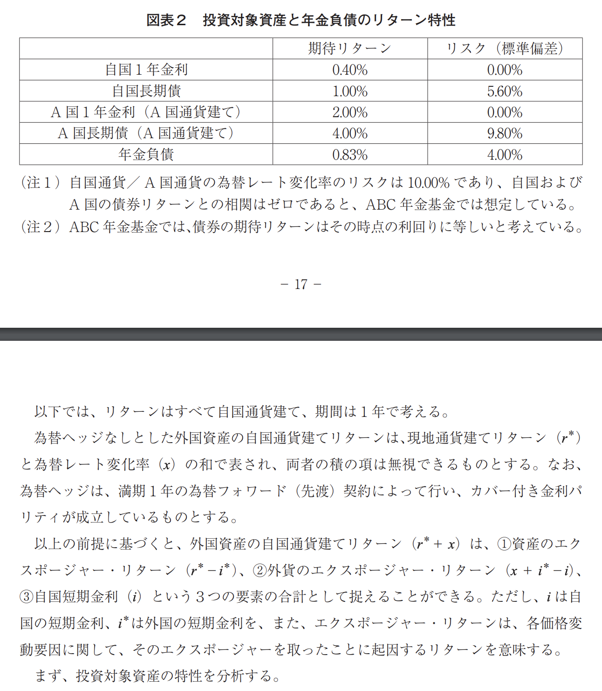
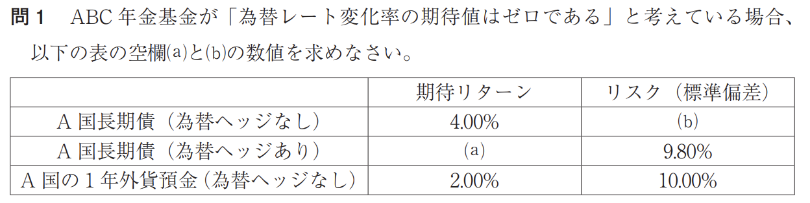
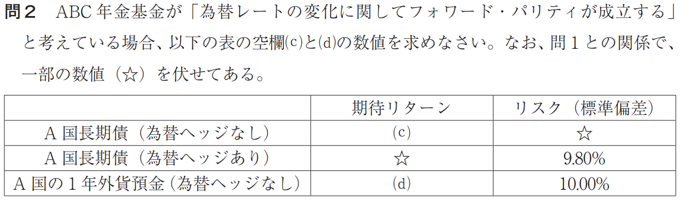
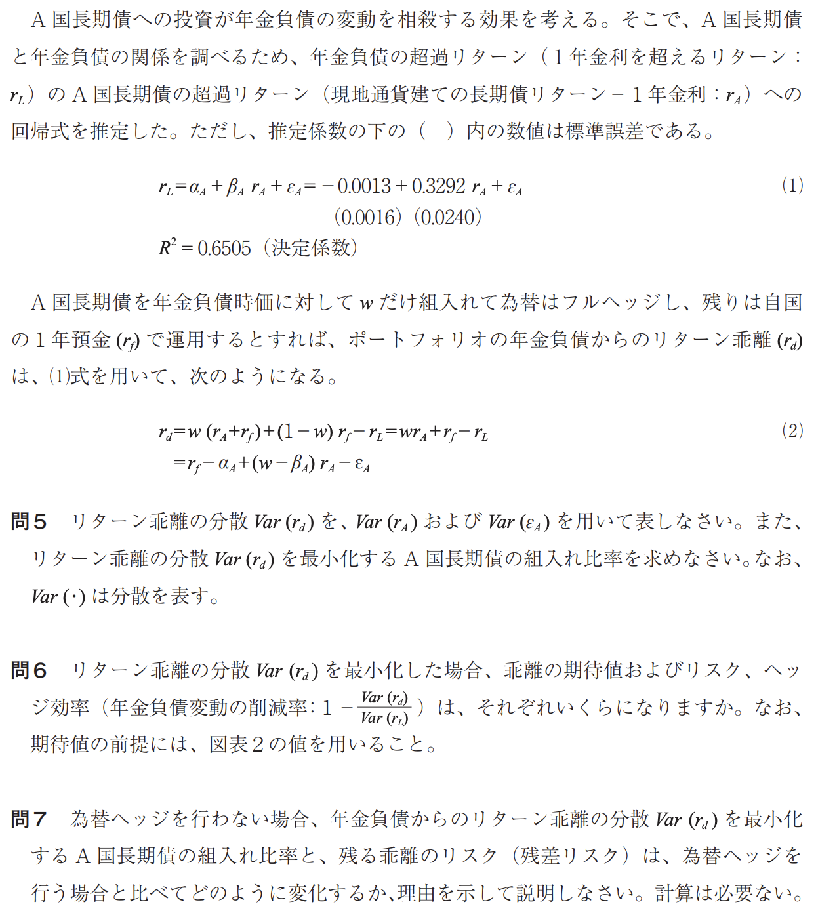

## 完全法・層化抽出法

完全法・層化抽出法・最適化法の定義は？

答えを見る

- 完全法
    - ベンチマークに含まれるすべての銘柄をベンチマークと同じウェイトで組み入れ、アクティブ・ウェイトをゼロにする。ベンチマークの構成に異動があった場合には、それに応じて銘柄の入れ替えやウェイト調整を行って、アクティブ・ウェイトをゼロに維持する。

- 層化抽出法
    - ベンチマークと運用ポートフォリオの特徴の類似性を確保しながら銘柄を抽出しようとするもので、特性（業種、規模など）によってユニバースを複数のセル（部分集合）に分割し、そのセルを代表するような銘柄を抽出し、そのセルの時価総額に応じた額だけポートフォリオに組み入れる。

- 最適化法
    - ポートフォリオの銘柄構成比率がベンチマークとは異なるためトラッキング・エラーが生じるが、これをゼロに近づけることによりポートフォリオをインデックスに近侍させる方法。パラメータの数を絞り込んだファクター・モデルを使って、数理計画法により、少数の銘柄でトラッキング・エラーを最小化する最適ポートフォリオを導く。

完全法の問題点は？

答えを見る

- 指数を構成する全銘柄を組み入れるため、構成銘柄の入れ替えに伴うリバランスのコストが増加する。
- 指数で採用される株価と売買価格が一致しない。特に低流動性銘柄で深刻。
- 単位株取引ルールにより、指数に占める個々の銘柄の投資比率を再現する際に誤差が生じる。
- 単位株取引ルールの下で投資比率を TOPIX と完全に一致させるには、大規模な資金が必要。

完全法と比べた際の層化抽出法の長所は？

答えを見る

- 指数構成銘柄のすべてを組み入れる完全法を用いるには、ある程度以上の運用額が必要であるのに対し、層化抽出法では運用額が小さくても運用できる。
- 完全法は低流動性銘柄を含むすべての構成銘柄を組み入れる必要があるため、その構築には大きな取引コストがかかるのに対し、層化抽出法では、組入れ銘柄を限定することで取引コストを節約できる。

層化抽出法のリバランスの頻度が完全法に比べて高くなる理由は？

答えを見る

完全法でのリバランスは資本移動とベンチマーク構成銘柄の変更のみであるのに対し、層化抽出法では、株価の変化によって、ポートフォリオ構成銘柄のウェイトが適切なウェイトから乖離するので、より頻繁にリバランスを行う必要があるため。

## 浮動株

浮動株の定義は？

答えを見る

総発行済株式から安定株主等が保有する固定株を除いたもので、市場で流通している株式を指す。

配当込み TOPIX が浮動株比率に応じた調整を行っている理由は？

答えを見る

インデックス運用が高まるにつれて、浮動株比率が低い株では、需給の不一致が深刻になるなど、浮動株ではない株式への投資が困難となる。そのため、ベンチマークの要件の 1 つである投資可能性（流動性、あるいは再現性）の観点から、浮動株比率に応じ保有ウェイトを調整している。

アクティブ・マネジャーの選定プロセスとして、最初にスタイル配分を行い、ついでスタイルごとにマネジャーの選択や入れ替えを行う理由は？

答えを見る

同じスタイルではアクティブ・マネジャー間に高い相関が生じるため、相関の高いマネジャーを多数採用することを回避するため。

## VaR

VaR の計算式

答えを見る

- VaR = V × (μ × T - zσ × √T)
    - V: 資産時価、μ: リターンの平均、T: 期間（年）、z: 信頼係数、 σ: リターンの標準偏差

上記のような VaR の算出手法が妥当でないという指摘もある。理由は？

答えを見る

平均リターンと標準誤差の推定誤差、分布の誤り（ファットテールの可能性）、リターンの系列相関などにより、独立した正規分布を前提とした VaR の手法やその算出値が妥当性を失う可能性があるため。

### VaR について言葉で説明せよ

答えを見る

VaR とは、一定期間に一定確率で発生する最大価値損失額。CFaR（キャッシュフロー・アット・リスク）とは、一定期間に一定確率で発生する最小キャッシュフロー。いずれも、一定期間経過後に一定の信頼区間の下限を考えることによって、ダウンサイドリスクを管理する指標という特徴を有している。

### VaR の特徴、使うメリットは？

答えを見る

VaR は、複数のリスクファクター（為替レートや金利など）について、その相関係数を考慮して、リスクにさらされている量を 1 つの数字に集約して表すという特徴がある。このため、企業の経営者にとっては企業全体のリスクを把握し、リスク管理の決定を容易にすることができる可能性がある。

## カーハート・モデルにおけるモメンタム・ファクターについて

### モメンタムが示す傾向とは？

答えを見る

直前の一定期間の株式のリターンが高い（低い）と今期のリターンも高くなる（低くなる）ことを示す。

### モメンタム・ファクターの作成方法

答えを見る

株式の過去 1 年間（実際には直近 1 ヵ月を除く 11 ヵ月間）のリターンの高低に基づいてグループ分けし、最も高かったグループ・ポートフォリオのリターンから最も低かったグループ・ポートフォリオのリターンを差し引くことにより作成する。

## インプリメンテーション・ショートフォール（IS）法

### 「見えざるコスト」の 4 つの要素

答えを見る

- タイミング・コスト
    - 売買計画策定時点での参照株価と、取引を実行する（発注）時点の株価の格差によるコスト。意思決定から執行までの時間差の影響を把握するもの。

- スプレッド・コスト
    - 売買執行時の株価と成約可能な価格（最良気配値）の格差（または、最良気配値と、最良売気配値と最良買気配値の平均（仲値）の格差）によるコスト。対象銘柄に対する注文の売り・買い、いずれか一方への偏りの程度が影響する。

- マーケット・インパクト
    - 売買執行時の最良気配値と実際に約定できた価格の格差（または、平均約定価格と最良気配値の格差）によるコスト。執行株数が最良気配値に待機している株数よりも大きい場合に発生。

- 機会コスト
    - 予定した数量が執行できなかったことによる機会損失。売買計画策定時点での参照価格と、たとえば、執行日の終値といった、当該計画分の執行コストを評価する時点の価格の格差を用いて評価。

### 低流動性銘柄の売買において、マーケット・インパクトを低下させようとすると機会コストが高くなってしまう理由

答えを見る

- マーケット・インパクトを低下させるために成行注文の代わりに指値注文を用いると、その後の価格変動によって執行されない可能性が高まることで機会コストが高くなるというトレードオフが発生する。
- マーケット・インパクトを低下させるために注文を分割すると執行に時間がかかり、一部の注文が執行されない可能性が高まることで機会コストが高まるというトレードオフが発生する。

## ファンド選定の問題

- （たとえば）X 年金基金が、パフォーマンスのよい（高い α を稼ぎ出している）あるファンド A（仮に小型グロースとする）を組み入れる場合に注意すべき点

答えを見る

- 多数のファンドの中から、たまたま過去に α が高かったファンドを選んだにすぎない可能性がある。
- 小型グロースを組み入れることで、X 年金基金の日本株ポートフォリオ全体のスタイルが小型グロースに偏る懸念がある。
- 他のアクティブ・ファンドのアクティブ・リスクとの間で高い相関が生じて、アクティブ・ファンド全体のアクティブ・リスクが増大する懸念がある。

----

## 住宅ローン担保証券（RMBS）、証券化商品の信用補完策

### RMBS の評価において考慮すべきモデル

答えを見る

1. 金利変動などに伴う期限前償還の大きさを推定した、期限前償還モデル（プリペイメント・モデル）
1. 金利期間構造モデルに基づく金利デリバティブ・モデル
を用いて、RMBS のオプション的特性を評価する必要がある。

### RMBS のプリペイメント・モデルで考慮すべき効果

答えを見る

- 金利変動の効果：金利低下によって借り換えが増加する傾向が見られる
- エイジ (age) 効果：借入直後は期限前償還が少ないが、期間の経過とともに増加し、やや安定する傾向が見られる
- 月の効果（季節要因）：わが国のボーナス期や引越しシーズンなどに期限前償還が増加する傾向が見られる
- バーン・アウト（燃えつき）効果：いったん金利低下によって借り換えが進むと、借り換えないで残された借り手は、再度金利低下しても借り換えを行うことが少ない傾向があるといわれている。

答えを見る

### 優先劣後構造とは？
- 発行する証券に付随する債務を複数の階層に分け、支払いの優先順位に差を設けることによって、優先部分に損失が及ぶ可能性を減らした構造。

### アセットバック証券（ABS）

- アセットバック証券 (ABS) の中で、貸付や債券などの金銭債権を裏付資産として発行されるものは **債務担保証券 (CDO)** と呼ばれる（※）。リスクの抑制には、裏付資産を構成しているここの金銭債権の信用力が高いことに加え、それらの特性が**分散**されていることが重要。デリバティブを用いて組成されたものは**合成債務担保証券**と呼ばれる。そのデリバティブは OTC 取引が一般的なため、それによる**カウンターパーティ**リスクを伴う。
    - ※ 金融機関の保有する貸付債権をプールして証券化した商品を CLO (Collateralized Loan Obligation) と呼び、私募債などの社債をプールしこれを担保に発行される証券化商品を CBO (Collateralized Bond Obligation) と呼ぶ。これらを相生して、CDO (Collateralized Debt Obligation) と呼ぶ。
- インフレ連動債の実質修正デュレーションは、**実質**利回りに対する価格変化率の大きさを示している。
    - インフレ連動際は実質金利での運用ができるという意味で実質債と呼ばれ、これと区別する意味で通常の固定利付債は名目債と呼ばれる。このため、インフレ連動債（実質債）の利回りを「実質利回り」、通常の固定利付債（名目債）の利回りを「名目利回り」という。
    - 名目金利 = 実質金利 + 期待インフレ率
- 他の条件が等しいとしてパー発行を想定する場合、プッタブル債とコーラブル債のクーポンの大小関係がどうなるか？

答えを見る

    - コーラブル債のクーポン > プッタブル債のクーポン
    - コーラブル債は投資家が発行体にコールオプションを売却しており、プッタブル債は投資家がオプションを付与されていると考えられるため。

### 変動利付債や証券化商品について

- 変動利付債のクーポンは LIBOR + 30 ベーシスポイントのように決められる。この 30 ベーシスポイントの部分は **（債券）発行** 時点で決められ、**設定マージン**と呼ばれる。
- 住宅ローン担保証券の評価には金利の期間構造モデルに加え、**期限前償還（プリペイメント）**モデルが必要。期限前償還（プリペイメント）に影響する要因として金利変動の効果、経過年数要因、季節要因、バーン・アウト効果等がある。
- アセットバック証券 (ABS) の信用補完の例として、超過担保、裏付け資産を**優先劣後**構造にし、返済順位を高めること、現金を SPV に留保する現金準備、裏付け資産の金利と発行証券の金利に差をつけて差額を一定額まで SPV に留保する超過スプレッド、第三者による信用保証等がある。

## カバー付き金利パリティ

- F = S × (1 + i_D)^T/(1 + i_F)^T ≒ (1 + i_D × T) / (1 + i_F × T)  
    - （F: 先渡為替レート、S: 直物為替レート、i_D: 国内金利、i_F: 外国金利、T: 期間（年））
- 外国証券に為替ヘッジした場合の投資期間 1 年のリターン r_H
    - r_H = (1 + r_USD) × F/S - 1
        - r_USD: 外貨ベースのリターン、F: 先渡為替レート、S: 直物為替レート、
- 価格変化率 ΔP/P
    - ΔP/P = -D_mod × Δy

## イールドカーブの主成分分析

- 大雑把には、「どういう主成分（ファクター）か」を表すのが固有ベクトル、「どれだけ説明できるか（情報量の大きさ）」を表すのが固有値。

イールドカーブを主成分分析したときの第 1 主成分〜第 3 主成分まではそれぞれ何を指すか？

答えを見る

- 第 1 主成分: すべての年限で符号がプラスで共通しており、値の差も小さい。イールドカーブの変化は各年限とも同方向。利回り曲線の金利上昇方向がプラスとなるパラレルシフト（水準変化）を表す。
- 第 2 主成分: 年限が短いとプラスで長いとマイナス。順イールドのフラットニング方向がプラスとなる利回り曲線の傾き変化（ツイスト）を示す。↑／↓
- 第 3 主成分: 短期年限と長期年限でプラス。中期年限でマイナス。イールドカーブの変化は短期と長期が同方向の動き・中期は逆の動きであり、曲率増加方向がプラスとなる利回り曲線の曲率の変化（バタフライ、カーベチャー）。

- 第 1 主成分の固有値が第 2, 第 3 主成分に比べて大きいことの意味は？

答えを見る

    - 最も大きい共通の変動要因が、利回り曲線変化の相当部分に寄与していることを意味する。したがって、利回り曲線の変動要因のうち第 1 主成分で説明できる部分の割合が、他に比べて際立って大きいことを意味している。

- 保有債権の利回りが他と比べて大きく上昇すれば、価格下落も大きいのでパフォーマンスは相対的に劣化する。また、これは金利感応度であるデュレーションの長い債権、つまり残存期間の長い債権ほど顕著になる。こうしたことから、一般に**バーベル型（短期・長期買い）はフラットニング・ツイスト（傾きが緩やかになる変化＝長期金利の相対的低下）に強く、スティープニング・ツイスト（傾きが急になる変化＝中期金利の相対的上昇）に齢とされる。一方、ブレット型（中期の買い）はポジティブ・バタフライ（中期ゾーンの膨らみが弱くなる変化＝中期金利の相対的低下）に強く、ネガティブ・バタフライ（中期ゾーンの膨らみが強くなる変化＝中期金利の相対的上昇）に弱い**とされる。

# デリバティブと投資戦略

## 先物理論価格

- F* = S × {1 + (r - d) × T}
    - （F*: 先物理論価格、S: 現物価格、r: リスクフリーレート（年率）、d: 配当利回り（年率）、T: 満期までの残存期間（年））
- リスク（標準偏差、年率）が 21.0 % の日本株ポートフォリオがある。この日本株ポートフォリオのリターンを、満期が 6 ヵ月後の TOPIX 先物リターンで回帰して得られる決定係数 (R^2) は 0.90 である。ヘッジ後の分散が最小となるように日本株ポートフォリオをこの TOPIX 先物でヘッジ（最適ヘッジ）した場合の、ヘッジ後ポートフォリオのリスク（標準偏差、年率）は？

答えを見る

ポートフォリオの分散の 9 割が TOPIX 先物でヘッジ可能 (R^2 = 0.90) であることから、最適ヘッジ後のポートフォリオ分散 Var は Var = (元々のポートフォリオの分散) * (1 - R^2) = 0.21^2 * (1-0.90) = 0.00441。したがって、最適ヘッジ後のポートフォリオの標準偏差 σ は σ = √0.00441 = 0.0664.. = 6.6 %

## ブラックショールズ・モデル　〜　オプションの理論価格

||ヨーロピアン・コール|ヨーロピアン・プット|
|--|--|--|
|原資産価格の上昇|？|？|
|ボラティリティの上昇|？|？|
|時間の経過|？|？|
|金利水準の上昇|？|？|

答えを見る

||ヨーロピアン・コール|ヨーロピアン・プット|
|--|--|--|
|原資産価格の上昇|上昇|低下|
|ボラティリティの上昇|上昇|上昇|
|時間の経過|低下|低下（deepITM に例外あり）|
|金利水準の上昇|上昇|低下|

### デルタ、ベガ、ロー、ガンマとは？

答えを見る

- 「デルタ（Δ）」：オプションの原資産価格変化に対する感応度。
    - 「ガンマ（Γ）」：原資産価格の変化に対するデルタ（Δ）の感応度。
- 「ベガ」：オプションのボラティリティ変化に対する感応度。
- 「ロー（ρ）」：オプションの金利変化に対する感応度。

- TOPIX ヨーロピアン・プットオプションのデルタは -0.47、ガンマは 0.00187。TOPIX（原資産）がただちに 1,500 円から 1,503 円に上昇した場合のプットオプションのデルタを求めよ。

答えを見る

-0.47 + 0.00187 × (1510 - 1500) = - 0.4513 = - 0.45

### プット・コール・パリティ

プット・コール・パリティは、同一原資産、同一権利行使価格、同一権利行使期間の配当のないヨーロピアン・コールとヨーロピアン・プットの間に成立する平価関係。

#### プットコールパリティの式は？

答えを見る

C + K/(1+r)^T = P + S
（C: コール・オプション価格、K: 権利行使価格、r: 金利（リスクフリーレート）、T* 権利行使期間（年）、P: プット・オプション価格、S: 原資産価格）

- ヘッジ戦略として、TOPIX ヨーロピアン・プットオプション（満期 6 ヵ月）の購入の代わりに、TOPIX 先物を用いたダイナミック・ヘッジングにより同様の効果を目指しても、6 ヶ月後の損益はオプションを購入した場合と乖離していることが考えられる。その理由は？

答えを見る

- 6 ヵ月間の実現ボラティリティが、オプションで想定されたインプライド・ボラティリティと乖離していたため。
- 実際には連続的なヘッジができないので、デルタヘッジは線形近似に過ぎないため。
- 株価のジャンプが起こるなど、ヘッジ期間中の株価変動はオプション評価の前提と異なったものとなっていたため。
- 売買に伴うコストがかさんだため。
- 先物にベーシス・リスクがあるため。
- 期中のリスクフリー・レートが変化したため。

### MM理論

モジリアニ=ミラーの第 1 命題では、法人税のない世界を前提に企業価値は資本構成と無関係であることが説明された。

その後、この第 1 命題は修正される。法人税がある場合、負債をもつことで支払利息が課税所得を圧縮するため、負債比率を上げることにより企業価値を向上させることができる（負債の節税効果）。

ただし、負債を際限なく拡大すると将来における倒産リスクが高まり、倒産に伴う諸々のコストの割引現在価値だけ企業価値を低下させる（倒産コスト）。

- 財務的困難に伴うコストや不完全市場に伴うコストという経路を通じて、企業価値が向上する可能性があるとはどういう意味か、それぞれについて説明せよ。

答えを見る

- 財務的困難に伴うコスト：負債比率を上げることにより財務的困難に伴うコストが高まるような場合、負債比率を低下させることにより企業価値を向上させることができる。
- 不完全市場に伴うコスト：法人税が存在する場合、支払利息の増大は利益を圧縮し節税効果を高める。このような場合には、負債比率を高めることで企業価値を向上させることができる。  
(詳細)
- 財務的困難に伴うコスト：倒産によって企業が清算されると、一般には清算価値は事業を継続していた場合の資産価値に比べて大きく低下する。また実際に清算にまで至らなくても、倒産の危険が高まると、顧客の需要の低下や取引条件の悪化、従業員の士気の低下など間接的なコストが発生する可能性がある。このような期待倒産コストの上昇は、企業価値の低下を招く。このため、リスク管理による倒産リスクの低減が、企業価値向上をもたらす可能性がある。
- 不完全市場に伴うコスト：
    1. 企業の CF が大きく変動する可能性があるとき、CF 低減期に NPV > 0 である投資案件が持ち上がっても、外部からの資金調達の制約により、直ちに資金調達ができないことにより、投資案件を逃してしまう可能性がある。このような自体は企業価値向上を阻むため、現時点での企業価値を低減させている可能性がある。
    1. 既存の負債に付された財務上の特約（コベナンツ）に抵触するような損益変動により負債の早期返済が必要になるなど、事業運転資金調達に支障が生じると、将来の投資機会を逃す可能性がある。
    1. 法人税は税引前利益に課せられるが、その各期の変動が大きく、損失となった場合の税の還付が完全には行われない場合には、法人税支払額の現在価値が損益変動の増加によって変動する可能性がある。このような場合には、損益変動を低下させるリスク管理によって、企業価値が向上する可能性がある。

### マートン・モデル

株式や負債をオプションとして考えると、それぞれコール、プットどっち？

資本構成が株式と負債で、1 期間後に清算する企業を考えればよい。

答えを見る

- 株主の持分 = **コール**オプション（企業価値が原資産、**負債**額面が権利行使価格、**負債満期**が残存期間）の買い
- 債権者の持分 = **プット**オプション（企業価値が原資産、負債額面が権利行使価格、負債満期が残存期間）の売り（厳密には、安全資産の買い＋プットオプションの売り）
- 資産価値の変動性の増大の影響：変動性の増大はコールオプション価値、プットオプション価値それぞれを向上させる。しかし、債権者はプットオプションの売りであるから、資産価値の変動性増大は、株主の持分の増加と、債権者の持分の減少をもたらすことになる。

### 株価リスク制御について

あなたの会社では親密取引先企業数社の株式を政策的に保有している。この政策保有ポートフォリオは取引上売却が困難だが、このポートフォリオの時価下落リストを制御したい。プットオプションを購入するかわりに、満期 1 年の TOPIX 先物を最適ヘッジ枚数だけ売却し、政策保有ポートフォリオのヘッジ後価値の分散が最小となるようにした場合、「相場上昇時のリターンの放棄」以外にも、プットオプションの購入と比較してデメリットが考えられるという。そのデメリットを簡潔に述べよ。

答えを見る

- 政策保有ポートフォリオは取引先数社の株式で構成されており、TOPIX に対するベータが 1.0 だとしても、TOPIX と連動しない非システマティック・リスクが相応に存在していることが考えられる。政策保有ポートフォリオを原資産とするプットオプションと異なり、TOPIX 先物ではこの非システマティック・リスクがヘッジできず、下方リスクが残る点がデメリットとなる。
- 株式相場が大きく上昇した場合、プットオプションの購入の場合はオプション料を失う以上の損失はないが、TOPIX 先物売りの場合、相場が上昇したぶんだけ先物売りの損失は膨らむ。仮に政策保有ポートフォリオの時価も上がっていたとちsても、これらは売却できないため、先物の売却損を清算するために必要な資金捻出が想定以上に膨らむ可能性がある点はデメリットとなる。同様に、相場上昇時には期中に追加証拠金が発生し、このために必要となるキャッシュが想定以上に膨らむ可能性がある点もデメリットである。
- 市場環境の変化により、期中にベータや最適ヘッジ枚数が変化する可能性があり、この場合、ヘッジ誤差の拡大や、これを防ぐためのヘッジ枚数調整に伴う売買コストが発生する可能性もデメリットとして挙げられる。
- 先物にベーシスリスクが存在しており、先物売却価格がベーシスリスクによりブレる可能性もデメリットとなりうる。
    - ベーシスリスク：非常に連動性の高い二つの金融商品の間に乖離が生じることにより、損益が変動するリスク。

### 為替リスク制御

- あなたの会社では 6 ヵ月後に 1,000 万米ドルが入金される予定となっているが、入金日までの円高リスクが気になるため通貨デリバティブの活用を検討している。

- ヘッジ戦略 ①: 想定元本 1,000 万ドルの為替先渡契約（6 ヵ月）によりフルヘッジ
- ヘッジ戦略 ②: 以下のドルプットを想定元本 1,000 万ドルぶん購入
- ヘッジ戦略 ③: 以下のドルプットを想定元本 1,000 万ドルぶん購入すると同時に、ドルコールを想定元本 1,000 万ドルぶん売却。

|オプションの種類|権利行使価格|オプション価格|
|--|--|--|
|ドルプット|107 円/ドル| 2.02 円 |
|ドルコール|112 円/ドル | 1.97 円 |

- 6ヵ月後に円安となった場合には為替差益（期首の為替レートで評価した金額を上回る円貨入金額の獲得）を狙いたい一方、大幅な円高で終わったとしても、ヘッジ後の円貨入金額（オプション売買金額考慮後）は 10.6 億円以上を必ず確保したいと考える場合、（1）上記ヘッジ戦略①、②、③のうちどの戦略が最も望ましいか。（2）その戦略を実行し、6 ヵ月後に直物為替レートが 100 円/ドルとなった場合のヘッジ後入金額が円貨でいくらになるか計算せよ。ただし、オプション売買にかかる金利は無視すること。

答えを見る

戦略①では、6ヵ月後の直物為替レートがいくらになろうと 1,000 万ドルは 1,000 万ドル × (現在の 6 ヵ月先渡（フォワード）為替レート; これは F = S × (1 + i_JPY)^T / (1 + i_USD)^T で算出される）で固まってしまう。「円安になった場合に為替差益を狙いたい」という条件に合致しないため不適切。

戦略②では、満期 6 ヵ月後の為替レートが 107 円/ドルを超える円安になった場合には権利行使により為替差損を補填でい、円安になった場合には（プットオプションは放棄するものの）入金される 1,000 万ドルを円転額が up するので為替差益をフルに享受できる。しかし、オプション価格が 2.02 円なので、6 ヵ月後の直物為替レートを S とすると、フロアは 1,000 万ドル × S + {(107 - S) - 2.02} × 1,000 万ドル = .. = 10.498 億円 となり、大幅な円高で終わったとしても、ヘッジ後の円貨入金額は 10.6 億円以上を必ず確保したいというニーズを満たさない。

**戦略③**が答え。為替レートが 107 円/ドルを超える円高になったときにはロング。プットの権利行使により為替差損（具体的には、入金する1000 万ドルの円転額が減少してしまうこと）を補填できる。この場合、権利行使価格 112 円/ドルのショート・コールは権利行使されないため、オプション価格 1.97 円がそのまま利益となる。フロアは、1,000 万ドル × S + {(107 - S) - 2.02 + 1.97} × 1,000 万ドル =...=10.695 億円 となり、ヘッジ後の円貨入金額は 10.6 億円以上を確保できる。

*{(107 - S) - 2.02 + 1.97} × 1,000 万ドル のように、{} 内の「1 オプションあたりの損益」にドルをかけるのがよくわからなかったが、想定元本（1000 万ドル）とはつまりオプションいくつぶんか？ということなの、、かな。*

### 通貨スワップ

|年限|円金利（スポットレート）|円金利（パーレート）|米ドル金利（スポットレート）|米ドル金利（パーレート）|
|--|--|--|--|--|
|1 年|0.800%|0.800%|2.00%|2.00%|
|2 年|1.505%|1.500%|2.811%|2.800%|

*通貨スワップの前提*

- 想定元本: 1 億ドル、
- 為替レート（直物）: 110 円/ドル
- 満期: 2 年
- 年 1 回、あなたの会社が円固定金利を支払い、ドル固定金利 2.8 % を受け取る
- 通貨スワップ開始時および満了時に元本の交換あり（1 億ドルと 110 億円 を交換）

1. 上記の通貨スワップの円固定金利（通貨スワップの期首時点の価値がゼロとなるような円固定金利）はいくらか。
1. この通貨スワップを締結した直後に、為替レート（直物）が 112 円/ドルになったとする。あなたの会社にとって、当該通貨スワップの価値はいくらか？

答えを見る

1. 円固定金利を支払い、ドル固定金利を受け取る通貨スワップの価値 V_c は、円建固定利付債をショートし、ドル建固定利付債をロングしたポートフォリオの価値の合計と解釈できる。円建固定利付債の価値を B_Y、ドル建固定利付債の価値を B_D、為替レート（円/ドル）を e とすると、通貨スワップの期首時点の価値がゼロとなるためには、V_c = - B_Y + e * B_D = 0 となる必要がある。ここで、通貨スワップのドル固定金利が期間 2 年のパーレートと同じ 2.8 % であることから、B_D は額面と同じ 1 億ドルとなることがわかる。このため、B_Y = e * B_D = 110 円/ドル × 1 億ドル = 110 億円 となり、円側も額面と時価が 110 億円で一致している必要があり、このため円の支払い利息はパーレートである必要がある。すなわち、円固定金利は 1.500 % であることになる。
1. 通貨スワップの価値は上記のとおり V_c = - B_Y + e * B_D と表される。B_Y = 110 億円、B_D = 1 億ドルであるから、為替レートが 112 円/ドルの場合、V_c = - 110 億円 + 112 円/ドル × 1 億ドル = 2 億円 つまり、この通貨スワップは **2 億円**の価値を持つことがわかる。

(ポイント)

**金利スワップも通貨スワップも、固定金利は対応する期間のパーレートとなる！**

## 投資政策とアセット・アロケーション

ポリシー・アセット・アロケーションの運用の考え方を説明し、その運用手法に従うと市場の動きに対して「逆張り」方向の取引を行うことになる理由を説明せよ。

答えを見る

①運用対象にする資産クラス（債券や株式など）を決め、②各資産クラスのリターン、リスク、相関係数に対する長期的な予想に基づいて望ましい配分比率（政策アセット・ミックス）を定め、③その配分比率を数年後の政策アセット・ミックス見直しの時点まで維持する（コンスタント・ミックス）という運用の考え方。価格が上昇した資産クラスを売り、価格が下落した資産クラスを買うというポートフォリオのリバランスが必要になるが、これが「逆張り」の要素になる。

ある資産の日次リターンを {R_1, R_2, ..., R_T} として、この T 個のデータからヒストリカル・ボラティリティ（年率換算値）を求める方法を、式を用いて説明せよ。なお、年間の営業日数は 250 日として年率換算すること。

答えを見る

標本平均: \bar(R) = 1/T * Σ(t=1~T)R_t

標本標準偏差: s = √{(1/(T-1))Σ(t=1~T)(R_t - \bar(R))^2}

を計算する。年率換算のヒストリカル・ボラティリティは √250 × s = 15.81s にょり求められる。

前四半期が状態1（ボラティリティ正常期）、今四半期が状態2（ボラティリティ異常上昇期）となる場合に、今四半期の S&P500 指数のリターンが最悪になると考えられる理由は？

答えを見る

投資家の不安心理が増幅してリスク回避度が上昇している状態である。投資家のセンチメントが悪化するといわゆる「質への逃避」が起こるので、短期投資家を中心に株式が大幅に売られ、株価が大きく下落するものと考えられる。

> **質への逃避**  
> 先行きに対する不安が著しく高まった時、リスクを避けるために「より安全性（信用度）・流動性（換金性）の高い投資対象」を投資家が求めることをいう。相対的にリスクが低く流動性が高い投資対象への動きがある。

||期待超過リターン|ボラティリティ|シャープ・レシオ|
|--|--|--|--|
|前四半期が状態1の場合|6.6%|16.1%|0.41|
|前四半期が状態2の場合|12.1%|31.7%|0.38|
|全期間|6.9%|17.3%|0.40|

上記の図表で、「前四半期が状態 1 の場合と状態 2 の場合で、今四半期のボラティリティに差はない」という帰無仮説について、有意水準 1 % で両側検定による仮説検定（F 検定）を行え。なお、上記の図表の統計値のもとになった標本数は「前四半期が状態 1 の四半期」が 232 個、「前四半期が状態 2 の四半期」が 12 個で、帰無仮説に対する F 分布の棄却域の下側閾値 F_99.5% (231, 11) は 0.3966、上側閾値 F_0.5% (231,11) は 4.2836 である。

答えを見る

帰無仮説の下で F = (s_1)^2 / (s_2)^2 が自由度 (231, 11) の F 分布に従うという性質を利用する。有意水準 1 % で行う帰無仮説の棄却域は  

(s_1)^2 / (s_2)^2 < F_99.5% (231, 11)（下側閾値）または (s_1)^2 / (s_2)^2  > F_0.5% (231, 11)（上側閾値）

である。図より (s_1)^2 / (s_2)^2 = 0.161^2 / 0.317^2 = 0.2579 となるが、棄却域の下側閾値が 0.3956 と与えられているので、帰無仮説は棄却される。

 

**インフォメーション・レシオ（IR）**

IR は「アクティブ・リスク（トラッキング・エラー。アクティブ・リターンの標準偏差）に対するアクティブ・リターンの割合」。

IR = α / TE

答えを見る

A 社ポートフォリオのアクティブ・リターンを R_Act,A と表すと、A 社ポートフォリオの IR は次のように表される。

IR_A = E(R_Act,A) / √Var(R_Act, A)

ここで、E(R_Act,A) = E(R_A - R_s) = E[(αA + β_ A ×R_s + ε_A) - R_s] = α_A + (β_A - 1) E(R_s) = 0.02 + 0.2 × 0.07 = 0.034

Var(R_Act, A) = Var(R_A - R_s) = Var([(αA + β_ A ×R_s + ε_A) - R_s]) = Var[α_A + (β_A - 1)R_s + ε_A] = ... = 0.0116

IR_A = 0.034 / √0.0116 = 0.32

※ 問 2 では「株式 31.7%, 債券 49.9%, 短期金融資産 18.4%」という答え。

答えを見る

この資産配分と問 2 の答えの資産配分は実質上等しい。すなわち、TOPIX 先物の売りポジションを勘案すると、ベンチマーク換算した各資産に対するエクスポージャーは、

- 株式: 1.2 × 44.0 % + 1.0 × (-22.1%) = 31.7 %
- 債券: 49.9 %
- 短期金融資産: 100 - 31.7% - 44.9% = 18.4 %

となり、問 2 の答えの資産配分と実質上等しい。
 
示唆していること: ベンチマークで説明できる部分を除いたマネジャー独自のリターンはベンチマーク・リターンと独立なので、アクティブ・リスクをどれだけ取るかは、マーケット・リスクに対するエクスポージャーとは独立に決定できるということを、この結果は示唆している。  
（A 社のβ・リスクは TOPIX 先物の売りによって打ち消され、市場並みのベータでアクティブ・リターン（アルファ）を狙うことができる。残る A 社のアクティブ・リスクの水準はベータ・リスクと無関係に決定、管理すればよい。

上の問いのように、アクティブ・マネジャーの運用スキルを享受しつつ、先物を使って実質的な資産配分を調整し、アクティブ・リターンを資産間で移し替える運用戦略は何と呼ばれるか。また、このような戦略を実際に実行する際の問題点は？

答えを見る

- 名称：ポータブル・アルファ戦略
- 問題点：
    - アクティブ・マネジャーの運用パフォーマンスについて、事前に (2) 式のような式を正確に推定することは難しい。
    - アクティブ・マネジャーの優れたパフォーマンスが将来も持続するか定かではない。
    - 運用する株式ポートフォリオと株価指数先物の間にはベーシス・リスクが存在する。
    - 先物ポジションを取るため証拠金が必要で、毎日の値洗いで追加証拠金が必要になったりする場合もあり事務手数がかかる。

**サプライサイド法**とは？

答えを見る

サプライサイド法とは、債券や株式のリターンの源泉は資本の生み出す収益であるとする考え方。たとえば、株式のリターンを、配当利回りや企業収益の伸び、バリュエーションの変化などの合計値として算出するような手法である。

（解説） 

中長期のポリシー・アセット・アロケーションの決定には、各種資産クラスの期待リターンとリスク、相関係数といったパラメータを推定する必要があるが、期待リターンの推定は難しい。期待リターンやリスクの推定にあたり最も単純な方法は過去のリターンの平均や標準偏差をそのまま引き伸ばして将来の投資期間に適用する **ヒストリカル法** である。

このヒストリカル法によった場合、過去のリターンの平均（標本平均）がよい推定値となるには、母集団から抽出された実現値に偏りがないことが必要である。しかし、株式や為替などリスク資産の実際のリターン（実現値）は過去の期間によって大きく異なり偏りが生じるため、期待リターンの推定は困難とされる。

ヒストリカル法に代えて、ビルディング・ブロック法とサプライサイド法がある。

- **ビルディング・ブロック法**: リスクのない安全資産のリターンを起点とし、各資産クラスのリスクに応じてリスク・プレミアムを推定し、これを積み上げることにより期待リターンを推計する方法。
- **サプライサイド法**: 本問。

||期待リターン（年率）|リスク（標準偏差・年率）|
|--|--|--|
|債券|0.5%|4.0%|
|株式|6.0%|20.0%|

債券と株式の相関係数: -0.2  

債券に 70 %、株式に 30 % を投資するポートフォリオの(1) リスク（標準偏差・年率）、(2) 同ポートフォリオにおける株式のリスク寄与（標準偏差・年率）を計算せよ。ただし、ポートフォリオ・リターンと株式リターンの共分散は 0.01088 である。

答えを見る

(1) √0.7^2 × 0.04^2 + 0.3^2 × 0.2^2 + 2 × 0.7 × 0.3 × (-0.2) × 0.04 × 0.2 = 6.1 %

(2) リスク寄与 = w_i × Cov_i,p / σ_p = 0.3 × 0.01088 / 0.061 = 0.0535081 = 5.4 %  
（ただし w_i: 資産 i への投資比率、Cov_i,p: 資産 i とポートフォリオの収益率の共分散、σ_p: ポートフォリオの収益率の標準偏差）

⭐️ すなわち、ポートフォリオのリスク 6.1% のうち 5.4%（約 88%）は株式リスクということになる。

A さんの効用が U_T = μ_T - λ/2 * σ_T^2 で表される（T: 投資期間, μ_T: 期間 T を通じた累積期待リターン（対数ベース）、σ_T^2: 期間 T を通じた累積リターンの分散、λ: A さんのリスク回避度）。各年のリターンは独立（系列相関がゼロ）で同一の分布にしたがい、現在保有する金融資産の投資のみを考えたとする。その場合、投資期間 T が長くなるにつれて、（1）A さんの株式への最適投資比率がどうなるか （2）その根拠、を答えよ。

答えを見る

（1）投資期間 T が長くなっても、株式への最適投資比率は変わらない

（2）根拠：各年のリターンは独立で同一の分布に従うことから、各資産の期待リターン（対数ベース）とリスク（分散）の相対的な大きさは、投資期間にかかわらず一定である。効用の式 U_T から、債券と株式の効用の相対的な大きさは投資期間 T によって変わらないので、最適ポートフォリオの構成も T によって変わらない（Samuelson-Merton の定理により、近視眼的なポートフォリオが長期投資家にとっても最適となる）。

> 効用関数を書き換えると U_T = μ_T - λ/2 * σ_T^2 = (T × μ) - λ/2 (T × σ^2) = (μ - λ/2 × σ^2) × T（ただし μ: 一年間の期待リターン（対数ベース）、σ: 一年間のリターンの標準偏差）となる。投資期間 T に対し効用が最大となるのは、一年の効用である `()` 内が最大となる場合である。`()` 内は投資期間 T に依存しない。

サラリーマンの富には、金融資産以外に**人的資本**も含まれるといわれる。（1）人的資本とは何か？（2）人的資本まで考慮した場合、投資家の年齢が上がると一般的に株式への最適投資比率がどうなるか？

答えを見る

（1）人的資本とは労働所得の獲得力であり、人的資本の価値は将来の労働所得の割引現在価値と考えることができる。 

（2）若い頃は金融資産が少なくても、将来の労働所得の現在価値、すなわち人的資本が多く、個人の総資産の大半を占める一方、年齢が上がるにつれて人的資本が減少し、金融資産の割合が高くなる。したがって、若い頃には金融資産は主に株式などのリスク資産中心で運用し、年齢が上がるにしたがって金融資産に占める株式などのリスク資産を現象させるのが最適となる。すなわち、人的資本まで考慮した場合、投資家の年齢とともに株式への最適投資比率は*減少する*。

> 一般的な給与所得者の場合、労働収入は比較的安定しているとして、人的資本は債券に近い性質を持つ（年によって収入が大きく変動する職業などの場合はまた別。その場合はどちらかというと株式的な性質とみなすことができよう）

サラリーマンの A さんは公務員として働いてきたが、証券会社に転職することになった。証券会社へ転職により、（1）人的資本も考慮した場合の株式への最適投資比率はどうなるか？（2）根拠は？

答えを見る

（1）公務員から証券会社に転職した場合、株式への最適投資比率は減少する。

（2）一般に、公務員に比べ、証券会社では景気に応じて収入の変動幅が大きく、また収入が株式市場と連動することが考えられる。このため、証券会社に転職することで人的資本の変動性（リスク）が上昇し、かつ株式市場との相関性が高まるため、金融資産の中での株式への最適投資比率は減少する。

人的資本が大きく算出されるのは、労働所得の稼得状況にどのような特徴がある場合か、考えられる状況を挙げよ。ただし、「現在の所得が大きい場合」は自明であるため除く。

答えを見る

- 今後の高い賃金上昇が期待される場合
- 年齢が若く、今後の所得稼得期間が長い場合
- 賃金が安定しており、リスクが小さい場合

現在 30 才で公務員である A さんについて、労働所得稼得能力の年齢に伴う変化を考慮すると、金融資産における（株式等の）リスク資産への投資比率を、若年期と中高年期でどのように変更していくのが望ましいと考えられるか、理由を示して説明せよ。

答えを見る

年齢との関係：若年きはリスク資産の投資比率を高くし、中高年期には債券などにシフトさせることにより、リスク資産の投資比率を引き下げる。

理由：公務員である A 氏の人的資本はリスクが小さく、その価値は年を重ねるにつれて減っていく。A 氏の総資産を金融資産と人的資本の合計とすると、若年期は低リスクの人的資本が多いので金融資産は主にリスク資産で運用し、中高年期には人的資本が減るので金融資産におけるリスク資産の投資比率は小さくすべきである。

答えを見る

係数 β の t 値は 1.60 ... (= (0.0605 - 0)/0.0378) である（これを z 値と見立てる）。有意水準 5 % （両側）の臨界値は片側 2.5 % の z 値を読み取って求められる。標準正規分布票から片側 2.5 % の z 値は ± 1.96 である（「1.9」と「.06」の交差する点に「.9750」と書かれてある。が、1.96 は暗記していて当然）。1.60... < 1.96 より棄却域に収まらないため、帰無仮説は棄却されない。

インフレのヘッジ手段として株式投資は有効といえるか、上記問いの結果を踏まえた理由を示して答えよ。また、株式以外で、インフレヘッジの手段として望ましいと考えられる投資資産（金融商品）を理由を示しながら 1 つ答えよ。

答えを見る

有効性：インフレヘッジを目的とした投資には有効とはいえない。

理由：株式と物価上昇率の関係を示す β は、長期間のデータを用いて検証しても有意に 0 と異なるとはいえないので、連動しているとは認められないため。（また、R^2 の水準は低いことから、株式はインフレ以外の要因によって大きく変動するといえ、資産運用によるインフレヘッジを難しくする可能性もあるため。）

望ましい投資資産：1. 物価連動債 2. 外国通貨 

理由：1. 支払額が物価に連動するため。 2. 国内通貨の価値下落に連動せず、購買力を保つと期待されるため。

> 古くから、コモディティ（商品）のリターンとインフレ率との相関は高いことが指摘されているため、コモディティ・ファンドと答えてもよかろう。

答えを見る

問6.

望ましい配分：確定拠出年金の運用資産で X ファンドを保有し、通常の運用資産として Y ファンドを保有する。

理由：ファンドの分配金は一般に課税対象であるが、確定拠出年金制度のような非課税勘定で運用していれば課税されない。よって、確定拠出年金の運用資産として X ファンドを保有し、通常の運用資産として Y ファンドを保有することで、税負担を軽くし長期的な蓄積をより大きくすることができる。

問7.

*生命保険は人的資本が失われるというリスクのヘッジ*だが、定年により人的資本の価値が大きく低下しているので、生命保険（死亡保険）への加入を続ける意味は乏しくなる。他方、長生きのリスクをヘッジし、老後の安定した生活基盤を確立するためには、終身年金保険への加入が重要となる。よって、A 氏は従来の生命保険を継続するのではなく、終身年金保険の新規契約を検討すべきである。

### サープラス・マネジメント

年金 ALM の代表的な手法として、「シミュレーション型」と「サープラス・アプローチ」がある。これらはどのようなものか、それぞれについて簡潔に説明せよ。

答えを見る

シミュレーション型：責任準備金（保険会社や構成年金基金等が将来の保険金や給付金を支払うために積立てている負債。本問では年金基金が題材）のような年金財政上の債務に見合った資産の確保を図るため、（モンテカルロ・シミュレーションなどのなんらかの）シミュレーションを通じて、リスク許容度の範囲で最適なポリシー・アセット・アロケーションを決定するもの。

サープラス・アプローチ：バランスシート型とも呼ばれ、会計上の退職給付債務（PBO; Projected Benefit Obligation）と運用資産のデュレーションの差異をリスクと認識して、それを制御することにより金利感応度の調整を図り、サープラスの変動リスクを管理するもの。

> ちなみに、協会テキストでは年金 ALM の手法として 3 つが挙げられており、もう一つは:    
> キャッシュフロー・マッチング（デディケーション）  
> 支払債務である年金給付金を債券のクーポンおよび満期償還金で賄えるように、給付金のアウトフローと債券のインフローを時期・金額ともマッチさせる。

> サープラス・アプローチでは、年金運用の目的は運用利回り（予定利率）の確保そのものでなく、資産直から債務の現在価値（債務時価）を引いた「サープラス」を維持・管理することととらえ、サープラスの変動（分散・標準偏差）を最小化させる。

　資産   給付債務  
  資産   給付債務  
  資産   給付債務  
  資産　サープラス   
  資産　サープラス  

欧米諸国の企業年金基金で年金 ALM が注目されるようになったきっかけは？米国もしくは欧米諸国の企業会計制度との関連を踏まえて説明せよ。

答えを見る

米国では、1986 年から企業会計基準・FAS87 (Financial Accounting Standard) が導入されたことにより、年金債務が市場実勢金利に応じた割引率で時価評価され、積立不足をバランスシートに計上することが義務づけられた。一方、英国や欧州大陸諸国でも 2000 年代半ば以降、確定給付債務、資産の変動を即時認識するなど会計基準や年金財政基準が厳格になった。こうした規制強化の動きが、年金 ALM の分析フレームワークに注目が集まる契機になった。

サープラス・アプローチを前提とした場合、短期金融資産、債券、株式の 3 種類の資産クラスのうちリスクの最も低いものはどれか。理由とともに答えよ。

答えを見る

サープラス・アプローチにおける **年金債務の時価評価額は、国際利回り等に基づく割引率の変動によって** 大きく影響される。そのため資産と*年金債務の時価評価額の差異に注目するサープラス・アプローチ*では、**年金債務と高い相関を持ち、金利変化に対し債務と同じ方向に時価評価額が変動する債券**が最も安全な資産になる。

資産側のリスクとリターンのみを勘案する伝統的な資産配分と比較したとき、サープラス・アプローチに基づく資産配分に伴う最も大きな問題点は何か、近年の経済・金利環境を踏まえて説明せよ。

答えを見る

サープラス・アプローチに則って資産配分を決めると、資産側だけを考える伝統的なアプローチに比べて**債券に対する配分比率が高くなる**。しかし、長期的には伝統的なアプローチのように株式の組入比率を高くした運用のほうが、期待リターンが高くなり、年金の積立（ファンディング）状況が改善する可能性が高まる。特に、長期間にわたり超低金利が続いている近年の状況では深刻な問題になる。

とある年金基金の資産配分について。年金基金がリスク許容度 τ を引き下げて、よりリスク回避的になったとすると、算出される資産配分にどのような変化がみられるか、(1) リスク資産全体と安全資産の間の投資比率に見られる変化と、(2) 各リスク資産間の投資比率に見られる変化について、それぞれ説明せよ。

答えを見る

(1) リスク許容度 τ を小さくすると、ポートフォリオ全体のリスクから発生するペナルティ項の値が大きく評価されるため、よりリスクを回避するような資産配分が選ばれる。具体的には、*安全資産への投資比率が上昇し、リスク資産への投資比率は低下する*。

(2) 分離定理が成立するため、リスク資産間の配分比率は、リスク許容度 τ の値に依存せずに一定となる。

> Note: トービンの分離定理  
> 市場にリスク資産と安全資産がある場合、接点ポートフォリオ（最適リスク資産ポートフォリオ）はリスク資産のみで構成される唯一の効率的ポートフォリオであり、投資家のリスク選好とは独立に決まる。  
> なお、効率的ポートフォリオは接点ポートフォリオと安全資産の組み合わせとなる。

①最小分散ポートフォリオ、②等ウェイト・ポートフォリオの概略を説明せよ。また、①と②のポートフォリオ戦略が、平均分散ポートフォリオ問題の最適解であると解釈するためには、期待リターンと共分散にどのような仮定をおけばよいか、それぞれ説明せよ。

答えを見る

① 最小分散ポートフォリオ：期待リターンは考慮せず、ポートフォリオの分散（リスク）が最も小さくなるように資産配分を決定する方法。投資対象のすべての資産のリターンが等しいと仮定した場合の最適ポートフォリオと解釈できる。

② 等ウェイト・ポートフォリオ：すべての資産を同一の配分で保有するポートフォリオ。投資対象のすべての資産の期待リターンとリスクが同一で、各資産間の相関係数も同一であると仮定した場合のポートフォリオと解釈できる。

現在のスポット為替レートが 1 ドル = X 円、フォワード為替レートが 1 ドル = F 円、国内金利が i_JP、米国金利が i_US であるとして、  
（1）カバー付き金利パリティの定義式を示せ。  
（2）カバー付き金利パリティが成立すると考えられる理由を述べよ。  
（3）「為替リスクを完全にヘッジしたうえで、国内債券から米国短期債券へと資金を移せば、短期債でも米国の方が金利が高いから、年金資産全体のリターンを確実に向上させることができる」とは真か。

答えを見る

（1）カバー付き金利パリティは、スポット為替レート X、フォワード為替レート F、そして 2 国の金利（国内金利 i_JP、米国金利 i_US）の間に、次のような関係が成立するというものである。

F / X = (1 + i_JP) / (1 + i_US)

（2）国内金利で運用した場合と、米国通貨に変換して米国金利で運用しつつ為替フォワード取引（為替予約）によって通貨エクスポージャーを消し去った場合とでは、得られる収益は同じだと考えられるため。言い換えれば、国内外の金利水準を所与とした場合、裁定取引がでいないような水準に為替のフォワードレートが定まるということ。したがって、カバー付き金利パリティは実際の市場で成立していることが多い。

（3）為替フォワード取引を用いて為替リスクを完全にヘッジしたときには、フォワード為替レートの水準が裁定取引を許容しないように定まっていることから、「米国のほうが金利水準が高い」からといって「必ずリターンを向上させることができる」わけではない。

⭐️ 上の問題に関連して。。

**為替ヘッジした場合の外国証券の投資収益率** r_H は以下のようになる。

r_H = (1 + r_US) × F/X - 1  
    = (1 + r_US) × (1 + i_JP)/(1 + i_US) - 1  
    ≒ r_US + i_JP - i_US

ただし、r_US: 外国証券の外貨ベースリターン。

ここで、米国短期債券に投資したとすると r_US ≒ i_US なので結局、投資収益率は日本円金利 i_JP となる。

## 国際証券投資

### 通貨配分と為替ヘッジ

とある年金飢饉では、ポリシー・アセット・アロケーションにおける通貨配分について、為替ヘッジの利用を検討している。  
ポートフォリオにおける通貨配分の決定方法には、2 段階法と 1 段階法があるが、それぞれどのようなものか。

答えを見る

2 段階法：あらかじめ国内外の株式や債券に対するアセット・アロケーションの決定を行い、次に為替ヘッジ戦略を考える方法。

1 段階法：株式や債券に対するエクスポージャーと通貨エクスポージャーを同時に決定する方法。

外国証券への資産配分は、2 段階法を採用した場合と 1 段階法を採用した場合のどちらが少なくなる傾向があるかを理由とともに答えよ。

答えを見る

2 段階法のほうが、外国証券が少なくなる傾向がある。

理由：2 段階法では、1 段階法に比べ資産配分を決定する際に為替リスクのぶんだけ外国証券のリスクを高く見積もることになる。その結果、外国証券への配分は 2 段階法のほうが 1 段階法よりも少なくなる傾向がある。

国内証券と通貨リターンの共分散 Cov(r_D, x) および外国証券と通貨リターンの共分散 Cov(r_F, x) の高低は最適ヘッジ比率 h* にどのような影響を与えるか。  
（r_D: 国内証券のリターン、r_F: 外国証券の現地通貨建てリターン、x: 外国通貨の自国通貨建て為替レートの変化率、ヘッジ比率とは、外国通貨エクスポージャーのうち、為替ヘッジする比率のこと）

答えを見る

国内証券と通貨リターンの共分散、および外国通貨と通貨リターンの共分散が低い（高い）ほど、最適ヘッジ比率は低く（高く）なる。

理由：国内証券と通貨リターンの共分散、および外国証券と通貨リターンの共分散が低いほど、外国通貨エクスポージャーをとる（＝エクスポージャーを取るとは、為替ヘッジを行わない割合を多くする、すなわちヘッジ比率を避けること）ことによってリスク分散効果が得られるためヘッジの必要性が現象し最適ヘッジ比率は低下する。

### サープラス・マネジメントと外債投資

ある年金基金、ABC年金基金について考える。

答えを見る

(a)
為替レート変化率の期待値がゼロであるので、為替ヘッなしの A 国長期債に関して、①資産のエクスポージャー・リターン、②外貨のエクスポージャー・リターン、③自国短期金利、それぞれの期待値は ① （r* は A 国長期債（為替ヘッジなし）を見て 4.00%、i* は外国の短期金利 2.00% ゆえ、4.00 - 2.00 =）2.00%、② 1.60%、③0.40% となる。したがって、為替ヘッジ長期債投資の期待リターンは、②外貨エクスポージャーが得られない（「エクスポージャー・リターンは…エクスポージャーを取ったことに起因するリターン」と説明書きがある）ので、①＋③より 2.40 % となる。

**解説**

外国証券に「為替ヘッジあり」で投資した場合の自国通貨建て期待リターンは、以下の近似式で計算できる。

**E[r_H] = E[r_A] + i_JPY - i_A**

（E[r_H]: 自国通貨建て期待リターン（為替ヘッジあり）、E[r_A]: A 国長期債の現地通貨建て期待リターン、i_JPY: 自国金利、 i_A: 外国（A 国）金利）

（導出）

カバー付き金利パリティから F/S = (1 + i_JPY) / (i + i_A)  
満期 1 年の為替フォワード契約（為替予約）で為替ヘッジするのだから、

1 + E[r_H] = (1 + E[r_A]) × F / S （為替レート S だったのを F に固定してしまう）  
E[r_H] = (1 + E[r_A]) × (1 + i_JPY) / (1 + i_A) - 1  
E[r_H] = (1 + i_JPY + E[r_A] + i_JPY * E[r_A] - 1 - i_A) / (1 + i_A)  
となるが、i_JPY * E[r_A] は微小量として無視。1 + i_A ≒ 1 として  
E[r_H] = E[r_A] + i_JPY - i_A が導かれる。

⭐️ ちなみに ❗️

（この問題では与えられているけど）**為替ヘッジなし** の期待リターンを求めろと言われたらどうする？  

いったん、為替レート変化率も考えてみよう。

求めるリターンを r_U とすると、

E[r_U] = (1 + E[r_A])(1 + E[r_FX]) - 1  
= E[r_A] + E[r_FX]  
（ただし E[r_FX] : 為替レート変化率の期待値）

E[r_A] は、「A国長期債」を考える場合は「A国長期債（A 国通貨建て）」で、「A 国の 1 年外貨預金」を考える場合は「A 国 1 年金利（A 国通貨建て）」となる。ここで、為替レート変化率 E[r_FX] = 0 なのだから、いずれも E[r_A] に等しく、それぞれ 4.00%, 2.00% になる。

(b)
外国証券に「為替ヘッジなし」で投資した場合のリスク（標準偏差）は、以下の近似式で計算できる。

σ_U = √(σ_A^2 + σ_FX^2 + 2 * ρ_A,FX * σ_A * σ_FX) = √(σ_A^2 + σ_FX^2) = √(0.098^2 + 0.1^2) = 0.140014 = 14.00 %。

ここで、図表 2 の (注 1) から、為替レート変化率のリスクは 10.00 %, A 国債券リターンとの相関はゼロというのを利用している。

答えを見る

問題の前提は「カバー付き金利パリティが成立している」であり、とくに問 2 では「為替レートの変化に関してフォワード・パリティが成立する」というのだから、以下の関係が成立している。

E[S_+1] / S = F / S = (1 + i_JPY) / (1 + i_A)

(E[S_+1]: 1 年後の為替スポットレートの期待値)

(c) したがって、A 国長期債の期待リターンは、「為替ヘッジなし」も「為替ヘッジあり」も同じ。

E[r_U] = E[r_H] = E[r_A] + i_JPY - i_A = 4.00% + 0.40% - 2.00% = 2.40%

💭 どうもよくわからん。。

(d) A 国の 1 年外貨金利（為替ヘッジなし）も上記式で計算される。

E[r_U] = E[r_H] = E[r_A] + i_JPY - i_A = 2.00% + 0.40% - 2.00% = 0.40 %

問 1 の 3 資産に国内資産（自国長期債、1 年自国預金）を加えて最適ポートフォリオを選ぶと、為替レート変化率の期待値に関する想定の相違によって A 国長期債の組み入れ比率（為替ヘッジなし投資とヘッジあり投資の合計＝ A 国長期債のエクスポージャー）にはどのような変化が生じるか、または生じないのか、理由をつけて説明せよ。なお、為替と自国および A 国長期債のリターンは独立に変変動するものとし、予算制約以外の制約は考慮しなくてよい。

答えを見る

組み入れ比率：為替レート変化率の期待値が変わっても、A 国長期債の組み入れ比率に変化は生じない。

理由：為替と自国および A 国長期債のリターンが独立に変動するのであれば、一定の予算制約の下で両国資産への配分は為替レートとは独立に決まる。為替レート変化率の期待値の上昇は、為替ヘッジなしの比率を上昇させ為替ヘッジありの比率を低下させるが、全体として A 国長期債の組み入れ比率には影響しない。

年金 ALM におけるサープラスとサープラス・アプローチについて説明せよ。

答えを見る

- サープラスとは、資産時価から負債時価を引いたもの。
- サープラス・アプローチとは、負債の成長率以上の資産リターンを、サープラス・リスク（サープラスの標準偏差）を勘案して達成することが年金運用の目標であるという考え方。このアプローチでは、目標サープラスの維持や一定のサープラスの成長率を前提としたサープラス・リスクの最小化などを検討する。

答えを見る

問5. (2) 式から、リターン乖離の分散は  
Var(r_d) = (w - β_A)^2 * Var(r_A) + Var(ε_A)  
となる。これを最小化する組み入れ比率は w* = β_A より、w* = 0.3292 (32.92 %) である。

問6. 乖離の期待値は、過去実績から得られた回帰式の結果ではなく、将来の期待リターンの想定である図表 2 の値を用いて（問題文に「なお、期待値の前提には、図表 2 の数値を用いること」とある）、

E[r_d] = w* * E[r_A] + r_f - E[r_L] = 0.3292 * 2.00 + 0.40 - 0.83 = 0.2284 = 0.23 % となる。

乖離の分散を最小化したときのヘッジ効率は、

1 - Var(r_d) / Var(r_L) = 1 - Var(E_a) / Var(r_L) = (1) 式の R^2 = 0.6505 = 65 % である。

また、Var(r_d) = Var(ε_A) = Var(r_L) (1-R^2) = 4.00^2 * (1 - 0.6505) = 5.592 となるので
リスクは √5.592 = 2.364.. = 2.36 % である。

> Note:  リスクの分解  
> Var(r_L) = β_A^2 * Var(r_A) + Var(ε_A)  
> これは「年金負債の総変動 = A 国長期債と連動する部分 + 残差の変動」という式。
> 両辺を Var(r_L) で割って  
> 1 = R^2 + Var(ε_A) / Var(r_L)  
> これを使えば、**Var(ε_A) = Var(r_L) * (1 - R^2)** とわかる。  
> また、ヘッジ効率（年金負債変動の削減率）も「リスクの分解」から**決定係数そのもの**。決定係数とは、総変動のうち、A 国長期債（回帰させたい説明変数）と連動する部分（システマティック・リスク）の割合なのだから、当たり前。

問7. 負債からのリターン乖離の分散を再消化する組入れ比率は、負債リターンを組入れ資産のリターンに回帰したときの回帰係数（すなわち β）、乖離のリスクは残差の大きさ（ε）である。為替ヘッジなしの A 国長期債を用いれば、独立変数である資産リターンに**負債リターンと関連のない（=説明変数に回帰できない）為替変化のリスク**が加わるために、回帰係数（β）は低下し、残差リスク（ε）は増える。望ましい組入れ比率は（当該比率は β に等しく、その β が低下するのだから）小さくなり、乖離のリスクは大きくなる。

